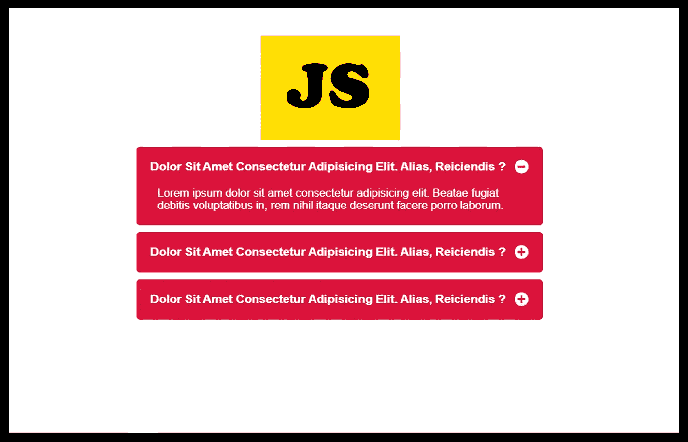

# 用普通 JavaScript 构建手风琴

> 原文：<https://javascript.plainenglish.io/building-an-accordion-with-vanilla-javascript-8440ab8f07ff?source=collection_archive---------3----------------------->

## 让我们用普通的 JavaScript 构建一个手风琴

Image Created with❤️️ By [Mehdi Aoussiad](https://mehdiouss315.medium.com/).

# 介绍

手风琴是你可以用 JavaScript 构建的美妙事物之一。例如，当我们有一些常见问题，并且希望在网页上显示这些问题及其答案时，这可能会很有用。

上个月，我做了一个简单的手风琴，这是我在 100 天代码挑战中尝试的项目之一。所以在尝试这个项目之前，你需要对 **HTML** 、 **CSS** 和 **JavaScript** 有基本的了解。让我们看看这个简单的项目是什么样子的。

# 项目演示

正如你在上面的例子中看到的，这个项目的想法非常简单。您有一些包含问题的元素。当您单击该图标时，将显示该问题的答案。这看起来更容易，但其中有很多逻辑。

# 让我们从 HTML 开始

首先，我们将创建一个名为 container 的 div，它将包含三个 div(我们的 3 个元素)。每个元素都包含问题及其答案，并有一个隐藏文本的类。你可以看看下面的 HTML 来了解一下。

The HTML Structure.

# 让我们来设计我们的元素

所以现在，我们将使用 CSS 样式化我们的元素。您可以阅读下面的代码来查看我们的样式表。

Styling Our Elements with CSS.

# JavaScript 部分

现在，这是令人兴奋的部分，将使我们的手风琴功能。在我们的 JavaScript 逻辑中，我们已经选择了所有的 div(元素),然后我们使用方法`**forEach**` 为每个问题添加一个点击事件。

我们还切换了我们在 HTML 和 CSS 中添加的类`**hideText**`,然后我们基于该类改变图标(加号-减号)。很难解释你的代码，这就是为什么我鼓励你阅读下面的 JavaScript 代码以便理解。

Our JavaScript Code.

现在恭喜你，你已经用普通的 JavaScript 轻松地创建了一个简单的手风琴。

# 结论

成为一名优秀的开发人员的最好方法是实践你所学到的东西。熟能生巧。构建一个 JavaScript 项目将帮助你练习和提高你的编码技能。感谢您阅读这篇文章。

# 进一步阅读

 [## 用普通 JavaScript 构建倒计时器

### 让我们用普通的 JavaScript 构建一个倒计时器

medium.com](https://medium.com/javascript-in-plain-english/building-a-countdown-timer-with-vanilla-javascript-d78d2ca7f180)