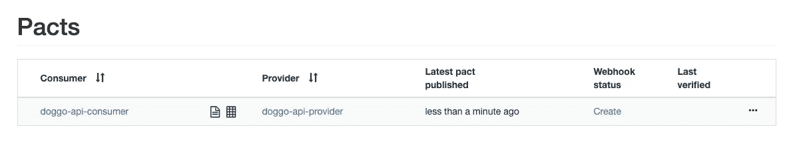
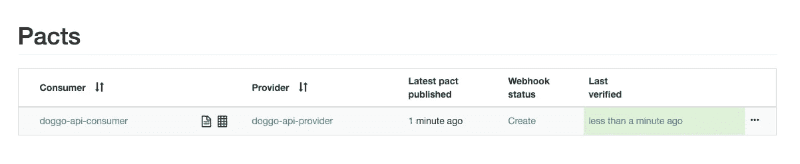

# 用 Pact 构建消费者第一的 API

> 原文：<https://javascript.plainenglish.io/building-an-api-consumer-first-with-pact-88360a19bf0d?source=collection_archive---------8----------------------->

Photo by [Andy Kelly](https://unsplash.com/@askkell?utm_source=medium&utm_medium=referral) on [Unsplash](https://unsplash.com?utm_source=medium&utm_medium=referral)

4 月初，我决定最终采取行动，尝试建立自己的应用程序，基于我个人的项目，用 FRESH 和 HackMyResume 自动化我的简历。

我目前正在经历该应用程序的想法验证阶段，但由于该应用程序最终需要一个后端，我决定花一些时间来建立一个基本的 API，具有 CV 数据的创建，读取，更新和删除(CRUD)功能。

这个 CRUD API 是我尝试 Pact 的完美借口，Pact 是我以前在另一个项目中用于测试我的 API 消费者代码的工具，但从来没有将其作为消费者驱动的契约测试解决方案。

我真的很喜欢使用 Pact 和它提供的范式转变，所以我想分享我使用它的经验，我已经创建了一个演示项目[，你可以下载来亲自尝试一下](https://gitlab.com/colinfwren/pact-demo)。

 [## 科林·雷恩/ pact-demo

### 展示契约的演示项目

gitlab.com](https://gitlab.com/colinfwren/pact-demo) 

# 什么是消费者驱动的契约测试？

契约测试是验证契约的行为，在 API 的情况下，这将是 API 端点期望接收什么以及它基于输入返回什么的契约。

构建 API 来生成某种形式的文档是常见的做法，无论是文档形式还是使用 Swagger 这样的工具进行 API 定义。

虽然 Swagger 是一个很好的工具(它很好地补充了 Pact ),但它也有一些缺陷:

*   如果实现更新了，而文档没有更新，那么 Swagger 文档(甚至那些作为代码库的一部分生成的文档)可能会变得不正确
*   Swagger 文档通常与 API 消费者单向使用，用它来测试契约，而 API 提供者从不验证契约是否得到维护
*   作为一个 API 提供者，很难想象哪些服务在使用 API，以及它们实际上在使用哪些属性，因为消费者无法告诉 Swagger 这一点

消费者驱动的契约测试颠倒了这种自上而下的单向通信流程，API 消费者定义他们如何使用 API，API 提供者使用定义来测试它是否遵守“契约”。

这是一个强有力的想法，因为这意味着 API 提供者可以自由地更新任何 API 消费者不使用的任何端点或属性，允许 API 在保持质量的同时发展。

Pact 的代理服务还为 API 提供者提供了不同消费者的可视化，这有助于基于微服务的规模化部署，在这种部署中，API 提供者可能有许多消费者都需要不同的属性。

# 设计 API

正如前面提到的，Swagger 是一个很棒的工具，而且它仍然是迄今为止我用来勾画 API 的最好的工具，所以我首先为 API 创建了下面的 Swagger 文档。

Swagger definition for a Doggo API, part of the demo project

通常 Swagger 文档会被用来创建一个供消费者使用的模拟服务器，来测试它的 API 集成代码，但是我使用了 Pact。

# 构建 API 消费者

在有一个 API 可以使用之前就构建 API 消费者可能会感觉有点奇怪，但是当我在一个分布式团队中工作时，我已经多次这样做了，前端和后端团队都构建相同的 API 定义，后来集成总是会导致问题(Pact 解决了这一问题)。

我在我的前端存储库中构建了一个新模块来与未来的 API 集成，并在 Jest 中为该模块创建了一个测试套件，使用 Pact 来定义发送给 API 提供者的请求和预期的响应。

Example Pact test, the interaction is described and then validated against a mock server

然后，Pact 使用这些定义(称为 pact)创建一个模拟服务器，前端 API 请求将被发送到该模拟服务器，并将返回预期的响应，从而允许对功能进行集成测试，而无需访问 API 提供者。

需要注意的一个问题是，当您有与相同响应状态匹配的测试时，比方说因为用户没有发送身份验证头而返回 401 的测试，以及因为身份验证令牌无效而返回 401 的测试，在这种情况下, [Pact 只会将响应代码的第一个交互添加到最终 Pact 中。](https://github.com/pact-foundation/pact.io/blob/06c43f405a523d09d103a420c9580c7b8b670df6/best_practices/consumer/contract_tests_not_functional_tests.md)

然后，我向 Pact Broker 发布了这个协议，Pact Broker 是一个管理其他服务的协议的服务器，用于验证、测试 API 消费者和提供者之间的结果和关系。

The JS implementation of Pact has a simple way of publishing pacts, other implementations may differ

# 设置契约代理

Pact 为 Pact Broker 提供了一个 Docker 映像，非常适合本地测试，因为它可以快速启动，但他们也在其付费服务 Pactflow 上提供了一个免费层，允许持有 5 个 Pact。

我已经创建了一个 Docker Compose 文件，您可以使用它来设置 Pact Broker，这将使服务在 [http://localhost:9292](http://localhost:9292) 可用(使用`test`作为用户名和密码登录)。

Spinning up the Pact Broker in Docker is really easy

一旦约定发布作业被配置为将约定上传到约定代理，并且约定被发布，消费者的约定将在约定代理的 UI 中可用。

Once the consumer’s pact is published to the Pact Broker it’s available to be verified by the provider

下一步是使用契约代理来允许 API 提供者下载 API 消费者的契约，验证 API 提供者是否遵守该契约，并将结果上传到契约代理。

# 使用 Pact for TDD 构建 API 提供者

下载 API 消费者契约和验证一致性的能力显示了消费者驱动契约的力量，因为现在我们能够使用已经验证过的契约来实践测试驱动开发(TDD)。

与为 API 消费者构建的测试套件相比，为 API 提供者构建的测试套件没有那么冗长。这是因为这些测试套件的关注点是验证契约是否被遵守，而不是定义它。

The provider test downloads the pacts it needs to verify, runs the server, tests them and publishes the results

一旦测试套件运行，测试套件的结果将被上传到 Pact Broker，并且每个人都可以看到结果。这意味着如果测试失败，那么很容易看出哪些消费者受到了变化的影响。

Once the provider runs it’s test the results of the pact are published to the Pact Broker

# 红色、绿色、重构

为了让我的初始测试套件通过 API，我严重依赖于存根值，但当然最终的应用程序将使用适当的认证服务来完成这一点，当使用 Pact 时，这可能很难管理。

Pact 的 JSON 结构是静态的，因此在测试运行时，消费者和提供者都需要使用认证令牌和其他潜在的动态数据。

[Pact 提出了一些缓解这个问题的方法](https://docs.pact.io/provider/handling_auth)，比如使用长期认证令牌，或者将认证作为一个单独的层，允许 Pact 针对未经认证的端点运行。

当重构我的 API 以使用 firebase 时，我选择保留存根值，但使用 Jest 优秀的模仿特性为`firebase/app`、`firebase/auth`和`firebase-admin`模块构建模仿，在模仿中返回存根。

这允许我将所有的测试逻辑移出控制器，移入那些底层函数中，这比我之前基于`NODE_ENV`为`test`使用策略模式返回存根的方法好得多(Jest 在运行时设置这一点)。

## 测试数据

随着 API 功能和消费服务数量的增长，管理测试数据并确保存根数据的行为标志使用一组一致的值变得非常重要。

我通过创建另一个测试数据模块来管理这一点，该模块存储所有请求和响应有效负载以及身份验证令牌和 id 的值，允许我更改任何测试值，而不会由于数据不匹配而中断测试。

在我的演示项目中，我也使用了这种技术，测试数据在`common`文件夹中。

# 摘要

通过使用消费者驱动的契约测试，我甚至能够在构建 API 本身之前验证我的前端能够与我的 API 一起工作，然后使用消费者的契约通过 TDD 来构建 API。

作为一个曾在多个团队工作过的人，我们要么收到一份过时的 Swagger 文档，要么因为后端开发人员没有像前端开发人员那样解释 Swagger 文档而不得不花时间重新开发 API 集成，Pact 是一个令人惊叹的解决方案。

在我的应用程序开发中，我在我的持续集成(CI)中使用 pact 的 Pactflow 服务，以便在每次推送时验证 Pact，直接从`package.json`开始使用应用程序的版本，以确保正确报告版本。

随着我的应用程序变得越来越大，我期待着看到 Pact 如何扩展，因为越来越多的消费者开始使用 CRUD API 的数据来处理更集中的工作。

# 你自己去看看

我已经创建了一个演示项目，其中包含一个 API 消费者、API 提供者和一个 Docker 合成文件来运行 Pact Broker，它可以用来玩 Pact，并了解消费者驱动的契约测试如何为 API 驱动的应用程序带来更高的质量水平。

 [## 科林·雷恩/ pact-demo

### 展示契约的演示项目

gitlab.com](https://gitlab.com/colinfwren/pact-demo) 

# 来自简明英语团队的说明

简明英语刚刚推出了一个 YouTube 频道！我们希望您现在就通过 [**订阅来支持我们！**](https://www.youtube.com/channel/UCtipWUghju290NWcn8jhyAw)