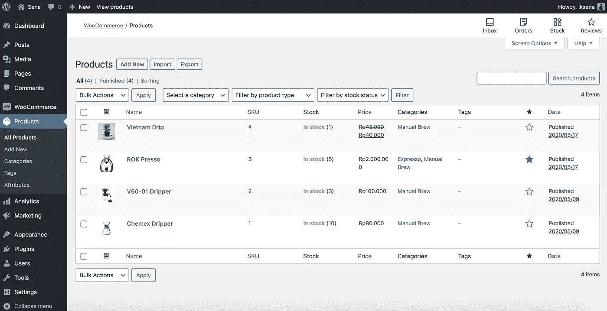
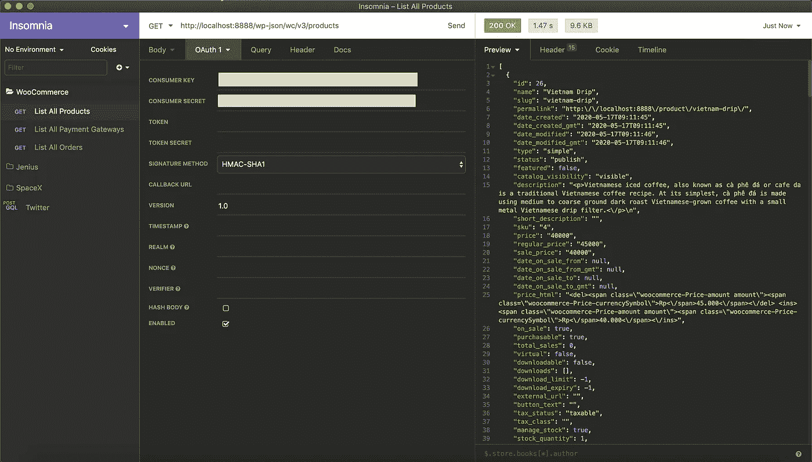
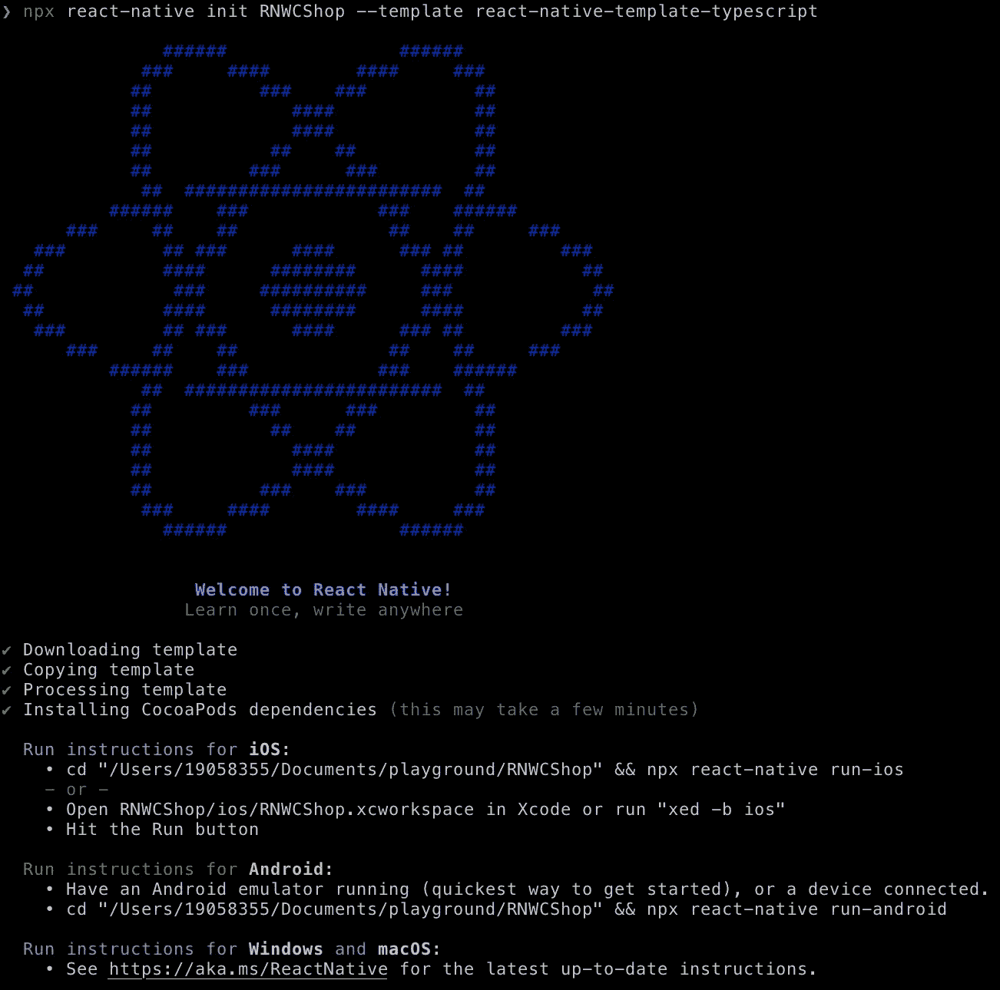
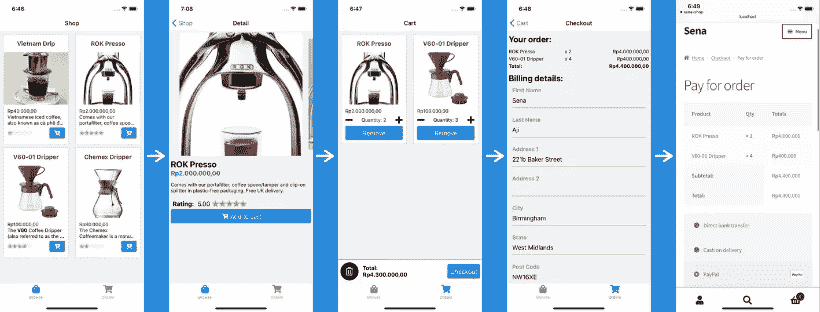
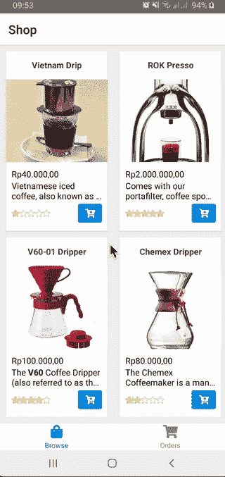
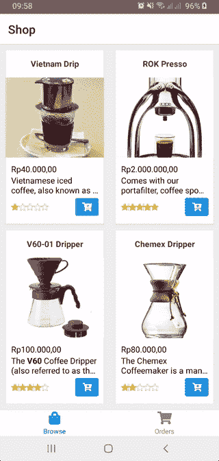
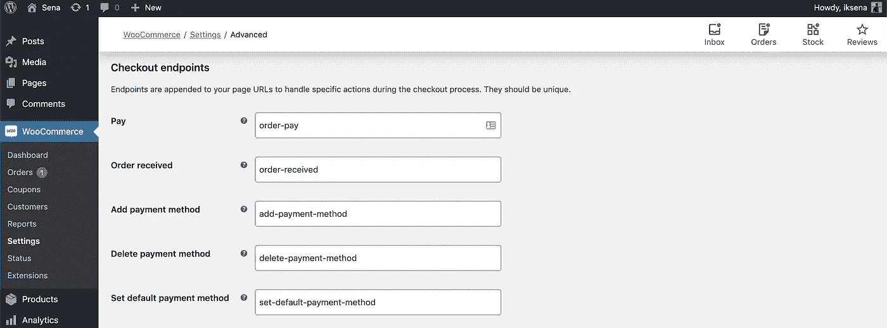
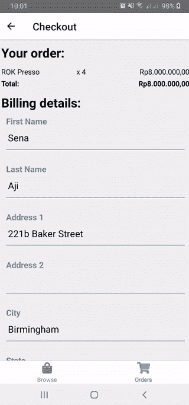

# 用 React Native 和 WooCommerce 构建电子商务移动应用程序

> 原文：<https://javascript.plainenglish.io/building-an-ecommerce-mobile-app-with-react-native-and-woocommerce-a4f5b3a1e434?source=collection_archive---------1----------------------->

## 一个实践教程，用一个免费的流行的电子商务平台——woo commerce 来构建一个跨平台的应用程序。


Photo by [Álvaro Serrano](https://unsplash.com/@alvaroserrano?utm_source=medium&utm_medium=referral) on [Unsplash](https://unsplash.com?utm_source=medium&utm_medium=referral)

2020 年的这个时候，电子商务正在兴起。全球疫情迫使我们在家做任何事情。因此，实体店老板正在适应并开始建立他们的第一个网上商店。作为一名开发人员，我认为这是一个分享我的知识来帮助陷入困境的企业的机会。有了为这些企业主创建移动应用的技能，你将是比大型电子商务顾问更快、更便宜的选择。

[React Native](https://reactnative.dev/) 是一个用于构建原生 iOS 和 Android 应用的 javascript 框架。它基于 React，您的代码将被编译成本机代码，您可以构建并在应用商店上发布。在本教程中，我们的应用程序将只使用通过 [WooCommerce REST API](https://woocommerce.github.io/woocommerce-rest-api-docs/) 连接的 WooCommerce 作为其后端。该应用程序将有简单的功能，如浏览产品，添加到购物车，并结帐。如果你已经理解了基本的 React、 [React 导航](https://reactnavigation.org/)、 [Redux](https://redux.js.org/) 和 REST API，你会更好地理解本教程。

# 🚀开一家网络商店

WooCommerce 是 Wordpress 的一个开源电子商务插件。要使用它，你应该把它安装在你的 Wordpress 网站上。

对于本教程，我们将通过在本地服务器上运行来使用 Wordpress。但是如果你已经有一个带有 WooCommerce 插件的 Wordpress 网站，你可以跳过这些步骤。

1.  你需要在你的电脑上安装一个 PHP 和数据库服务器，这样你就可以下载并安装 [XAMPP](https://www.apachefriends.org/index.html) 或 [MAMP](https://www.mamp.info/en/) 。
2.  在这里下载 Wordpress [并解压到你服务器的根目录。](https://wordpress.org/download/)
3.  现在你可以通过访问服务器地址上的`/wp-admin`路径来访问 Wordpress 管理页面。例如，MAMP 的地址是`http://localhost:8888/wp-admin`。
4.  当你第一次访问它时，你将被要求建立你的网站，你可以遵循[这个官方指南](https://wordpress.org/support/article/how-to-install-wordpress/)。
5.  要添加 WooCommerce 插件，在仪表板侧菜单上点击插件→添加新插件→搜索“woo commerce”→点击立即安装。
6.  添加插件后，您可以在管理页面上看到一个新菜单。出于开发目的，我们将用虚拟产品填充商店，单击产品→添加新品开始添加一些产品。



Adding Products to a WooCommerce store

# 🎮尝试 WooCommerce REST API

WooCommerce 提供了几乎所有基本功能的端点，正如你在这里看到的。我们可以查询产品、类别、评论、优惠券等数据。

甚至我们可以作为管理员提出请求，如创建和更新产品或支付网关。因此，您必须小心不要将任何管理端点暴露给为用户设计的应用程序。

要使用 WooCommerce REST API 进行请求，我们需要一个从您的商店生成的 API 密钥。可以进入管理页面→点击 WooCommerce 菜单→设置→进入高级选项卡→ REST API →添加密钥。填写描述字段并将权限字段设置为*读/写*，然后点击*生成 API 密钥*。

您将检索消费者密钥和消费者机密。OAuth 1.0 方法的每个请求中都将使用这些密钥。例如，我们将使用 API 开发应用程序[失眠症](https://insomnia.rest/download/)发出请求，查询所有产品。



Querying list of all products with WooCommerce REST API

# ⚒启动了一个 React 本地项目

我们将从头开始构建电子商务应用程序，因此我们需要为它设置必要的依赖关系。我们还将在这个项目中使用 Typescript。如果你想知道为什么我们应该实现类型检查，正如 React 官方网站上所说的，

> TypeScript 可以在构建时捕获错误和 bug，远远早于您的应用程序上线。

现在让我们把手弄脏。为了快速启动项目，我们使用官方的 react 本地模板和来自这个[链接](https://github.com/react-native-community/react-native-template-typescript#arrow_forward-usage)的类型脚本。只需使用下面的命令启动一个新项目。

```
npx react-native init RNWCShop --template react-native-template-typescript
```



Starting a React Native project

## 文件夹结构和相关性

当您在 IDE 中打开项目时，您可以看到`App.tsx`文件，它将是您的应用程序的根组件。为了使我们的项目更有条理，我们将把代码放在一个新的`app`目录中。里面的文件夹结构会如下图。

```
index.js
App.tsx
/app
|_ Components
|_ Containers
|_ Navigations
|_ Reducers
|_ Services
|_ Utils
```

`Components`目录用于存放可复用组件，如`ProductItem`、`Button`、`InputField`等。，而`Containers`目录是我们把组件作为一个包含状态、处理程序和数据映射函数的屏幕放置的地方。

在我们开始编码之前，我们需要安装一些依赖项，如 [Axios](https://github.com/axios/axios) 、 [Redux](https://react-redux.js.org/) 和 [React Navigation](https://reactnavigation.org/) 。在本教程中，我们还将使用组件库，如 [React Native Elements](https://react-native-elements.github.io/react-native-elements/) 、 [RN Snap Carousel](https://github.com/archriss/react-native-snap-carousel) 、 [RN Image Zoom Viewer](https://github.com/ascoders/react-native-image-viewer) 、 [RN Render HTML](https://github.com/archriss/react-native-render-html) 和 [Formik](https://jaredpalmer.com/formik/docs/guides/react-native) ，因此您不必过多关注样式😉。要将它们全部添加到您的项目中，您可以运行下面的命令。

```
**yarn add** axios redux react-redux @types/react-redux @react-navigation/native @react-navigation/stack @react-navigation/bottom-tabs react-native-reanimated react-native-gesture-handler react-native-screens react-native-safe-area-context @react-native-community/masked-view react-native-elements react-native-snap-carousel @types/react-native-snap-carousel react-native-image-zoom-viewer react-native-render-html formik react-native-vector-icons react-native-webview intl
```

## 设计应用流程

“总是从目的开始”，也就是说，我们需要定义我们的应用程序可以有什么功能。WooCommerce 在其 API 中提供的功能没有其基于网络的商店和高级扩展多。但我们可以实现基本功能，让用户有完整的购买体验。

对于本教程，我们的应用程序的用户将能够浏览在一个屏幕上显示的产品，当一个项目被单击，它将进入一个产品的详细信息屏幕。在浏览和详细信息屏幕上，用户可以将产品添加到他们的购物车，然后将显示购物车屏幕。在那里，用户将能够管理他们的购物车，直到点击一个结帐按钮，它将转到一个结帐屏幕。结账时，用户需要填写账单细节，并确认他们订购的商品。最后，当用户点击“继续付款”按钮时，我们会在浏览器上将他们重定向到您的 WooCommerce 网上商店的付款页面。



React Native WooCommerce App Flow

基于以上流程，我们可以创建应用程序的导航堆栈。首先，我们定义了包含*浏览*和*订单*堆栈的标签导航。*浏览*栈内有*店铺**明细*集装箱，而*订单*栈内有*推车*和*结账*集装箱。该导航堆栈将位于路径为`app/Navigations/index.tsx`的文件中。它将在`App.tsx`中呈现，如下所示。

如您所见，每个屏幕都有一个容器作为其组件支柱。因为我们还没有创建任何容器，所以你可以给它们放一个空的组件。

# 👨🏽‍🍳创建 WooCommerce 服务

现在，我们正在创建一个服务，将我们的 React Native 应用程序与 WooCommerce REST API 连接起来。该服务包含 HTTP 方法的功能，如 GET 和 POST。然后，我们从应用程序中提出的每一个请求都将使用 OAuth 1.0 参数进行设置和签名。

为了做到这一点，我们需要在我们的项目中添加 [CryptoJS](https://github.com/brix/crypto-js) 和 [Oauth-1.0a](https://github.com/ddo/oauth-1.0a) 库。这些库具有 OAuth 1.0 请求所需的加密和哈希函数。然而，这些功能是基于 Node 的，在 React Native 项目中不能正确使用，所以我们使用 [RN Nodeify](https://github.com/tradle/rn-nodeify) 来实现。

第一步，我们需要安装这些依赖项。

```
yarn add oauth-1.0a crypto-js @types/crypto-js rn-nodeify
```

然后，在项目的根目录下，运行以下命令。

```
./node_modules/.bin/rn-nodeify --install \"crypto,vm,stream,process\" --hack --yarn
```

它将生成一个名为`shim.js`的新文件。您需要在顶部增加一行，将该文件导入`index.js`。

```
import './shim.js';
```

RN Nodeify 应该在您每次安装依赖项时执行。为此，您可以简单地将命令放入`package.json`脚本中。

```
"scripts": {
  // other scripts
  "postinstall": "./node_modules/.bin/rn-nodeify --install \"crypto,vm,stream,process\" --hack --yarn"
},
```

对于服务文件，您可以在`app/Services/`目录下创建一个名为`WooCommerce.ts`的文件，并按照下面的代码进行操作。

正如您在*配置*对象中所看到的，您可以将基本 URL 更改为您的 WooCommerce URL，然后从我们之前生成的密钥中更改消费者密钥和消费者秘密。

# 🏪创建浏览产品选项卡屏幕

在这一部分，我们将开始为我们的组件和容器编写代码。如前所述，在*浏览*页签会有*店铺*画面显示产品列表，以及*明细*画面显示产品的明细信息。

在我们制作*商店*容器之前，我们需要首先制作一个可重用的*产品项目*组件。我设计这个组件用于显示产品列表的*商店*和*购物车*容器。所以如果你注意到，我做了*is Cart*prop 来区分它在不同屏幕上的样子，我还做了与 cart 相关的动作按钮，我们稍后会讲到。您可以在`app/Components/ProductItem`中添加一个名为`ProductItem.tsx`的新文件。

然后，我们将创建商店容器。该容器将有两个文件，`Shop.container.tsx`和`Shop.component.tsx`。在这个项目中，带有`*.container`文件的容器的一部分是放置状态、钩子、动作处理程序和数据映射的地方。而`*.component`文件是放置要渲染的组件的地方。您可以在`app/Containers/Shop/`中创建这些文件。

注意，我们在`useEffect` hook 中调用了 WooCommerce 服务，因此它将在组件呈现后被调用。

我们还创建了一个名为`handleProductPress`的处理函数，它被传递给 ProductItem 组件。因此，当列表中的产品被按下时，它将被调用，然后在传递其产品 id 时，它将导航到详细信息屏幕。

下一步是制作*细节*屏幕。只有当一个产品被按下时，屏幕才会被渲染，因此它将接收一个产品 id 来从 WooCommerce 获取数据。

在 detail 组件中，我们有两种方式来显示产品的图像。我们首先用一个转盘显示它们，然后当一个图像被点击时，它会显示一个图像缩放查看器，你也可以滑动到其他图像。因此，我们创建`handleShowImages`处理程序作为切换函数来显示图像查看器模态，并将其传递给每个 carousel 项目。



Browse products tab screens

# 🛒创建购物车 Redux 商店

如果你还不熟悉 Redux，它是一个 JS 库，可以让你管理应用程序的全局状态。使用 Redux，我们可以为用户的购物车商品状态提供一个单独的存储，并且我们可以从任何组件转换状态。

我们可以为 reducer 中的购物车条目定义状态和动作。购物车缩减器将有一个状态，其中包含购物车中的一组产品和总价。我们将创建以下操作:

1.  **添加到购物车**动作会在状态中插入一个新产品，但是如果该产品已经存在，该动作会将其数量加 1。
2.  **从购物车中移除**动作将在产品存在的状态下移除产品。
3.  **添加数量**动作将产品的数量加 1。
4.  **子数量**动作会将产品的数量减去 1，但如果其数量为 1 或更少，则该动作会移除该产品。
5.  **重置购物车**动作将清空购物车的产品和总价。

您可以在`app/Reducers`中创建一个名为`Cart.reducer.ts`的新文件，并遵循下面的代码。

为了使我们的 redux 存储对组件全局可用，我们需要在我们的根组件`App.tsx`中创建一个提供者，并遵循下面的代码。

现在，我们可以创建在*商店*和*细节*容器中分派这些动作的处理程序。您可以在现有的处理程序中添加一些函数，如下所示。

```
import { ***actions*** } from '../../Reducers/Cart.reducer';const dispatch = useDispatch();

const handlers = {
  // ...rest of handlers
  addToCart: (product: Product): Action => {
    navigation.navigate('Orders', { screen: ***routes***.Cart });

    return dispatch(***actions***.addToCart(product));
  },
  removeFromCart: (productId: number): Action =>
    dispatch(***actions***.removeFromCart(productId)),
  addQuantity: (productId: number): Action =>
    dispatch(***actions***.addQuantity(productId)),
  subQuantity: (productId: number): Action =>
    dispatch(***actions***.subQuantity(productId))
};
```

# 🛍创建订单标签屏幕

在最后一部分，我们将创建*购物车*和*收银台*容器。*订单*标签将显示*推车*画面，当按下 checkout 时，将显示 *Checkout* 画面。



Cart screen

要创建*购物车*容器，您可以在`app/Containers/Cart`中创建名为`Cart.container.tsx`和`Cart.component.tsx`的新文件。在这个容器中，我们使用我们之前所做的购物车操作，并使用 ProductItem 组件显示购物车商品列表。

接下来，我们用`app/Containers/Checkout`中名为`Checkout.container.tsx`和`Checkout.component.tsx`的文件创建 *Checkout* 容器。在这个容器中，我们将使用 Formik 来呈现一个表单，供用户输入他们的账单细节。当用户点击“继续付款”时，我们会将订单发布请求发送到 WooCommerce。

从请求中，我们将收到订单 id 和密钥的响应，因此我们将使用它们在 WooCommerce 网络商店上创建到您的支付页面的链接。链接扩展了一个`/checkout/order-pay`的永久链接，你可以在你的 WP 仪表盘上找到配置→ WooCommerce →设置→高级→页面设置→结账端点。



Checkout payment permalink settings on WooCommerce

您可以按照下面的代码创建容器。



Checkout screen and payment page

最后，你自己的电子商务应用程序完成了！你可以试着用`yarn android`或`yarn ios`在模拟器或你自己的设备上运行。

要在 Play Store 或 App Store 上发布你的应用，可以阅读这个[官方文档](https://reactnative.dev/docs/signed-apk-android)。请确保您的 WooCommerce 基本 URL 使用的是公共域，这样任何网络中的任何设备都可以访问它。

# 📚从这里去哪里

我做这个项目只是为了帮助你快速启动电子商务应用程序。如果我忽略了 React 和 Typescript 的一些最佳实践，这是有可能的。有了这个项目，希望你能学会改进，满足自己的风格和需求。

在一个电子商务应用程序中，像运输和支付这样的功能是很常见的。所以你可能想了解更多关于使用 WooCommerce API 在 *Checkout* 屏幕上包含运输和支付网关选项的信息。为了使它更加安全，在处理用户订单请求时，还可以进行表单验证和错误处理。

在技术方面，你可以增强应用的性能和架构。例如，你可以使用像 [redux-thunk](https://github.com/reduxjs/redux-thunk) 或 [redux-saga](https://redux-saga.js.org/) 这样的 Redux 中间件库来调用像 WooCommerce service 这样的异步函数。还有一个名为 [redux-persist](https://github.com/rt2zz/redux-persist) 的库，用于在持久存储中存储应用程序的 redux 状态，因此每次用户打开应用程序时，购物车状态都会被持久化。

我已经为这个项目发布了一个资源库，你可以在这里查看。

[](https://github.com/iksena/RNWCShop) [## iksena/RNWCShop

### 用 Typescript 反应原生 WooCommerce app。通过在…上创建帐户，为 iksena/RNWCShop 的发展做出贡献

github.com](https://github.com/iksena/RNWCShop) 

我还为这个应用程序做了一个正在进行的项目，增强了 redux-saga 和 redux-persist。

[](https://github.com/iksena/react-native-woocommerce) [## iks ENA/react-native-woo commerce

### 在 GitHub 上创建一个帐户，为 iks ENA/react-native-woo commerce 的发展做出贡献。

github.com](https://github.com/iksena/react-native-woocommerce) 

请随意为项目做贡献。如果你有任何反馈，你可以在推特上给我发消息。

## **用简单英语写的便条**

你知道我们有四份出版物和一个 YouTube 频道吗？你可以在我们的主页[**plain English . io**](https://plainenglish.io/)找到所有这些内容——关注我们的出版物并 [**订阅我们的 YouTube 频道**](https://www.youtube.com/channel/UCtipWUghju290NWcn8jhyAw) **来表达你的爱吧！**