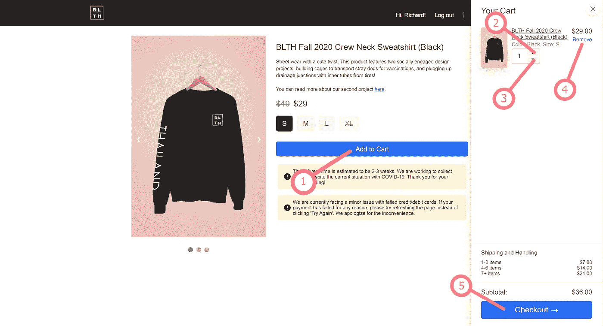
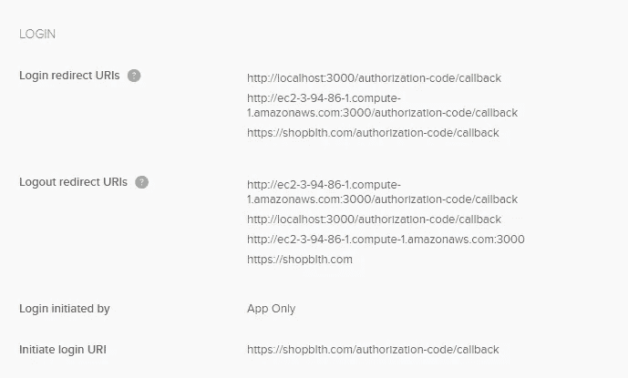
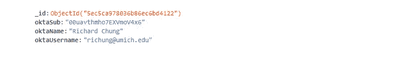
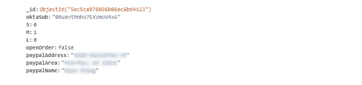

# 从零开始建立电子商务商店

> 原文：<https://javascript.plainenglish.io/building-an-ecommerce-store-from-scratch-fe80c409eb67?source=collection_archive---------3----------------------->

今年夏天，我决定建立一个网上商店来组织销售我定制的印花运动衫。你可以在[https://shopblth.com](https://shopblth.com)访问这个项目，但请注意，结帐已被设置在一个开发者沙盒模式，所以付款将被拒绝在这个时候。

这篇博文的内容本质上是技术性的，所以可能有点枯燥。希望这能为从事类似项目的开发人员提供一个合适的参考指南或不错的起点！

# 概观

这是一个完整的 stack Node.js 项目。名为 Okta 的服务用于用户认证。后端数据库通过 MongoDB 处理，前端是用 CodyHouse 框架组件设计的。PayPal 智能按钮用于结账。所有这些技术都在各自的章节中进行了详细介绍，以便于跳过。我还包括了从头开始设计这个系统的关键要点。

# Okta 用户认证

Okta 使得将登录信息集成到 web 应用程序和从图形界面管理用户变得简单。在这个项目中，我需要用户身份验证，以将客户购物车中的商品保存到他们的帐户中，并按客户 ID 组织订单详细信息。我附上了我如何将 Okta 集成到 Node.js 脚本中的图片，以及我用来设置 web 应用程序的路线。我主要是按照[这个](https://developer.okta.com/blog/2019/05/31/simple-auth-express-fifteen-minutes)指南作为参考。

Using OIDC Middleware for this project. The ‘env’ variables were generated from the Okta Dashboard. On line 16, I created a callback JSON to redirect the login URL to the product page.

You can attach several URLs to the login/logout redirects. As shown above, I still haven’t deleted my localhost and Amazon EC2 Instance URLs. The only important one to remember to change is the Initiate login URL.

# MongoDB 集合

要理解这一节，掌握 MongoDB 中元素的层次结构很重要。键值对或**字段**可以组合成一个名为**文档**的对象。几个**文档**组成一个**集合**。几个**集合**形成一个**数据库**。我的数据库中有两个集合:一个客户集合和一个订单集合。

客户文档包含以下字段: *oktaSub* 、 *oktaName* 和 *oktaUsername* 。oktaSub' 是分配给用户的唯一 ID，' oktaName' 是注册用户的全名，' oktaUsername' 是用户的电子邮件地址。所有三个客户字段都有字符串值。

Example of Customer document.

当一个新订单生成时，它包含以下字段: *oktaSub* 、 *S* 、 *M* 、 *L* 和 *openOrder* 。和以前一样，‘okta sub’是用户的唯一 ID。S '，' M '和' L' 取与用户添加到购物车中的每个产品尺寸的数量相对应的整数值(S =小，M =中，L =大)。openOrder' 有一个布尔值，通过确定最终采购订单是否已通过 PayPal 提交，与订单是否已完成相对应。

Example of an open Order document. The value of ‘S’ is 3, which means that the user currently has 3 small sweatshirts saved in his/her cart. The value of ‘openOrder’ is true, which means that the user is still shopping and has not checked out yet.

当用户成功提交付款后，订单文档中会添加三个附加字段。这些字段是*支付地址*、*支付区域*和*支付名称*。“paypalAddress”和“paypalArea”是两个字符串，组合在一起构成完整的送货地址。顾名思义，“paypalName”是指注册到 PayPal 帐户的名称。我包含了这个字段，以防它与“oktaName”不同。

Example of a closed Order document. The value of ‘M’ is 1, which means that the user currently has 1 medium sweatshirt saved in his/her cart. The value of ‘openOrder’ is false, which means that the user has successfully checked out. Therefore, the three additional ‘paypal’ fields have been appended.

用户首次登录后，会生成新的客户和订单文档。成功结帐后，还可以生成新的订单文档。回想一下，这是通过“openOrder”字段将值交换为“false”并添加三个“paypal”字段来分类的。

# CodyHouse 框架组件

框架是软件的“画布”,从中可以开发出更复杂的应用程序。CodyHouse 框架包含预先构建的电子商务组件，已经附加了所有必要的 HTML、SCSS 和 JavaScript。在这个项目中，我使用了以下你可以在他们网站上找到的组件:[产品](https://codyhouse.co/ds/components/app/product)、[推车抽屉](https://codyhouse.co/ds/components/app/cart-drawer)、[对话框](https://codyhouse.co/ds/components/app/dialog)、[填充加载器](https://codyhouse.co/ds/components/app/fill-loader)、[英雄](https://codyhouse.co/ds/components/app/hero)、[预警](https://codyhouse.co/ds/components/app/alert)。

为了建立工作环境，我遵循[这个](https://codyhouse.co/ds/docs/framework)指南。

# PayPal 智能按钮

PayPal 拥有丰富的开发者 API，但集成支付的最简单方式是通过 PayPal 开发者网站上提供的 JavaScript。我跟随他们的正式指南[来到这里](https://developer.paypal.com/docs/checkout/)。

PayPal 按钮渲染函数附带了两个操作。第一个是“createOrder”，它创建一个包含交易金额的采购订单。第二个是“onApprove”，在成功支付后触发。在这个阶段可以编写和执行自定义操作。在我的项目中，我创建了一个不可见的表单，并附加了包含 PayPal 用户姓名、地址和地区的隐藏输入字段。我还创建了一个隐藏的 submit 按钮，并使用 JavaScript 在 AJAX 请求中处理它。为了更清楚起见，下面提供了代码。

PayPal Smart Button render code. Order is created on lines 6 to 14\. On line 10, the transaction amount is specified in USD. ‘subtotal’ is global variable that is updated via AJAX request (more on this in a later section).

Actions taken after ‘onApprove’ function. ‘details’ is a JSON object containing PayPal data. Several hidden input elements are created and their values are set to various values from the ‘details’ JSON. These elements are then appended and subsequently to ‘dynForm’, a form object created earlier in the code. A hidden submit input is also created and clicked on line 33\. All elements are subsequently removed from ‘dynform’ after submission.

Handling of the form submit of dynForm. Line 11 prevents the page from refreshing after the form is submitted. A JSON package is prepared, followed by a POST request, and finally handling of the response.

Route within Node.js script for checkout. Order collection is updated as described in the MongoDB section.

# 关键要点 1: PayPal 智能按钮适用于非可变购买

虽然这是 PayPal 明确提出的，但我决定忽略这个警告。最初，我选择使用智能按钮，因为代码已经提供，而且似乎很容易集成。如 PayPal 部分的上图所示，创建采购订单时必须指定交易值。对于一个固定的价格，分配这个值很简单。然而，设置动态价格需要考虑一些安全因素。

其中一个大问题是不能从 HTML DOM 中获得交易总数。DOM 元素可以从用户端进行编辑和操作，以影响最终的小计。像 uOrigin 这样的广告拦截器使用这种技术作为其主要功能之一，因此其意图并不总是恶意的，但仍可能在结账时引起问题。我的解决方法是在每次 AJAX 请求后更新一个全局“subtotal”变量(如果您感兴趣，可以在外卖#2 中了解更多)。

我有目的地推迟发表这篇文章，直到我采取了现场支付，因为我仍然不知道如何“黑客”这个解决方案。我知道这比从 DOM 元素中提取小计要好得多，但想想还是让我不舒服。我认为正确的解决方案是使用 Node.js 路径并使用 PayPal 开发人员 API 来处理这种混乱。

# 要点 2:从按钮按压而不是从 HTML更新“小计”

我在外卖#1 中提到了这一点，但是我学到的一个总的教训是，基于 DOM 元素更新信息是非常愚蠢的。同样，DOM 元素可以从用户端操作。敏感字段不应该从 HTML 元素中更新它们的值。我采用的解决方法是在每次按钮按下时发送一个 AJAX 请求，这会影响后端。下图提供了所有相关按钮的列表。

All AJAX buttons. (1) Obtains size selected from radio buttons. Searches Orders Collection for user and increases the quantity of the selected size. (2) Searches Order Collection for user and increases the quantity of the item size. (3) Searches Order Collection for user and decreases the quantity of the item size. (4) Searches the Order Collection for user and sets the quantity of the item size to 0\. (5) Updates global ‘subtotal’ variable one last time.

# 要点 3:不要从浏览器 cookies 更新后端

所有这些要点都遵循一个相似的主题，即*不要更新用户可以操纵的敏感信息*。使用浏览器 cookies 的好处是不需要用户注册来保存他们的购物车。不幸的是，当用户决定重置他们的浏览器历史时，cookies 可能会被无意中删除。我的解决方法是要求用户登录以保存他们的购物车。我使用按钮通过 AJAX 请求更新用户的购物车，如外卖#2 中的图所示。虽然通过 Okta 注册对用户来说是一个额外的麻烦，但我认为这是必要的不便。

# 未解决的问题

在这一部分，我想简要概述一下这个项目中我暂时搁置的一些未解决的问题。我计划退出这个项目，但是如果没有一些遗留问题的报告和可以帮助其他开发者的改进，这个博客是不完整的。

首先，一个让我纠结并最终放弃的问题是处理失败的 PayPal 支付。如果信用卡被拒或用户输入的信息不正确，用户需要刷新页面，而不仅仅是重新输入信息。简单地再次输入他们的信息不会导致错误，但会“软锁定”用户访问结账过程的其余部分。根据网上的一些研究，在用户未能正确结账后，PayPal 似乎无法记住之前打开的订单请求会话。

另一个需要改进的地方是替换我在设置 Okta 时使用的“OIDC”中间件。我在这方面没有做过很多研究，但我相信更常见的做法是使用 Passport.js 来代替。这将给开发者更多的灵活性，包括注册后发送定制确认邮件的能力。

# 结束语

在从事这个项目的过程中，我对全栈应用程序的每个组件的了解可能比我以前所有的项目和实习经历加起来还要多。尽管如此，每年夏天我都会尝试这些项目中的一个，但总觉得自己只是刚刚触及皮毛。我期待着利用我所学到的一切，并在我的下一次冒险中加以利用。感谢阅读！