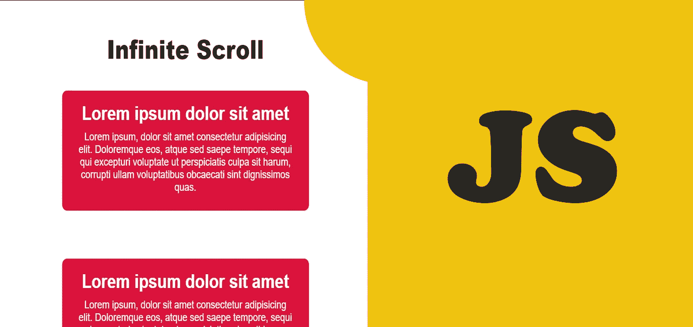

# 用普通 JavaScript 构建无限卷轴

> 原文：<https://javascript.plainenglish.io/building-an-infinite-scroll-with-vanilla-javascript-32810bae9a8c?source=collection_archive---------2----------------------->

## 让我们使用普通的 JavaScript 构建一个无限滚动项目

Image By Mehdi Aoussiad.

# 介绍

为了提高你的 JavaScript 技能，无限滚动是你必须尝试的令人兴奋的项目之一。上个月，我制作了一个简单的无限卷轴，这是我在 100 天代码挑战中尝试的项目之一。所以在尝试这个项目之前，你需要了解 **HTML** 、 **CSS** 和 **JavaScript** 。如您所见，这个项目非常简单，当我们向下滚动时，它只需加载并创建 HTML 元素。让我们看看我们的项目怎么样。

# 项目演示

Our Infinite Scrolling Demo.

正如你在上面的例子中看到的，这个项目非常简单，当我们向下滚动时，它创建了无限的元素。我们还添加了一个简单的加载动画，如您在示例中所见。

# 让我们从 HTML 开始

首先，我们将把包含博客文本(Lorem 文本)的 3 个元素放在一个容器中。我们还将为加载动画添加 HTML 元素。让我们看看下面的例子:

The HTML Structure.

# 让我们来设计我们的元素

所以现在，我们将使用 CSS 样式化我们的元素。您可以阅读下面的代码来查看我们的样式表。

Styling Our Elements with CSS.

# JavaScript 部分

现在，这是令人兴奋的部分，将使我们的项目功能。在我们的 JavaScript 逻辑中，我们创建了一个滚动事件，如果滚动高度大于主体的整个滚动高度减去 5 个像素，该事件将调用一个**函数**。该函数创建一个博客文章文本，并将其添加到 HTML 中的容器中。仔细阅读下面的代码，理解我们的逻辑。

Our JavaScript Code.

现在恭喜你，你已经用普通的 JavaScript 轻松地创建了一个简单的无限滚动项目。

# 结论

成为一名优秀的开发人员的最好方法是实践你所学到的东西。熟能生巧。构建一个无限滚动将帮助你练习和提高你的编码技能。这就是这篇文章，我希望你今天学到了一些新的东西。

喜欢这篇文章吗？如果有，通过 [**订阅解码，我们的 YouTube 频道**](https://www.youtube.com/channel/UCtipWUghju290NWcn8jhyAw) **获取更多类似内容！**