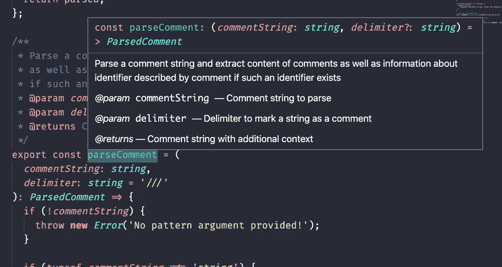

# 构建内联注释解析器

> 原文：<https://javascript.plainenglish.io/building-an-inline-comment-parser-6bb97dd327e5?source=collection_archive---------4----------------------->


Photo by [Erik-Jan Leusink](https://unsplash.com/@ejleusink?utm_source=medium&utm_medium=referral) on [Unsplash](https://unsplash.com?utm_source=medium&utm_medium=referral)

## 在一个地方获取所有内联注释

当谈到记录 JavaScript 代码时，很难夸大 JSDoc 的便利性。写评论——以您想要的任何格式获得自动生成的文档。非常漂亮，而且正是我们期望在 JS 生态系统中可用的那种工具。

不过，有时我们可能出于其他原因想要注释我们的源代码，比如设置提醒来重构某些东西、移除一个方法、重命名一个变量等等。然后能够在一个地方访问这些信息。

在这篇文章中，我将编写一个脚本来解析一系列文件并提取这些类型的注释，并假设它们是作为某种形式的内联注释编写的。对于其他的东西，当然有 JSDoc。

# 解析文件

所以我们有一个文件，它可能有也可能没有我们感兴趣的行内注释。在我们对它做任何事情之前，让我们把它读入内存。

现在我们可以访问文件的内容了。

一旦我们有了我们的文件，我们可以通过简单的分行符来得到每一行。

```
const lines = file.split(‘\n’);
```

我们可以遍历每一行，通过检查注释分隔符的存在来查看它是否包含我们想要的信息(在这种情况下，我决定使用'///'，例如在 [Swift](https://nshipster.com/swift-documentation/) 中，但是当然你可以使用任何你喜欢的东西)。

在上面的代码中，我们只是循环遍历这些行，并返回一个格式更好的对象，带有注释文本以及它出现的行号。

现在我们有了文件中的所有注释。

我们可以在这里停下来，但是为了更好的可读性，最好在连续的行上连接注释。这就是我们将行号存储在数组中的原因——在下一步中它会派上用场。

# 串联注释

为了连接注释，我们将减少上一步中得到的注释数组。在我们的 reducer 函数中，我们将检查累加器中出现的每个注释，看看它的`lineNumbers`数组中是否有一个行号，使得该行号比当前注释的行号小 1。

如果有这样一个带有这样一个行号的注释，我们将把我们正在迭代的当前注释的内容与那个注释连接起来，并将当前注释的行号添加到那个注释的`lineNumbers`数组中。

通过这种方式，我们设置了由下一个迭代的注释使用的`lineNumbers`数组，这样我们就可以连接任意多的连续注释。

现在我们从一个文件中得到串联的注释。为了使它成为一个现成的实用程序，让我们将这段代码包装成一个 glob 模式，然后在每次匹配时运行上面的代码。为此，我们需要[全球 npm 包](https://www.npmjs.com/package/glob)。下面是所有代码的组合:

*编辑 5 月 30 日:上述要点中的第 36 行应为* `*comments: comment,*`

虽然这个工具可以给我们提供足够的信息来检测我们想要的信息，但是如果我们能够添加一些上下文就更好了。

在大多数 ide 中，如果您将鼠标悬停在用 doc 注释标注的标识符上，您将获得从注释中提取的关于该标识符的一些信息。



这种将评论和他们描述的事物联系起来的能力是一个非常好的特性。我们将通过使用解析器组合子来实现这一版本。

在下一节中，我将描述什么是解析器组合子，但是如果你很急，你可以[跳到下一节](#56c7)看代码:)

# 解析器组合子

对这种技术的详细探索超出了本文的范围，但是有大量的资源展示了如何使用它[以及如何](https://www.lihaoyi.com/post/EasyParsingwithParserCombinators.html)[构建自己的解析器库](https://www.youtube.com/watch?v=6oQLRhw5Ah0&list=PLP29wDx6QmW5yfO1LAgO8kU3aQEj8SIrU&index=1)。

解析器组合子背后的原理是，我们可以编写更小的解析器，它们本身只解析输入的一部分，比如单个字符，而不是编写一个巨大的正则表达式来捕获输入字符串中的复杂值。

解析器组合子使我们的程序更容易理解，并允许我们在每次想要改变解析器时避免使用点和斜线(不是最小化正则表达式的强大功能)。

解析器组合子中的解析器通常是纯函数，可以接受和返回相同形状的状态对象。这允许将它们链接在一起，以便每个解析器可以将其操作结果传递给链中的下一个解析器。

将一系列解析器应用到输入字符串的最终结果是每个解析器的组合结果。解析器组合子也可以这样设计，如果解析不成功，操作失败的特定解析器可以在它返回的状态中添加一条错误消息，这样我们就可以一眼看出输入的哪一部分是不可解析的。这绝对不是正则表达式所能做到的。

举一个具体的例子，您将看到的`str`解析器是一个高阶函数，它接受一个字符串进行匹配，并返回一个对象，该对象的`run`方法接受目标输入，并检查它是否以前面的字符串值开始。

这些例子摘自我们将要使用的解析器组合器库 [Arcsecond](https://github.com/francisrstokes/arcsecond) 的文档。

除了这个字符串检查解析器之外，还有一些用于组成解析器的函数，它们通过接受一系列解析器并将它们的某种组合应用于目标输入来工作。

因此，名副其实的`sequenceOf`解析器可以这样使用:

类似地，选择解析器的用法如下:

# 获取关联的标识符

正如我上面提到的，我们将使用 [Arcsecond](https://github.com/francisrstokes/arcsecond) 来实现我们的解析目标。

对于本例，我们将尝试解析以下形式的任何标识符声明:

*   `const x = 'y'`
*   `let x = 'y'`
*   `var x = 'y'`

下面是我们解析它们所需的解析器:

在上面的代码中，`identifierName`是一个解析器，它查找标识符名称中所有有效的字符。

`varDeclaration`解析器将试图解析一个包含以下内容的字符串:

1.  0 个或多个空白字符
2.  `const`、`let`或`var`中的一种
3.  0 个或多个空白字符
4.  我们的标识符的名称

然后，我们应用一个 map 函数将结果输出格式化为更具可读性的格式。

注意，这个 map 函数不是常规的 JavaScript `map`，而是一个[函数](https://github.com/francisrstokes/arcsecond/blob/67efddd3e11734e0c0544e6ad41cbf362fef1027/index.mjs#L79)，它获取应用解析器的结果，并返回另一个解析器，该解析器的状态已经被我们给它的回调所修改。

如果我们想要解析不同种类的标识符声明，比如函数，我们可以为它们编写单独的解析器，然后使用`choice`简单地组合它们。

因为我们知道我们在给定序列中解析的最后一个行内注释的行号，所以我们只需要检查文件中的下一个行号，看看它是否包含声明。如果有，我们就提取它，如果没有，我们什么也不做。

我们的函数将接受注释对象和文件中的`lines`行数组。

我们还需要改变从文件循环中返回的内容，如下所示:

现在，我们解析的注释对象如下所示:

这就把我们带到了终点！

如果你对研究代码感兴趣，[这里有一个回复！](https://repl.it/@Ilya_Meer/ShrillArtisticMetric#index.js)

只要我们有带注释的文件，我们的解析器就会给我们一个很好的列表，列出所有的注释、它们描述的变量(如果有的话)以及可以找到它们的文件。

我们的实现有一些限制——例如，它不能解析语法中的对象析构，所以`const { hi } = someObject`会将我们的变量名解析为`{`,这不好。

使用我们所看到的工具，读者应该已经能够解决这个问题，并对我们的解析逻辑进行其他改进。

最后，如果你想在你的项目中使用它，这里有完整的[包](https://www.npmjs.com/package/inline-comment-parser)。

这个包使用了一个稍微不同的解析器组合子，它是由 Arcsecond 的创建者按照这个系列的构建的，在这个系列中，他提供了构建一套解析器的一步一步的过程。我强烈推荐观看这一系列对这一技术的引人入胜、内容丰富的阐述。

如果您已经做到了这一步，我希望对注释解析的这种探索在某种程度上对您有用。

编码快乐！

# **用简单英语写的便条**

你知道我们有四份出版物和一个 YouTube 频道吗？你可以在我们的主页[**plain English . io**](https://plainenglish.io/)找到所有这些内容——关注我们的出版物并 [**订阅我们的 YouTube 频道**](https://www.youtube.com/channel/UCtipWUghju290NWcn8jhyAw) **来表达你的爱吧！**

# 资源

Arcsecond 解析库:[https://github.com/francisrstokes/arcsecond](https://github.com/francisrstokes/arcsecond)

李论解析器组合子:[https://www . Li haoyi . com/post/easyparsingwithparsercombinators . html](https://www.lihaoyi.com/post/EasyParsingwithParserCombinators.html)

解析器组合子教程:[https://www.youtube.com/watch?v=6oQLRhw5Ah0&list = PLP 29 wdx 6 QM w5 yfo 1 lago 8 ku 3 aqej 8 siru&index = 1](https://www.youtube.com/watch?v=6oQLRhw5Ah0&list=PLP29wDx6QmW5yfO1LAgO8kU3aQEj8SIrU&index=1)

全球套餐:【https://www.npmjs.com/package/glob 

内联注释解析器包:【https://www.npmjs.com/package/inline-comment-parser 