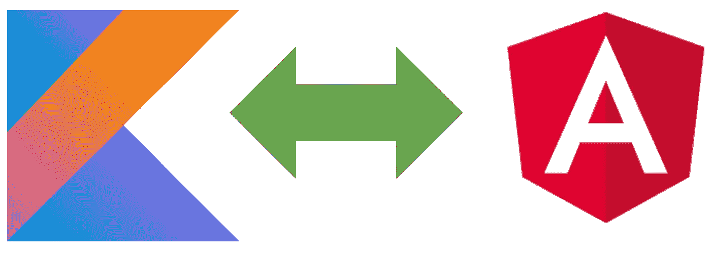

# 用 Kotlin 和 TypeScript 构建 Web 应用程序

> 原文：<https://javascript.plainenglish.io/building-applications-with-kotlin-and-typescript-8a165e76252c?source=collection_archive---------1----------------------->

## 克服整合问题



Kotlin 是许多针对 JVM 的新语言之一。然而，我发现 Kotlin 特别有用的一点是它面向多个平台，而不仅仅是 JVM。

在 web 应用程序的上下文中，Kotlin 的这种[多平台特性使我们能够用 Kotlin 编写一次代码，然后在 JVM 后端和 JavaScript 前端使用这些代码。这对于在前端浏览器和后端服务器之间传递复杂的数据结构特别有用。](https://kotlinlang.org/docs/reference/multiplatform.html)

本文描述了我在将 Kotlin 生成的模块与一个 [TypeScript](https://www.typescriptlang.org/) 浏览器应用程序集成时遇到的问题，当然也包括我是如何克服这些问题的。有些解决方案需要一些相当复杂的 [Gradle](https://gradle.org/) 构建脚本代码。我已经通过提供一个 [Gradle-plugin 简化了集成，该插件包装了复杂性](https://github.com/dhakehurst/net.akehurst.kotlin.kt2ts)，但是下面为那些真正想了解遇到的问题和可能的解决方案的人提供了完整的解释。

# 介绍

集成的环境是在服务器端(后端)使用 JVM 的 Web 应用程序，而浏览器应用程序(前端)是使用基于类型脚本的框架开发的，例如 [Angular](https://angular.io/) 或 [React](https://reactjs.org/) (带有类型脚本选项)。

在 JVM 方面，Kotlin 的集成很容易，通过适当的构建工具(即 Gradle 和 [Kotlin 多平台插件](https://plugins.gradle.org/plugin/org.jetbrains.kotlin.multiplatform))，Kotlin 代码被构建到一个易于使用的 jar 模块中。这可以像任何其他 JVM jar 一样使用。

JavaScript 方面稍微复杂一点。构建工具将编译 Kotlin 代码并提供(默认情况下)一个包含 [UMD](https://github.com/umdjs/umd) JavaScript 模块的 jar。棘手的部分是将它集成到基于 [Node.js](https://nodejs.org/) 的浏览器应用程序构建中。

在本文中，我将讨论基于角度的浏览器应用程序的相关问题。然而，我也用一个基于 React-TypeScript 的应用程序做了同样的事情，并且这个解决方案在两种情况下都有效。

在将 Kotlin 模块集成到 Angular build 中时，存在许多不同的问题:

1.Angular 希望在 Node.js 环境中构建一个项目，该环境
a .希望模块依赖关系是 package.json 文件
的一部分 b .希望这些模块在 node_modules 目录中被解包(通常由 [npm](https://www.npmjs.com/) 、 [yarn](https://yarnpkg.com/lang/en/) 等)

2.Angular 需要包含 TypeScript 声明文件的模块。
-虽然可以使用普通的 JavaScript，但没有静态类型信息来帮助编译器(或 IDE 中的开发人员)。

3.序列化，浏览器和服务器之间的数据通信。(我将在另一篇文章中讨论这个问题，因为它本身就是一个大话题。)

为了解释如何克服前两个问题，我将使用一个小的示例应用程序。该应用程序是一个简单的在线地址簿。我不会(在本文中)讨论认证、安全或数据保护方面的问题。我只是用这个例子来说明如何集成应用程序的 Kotlin 和 Angular 部分。

该示例和讨论基于:

科特林 1.3.61
百分度 6.0.1
角度 9.0.0

> 本文并没有(明确地)包含该示例的所有代码，我只是强调了特定于该主题并且需要解释的那些部分。完整的代码可以在 [github](https://github.com/dhakehurst/example.kotlin.angular) 中找到。

# 构建脚本

首先，我将描述应用程序的构建脚本和目录结构。我将使用 Gradle 作为构建工具。(原因很简单，因为在撰写本文时，Gradle 是我首选的构建工具。我确信使用其他构建工具也可以采用同样的方法。)

该示例是一个包含以下模块的[多模块梯度构建](https://docs.gradle.org/current/userguide/multi_project_builds.html):

1.  **服务器** : Kotlin-JVM 后端和托管前端
2.  **客户端**:基于 Angular/Kotlin-JS 浏览器的前端
3.  **信息**:前后台传递的通用数据结构
4.  **user-api** :描述用户(前端)和核心(后端)之间交互的通用接口
5.  **user2core** :处理数据序列化和去序列化的通用模块

使用目录结构，如:

```
root
 ├╴ client
 ├╴ information
 ├╴ server
 ├╴ user-api
 ├╴ user2core
```

有一个**根**[build . grade le . kts](https://docs.gradle.org/current/userguide/kotlin_dsl.html#sec:scripts)文件来建立 Kotlin 多平台构建。根构建脚本添加了 [Kotlin Multiplatform 插件](https://kotlinlang.org/docs/reference/building-mpp-with-gradle.html#gradle-plugin)(但没有在根级别应用):

```
*//from file: root/build.gradle.kts*plugins {
    kotlin("multiplatform") version ("1.3.60") apply false
}
```

它还为每个 Gradle 子项目应用和配置插件:

```
*//from file: root/build.gradle.kts*subprojects {
  apply(plugin = "org.jetbrains.kotlin.multiplatform")
  configure<KotlinMultiplatformExtension> {
    js("js") {        // we want to build for a JS target
      browser()
    }
    jvm("jvm8") {     // we want to build for a JVM target
      ...
    }
  }   
}
```

# 信息模块

信息模块将由 JVM **服务器**模块和 JS **客户端**模块使用。为了确保可以为两个目标构建 Kotlin 代码，确保代码是 Kotlin 通用代码是很重要的。(或者，您必须提供相同代码的两个版本，每个目标平台一个。但这是我们试图避免的。)

kot Lin-公共代码位于 **commonMain** 目录中，如下所示:

```
root
 ├╴ client
 ├╴ information
 ┆  └╴src
 ┆     └╴commonMain
 ┆        └╴kotlin
 ┆           └╴information.kt
 ├╴ server
 ┆
```

Kotlin 代码本身只是几个定义示例所需数据结构的数据类:

```
*//from file: information.kt*data class AddressBook(val title: String) {
    var contacts = mutableMapOf<String, Contact>()
}data class Contact(val alias: String) {
    var firstName: String? = null
    var lastName: String? = null
    var phoneNumbers = mutableMapOf<String, PhoneNumber>()
}data class PhoneNumber(val label: String, val number: String)
```

**信息**模块的构建脚本不需要任何特定的东西(目前),因为根构建脚本配置所有子模块为 JVM 和 JS 目标平台构建。

# 客户端模块

这是角度代码所在的位置。我们希望它的构建能够在 Gradle 构建中被触发。但是在角度构建开始之前，我们必须解决第一个问题。也就是说，我们需要将 Kotlin 构建的 JavaScript 模块放入 node_modules 目录中，正如 Angular 构建所期望的那样。

我们从添加 Gradle 依赖配置开始，该配置用于处理我们希望集成到 Angular 构建中的 Kotlin 模块的依赖关系。

> 定义[渐变元数据](https://blog.gradle.org/gradle-metadata-1.0)属性很重要，这些属性应该用于匹配所需的依赖关系。Kotlin 多平台构建大量使用 grade le 元数据，以解决 grade le 对正确人工产物的依赖性。

```
*//from file: client/build.gradle.kts*val nodeKotlin by configurations.creating {
  attributes {
    attribute(KotlinPlatformType.attribute, KotlinPlatformType.js)
    attribute(
      Usage.USAGE_ATTRIBUTE,
      project.objects.named(
          Usage::class.java,
          KotlinUsages.KOTLIN_RUNTIME
      )
    )
  }
}
```

该配置被配置为匹配为 JS 平台构建并在运行时使用的人工产物。KOTLIN_RUNTIME 用法(与 KOTLIN_API 相反)意味着 Gradle 将收集运行时所需的所有依赖关系。

我们使用这种依赖配置向所需的 Kotlin 模块添加依赖:

```
*//from file: client/build.gradle.kts*dependencies {
  nodeKotlin(project(":information"))
}
```

现在，棘手的部分是，我们需要解析所有的 **nodeKotlin** 依赖项(过渡地)并将解析的工件(包含 JavaScript 代码的 jar)解包到 node_modules 目录中。

## 打开 Kotlin 模块的包装

幸运的是，Kotlin Mutiplatform Gradle 插件带来了一些任务，使我们能够运行 Node 和 [Yarn](https://yarnpkg.com/) 命令。我们不需要明确地将 node 和 Yarn 集成到 Gradle 构建中(例如通过 [moowork node 插件](https://plugins.gradle.org/plugin/com.moowork.node)，这是一个伟大的、独立于 Kotlin 的、用于从 Gradle 执行 Node 的替代方案), Kotlin 插件提供的 Node 和 Yarn 任务已经提供了。

不幸的是，虽然 Kotlin Muliplatform 插件也创建了一个 node_modules 目录，其中包含了我们需要的许多 JavaScript 模块，但我无法找到一种好的方法让 Angular 代码使用 Kotlin Gradle 插件创建的 node_modules 目录。Angular 构建需要自己的 node_modules，它位于 angular.json 和 package.json 文件的旁边。(我考虑的唯一选择是创建[硬链接](https://medium.com/@meghamohan/hard-link-and-symbolic-link-3cad74e5b5dc)来欺骗 Angular 认为 node_modules 是它想要的。)

因此，我定义了一系列任务来构建(安装)预期的 node_modules 目录，然后将 Kotlin-JS 模块放入其中。这些任务如下:

1.  **yarnInstall** :使用对 yarn 的调用，安装 Angular 应用程序所需的 JS 模块。
2.  **unpackKotlinJs** :从 Gradle 构建脚本中定义的 nodeKotlin 依赖项中解包 Js 文件。
3.  **nodeBuild** :调用 Angular/Node.js 构建。

## 在 TypeScript 代码中使用 Kotlin 生成的模块

一旦任务 **unpackKotlinJs** 被执行，我们就可以开始开发 Angular/TypeScript 代码了，因为 Kotlin-JS 模块应该都在 node_modules 目录中，正如我们所期望的那样。

为此，我尝试了两种选择。

1.  包括 Kotlin 生成的 JavaScript 作为“脚本”。直接在网页中(通过脚本标签)或通过 angular.json 中的“脚本”部分
2.  只需使用 import 语句，让 JavaScript 模块捆绑器和加载器(即通过 webpack)处理一切。

我的第一种方法是将代码作为脚本包含在内，但是尽管这样做可行，但并不理想。使用 TypeScript import 语句肯定是更好的选择。

我们可以将 Kotlin 生成的模块导入到 TypeScript 文件中，如下所示:

```
import * as info_js from 'example.addressbook-information';
import info = info_js.example.addressbook.information;...let contact = new info.Contact('alias')
```

我们做到了！导入到 Angular-Typescript 组件中的 Kotlin 模块。

第二个 import 语句并不重要，但是它为模块内容创建了一个很好的别名。Kotlin-JS 代码是用 JavaScript 对象生成的，这些对象反映了最初的 Kotlin 包声明，所以每次我们想要使用 Kotlin 生成的项时，导入别名使我们不必写出完全限定的名称。

> 但是，等一下！！！

我用 Kotlin 写了这些类，这是一种很好的静态类型语言。我的类型信息都到哪里去了？根据 TypeScript，我从 Kotlin-JS 模块中导入的所有东西的类型都是‘any ’!

这是因为 Kotlin 没有生成类型信息。(尽管似乎有一个[计划在 Kotlin](https://youtrack.jetbrains.com/issue/KT-16604) 的 1.4 版本中引入这个。)

# Kotlin 代码的类型脚本类型

在 [Gradle 插件注册中心](https://plugins.gradle.org/search?term=kotlin+typescript)发布了一些 Gradle 插件，旨在为 Kotlin 代码提供类型声明。然而，在撰写本文时，没有一个可用的选项能满足我的需求。

现有的*.d.ts 生成器也不适合我的用例，并且/或者需要在 Kotlin 类上添加注释。

我特别不想要(第三方)注释，因为这会将 Kotlin 代码的依赖关系放到 TypeScript 生成器上，我强烈认为这是一个糟糕的依赖关系。我的 Kotlin 类应该乐于成为纯粹的普通 Kotlin 代码，不需要知道它们是如何被使用的或者在哪里被使用的。他们肯定不需要了解任何关于 TypeScript 的知识。

所以，我自己写了*.d.ts 生成器。

在我的用例中，这实际上比预期的要容易。主要是因为我正在一个包含 JVM 目标的 Kotlin 多平台构建的环境中工作。

使用一些 Kotlin 反射和 Kotlin 字符串模板，我们可以遍历必要的 Kotlin 公共类(来自信息模块),并生成一个包含等效的 TypeScript 声明的*.d.ts 文件。(当然，如果我们没有在构建中包含 JVM 目标，这是不可能的。)

还需要创建一个 package.json 文件，该文件包含一个引用生成的类型声明的“types”条目，以及对生成的 JavaScript 代码的引用。像这样简单的事情就足够了:

```
{
  "name": "com.example-my-module-common"
  "version": "1.0.0",
  "main": "./com.example-my-module-common.js",
  "types": "./com.example-my-module-common.d.ts"
}
```

## 第三方库的类型脚本声明

除了在您自己的项目中为 Kotlin 代码生成类型脚本声明之外，很快就会发现为其他第三方库(尤其是 Kotlin stdlib)生成类型脚本声明也是必要的。

幸运的是，假设第三方库也是一个 Kotlin 多平台库，有一个 JVM 目标，可以使用相同的(JVM 反射)方法。

> 除了 Kotlin 标准库！

在 JVM 上，Kotlin stdlib 被分成多个不同的模块。在 JavaScript 目标上，Kotlin 提供了一个包含所有内容的特定“kot Lin”JavaScript 模块。因此，我发现有必要手动为 Kotlin stdlib 显式创建 TypeScript 声明。(嗯，还不是全部。只有我需要的部分-一个持续的任务来增加这一点。)

同样，有问题的是，JavaScript 模块名不一定与 JVM 模块名匹配！。他们有时会，但不总是。

> Gradle/Maven 基础设施有一个很好的[全球接受的命名约定](https://maven.apache.org/guides/mini/guide-naming-conventions.html)的`<group>:<name>:<version>`，这使我能够确保我的模块身份永远不会与其他人的冲突，因为我拥有`<group>`，它是我的反向域名。
> 
> 不幸的是，JavaScript 世界没有这么好的约定。更不幸的是，Kotlin 生成的 JavaScript 模块的名称似乎没有遵循任何约定。(尽管它可以很容易地使用来自 Gradle 构建信息的`<group>`和`<name>`。)

因此，有必要向 TypeScript 声明代码生成器手动提供 JVM ( `<group>:<name>:<version>`)和 Kotlin-JS 模块名称之间的映射(如果它不遵循相同的约定)。生成器使用它将正确的导入添加到 TypeScript 声明文件中，以实现模块间的依赖关系。

# 其他考虑

我已经讨论了两个主要问题，类型脚本声明和构建环境的集成。然而，还有一些其他相关的兴趣点。

## 托管前端代码

鉴于它是一个 Kotlin 后端，我喜欢使用 [Ktor.io](https://ktor.io/) 框架来托管前端代码。这个框架很容易建立，并且有很好的文档记录。例如，以下代码完成了所需的大部分工作:

```
val server = embeddedServer(Jetty, port = port, host = host) {
  install(DefaultHeaders)
  install(CallLogging)
  install(Routing)
  install(Sessions) {
    cookie<String>("SESSION_ID")
  }
  install(WebSockets) {
  }
  intercept(ApplicationCallPipeline.Features) {
    call.sessions.set<String>(generateNonce())
  }
  install(SinglePageApplication) {
    defaultPage = "index.html"
    folderPath = "/dist"
    spaRoute = ""
    useFiles = false
  }
  routing {
    webSocket("/ws") {
      handleWebsocketConnection(this)
    }
  }
}server.start(true)
```

这里的主要兴趣点是:

1.  Ktor 目前不支持单页应用程序。
2.  在本例中，WebSockets 用于浏览器-服务器通信，但这不是必需的。
3.  客户端代码被包装到一个 jar 中，并从类路径中提供(使用 SinglePageApplication 特性)。它也可以从文件路径提供。

> (Ktor 确实支持静态路由，但是它不能很好地与前端路由一起工作。我目前使用的是`com.github.lambda92:ktor-spa`的(略微)修改版本，它提供了你可以在上面的代码中看到的`SinglePageApplication` Ktor 特性。)

## 从 JavaScript 调用 Kotlin

一个重要的“T1”问题是，在[特定情况](https://kotlinlang.org/docs/reference/js-to-kotlin-interop.html#jsname-annotation)下，Kotlin 编译器在以 JavaScript 为目标时会“破坏”函数名。

因此，为了确保我们生成的 TypeScript 声明和 Kotlin 生成的 JavaScript 之间的“正确”名称匹配。最好用 Kotlin @JSName 注释来注释 Kotlin 函数，您知道这些函数将在 TypeScript 中使用。(或者干脆全部注释！)

> 我不喜欢我们必须添加这个注释(如前所述，这是一个“错误的”依赖)。然而，至少它是由 Kotlin stdlib 提供的注释，所以不需要额外的库依赖。

## 缺少模块、文本编码等

在 JavaScript 目标上常用的一些 Kotlin 库(例如，目前的 Ktor)依赖于 JavaScript 模块，如文本编码、加密、http 等。

有必要告诉模块加载器(在基于 Node.js 的构建中)，这些模块将由浏览器提供，而不是试图在 node_modules 目录中查找模块。

在我的应用程序中，我发现将它添加到 package.json 文件中是可行的(但这取决于所使用的特定模块加载器和配置):

```
{
...
"browser": {
    "text-encoding": false,
    "ws": false,
    "fs": false,
    "path": false,
    "os": false,
    "crypto": false,
    "stream": false,
    "http": false,
    "tls": false,
    "zlib": false,
    "https": false,
    "net": false
  }
}
```

另外，为了构建和运行 JavaScript 测试，可能需要将`text-encoding`(尽管不再主动维护)作为一个显式的(package.json)依赖项。

## 角度预算

目前，科特林图书馆相当大。我发现我棱角分明的身材几乎总是抱怨预算被超过。很好地使用[树抖动](https://en.wikipedia.org/wiki/Tree_shaking)和[死代码消除](https://en.wikipedia.org/wiki/Dead_code_elimination)技术通常会使这个问题变得更小。然而，当然，我们也可以简单地增加 angular.json 文件中定义的限制。

# 结论

在我写这篇文章的时候，我已经用这种方法构建了几个不同规模和复杂度的项目。最初，在第一个项目中，我只是专注于将生成的 Kotlin-JS 代码与现有的 Angular UI 集成在一起。我没有 TypeScript 声明文件，只是使用 angular.json 脚本字段导入了 Kotlin JavaScript。

鉴于 IDE 没有静态类型支持，开发需要老派的技术(即阅读 Kotlin 代码)，而不是使用 IDE 代码完成辅助。我不确定集成工作是否真的值得。在 TypeScript 中简单地复制数据类肯定会更快(在一个小项目中)。

然而，随着生成的 TypeScript 声明的增加，当我进行第三个(大得多的)项目时，其好处真的超过了最初的集成工作。尤其是我现在已经将所有的 Gradle build 脚本代码打包到它自己的 Gradle 插件中。

现在能够应用 DRY 原则，用 Kotlin 写一次我的数据类真的很好。我只需在 Gradle 构建脚本中应用[kt2ts Gradle 插件](https://github.com/dhakehurst/net.akehurst.kotlin.kt2ts)，很快我的 Kotlin 代码就与我的 TypeScript 代码集成在一起了。

## 未解决的问题

目前有两个集成问题我还没有找到解决方案，欢迎大家提出建议！

**Kotlin stdlib 方法:** Kotlin 在生成 JavaScript 时会篡改方法名(因为 JavaScript 不支持方法重载)。这意味着，默认情况下，方法(带参数)在 JavaScript 中有一个混乱的名称，除非用`@JSName`进行注释。不幸的是，Kotlin stdlib 类上的许多方法没有被注释以生成可用的 JavaScript 名称。因此，我使用 JVM 反射生成 TypeScript 声明的技术不起作用。因此，从 TypeScript 代码中调用这些方法(例如 Map.put)不会像运行时一样工作。

我目前的解决方案是，在我自己的类中总是为我需要从 TypeScript 代码中调用的任何东西提供(JSName)注释函数。这并不理想。

**模块名映射:**通过读取 jsJar 中包含的‘package . JSON’文件(如果有的话),有可能找出 Kotlin 生成的 JavaScript 模块的 JavaScript 模块名。并不总是有这样的文件。我目前无法找出一种确定性的方法来发现生成的 JavaScript 模块名。因此，不幸的是，需要提供手动映射。