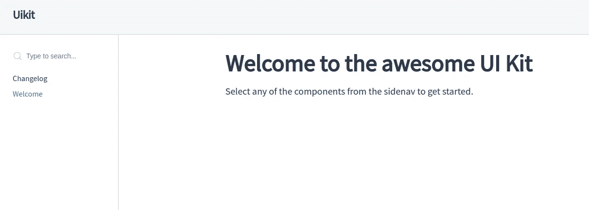
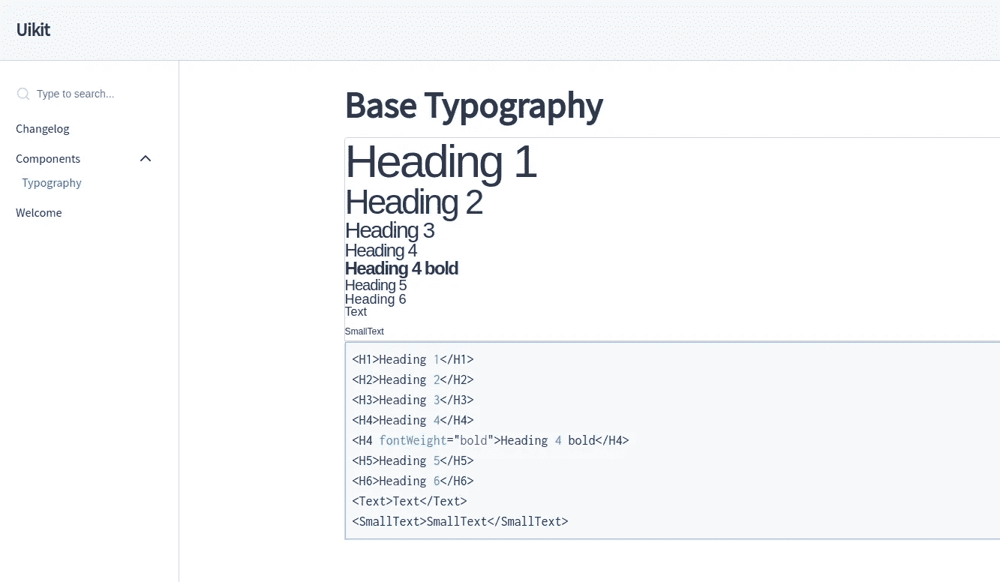

# 用 Docz 和 Lerna 构建组件库

> 原文：<https://javascript.plainenglish.io/building-component-library-with-docz-and-lerna-5cd7f470ec05?source=collection_archive---------6----------------------->


组件库如今风靡一时，许多公司推出了自己的解决方案，或者坚持使用一堆开源替代方案。利用组件库进行 UI 开发，尤其是在大型团队中，有很多好处。它允许充分利用模块化和可重用的 UI 组件，这提高了开发速度，并统一了多个团队和应用程序的风格。将它与一个健壮的设计系统结合起来，从设计到开发团队的交接会变得更加顺畅和高效。

React、Vue 等框架/库非常适合这个目的，因为它们被设计成高度模块化。在这篇文章中，React 和 Styled 组件被用作开发组件的主要工具。

还有一些有用的工具，可以用来加速库的开发过程和部署。采用模块化方法，每个组件都是一个自己的 npm 包，整个库是一个 monorepo，这是有意义的。在那里 [Lerna](https://github.com/lerna/lerna) 将被用于管理项目中的多个包，以及跟踪它们的版本和发布过程。

为了测试和记录组件，使用了 [Docz](https://github.com/doczjs/docz) (作为[故事书](https://github.com/storybookjs/storybook)的替代)。它允许用 [MDX](https://mdxjs.com/) 记录组件，MDX 是一种结合了 JSX 和 Markdown 的格式，基本上可以在 Markdown 文件中导入 React 组件。此外，Docz version 2 运行在 [GatsbyJS](https://www.gatsbyjs.com/) 上，这带来了更快的开发和构建速度，并允许访问 Gatsby 庞大的插件和工具网络。

# Lerna 设置

我们将首先创建一个名为 **uikit** 的新项目，并安装所需的依赖项。

```
$ npm i -g lerna $ mkdir uikit && cd $_ $ yarn add docz react react-dom styled-components
```

安装了核心依赖项之后，就该初始化 Lerna 项目了。

```
$ lerna init
```

这将创建以下项目结构:

```
ui-kit/
  packages/
  package.json
  lerna.json
```

UI 组件将存储在`packages`文件夹中。

现在让我们检查生成的`lerna.json`，它充当 Lerna 的配置文件。默认情况下，不会发生太多事情，经过一些定制后，配置将如下所示。

```
{
  "npmClient": "yarn",
  "version": "independent",
  "packages": [
    "packages/*"
  ],
  "useWorkspaces": true
}
```

这里最重要的变化是选择`yarn`作为 npm 客户端，指定`independent`版本控制，这样包版本可以彼此独立地改变，并且启用 [Yarn 工作区](https://yarnpkg.com/lang/en/docs/workspaces/)。`packages`选项指向我们库包的位置，我们将保持默认设置。Lerna 的 [Github 页面](https://github.com/lerna/lerna#lernajson)提供了更广泛的配置选项列表。

此外，我们需要将与工作区相关的选项添加到根目录`package.json.`

```
{
  "name": "uikit",
  "license": "MIT",
  "workspaces": {
    "packages": [
      "packages/*"
    ]
  },
  "private": true,
  "dependencies": {
    "docz": "^2.2.0",
    "lerna": "^3.20.2",
    "react": "^17.0.1",
    "react-dom": "^17.0.1",
    "styled-components": "^5.0.0"
  },
  "devDependencies": {
    "prettier": "^2.1.2"
  }
}
```

这里我们指定了到`workspaces`的路径，与`lerna.json`中的路径相同。此外，我们必须使包私有，否则工作区将无法工作。

# 创建第一个组件

为了开始开发工作，让我们添加第一个包— `Typography`，带有必要的基本字体组件。因此，项目的结构将更新如下。

```
ui-kit/
  packages/
    typography/
      src/
        index.js
      CHANGELOG.md
      package.json
  package.json
  lerna.json
```

在实际编写字体组件之前，让我们对字体的`package.json`做一些修改。

```
{
  "name": "@uikit/typography",
  "version": "1.0.0",
  "description": "Base fonts",
  "main": "dist/index.js",
  "module": "src/index.js",
  "files": [
    "dist",
    "CHANGELOG.md"
  ],
  "author": "",
  "license": "MIT"
}
```

这里最有趣的是`main`、`module`和`files`字段。我们将把`main`指向`dist`文件夹，传输的文件将存储在这里，稍后将在已安装的包中使用。`module`将指向`src`文件夹，因此在开发过程中可以直接从源文件夹导入包，并且更改将立即反映出来，而无需再次引导包或运行构建脚本。最后， [files](https://docs.npmjs.com/files/package.json#files) 属性包含文件列表，这些文件将包含在发布的包中。

现在我们可以在`typography`的`index.js`中设置一些基本的字体样式。这些将作为样式组件。

注意来自`styled-components`的`css`助手用于定义样式的可重用部分，然后由其他组件扩展。组件还接受一个`fontWeight`属性进行定制，默认为`regular`。

# 尝试 Docz 游乐场

这似乎是一个实践这些组件的好时机，这也是`Docz`将被用来记录它们的用法的地方。为了做到这一点，我们需要在项目的某个地方添加一个包含组件文档的`.mdx`文件，其中一个文件需要指向`route: /`，并且将被用作首页。让我们在`packages`的根中创建这个`index.mdx`。

```
// index.mdx---
name: Welcome
route: /
---# Welcome to the awesome UI KitSelect any of the components from the sidenav to get started.
```

运行`yarn docz dev`后，我们可以导航到`localhost:3000`，看到库的首页。



为了将文档添加到排版中，我们将在包中创建一个`docs`文件夹，并在那里添加`typography.mdx`。

```
ui-kit/
  packages/
    typography/
      docs/
        typography.mdx
      src/
        index.js
      CHANGELOG.md
      package.json
  package.json
  lerna.json
```

为了记录组件，我们将使用一个特殊的 Docz 组件，称为`Playground`。将它包裹在组件周围将允许在组件显示的正下方编辑它们。

```
---
name: Typography
menu: Components
---import { Playground } from 'docz';
import { H1, H2, H3, H4, H5, H6, Text, SmallText } from '../src/index';# Base Typography
<Playground>
    <H1>Heading 1</H1>
    <H2>Heading 2</H2>
    <H3>Heading 3</H3>
    <H4>Heading 4</H4>
    <H4 fontWeight='bold'>Heading 4 bold</H4>
    <H5>Heading 5</H5>
    <H6>Heading 6</H6>
    <Text>Text</Text>
    <SmallText>SmallText</SmallText>
</Playground>
```

刷新页面后，或者必要时重启 dev sever，我们将能够看到我们的排版组件。最棒的是，我们可以直接编辑页面上的代码，并立即看到更新的结果！



# 添加自定义字体

这对于内置字体来说很好，但是如果我们想要加载一个自定义字体，比如说从 Google fonts 加载呢？不幸的是，由于 Docz 的 v2 是对 v1 的主要重写，仍然没有清晰的、有文档记录的方法来做到这一点。然而，有一个[解决方案](https://github.com/doczjs/docz/issues/944#issuecomment-514684671)，它也很好地展示了 Gatsby 配置的可扩展性和一个概念，称为[组件隐藏](https://www.docz.site/docs/component-shadowing)。

对于特定于 Gatsby 的组件，我们需要在项目的根目录下创建一个`src`文件夹，其中将存储特定于主题的组件。因为我们正在扩展`gatsby-theme-docz`，所以需要在`src`中创建一个同名的文件夹。最后，我们将在其中创建一个`wrapper.js`文件，具有以下项目结构。

```
ui-kit/
  packages/
    typography/
      docs/
        typography.mdx
      src/
        index.js
      CHANGELOG.md
      package.json
  src/
    gatsby-theme-docz/
      wrapper.js
  package.json
  lerna.json
```

在内部`wrapper.js`我们将添加一个非常简单的组件，它唯一的任务就是传递它的子组件。

制作一个只转发孩子的组件似乎毫无意义，然而这样做的原因是我们现在可以在这个组件中包含`css`样式，这将在全球范围内应用。为此，让我们在`wrapper.js`旁边创建`styles.css`，并在那里导入一种选中的字体。在本教程中，我们将使用**蒙特塞拉特**。

现在我们只需要将这个文件导入到`wrapper.js`中，并为排版更新`fontFamily`常量。

更改应该立即可见(如果不可见，请重启 dev 服务器)。这可能不是最干净的方法，但它完成了工作，而且由于不再可能通过`doczrc.js`加载自定义字体，这可能是少数可行的解决方案之一。

# 自定义文档网站

说一下`doczrc.js`，用来配置一个 Docz 项目。配置选项列表可在项目的[文档网站](https://www.docz.site/docs/project-configuration)上找到。由于我们现在使用 Montserrat 作为 UI 工具包的排版，如果我们的文档网站使用相同的字体，这将是有意义的。为此，我们将向`doczrc.js`添加一个`themeConfig`属性，其中将应用最常用的文本元素的样式。

因为我们需要将项目配置与组件分开，所以我们必须单独声明字体系列，并将其用于特定的文本元素。此外，我们可以定制项目标题和描述。默认的`themeConfig`可以在 [Docz 的 Github 页面](https://github.com/doczjs/docz/blob/master/core/gatsby-theme-docz/src/theme/index.js)找到。在[文档](https://www.docz.site/docs/gatsby-theme)中描述了更多定制项目的选项，如添加自定义徽标。

# 添加按钮

最后，是时候添加一个 React 组件了，`Buttons,`它也将利用排版来更好地说明组件如何一起使用。和以前一样，我们将制作一个新的包，所以项目的结构如下。

```
ui-kit/
  packages/
    typography/
      docs/
        typography.mdx
      src/
        index.js
      CHANGELOG.md
      package.json
    buttons/
      docs/
        buttons.mdx
      src/
        index.js
        Buttons.js
      CHANGELOG.md
      package.json
  src/
    gatsby-theme-docz/
      style.css
      wrapper.js
  package.json
  lerna.json
```

除了一些小的例外，`buttons`的`package.json`看起来几乎和`typography`的一模一样。最值得注意的是`buttons`有`typography`包作为依赖。

```
{
  "name": "@uikit/buttons",
  "version": "1.0.0",
  "description": "Button components",
  "main": "dist/index.js",
  "module": "src/index.js",
  "files": [
    "dist",
    "CHANGELOG.md"
  ],
  "dependencies": {
    "@uikit/typography": "^1.0.0"
  },
  "author": "",
  "license": "MIT"
}
```

现在，在我们运行`lerna bootstrap`之后，它将安装所有需要的包并符号链接`packages`文件夹中的依赖项。这样做的一个好处是，如果我们对`typography`包进行任何更改，并在`buttons`中使用该包，这些更改将立即反映在两个包中，而不需要重新构建或发布它们。这让开发体验真的很快很高效！

安装完所有依赖项后，我们可以开始为按钮编写代码了。

这里我们定义了两个非常基本的按钮组件。样式组件有一些基本样式，可以进一步扩展。`ButtonSmall`有一个预定义的文本组件，因此接受按钮文本作为单独的属性。此外，为了方便起见，我们从`Buttons.js`中导出`index.js`中的所有内容。这将确保每个包有一个单一的导出点，当每个包有多个文件时特别有用。现在让我们在操场上试试这些新部件。

```
// packages/buttons/docs/buttons.mdx

---
name: Buttons
menu: Components
---

import { Playground } from 'docz';
import { Button, ButtonSmall } from '../src/index';

# Buttons

## Base button
<Playground>
  <Button>Test</Button>
</Playground>

## Small button
<Playground>
  <ButtonSmall text='Click me'/>
</Playground>
```

导航回`localhost:3000`我们可以确认按钮按预期工作。有了它，我们就有了一个文档化的、功能性的组件库，可以很容易地扩展。

# 部署文档和发布包

到目前为止，我们主要关注组件库的开发方面，但是在组件库变得可用之前，还需要完成一些其他重要的步骤。

# 发布包

要发布自上次发布以来发生变化的所有包(在用 [Babel](https://babeljs.io/docs/en/) 传输它们之后)，我们可以使用`lerna publish`命令。在发布之前，它会提示为每个包指定版本。可以用`publish`命令直接指定版本，该命令会将相同的版本应用于所有已更改的包，并跳过提示，例如`lerna publish minor`。为了发布工作，需要在`lerna.json`中添加一个`registry`。

```
"command": {
  "publish": {
    "registry": "https://mypackageregistry/"
  }
}
```

# 建立文档并为他们服务

Docz 附带了一些内置脚本，使得查看和部署文档变得更加容易。它可以通过运行`yarn docs build && yarn docz serve`在本地构建和服务。对于在线部署文档，Docz 的网站上有一个[用 Netlify](https://www.docz.site/docs/deploying-your-docs) 做这件事的简单例子。在 Netlify 站点设置完成后，通过运行`netlify deploy --dir .docz/dist.`可以很容易地进行部署

如果你想看看组件库的样板代码，可以在 [Github](https://github.com/Clarity-89/ui-kit) 上找到。

喜欢这篇文章吗？如果有，通过 [**订阅获取更多类似内容解码，我们的 YouTube 频道**](https://www.youtube.com/channel/UCtipWUghju290NWcn8jhyAw?sub_confirmation=true) **！**

*原载于*[*https://claritydev.net*](https://claritydev.net/blog/building-component-library-with-docz-and-lerna/)*。*