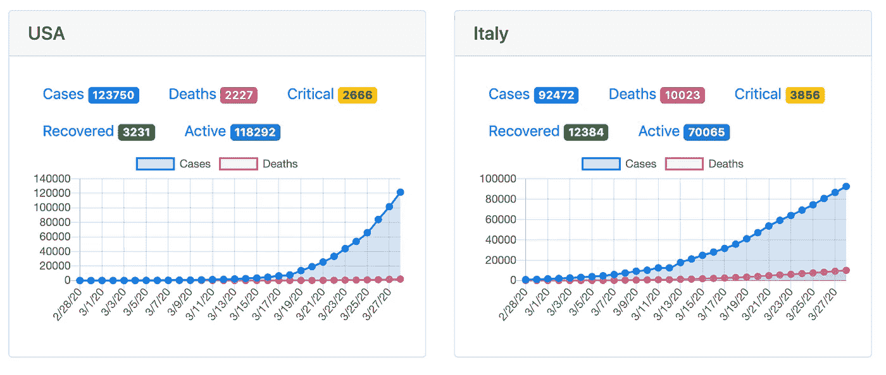
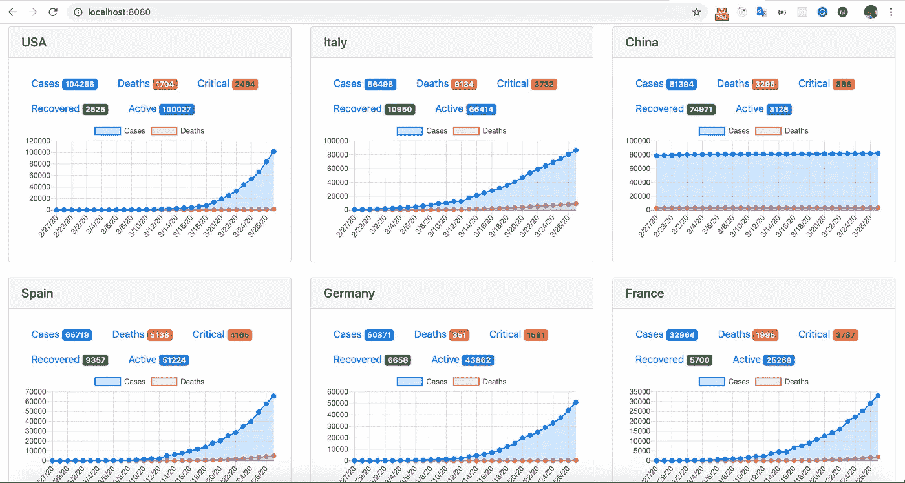
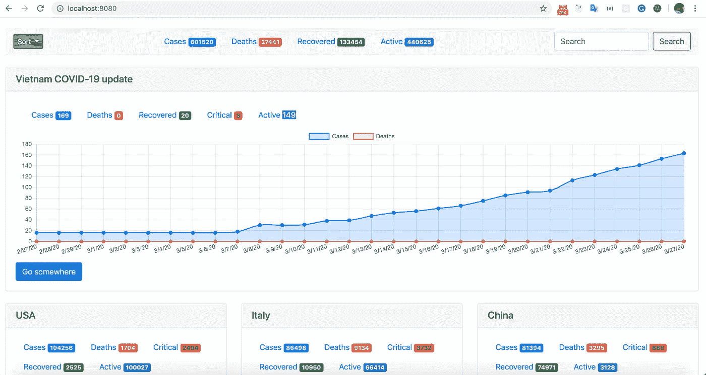

# 和我儿子在 60 分钟内建立新冠肺炎统计仪表板

> 原文：<https://javascript.plainenglish.io/building-covid-19-statistic-dashboard-in-60-minutes-with-my-son-d5c7734625eb?source=collection_archive---------8----------------------->

新冠肺炎疫情现在正成为所有媒体和社交网络上最热门的趋势。为了支持公民快速及时地了解情况，世界各国政府和许多科学组织已经公布了几个渠道来共享真实信息，特别是每小时更新的新病例数。现在，人们可以通过智能手机，短信或许多网站获得更新。

我最喜欢的功能之一是仪表板，它提供直观、清晰和快速的信息。由于公司要求每个人在家工作，我有更多的机会和我 8 岁的孩子讨论新冠肺炎疫情如何影响我们的国家和家庭。然后，他要求我建立一个非常快速和简单的仪表板，以便他可以跟进最近。

我的一个朋友——一个资深的父亲工程师介绍了一个来自 github 的 [covid api](https://github.com/novelcovid/api) ,这个服务器 api 很简单，可以快速集成。然后我们查看了 [chartjs](https://www.chartjs.org/) 库、ejs 模板、expressjs、bootstrap 4……我们将所有东西结合起来，构建了我们自己的仪表板。

my son Peter to start using his dashboard

**带有 expressjs 和 ejs 模板的后端**

这只是一个非常简单的 expressjs 服务器，我们用 EJS 模板引擎呈现 HTML 内容

我们没有将 covid api 直接安装为 npm 包。只需获取 API，我们构建了几个函数来获取我们想要的数据。只有 3 个函数和大部分代码…违反了 D.R.Y 原则。

历史 API 返回更具体的数据，不仅返回中国的数据，还返回其省份的数据。我们还发现，其他一些国家，如法国，加拿大，澳大利亚也是一样，所以我们做了一些作弊来修复数据。

**用户界面**

我们需要显示世界上所有的国家，按新增确诊病例、死亡病例等进行分类，但每个国家都应该有一个折线图来显示确诊病例和死亡病例，因为它们是我们最想看到的。

世界怎么样？我们还需要一个仪表板来获取更新频率，所以我们只需将所有信息放在标题中

上述每个组件将由 EJS 部分模板处理。由于我不是 reactjs、angular 或 vue 等所有前端框架的粉丝，所以我和我儿子一起把它们作为部分模板来构建

国家部分显示每个国家的统计数据，这一次我们遇到了一些障碍，以获取正确的数据。让我们看看，我们还将 JavaScript 代码放在这里，用从父模板传递的数据来呈现图表。

看看我们是如何过滤数据来显示国家、历史数据的…看起来有点滑稽，但在我们关闭编码来准备午餐之前，我们只剩下几分钟了。到这个时候，仪表板几乎可以工作了，并且显示了我们想要的信息

让我们看看第一次尝试是怎样的:

最后，我们添加了一个小部件来显示我们自己的国家越南的 covid 统计数据:

**糟糕，我们忘记了一些重要的事情**

实时和实时更新… websockets，http2。但简单的只是添加页面自动刷新…

> setInterval(function(){ window . location . reload(1))；}, 10*60*1000);

够简单吗？你可以在这里拿走所有的[代码](https://github.com/dothanhlam/covid_19) …这只是一个简单而愚蠢的仪表板，但这是我和儿子一起编码的快乐时光。

## **用简单英语写的一段 JavaScript 笔记:**

我们一直有兴趣帮助推广 JavaScript 相关的内容。如果你有一篇文章想用简单的英语提交给 JavaScript，用你的中级用户名发邮件到[submissions@javascriptinplainenglish.com](mailto:submissions@javascriptinplainenglish.com)给我们，我们会把你添加为作者。