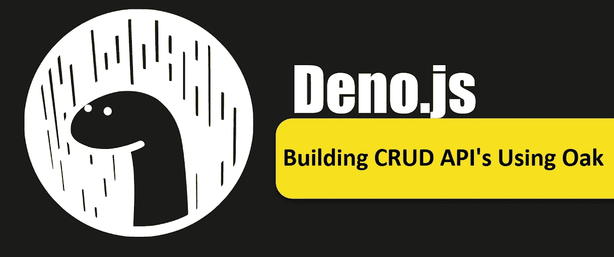
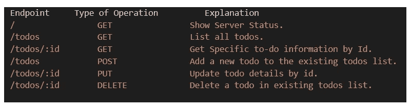
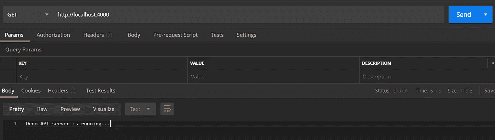
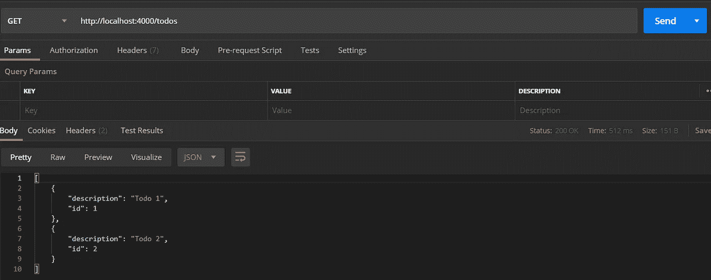
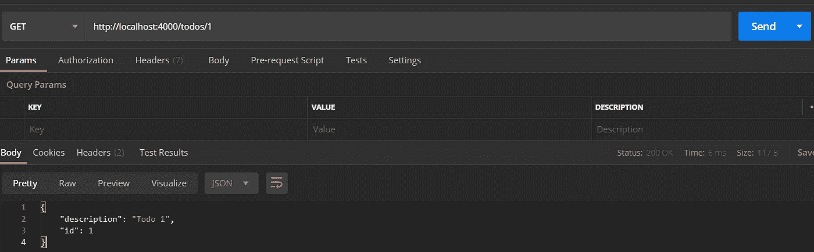
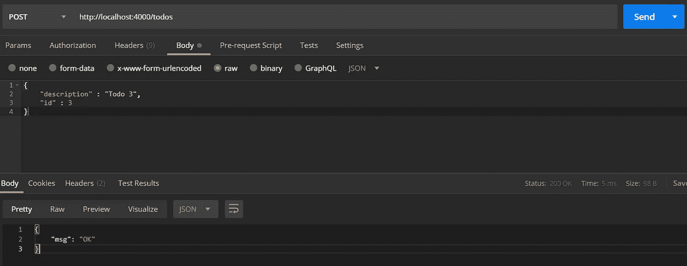
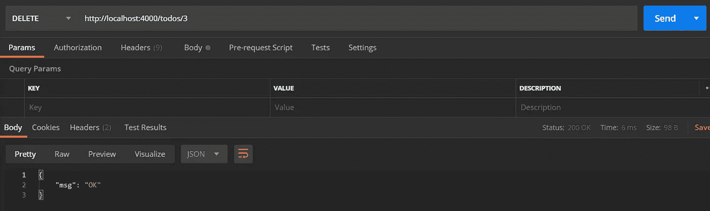

# 使用 Deno 和 oak 构建 CRUD APIs

> 原文：<https://javascript.plainenglish.io/building-crud-apis-using-deno-and-oak-9f71ec106b0e?source=collection_archive---------6----------------------->

Building CRUD api’s using Deno and oak

与 Node 相比，Deno 是一个相当新的环境。在学习 Deno 时，开发人员想做的第一件事就是构建 CRUD api。Deno 有几个项目帮助我们实现这一目标，即: [deno-express](https://github.com/NMathar/deno-express) 、 [oak](https://github.com/oakserver/oak) 、 [servest](https://github.com/keroxp/servest) 、 [deno-drash](https://github.com/drashland/deno-drash) 和 [pogo](https://github.com/sholladay/pogo) 。在这篇文章中，我们将学习如何使用 Deno 和 Oak 构建一个待办事项列表。

## **我们在建造什么？**

Oak 是一个受 Koa 启发的项目，Koa 是一个流行的 Node.js HTTP 中间件框架。我们将使用 oak 和 Deno 构建一个处理 todos 列表的小应用程序。我们将要构建的 api 将有以下端点。

List of API end points

## **我们如何构建它？**

我们需要在项目存储库中创建两个文件 **app.ts** 和 **routes.ts** 。一个用于 app，另一个用于服务路线。

**app.ts** 文件的内容如下图所示。看看我们如何在 **app.ts** 文件中从 oak 导入应用模块。我们在第 8 行创建了一个新的 oak 应用程序。我们让这个应用程序使用我们稍后将在 **routes.ts** 文件中定义的路线。现在，这个应用程序将在第 5 行和第 6 行给出的指定主机和端口上运行。

content of app.ts file

我们将在 **routes.ts** 中为 Todo 创建一个接口，它将有两个字段 **id** 和**描述**。我们将在这些字段中分别存储 todo id 和 todo 描述。我们也有一个 **todos** 列表，第一次返回初始值。

creation of todo interface and sample todos list with initial values.

我们现在将定义函数来支持 todo 的列表操作，通过 id 获取特定的 todo，创建新的 todo，通过 id 更新/删除特定的 todo 描述。相同的代码可以在下面的 gist 文件中看到。

functions for GET,PUT,POST,DELETE operations of todos.

我们已经创建并导出了路由来使用这些函数，如下所示。

Routes creation and mapping to specific functions

运行以下命令，让应用程序在 [http://localhost:4000，](http://localhost:4000,)上运行

> **deno run—allow-env—allow-net app . ts**

既然应用程序已经在 localhost:4000 上运行，那么就使用 postman 或类似的应用程序来测试 api 端点。以下是 postman 中的结果截图。

Health Check API respone

listing todos API response.

Get todo by Id API response.

POST operation to create a new todo.

DELETE operation to delete todo by Id.

如果你只是想克隆我在本文中使用的代码，看看它是如何工作的。你可以使用下面的链接从 GitHub 下载代码。

【https://github.com/Kailashw/deno-api-oak】源代码链接:

# **来自简明英语团队的通知**

你知道我们有四份出版物和一个 YouTube 频道吗？你可以在我们的主页[**plain English . io**](https://plainenglish.io/)找到所有这些内容——关注我们的出版物并 [**订阅我们的 YouTube 频道**](https://www.youtube.com/channel/UCtipWUghju290NWcn8jhyAw) **来表达你的爱吧！**