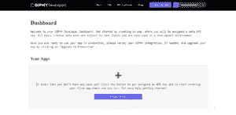
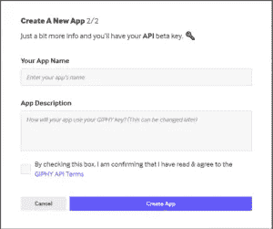

# 使用 Giphy API 构建首个 React 本地应用

> 原文：<https://javascript.plainenglish.io/building-first-react-native-app-with-giphy-api-6f8659cd5eeb?source=collection_archive---------16----------------------->

## 我们将 Giphy API 集成到任何 React 本机应用程序的经验

## Giphy 是最大的图书馆，提供了广泛用于聊天的最流行的媒体形式之一——gif 或图形交换格式和贴纸。

WhatsApp、Instagram、Slack、Skype 和 Twitter(仅举几例)等最受欢迎的社交媒体应用程序使用 Giphy 的技术为其聊天用户提供 GIF 内容和贴纸，以改善聊天体验。在 Instamobile，我们已经将 Giphy 集成到我们所有的聊天应用程序中，因此我们将描述我们将 Giphy API 集成到任何 React 原生应用程序中的体验。


在本文中，我们将通过四个简单快捷的步骤深入了解如何在 React Native 中集成 Giphy API。

## 1.获取 API 密钥

前往开发者[页面](https://developers.giphy.com/)，在 **chrome 浏览器**上创建一个账户。您的仪表板应该是这样的。



点击' ***创建一个应用'按钮*** 创建一个新的 API。将提示您在 API 或 SDK 之间选择一个选项。


对于本文，我们将重点放在 API 上，因此单击 API 选项。



填写您的应用名称和应用描述，然后创建应用。您的仪表板应该已经设置好了，上面有您的 API 键。

## 2.从 Giphy API 获取数据

此外，我们将创建状态来保存 gif 数据和我们要搜索的术语。

```
const [gifs, setGifs] = useState([]);
const [term, updateTerm] = useState('');
```

在您的 **App.js** 中，在您的 App 组件中创建一个函数`fetchGifs()`。

```
async function fetchGifs() {
  try {
    const API_KEY = <API_KEY>;
    const BASE_URL = 'http://api.giphy.com/v1/gifs/search';
    const resJson = await fetch(`${BASE_URL}?api_key=${API_KEY}&q=${term}`);
    const res = await resJson.json();
    setGifs(res.data);
  } catch (error) {
    console.warn(error);
  }

}
```

在你的 React 原生应用中随意使用这种方法，可以节省 20 分钟的编码、测试和调试时间。

## 3.在 React 本机 UI 中显示 gif

让我们创建一个图像列表组件来保存图像格式的 gif。为了实现这一点，我们编写了以下代码:

```
import React, {useState} from 'react';
import {View, TextInput, StyleSheet, FlatList, Image} from 'react-native';

// do not forget to add fresco animation to build.gradle

export default function App() {
  const [gifs, setGifs] = useState([]);
  const [term, updateTerm] = useState('');

  async function fetchGifs() {
    try {
      const API_KEY = <API_KEY>;
      const BASE_URL = 'http://api.giphy.com/v1/gifs/search';
      const resJson = await fetch(`${BASE_URL}?api_key=${API_KEY}&q=${term}`);
      const res = await resJson.json();
      setGifs(res.data);
    } catch (error) {
      console.warn(error);
    }
  } /// add facebook fresco

  function onEdit(newTerm) {
    updateTerm(newTerm);
    fetchGifs();
  }

  return (
    <View style={styles.view}>
      <TextInput
        placeholder="Search Giphy"
        placeholderTextColor='#fff'
        style={styles.textInput}
        onChangeText={(text) => onEdit(text)}
      />
      <FlatList
        data={gifs}
        renderItem={({item}) => (
          <Image
            resizeMode='contain'
            style={styles.image}
            source={{uri: item.images.original.url}}
          />
        )}
      />
    </View>
  );
}

const styles = StyleSheet.create({
  view: {
    flex: 1,
    alignItems: 'center',
    padding: 10,
    backgroundColor: 'darkblue'
  },
  textInput: {
    width: '100%',
    height: 50,
    color: 'white'
  },
  image: {
    width: 300,
    height: 150,
    borderWidth: 3,
    marginBottom: 5
  },
});
```

**重要提示**:为了让 gif 出现在你的 Android 设备上，你必须将以下内容添加到你的***Android/app/build . gradle***中的依赖项列表中。

```
implementation 'com.facebook.fresco:fresco:2.0.0'
implementation 'com.facebook.fresco:animated-gif:2.0.0'
```

现在只需运行应用程序，您将在 React Native 应用程序的主屏幕上看到类似这样的内容:

## 4.显示高级 Giphy 单元，如贴纸、趋势 gif 和最佳匹配

上面的视频展示了 Giphy API 如何对 gif 进行本地集成。您可以通过替换 ***BASE_URL*** 来轻松搜索 Giphy 贴纸

```
[http://api.giphy.com/v1/stickers/search](http://api.giphy.com/v1/stickers/search)
```

这是 Giphy API 贴纸在 React 原生应用中的外观:


Giphy API 为开发人员提供了两个更简单但更强大的端点[趋势](https://developers.giphy.com/docs/api/endpoint#trending)

> *GIPHY Trending 每天都会返回一份最相关、最吸引人的内容列表。我们的趋势内容提要会不断更新，因此您总是可以获得最新、最棒的内容。*

还有[翻译](https://developers.giphy.com/docs/api/endpoint#translate)

> *GIPHY Translate 使用 GIPHY 的特殊 sauce 算法将单词和短语转换为完美的 GIF 或贴纸。这个特性在 GIPHY 的 Slack 集成中得到了最好的展示。*

## 结论

正如我们所了解的，通过 React Native 中的 Giphy API 集成，向任何 React Native 应用程序添加 gif 支持非常简单。从 React Native 调用 Giphy 提供的通用 REST 端点非常简单。

如果你想看到它的运行，可以看看我们的[社交应用](https://www.instamobile.io/mobile-templates/social-networks/)的一个演示，所有这些应用都集成了 React 本地 Giphy API