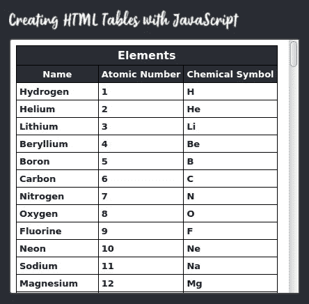

# 用 JavaScript 构建 HTML 表格

> 原文：<https://javascript.plainenglish.io/building-html-tables-with-javascript-15c79a0055ff?source=collection_archive---------2----------------------->

Image: [Pixabay](https://pixabay.com/photos/tools-workshop-equipment-690038/)

在本文中，我将演示用 JavaScript 创建和填充 HTML 表格的三种方法，并分析每种方法的优缺点。

下面截图中的表格列出了所有 118 种元素(原子类型)，包括它们的名称、原子序数(原子核中的质子数)和化学符号(化学式中使用的缩写，如 H2O 或氯化钠)。

表格本身及其标题、列标题和行是使用 JavaScript 从数据结构动态创建的，在本例中是一个对象数组。

与其他 HTML 元素相比，表格相对复杂，创建起来很麻烦，所以值得花些精力，以一种既高效运行又易于编码的方式来创建。

正如我上面提到的，我使用三种不同的方法来创建一个表。这些是:

*   将表格构建为单个 HTML 字符串，然后通过单个操作将其添加到文档中
*   使用标准的 DOM 操作方法，即 createElement、createTextNode 和 appendChild
*   使用特定于表格的方法，即 createCaption、insertRow 和 insertCell

我将在下面的代码描述中详细讨论每一个。

## 该项目

该项目由以下文件加上一个 CSS 文件和一个图形组成。它们一起构成了一个完整的网络应用程序，你可以从 [Github 库](https://github.com/CodeDrome/creating-html-tables-with-javascript)中克隆或下载它，在你的浏览器中运行，

*   creatingtables.htm
*   创建表格. js
*   elements.js

## 数据源

在开始创建表之前，我需要简要描述一下数据源。在现实世界中，您可能会填充一个表，例如，从 REST API 获得的 JSON 解析的数据结构。对于这个演示，我已经将数据硬编码到 Github 库的一部分的 **elements.js** 中的一个类的静态方法中。该类还有获取列标题和对象属性名称的方法。

这是元素数据的开始，这样您就可以看到它的样子。

现在让我们开始查看 **creatingtables.js** 中的代码。

这里我们调用三个函数中的一个来创建和填充我们的表。当然，您可以注释/取消注释函数调用来运行您想要的函数。

下面是这些函数中的第一个。

这三个功能的总体结构是相同的:

*   获取数据
*   创建表格
*   添加标题
*   添加列标题
*   插入数据
*   将表格插入到 creatinghtmltables.htm 的空 div 中

在第一个示例中，我们创建了一个名为`tablehtml`的变量，将表格保存为一个字符串，并用开始的表格标签和标题对其进行初始化。

接下来，我们添加一行并迭代标题，在关闭 row 标记之前为每个标题添加一个单元格。

之后，我们迭代元素数组，为每个元素添加一行，然后迭代每个元素对象的属性，并在此过程中添加单元格。

最后，我们只需要关闭表格并将其设置为空 div 的`innerHTML`。

**这种方法的优点**是当设置`innerHTML`时，我们只在最后点击 DOM 一次。当然，所有的元素仍然需要添加到 DOM 中，但是这是由 JavaScript 引擎在较低的层次上完成的，而不是我们的 JS 函数调用。在下面的第二个函数中，我们调用了数百次 DOM 方法，即使是对于这个大小适中的数据集。

缺点是我们将 HTML 硬编码成 JavaScript。很难完全避免这种情况，但是 JavaScript 中的大量 HTML 很难编写和维护，并且违反了您所认同的任何关注点分离教条。

让我们继续讨论标准的 DOM 方法。

这里的整体结构基本相同，但是这个函数对表格、标题、行和单元格使用了`createElement`和`createTextNode`，然后用`appendChild`将它们添加到各自的父元素中。

**优势**是我们使用“官方”的前门方法来操作更健壮的 DOM。例如，如果我们调用`document.createElement(“tr”)`，那么我们知道我们将得到一个`<tr>`,而不用担心拼写错误或必须记住在末尾添加`</tr>`。

**缺点**首先，正如我上面提到的，对各种 DOM 方法的大量调用，在这个相当小的表中有近 500 个，其次，这段代码比下面列出的下一个函数要长得多。

最后让我们看看表格元素提供的一些方法。

这里的整体结构是一样的，但是你可以看到代码更加简洁。

我们仍然需要`document.createElement(“table”)`来创建一个表格，但之后我们可以使用表格或其子元素的方法和属性来创建标题、行和单元格。

注意`insertRow`和`insertCell`使用一个索引参数，但是您可以使用-1 在末尾插入行或单元格，就像我在这里所做的那样。

一个轻微的问题是你不能直接创建一个`<th>`，因为`insertCell`总是给你一个`<td>`。我通过覆盖新单元的`outerHTML`解决了这个问题。

插入单元格时，有两种方法设置文本，设置`innerHTML`或创建/追加文本节点。我无法决定我更喜欢哪一个:第一个更紧凑，第二个更符合这个函数方法的精神。你挑吧。

同样的优点/缺点也适用:与大量的 DOM 操作调用相比，代码更容易编写和维护。

## 尝试一下

如果你想看到结果，在浏览器中打开**creatinghtmltables.htm**，通过取消注释`window.onload`中的函数调用，一次运行一个函数。当然，三者的最终结果是一样的。

## 结论

那么，用哪个呢？没有明确的答案，但我看不出第二个选项`createElement`、`createTextNode`和`appendChild`有什么优势，因为我们有更专业的方法。

如果你有一个简单但很大的数据集，那么构建一个字符串是很有效的，如果你不介意编码所有的开始和结束标签以及它们的内容，如果数据结构或需求改变，冒着必须解开代码的风险。如果你有少量的数据，喜欢光滑优雅的代码，那么选择第三个选项，`createCaption`，`insertRow`和`insertCell`。

另外请注意，`createCaption`、`insertRow`和`insertCell`只是一些特定于表格的方法，我将在以后的文章中研究其他方法。