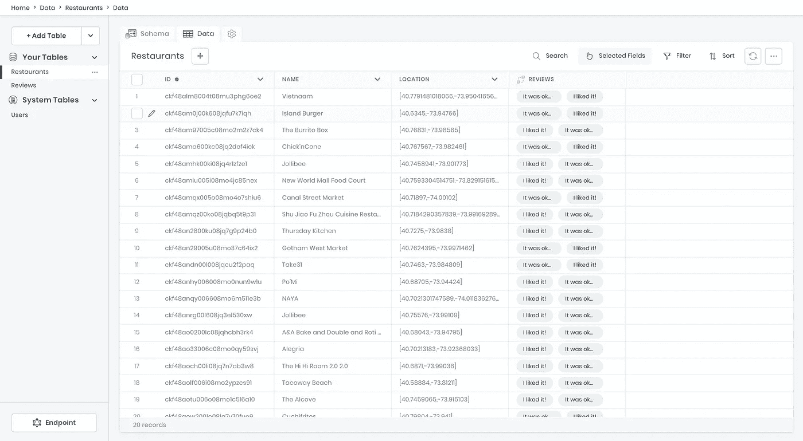
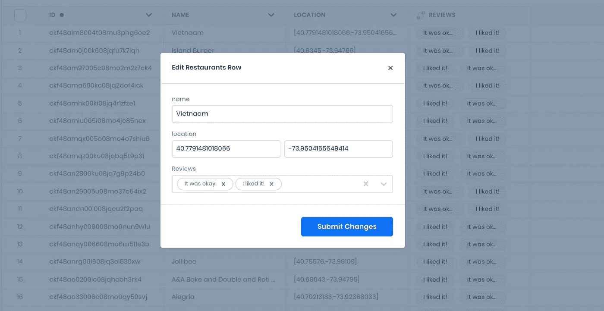
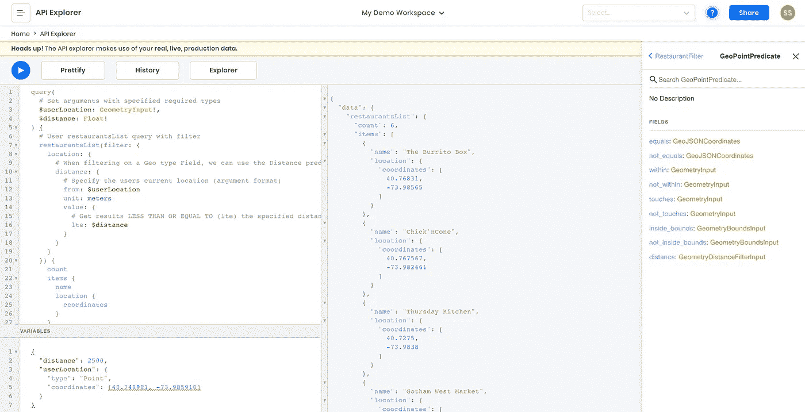
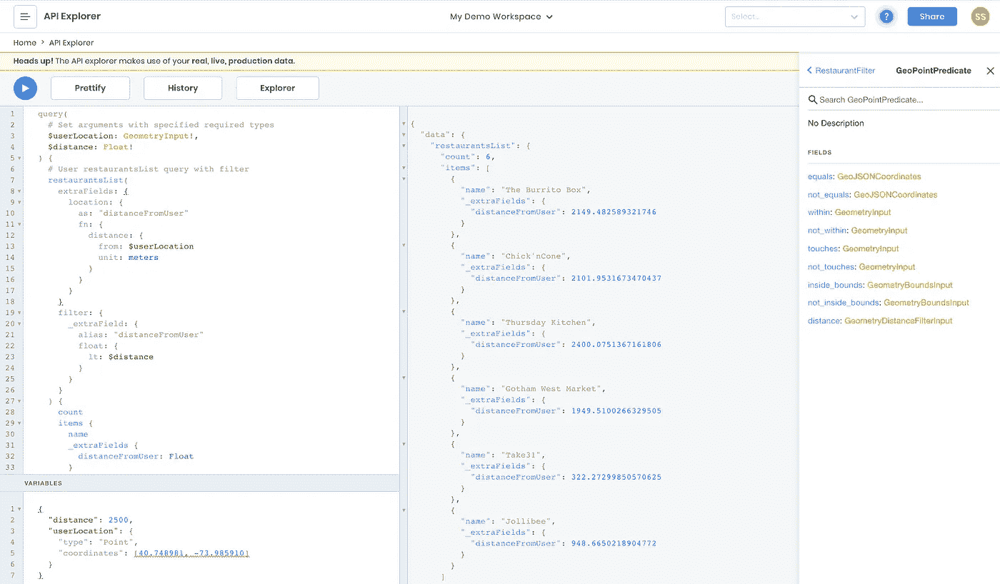

# 使用 Geo JSON GraphQL API 构建地图界面应用程序

> 原文：<https://javascript.plainenglish.io/building-map-interface-apps-using-a-geo-json-graphql-api-55b2f802d517?source=collection_archive---------8----------------------->


开发依靠地理坐标来实现重要功能的应用程序，必须远远超越简单地存储纬度和经度数据。计算边界和距离的地理坐标算法可能是一个有趣的大脑挑战，尽管它们往往会耗费时间，分散人们对核心项目的注意力。‍

在本教程中，我们将了解如何快速设置和使用一个高级的、随时可以使用地理坐标操作的 API。不管你是在构建一个基于地图的房地产应用程序，一个显示用户离餐馆距离的美食评论网站，还是任何其他需要使用地理坐标数据的应用程序；本教程将适用于任何这样的用例。

也就是说，我们将使用一个食品评论应用程序的例子，它需要向用户显示他们离被评论的餐馆的距离。所以让我们开始吧！

# 辅导的

首先，你需要一个 8 英尺的工作空间。这个免费计划对本教程来说很好，所以如果你还没有在 app.8base.com 注册，那就去注册吧。

登录 8base 后，我们需要为我们的评论建立一个简单的数据模型。它看起来会像这样:

**餐馆**

*   名称:文本
*   位置:地理位置
*   点评:有很多 Reviews‍

**点评**

*   内容:文本
*   评级:数字
*   餐馆:有一家餐馆

# 导入数据模型和种子数据

欢迎您使用 8base data builder 快速构建这个数据模型。但是，我建议使用 CLI 导入模式和种子数据。它不仅可以快速建立数据模型，还可以用 20 家餐馆和 40 条评论填充数据库。

以下命令将使您快速启动并运行！您需要将最后一个导入命令的路径提供给[这个文件](https://github.com/8base/geo-coordinates-tutorial-101/blob/master/schema-and-data.json)。‍

```
# Install the cli
npm install -g 8base-cli
# Authenticate the CLI
8base login
# Create an empty 8base project and select workspace
8base init rr-tutorial -e
# Import the schema
8base import -f [PATH_TO schema-and-data.json]
‍
```

此时，应该已经建立了数据模型，种子数据已经准备好可以使用了！您可以跳回 8base 控制台，查看 Data Builder/Viewer 来查看导入的模式和记录。它看起来会像下面的截图。



8base data viewer with imported records

# 查看保存的位置数据

如果您查看*餐馆*表，您会看到有一个名为*位置*的字段，它选择了类型*地理*，格式设置为*点*。地理点只是一个纬度和经度坐标，它们共同引用了地图上的一个特定点。

现在切换到数据选项卡，您将看到*位置*列以数组的形式显示所有的纬度和经度坐标。这就是 API 接收数据的方式，尽管当通过 UI 8base 编辑记录时，这两个值是分开的。



Editing latitude and longitude fields in 8base console

有了这个由 8base 自动生成的 GraphQL API，我们所有的地理坐标操作都可以使用了。因此，让我们跳到 API Explorer，看看我们可以访问什么样的查询和变化。

# 使用地理过滤编写查询

当用户使用您的应用程序或网站时，有许多方法可以获取用户的当前位置。例如，许多现代浏览器已经实现了地理定位 API，提示用户允许访问他们当前的位置。获得授权后，下面的代码片段将使用地理坐标返回用户的位置。

```
‍navigator.geolocation.getCurrentPosition(
 ({ coords: { latitude, longitude } }) => console.log([latitude, longitude])
)
```

使用返回的纬度和经度，您将能够将用户的位置作为参数传递给 GraphQL 查询。在这个例子中，我们只是碰巧使用了用户的当前位置。任何有效的地理坐标都可以传递给查询，用于过滤，这取决于用例。

因此，让我们继续编写一个查询，允许我们使用米来过滤一个餐馆离用户当前位置的距离。我们将手动设置用户的当前位置为纬度 40.748981 经度-73.985910 大致是纽约市的帝国大厦。

***剧透提醒:餐厅数据是曼哈顿所有的地方！*** ‍

在 API Explorer 中，打开*变量*输入并粘贴到下面的 JSON blob 中。我们将能够在查询编辑器中用作参数的顶级键。‍

```
{
  “distance”: 2500,
  “userLocation”: {
    “type”: “Point”,
    “coordinates”: [40.748981, -73.98591]
  }
}
```

‍Now:我们将写出实际的查询。请参阅下面的内容，并阅读代码注释中的上下文！

```
query(
  # Set arguments with specified required types
  $userLocation: GeometryInput!
  $distance: Float!
) {
  # User restaurantsList query with filter
  restaurantsList(
    filter: {
      location: {
        # When filtering on a Geo type Field, we can use the Distance predicate.
        distance: {
          # Specify the users current location (argument format)
          from: $userLocation
          unit: meters
          value: {
            # Get results LESS THAN OR EQUAL TO (lte) the specified distance
            lte: $distance
          }
        }
      }
    }
  ) {
    count
    items {
      name
      location {
        coordinates
      }
    }
  }
}
```

运行查询，然后嘣…我们开始工作了！不完全是。



Filtering records by distance from a lat-long point

‍We 可以看到，从我们给定的用户位置，6 家餐馆在 2500 米以内。然而，我们只过滤了列表，并在响应中获得了地理坐标。我们需要的是从我们的用户那里得到实际的距离计算结果！

# 使用额外字段返回距离计算结果

我们将能够使用一个叫做 extraFields 的 API 特性来完成这个任务。本质上，我们要做的是返回一个计算结果，它不是核心数据模型的一部分。这就是 extraFields 使我们能够做到的。

让我们稍微修改一下我们的查询来完成这个需求。就像上次一样，在下面看到它，并阅读上下文的代码内注释！‍

```
query(
  # Set the same arguments with specified required types
  $userLocation: GeometryInput!
  $distance: Float!
) {
  # User restaurantsList query with filter and extraFields
  restaurantsList(
    extraFields: {
      # Specify which field the "extra field" will be calculated from
      location: {
        # Give the new field a unique name
        as: "distanceFromUser"
        fn: {
          # Declare the function calculate that will be used. In this case, distance from the userLocation using meters.
          distance: { from: $userLocation, unit: meters }
        }
      }
    }
    filter: {
      # Instead of repeating ourselves in the filter, we can filter using the extraField that's getting calculated!
      _extraField: {
        # Specify the extraField we're filtering by.
        alias: "distanceFromUser"
        # Declare the field type and relevant predicate. In this case, a float less than the specified distance.
        float: { lt: $distance }
      }
    }
  ) {
    count
    items {
      name
      # extraFields can then be collected in the response like so.
      _extraFields {
        distanceFromUser: Float
      }
    }
  }
}
```

相当酷！对吗？正如您在回复中看到的，您现在得到了用户距离不同餐馆位置的精确距离(米)。



Using extraFields distances with lat long points

# 向查询中添加分组和聚合

可以想象，用户可以在 UI 中调整`$distance`。例如，他们可以在使用应用程序时选择 1 公里、5 公里或 10 公里作为距离，然后查询将相应地运行和过滤。也就是说，结合我们刚刚探索的地理坐标过滤器，可以生成其他类型的数据。

例如，如果用户不仅想看到 2500 米内的餐馆，还想看到评论的平均评分，该怎么办？这怎么可能实现呢？

嗯，通过深入 API 的`groubBy`特性，我们将能够完成下一个层次的复杂性。我们来看看吧！

```
query(
  # Set arguments with specified required types
  $userLocation: GeometryInput!
  $distance: Float!
) {
  # User restaurantsList query with filter
  restaurantsList(
    extraFields: {
      # Specify which field the "extra field" will be calculated from
      location: {
        # Give the new field a unique name
        as: "distanceFromUser"
        fn: {
          # Declare the function calculate that will be used. In this case, distance from the userLocation using meters.
          distance: { from: $userLocation, unit: meters }
        }
      }
    }
    filter: {
      # Instead of repeating ourselves in the filter, we can filter using the extraField that's getting calculated!
      _extraField: {
        # Specify the extraField we're filtering by.
        alias: "distanceFromUser"
        # Declare the field type and relevant predicate. In this case, a float less than the specified distance.
        float: { lt: $distance }
      }
    }
  ) {
    count
    items {
      name
      _extraFields {
        distanceFromUser: Float
      }
      # In the response we specify a groupBy argument to the relation
      reviews(
        groupBy: {
          query: {
            # On the ratings field, we aggregate an average of the reviews belonging to a restaurant.
            rating: { as: "avgRating", fn: { aggregate: AVG } }
            # We alias the grouping as reviews
            _group: { as: "reviews" }
          }
        }
      ) {
        groups {
          # In each group, we return the avgRating as a float
          avgRating: Float
          # We return the "items" (reviews) with content and the individual rating
          reviews: ReviewGroup {
            items {
              content
              rating
            }
          }
        }
      }
    }
  }
}
```

预期响应的示例如下。

```
{
  "data": {
    "restaurantsList": {
      "count": 6,
      "items": [
        {
          "name": "The Burrito Box",
          "_extraFields": {
            "distanceFromUser": 2149.482589321746
          },
          "reviews": {
            "groups": [
              {
                "avgRating": 4,
                "reviews": {
                  "items": [
                    {
                      "content": "I liked it!",
                      "rating": 4
                    },
                    {
                      "content": "It was okay.",
                      "rating": 4
                    }
                  ]
                }
              }
            ]
          }
        },
        {
          "name": "Chick'nCone",
          "_extraFields": {
            "distanceFromUser": 2101.9531673470437
          },
          "reviews": {
            "groups": [
              {
                "avgRating": 4.5,
                "reviews": {
                  "items": [
                    {
                      "content": "It was okay.",
                      "rating": 4.5
                    },
                    {
                      "content": "I liked it!",
                      "rating": 4.5
                    }
                  ]
                }
              }
            ]
          }
        }
        // ... more!
      ]
    }
  }
}‍
```

# 最后的想法

正如所展示的，使用现有的 API 平台，我们能够快速建立一个极其强大的 API，其中内置了高级地理坐标操作。这适用于您可能正在构建的各种应用程序。

我希望你发现这是有用的和有趣的！如果您有任何问题，以及您最终使用 8base 构建了什么项目，请告诉我们！

*原载于【https://www.8base.com】[](https://www.8base.com/blog/building-map-interface-apps-using-a-geo-json-graphql-api)**。***