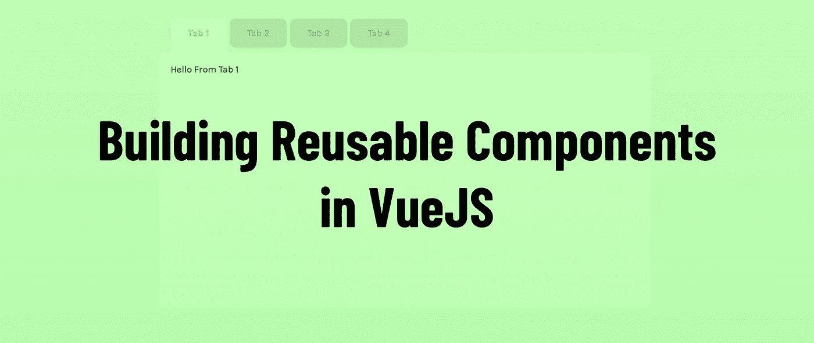
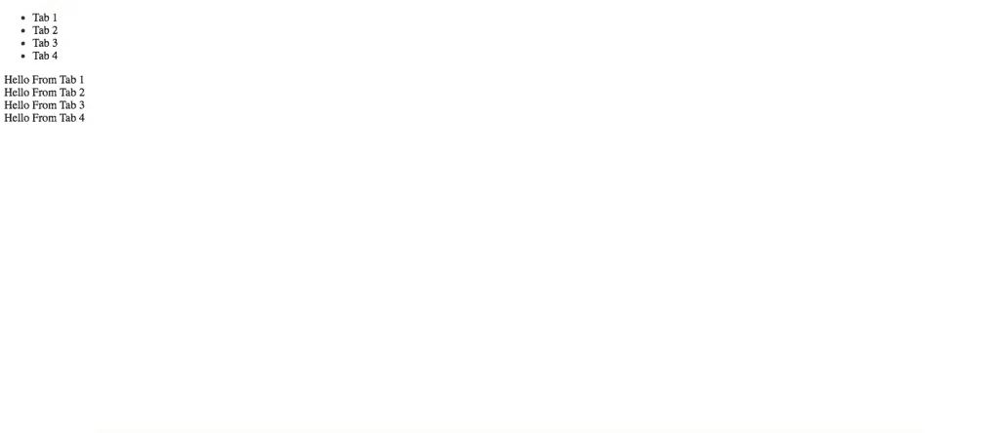
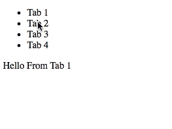
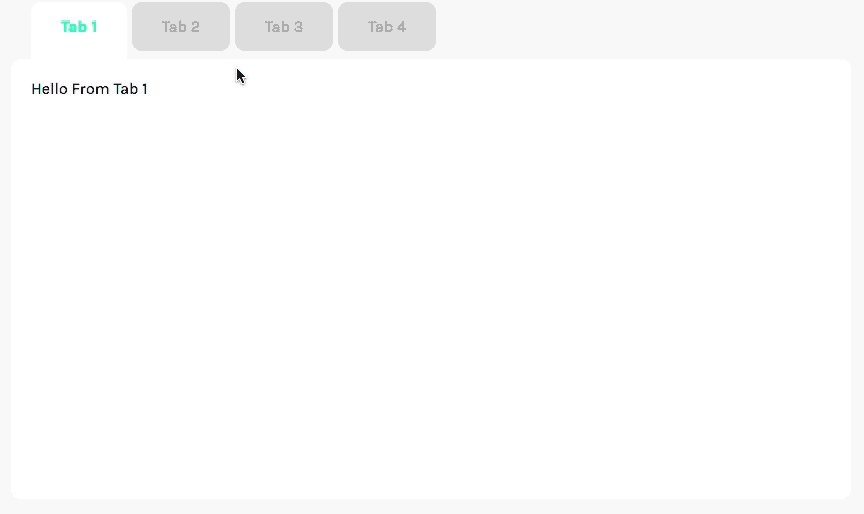
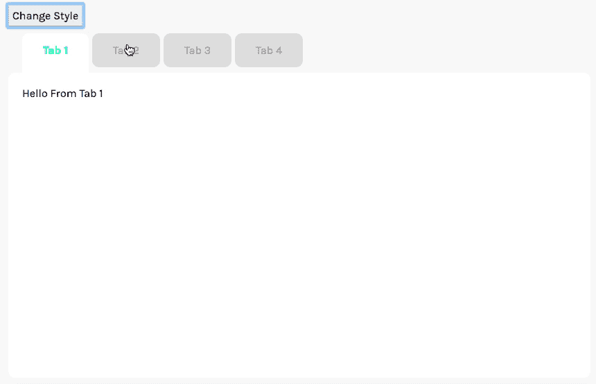

# 在 VueJS |选项卡中构建可重用组件

> 原文：<https://javascript.plainenglish.io/building-reusable-components-in-vuejs-tabs-b7ce18c48238?source=collection_archive---------2----------------------->



可重用组件在 VueJS 中非常重要。它能帮你节省很多时间，如果做得好，真的会让你的项目更具观赏性。

在本教程中，我们将制作一个自定义的标签组件，允许任何类型的内容被转换成一个单页标签系统。这就是我们要做的！


希望本教程能让你对设计可重用组件有所了解。另外，你也会得到一些有用的 Vue 代码！

*免责声明:本教程假设你对 VueJS 有所了解，如果你想学习更多的基础知识，我建议你从我们的其他教程开始。*

# 可重用组件简介

开发人员喜欢使用的一个关键短语是**不要重复自己**(干)。在 VueJS 中，有很多情况下可重用代码是有用的:滚动功能、标题组件，或者在我们的例子中，创建一个标签系统。

实现可重用代码有不同的方法。一种常见的方法是使用 [mixins](https://learnvue.co/2019/12/how-to-manage-mixins-in-vuejs/) 来提取你的功能，另一种是使用 [slots](https://learnvue.co/2019/12/using-component-slots-in-vuejs%e2%80%8a-%e2%80%8aan-overview/) 来提供定制和灵活性。

对于我们的标签系统，我们将使用插槽，这样我们可以在每个标签中放置任何我们想要的内容。

好的——让我们开始编码。

# 一切准备就绪

如果你想跟随这个教程，我创建了一些我将要使用的[启动代码](https://github.com/matthewmaribojoc/learn-vue-tabs-starter)。

这完全没有必要，因为您可以实现我们将要直接写入您的 Vue 项目中的代码。所以这真的取决于你。

不管怎样，我们的 tab 系统只需要两个组件就可以工作，然后用另一个组件来测试我们的新项目。对于功能，我们需要:

*   **Tab.vue** —可以显示的每个单独的内容选项卡
*   **Tabs.vue** —包含所有选项卡和显示它们的句柄。

这个想法很简单。Tabs.vue 组件将是一个包含**单个插槽**的包装器。然后，当我们创建一个 Tabs 元素时，我们为每个不同的内容传递几个单独的 Tab.vue 组件。

为了使示例代码尽可能轻量级，我们使用了全局 vue-cli 来帮助构建所有内容。所以要运行实际的项目，首先我们需要安装`npm install -g @vue/cli-service-global`，然后我们可以使用`vue serve src/Demo.vue`来实际运行项目。

让我们先把基本的功能做好，然后我们可以用更多的风格把它做得更漂亮一点。

# 设置可重复使用的选项卡组件

`Tab.vue`是标签系统中最底层的组件，也是最容易设置的组件之一。

我们真正想做的是获得一些识别数据(标签标题),并根据布尔值显示某种内容。我们将把`title`作为组件属性传递，并将`isActive`存储为数据值，这样我们就可以从另一个组件控制它。

为了允许我们在选项卡中显示任何类型的内容，我们可以使用一个**槽**。这个组件非常简单，所以我只向您展示代码。

```
<template lang="html">
  <div v-show='isActive'>
    <slot></slot>
  </div>
</template><script>
export default {
  props: {
    title: {
      type: String,
      default: 'Tab'
    }
  },
  data () {
    return {
      isActive: true
    }
  }
}
</script>
```

我们使用`v-show`而不是`v-if`的一个原因是为了实现 Vue 的一些保活功能。

我们稍后将返回并向该组件添加更多的定制选项，但这已经足够让您开始了。

# 设置标签包装组件

现在，让我们为`Tabs.vue`创建一些框架代码，允许它处理各种标签。

首先，我认为我们应该确定组件的 Javascript 代码。让我们从定义我们的**数据**选项开始——我们需要一组 Tab.vue 组件和一个索引来跟踪哪个选项卡当前被选中。应该是这样的。

```
export default {
  data () {
    return {
      selectedIndex: 0 // the index of the selected tab,
      tabs: [],        // all of the tabs
    }
  }
}
```

接下来，我们实际上应该弄清楚如何加载选项卡。这个组件实际上与插槽一起使用的方式看起来就像这样。

```
<!-- THIS IS JUST A SIMPLIFIED EXAMPLE. ITLL LOOK A LITTLE DIFFERENT -->
<tabs>
      <tab>Tab 1</tab>
      <tab>Tab 2</tab>
      <tab>Tab 3</tab>
      <tab>Tab 4</tab>
</tabs>
```

如您所见，每个选项卡都是 Tabs.vue 组件的子组件——这意味着我们可以使用一些 VueJS 和普通的 Javascript 模式来获取所有子组件。这段代码很简单，我们可以把它放在创建的生命周期钩子中。

```
created () {
    this.tabs = this.$children
}
```

这是将包含所有单个选项卡的组件，但是为了使这个**尽可能灵活**，我们将使用一个插槽，这样我们可以使用任意数量的选项卡。

现在，我们的模板代码将如下所示。

```
<template lang="html">
  <div>
    <ul class='tabs__header'>
      <li v-for='tab in tabs' :key='tab.title'>
        {{ tab.title }} 
      </li>
    </ul>
    <slot></slot>
  </div>
</template><script>
export default {
  data () {
    return {
      selectedIndex: 0, // the index of the selected tab,
      tabs: []         // all of the tabs
    }
  },
  created () {
    this.tabs = this.$children
  }
}
</script>
```

# 制作演示页面

接下来，我们需要某种组件来测试我们的标签组件，看看是否一切都设置正确。因此，在我们的`Demo.vue` 组件中，我们必须导入我们的选项卡和标签组件，然后创建一些示例元素。这非常简单；对于这个例子，这是我使用的代码。

```
<template lang="html">
  <div>
    <tabs>
      <tab title="Tab 1">Hello From Tab 1</tab>
      <tab title="Tab 2">Hello From Tab 2</tab>
      <tab title="Tab 3">Hello From Tab 3</tab>
      <tab title="Tab 4">Hello From Tab 4</tab>
    </tabs>
  </div>
</template><script>
import Tab from './Tab.vue'
import Tabs from './Tabs.vue'export default {
  components: {
    Tab,
    Tabs
  }
}
</script>
```

我们现在已经将所有组件连接起来了！让我们试一试。如果您之前错过了它，请确保您安装了@vue/cli-service-global —然后我们可以从命令行运行它。导航到你的项目的根文件夹并运行`vue serve src/Demo.vue`

如果你收录了和我一样的内容，你应该会看到这样的东西。



我知道。现在还很基本，但是别担心，我们会添加所有的功能。

# 添加选项卡功能

现在我们已经设置好了所有需要的组件，让我们开始实际添加选项卡部分。

这其实很简单。我们必须编辑`Tabs.vue`文件。首先，我们将添加一个方法来选择显示哪个选项卡。添加以下 Javascript:

```
mounted () {
    this.selectTab(0)
},
methods: {
    selectTab (i) {
      this.selectedIndex = i

      // loop over all the tabs
      this.tabs.forEach((tab, index) => {
        tab.isActive = (index === i)
      })
    }
 }
```

这使得一次只有一个标签是可见的，也使得在标签之间切换变得非常容易。现在，为了使用标题控制哪个选项卡可见，我们可以使用 VueJS 的 click 事件。

我们只需更改标题代码，以便在单击列表项时调用我们的新方法。我们的新代码应该是这样的。

```
<li v-for='(tab, index) in tabs' :key='tab.title' @click='selectTab(index)'>
        {{ tab.title }}
</li>
```

现在，我们应该有一个工作标签系统，其中的内容对我们的点击作出反应。



那里！我们有一个工作标签系统！每个选项卡可以包含任何类型的内容:文本、图像、表单，甚至其他定制组件。这种灵活性使得组件具有极高的可重用性。但显然，它需要一个视觉上的升级。

# 让它看起来更好

因为本文的重点是 VueJS 组件，而不是大量的 CSS 编程，所以我不打算详细介绍这个元素的 CSS。但是你可以随时去回购本教程，看看周围。

我要解释的一件事是，我是如何让选定的选项卡以某种样式显示的。为此，我们可以对 class 属性使用 v-bind。在 Vue 中，这需要一个对象，其中我们有类名和一个布尔值来切换类。

在这种情况下，我们必须编辑 Tabs.vue 中的标题，它看起来像这样…

```
<li v-for='(tab, index) in tabs' 
        :key='tab.title' 
        @click='selectTab(index)' 
        :class='{"tabs__selected": (index == selectedIndex)}'>
        {{ tab.title }}
 </li>
```

这意味着当索引等于选定的索引时(我们在选定的选项卡上)，元素将具有类。选项卡 _ _ 已选定。这允许我们向选定的选项卡添加一些自定义样式。

总而言之，在花了一点时间把它变漂亮之后。这就是我们的标签组件的样子。如果你想让你的看起来像这样，只需从 [Github](https://github.com/matthewmaribojoc/learn-vue-tab) 复制代码。



如你所见，它开始看起来很合法。现在我们再增加一些组件道具，让它超级好用。

# 添加更多定制

一个超级简单的方法是增加一些不同的风格，可以通过道具来切换。你真的可以添加任何你想要的功能:图标斑点，颜色变量等等。

现在，我将展示一个例子，我们可以使用道具在多种风格之间切换。在我们的例子中，我们将有一个亮模式和一个暗模式。

为此，我们必须在 Tabs.vue 文件中添加一个道具。只需将以下代码添加到您的导出默认值中。

```
props: {
    mode: {
      type: String,
      default: 'light'
    }
}
```

然后，我们可以向 Tabs.vue 根元素添加一个类，使用的技术与添加我们选择的 tab 类的技术相同。在这种情况下，我们需要两个可切换的类，一个用于亮，一个用于暗。(以及任何你想要的其他风格)

```
<div :class='{"tabs__light": mode === "light", "tabs__dark": mode === "dark"}'>
```

接下来，要添加实际实现的自定义样式，我们只需要调整现有的 CSS 选择器，并添加一些新的选择器，使每个模式都有元素样式。再一次，只需查看[回购](https://github.com/matthewmaribojoc/learn-vue-tab)的最终代码。

最后，我们必须更新 Demo.vue，以便向组件传递一个模式属性。出于演示的目的，我制作了一个在两种风格之间切换的按钮。这是更新后的演示组件的样子

```
<template lang="html">
  <div class='wrapper'>
    <button class='change__style' @click='changeStyle()'>Change Style</button>
    <tabs :mode="mode">
      <tab title="Tab 1">Hello From Tab 1</tab>
      <tab title="Tab 2">Hello From Tab 2</tab>
      <tab title="Tab 3">Hello From Tab 3</tab>
      <tab title="Tab 4">Hello From Tab 4</tab>
    </tabs>
  </div>
</template><script>
import Tab from './Tab.vue'
import Tabs from './Tabs.vue'export default {
  components: {
    Tab,
    Tabs
  },
  data () {
    return {
      mode: 'dark'
    }
  },
  methods: {
    changeStyle () {
      if (this.mode === 'dark') {
        this.mode = 'light'
      } else {
        this.mode = 'dark'
      }
    }
  }
}
</script>
```

现在，这是我们网站的样子…



这只是添加自定义道具的冰山一角。这真的取决于你想如何将这个标签系统扩展到你的 Vue 项目中。绝对只是玩玩它，看看有什么可能！

# 最终可重用组件文件

同样，如果你有兴趣看最终的文件，你可以查看一下 [Github 库](https://github.com/matthewmaribojoc/learn-vue-tab)。

# 可重复使用组件的关键要点

希望您能够学习一点关于使用插槽来设计可重用组件的知识。这是避免重复代码的好方法，也是包含任何您想要的内容的超级灵活的方法。

只是要记住，在开始编程之前，你要一直规划好道具/数据和继承。我知道这样做很烦人，但是当您忘记哪个组件可以访问哪些数据时，这会让您非常头疼。

我希望将此构建成一个更长的系列，在其中我们构建各种不同的可重用组件。但与此同时，祝您编码愉快！

如果你有兴趣了解更多关于 VueJS 的知识，[点击这里获得一份免费的 Vue 备忘单](https://expert-painter-2502.ck.page/f4a74ed5e2)，它是每个 Vue 开发者都需要知道的基本知识。