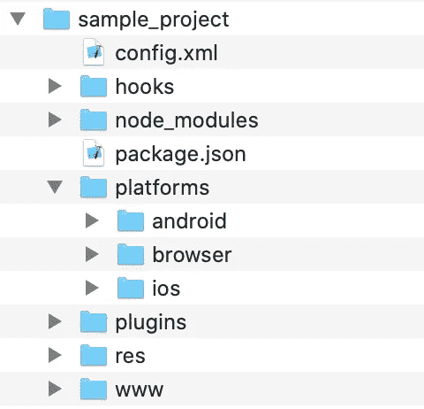
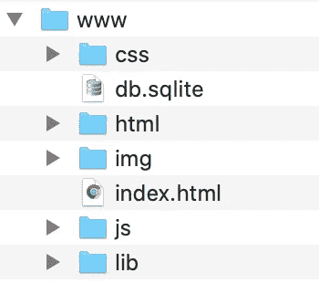

# 构建短期移动应用

> 原文：<https://javascript.plainenglish.io/building-short-lived-mobile-apps-41f2ed41ec18?source=collection_archive---------6----------------------->

JavaScript 如何允许构建需要运行几天的跨平台应用程序，但不能有一点瑕疵


Image by [Tatiana Syrikova](https://www.pexels.com/it-it/@tatianasyrikova?utm_content=attributionCopyText&utm_medium=referral&utm_source=pexels) from [Pexels](https://www.pexels.com/it-it/foto/marketing-smartphone-laptop-notebook-3975575/?utm_content=attributionCopyText&utm_medium=referral&utm_source=pexels)

# 没时间修理它

在过去的两三年里，我越来越多地参与开发一种特定类型的移动应用程序，这需要在大多数其他应用程序中不需要的特殊技术预防措施。这些应用程序支持公共或私人活动的所有参与者，如公司会议、婚礼、校友会议、导游等。

像这样的应用程序有一个特点，就是在活动开始前几天才可用，活动一结束(或几天后)就停止工作。它们短暂的“保质期”有一个显著的后果:它们只能在应用商店上发布一次，如果在它们的内容或功能中发现任何缺陷，通过提交新版本来修复它不是一个选项。

# 我的一点技术史

我从 2008 年开始为 iOS 开发应用程序，首先是在家里，然后作为一份固定工作。最初拥抱原生平台(XCode 和 Android SDK)，我逐渐转向跨平台工具，经历了几个不同的解决方案(Appcelerator、ExtJS、Xamarin、React Native)。我从未完全满意过。自 2001 年以来，我在构建 web 应用程序时或多或少地经历了同样的失望:所有这些框架都是好东西吗？当恼人的和永无止境的维护任务发生时，第一个时刻的兴奋感是否还站在远处？
长话短说:我说服自己和我的同事，只需要一个极小的平台就足以开发一切，这里“极小”意味着 HTML、CSS 和 jQuery。
这听起来可能很奇怪，但与 React 或 Flutter 等高级工具相比，使用这些基础工具确实有优势。但是我将在以后的文章中详细阐述这一点。

这里值得一提的是，我们的选择对解决我们遇到的问题至关重要:如何修复一个应用程序而不需要重新构建它。

# 活动管理应用程序的功能

首先，这么短命的 App 是做什么的？它为用户提供

*   关于活动的信息(时间表、联系人、地点等。)
*   通知
*   关于这个城市和邻近地区的暗示和好奇
*   地图
*   预订额外服务和订阅额外活动的功能
*   聊天或其他联系渠道

在大多数情况下，提供了后台 web 应用程序，其中事件“管理员”可以控制流入和流出用户设备的信息。

# 编码一次，随时改变

我们有三个挑战要应对。

**首先**，我们的客户可能需要随时修改页面内容。
在应用程序发布后，由于不可预见的情况，他或她可能想要更改、添加或删除任何文本、图像、样式和导航树本身。

**其次**，即使在活动开始后，应用程序逻辑的某些方面也可能发生变化(例如，由于组织限制，预订功能的某些行为)。

**第三**，我们必须能够修复发布后出现的任何 bug，而无需发布新版本。

简而言之，我们找到的解决方案依赖于一种机制，在这种机制中，应用程序与驻留在后端服务器上的数据保持同步，其中“数据”包括实际内容，但也包括软件块(HTML、CSS 和 javascript)。

让我们看看如何做到这一点。

# 软件平台

我们编写的应用程序很像一个标准的单页应用程序，以 HTML、CSS 和 jQuery 为骨干。为了将它转换成 iOs 和 Android 包，我们使用了 [Apache Cordova](http://Let%27s%20see%20how%20we%20do%20that.) 。这种架构的一个优点是，我们可以使用浏览器(通常是 Google Chrome)完成 95%的开发和测试:需要省略的几件事情是设备专用功能，如推送通知或照片库浏览。

典型 Cordova 应用程序的目录树具有以下结构:



Structure of a Cordova project

请注意， ***www*** 文件夹包含整个应用程序源代码，而所有其他文件夹和文件都为 Cordova builder 服务，以生成打包同一应用程序的 Android、iOs 和浏览器版本所需的所有附加组件。 *www* 文件夹的典型(最少)内容可能是:



Content of the www folder

构建时，Cordova 将整个文件夹复制到 Android 和 XCode 资产中，成为最终包的一部分。index.html 文件是应用程序的入口点，和一个简单的网络应用程序一样。在我们的应用程序中，我们还使用了 SQLite 数据库，适当的 Cordova 插件(cordova-sqlite-ext)将该数据库复制到设备的可写区域，而所有其他文件都不能由程序写入。

现在让我们看看如何利用这个简单的结构来获得一个应用程序，我们可以改变它而不用重新构建它，更不用说发布它了。

# 第一:数据同步

我们的应用程序可以在线和离线模式下工作，这要归功于它自己的本地 SQLite 数据库，其中包含所有相关的基本数据(活动计划、参与者、地址、预订等)。).当我们第一次将应用程序上传到商店时。包中的 sqlite 文件包含当时可用数据的最新版本。之后，应用程序会在适当的时候调用后端服务器来保持更新:

*   开始时
*   当用户从后台恢复时
*   当它出于其他目的(如预订服务)调用服务器时

当调用服务器时，我们的应用程序向它发送“最后更新”的时间戳，并负责将新的时间戳保存在应用程序的本地存储中。在服务器端，服务器选择此后所做的所有更改，并以 SQLite 语句的形式返回给应用程序。稍后我们将看到更多细节。

# 第二:内容同步

为了让用户完全控制应用程序页面的内容，整个应用程序根据保存在其 SQLite 数据库中的数据动态构建页面，我们称之为 CMS 或*内容管理系统*。CMS 包含

*   文本(HTML 格式，可能包括 CSS 部分)
*   图像和图像库
*   页面之间的关系和转换的定义

作为同一个数据库的一部分，数据同步机制也适用于 CMS 数据。我们创建了一个非常先进的后台工具，让非技术用户在网络后台维护那些 CMS 数据。

# 第三:覆盖 HTML 和 CSS

CMS 允许用户以广泛的自主权处理大多数应用程序页面。图像、文本和链接由用户通过 web 后端定义，并由应用程序的 javascript 代码放入正确的 HTML 上下文中。然后，通过插入表单、按钮等小工具来完成该内容。，由应用程序设计者和开发者计划。

应用程序的这种预先设计的部分由 HTML 模板和 CSS 定义组成，分别驻留在静态文件夹 www/html 和 www/css 中。因此，在需要时不能直接覆盖它。

对预定义的 HTML 和 CSS 进行不可预见的更改不太常见，但确实会发生。为了克服这个障碍，我们决定

*   在用于数据库的同一通道上传送对 HTML 模板的任何更新
*   通过在 HTML 文件中插入*脚本*标签，使用相同的通道覆盖 CSS 定义
*   将所有更新的 HTML 保存到本地存储
*   动态加载所有 HTML，从本地存储中获取，或者如果缺少，从内置文件中获取。

# 第四:覆盖 Javascript 函数

如何修复或更改我们应用程序的 javascript 部分？

首先，我们构建了我们的代码，使它由小的 javascript 函数组成:主初始对象(“app”，因为它是一个 Cordova 应用程序)，有几个映射我们的应用程序的逻辑子部分的属性(例如，app.program、app.reservation、app.contact、app.map 等)。).每个函数都是其父对象的*属性*(例如 app.reservation.listServices、app.contact.sendMsg 等)。

剩下的就简单了:

*   我们在用于数据库和 HTML 模板的同一通道上传送对 javascript 函数的更正
*   我们按照它们出现的顺序将它们保存到本地存储中
*   当应用程序启动时，它从本地存储中读取所有的函数重定义并执行它们，从而覆盖之前在静态 javascript 文件中找到的任何同名函数。

现在让我们看一些代码。

# 在服务器上:“get updates”API

我们的后端服务器提供了一个 RESTful API，它接收一个时间戳并返回一个 JSON 响应，该响应包含一个新的时间戳和三个可能的空数组:

*   命名的 HTML 文件列表
*   javascript 文件列表，按照它们必须执行的顺序排列
*   SQLite 语句的列表，按必须执行的顺序排列

下面是一个收集 javascript 和 HTML 文件更新的 PHP 代码示例:

Example code collecting javascript and HTML updates

它扫描一个目录，收集在给定日期之前更改过的所有文件。对于 javascript 文件，它只返回文件的内容。对于 HTML 文件，它返回文件名及其内容，并且每个文件必须与它要替换的项目文件完全相同。

关于数据库，我们采取了以下策略:

*   应用程序以 **SQL 语句**的形式接收所有数据库更新
*   对于每个可更新的 SQLite 表 ***x*** ，在 MySql 数据库中存在一个 ***sync_x*** 视图，与表 ***x*** 具有相同的列
*   每个 ***sync_x*** 包括时间戳和主键
*   ***触发器*** 拦截表行的物理删除并产生相应的 SQL 语句；典型的触发器是

```
DELIMITER $$CREATE TRIGGER IF NOT EXISTS `deleted_from_mytable` AFTER DELETE 
ON mytable FOR EACH ROW BEGININSERT INTO app_sql (SqlStatement) VALUES( CONCAT('DELETE FROM mytable WHERE MyTable_Id=',old.MyTable_Id) );END;$$
```

*   一个临时的表(上例中的 *app_sql* )收集了触发器生成的所有 sql 语句和手动构建的语句(在紧急维护 SQLite 数据库的情况下)

下面是处理这个问题的代码:

Example code preparing SQLite updates

值得注意的是，在后端处理所有人员所需的代码是多么的简短。

# 在应用程序中:接收更新

处理更新的客户端代码也很简单。我们的应用程序调用后端 API 并处理响应，如下所示:

一切处理完毕后，我们有

*   最新的数据库
*   最新的 javascript 函数，也保存在本地存储中
*   保存到本地存储中的已更改 HTML 文件的新副本

当程序想要使用一个 HTML 文件时，它总是动态地加载它，有一个非常简单的函数，就像这样:

我们还需要一件事来完成任务:每次我们的应用程序启动时，它必须恢复固定的 javascript 定义。这是微不足道的:

# 结论

注意，使这种解决方案可行的是普通 javascript 和 HTML 的使用。我不认为目前的主流工具(如 Ionic、React Native、Flutter 等。)可以做同样的事情，即动态更新应用程序代码。如果我错了，请告诉我。

我们可以称这些应用程序为“自我修复”。即使不正确，也好像是。我们记得，当我们成功地解决了用户智能手机上的意外问题，没有造成任何伤害，用户甚至没有注意到时，我们取得了巨大的成功。

一种魔法。