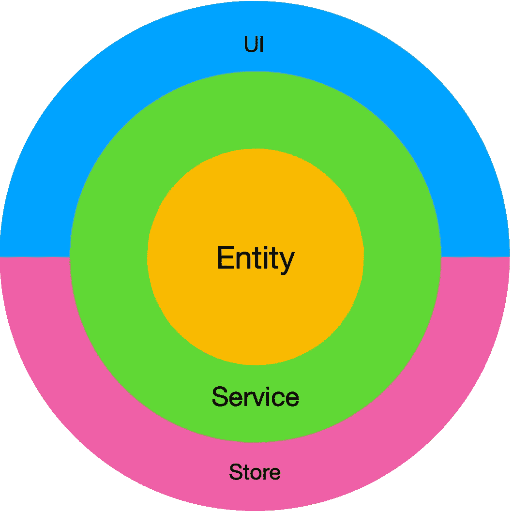

# 用 Vue 构建企业应用程序

> 原文：<https://javascript.plainenglish.io/building-vue-enterprise-application-part-0-overture-6d41bea14236?source=collection_archive---------0----------------------->

## 将清洁架构的原则应用于企业前端应用。第 0 部分(序曲)

Dependency rule illustration for FE application

# 序文

在[最后一篇文章](https://medium.com/javascript-in-plain-english/react-vue-and-business-logic-19df105698a2)中，我谈到了如果我们不小心将应用程序的业务逻辑与用户界面分开，可能会出现的不同的复杂性。但这只是一场理论上的独白。这一次，我想更进一步，提供一个我们如何实现这个目标的教程。

正如标题所述，本教程特别关注 Vue 的实现。我希望我能找到时间，为反应准备一个单独的教程。但是由于这两个库几乎是相同的，并且这种方法背后的核心思想是相同的，我希望 React 开发人员也会发现这篇文章很有用。

# 同意

Photo by [Cytonn Photography](https://unsplash.com/@cytonn_photography?utm_source=medium&utm_medium=referral) on [Unsplash](https://unsplash.com?utm_source=medium&utm_medium=referral)

与任何其他人类实践一样，前端开发有各种各样的方法、技巧，甚至主观偏好。在我们开始之前，我想对我在本教程中选择使用的方法和技术做一些澄清。你有权不同意并偏爱他人，但我会花几段时间解释我的理由。

## **这是关于构建企业应用程序**

我将要讨论的架构思想和方法主要适用于企业级应用程序。这里，我指的是这样的软件:

a.有相当多的复杂性；

b.由一个开发团队(不是一个，不是两个，而是一个*团队*)构建和支持；

c.必须存活至少几年，一方面尽可能独立于前端世界的快速变化，另一方面保持可维护性；

d.是一个 web 应用程序:不是一个“瘦客户机”网站，几乎整个业务逻辑都存在于后端。它也不是一个用户界面库，可以说它不包含任何业务逻辑。我认为，对于这些情况，另一种方法会更有意义。

## **测试驱动开发**

我坚信 TDD 为提高代码质量提供了很多价值。不幸的是，我所看到的大多数教程都没有使用它(除非这些教程实际上是关于 TDD 的)。在本文中，我将使用一种测试驱动的方法:我们将首先考虑特定功能的测试，只有在这之后，我们才会编写实际的代码。

# 先决条件

Photo by [Sharon McCutcheon](https://unsplash.com/@sharonmccutcheon?utm_source=medium&utm_medium=referral) on [Unsplash](https://unsplash.com?utm_source=medium&utm_medium=referral)

在开始之前，请确保您的工具箱中有一些工具。

## **理解一般的基于组件的体系结构，特别是 Vue**:

1.  您知道“组件”在用户界面方面的含义
2.  您了解 Vue 的基本语法
3.  你知道什么是“状态”
4.  您知道什么是“渲染”和“生命周期事件”

## **对 Vuex 的理解**

1.  您熟悉通量模式
2.  你知道什么是“行动”“突变”和“储存”
3.  你明白 Vuex 和 Vue 之间的联系

## **面向对象编程**

最重要的是，你知道 OOP **和优秀软件设计的基本原则:稳固、设计模式、关注点分离等。等。如果你认为 javascript 必须只支持函数式编程，或者“OOP 是为 java 开发人员准备的”，这篇文章可能会让你失望。**

# 工具

Photo by [Jo Szczepanska](https://unsplash.com/@joszczepanska?utm_source=medium&utm_medium=referral) on [Unsplash](https://unsplash.com?utm_source=medium&utm_medium=referral)

除了 Vue/Vuex 之外，工具箱中还有一些我将在本教程中使用的项目:

1.  **打字稿**。我们即将启动一个企业应用程序。多个开发者将支持它几年。很多启动项目的开发者，几年后就会被换掉。这就是行业的现实。严格类型(结合适当的测试覆盖率和林挺)提供了一种从长远来看降低应用程序维护成本的好方法。我不会在这里花时间说服你为什么这是如此重要。幸运的是，关于它有成百上千的帖子。
2.  **JSX** 。默认情况下，Vue 采用了模板语法，这在主观上比 JSX 更“自然”,更接近传统的 HTML。然而，后者有一个令人惊讶的好处:它支持严格类型。我最近发表了一整篇文章[关于为什么这很重要以及你如何使用它。](https://medium.com/@gregsolo/why-i-advocate-using-jsx-and-typescript-in-vue-components-e378bf9ee6e7)
3.  **笑话**。我将结合使用 [Jest](https://jestjs.io) 和 [Vue-test-utils](https://vue-test-utils.vuejs.org) 进行单元测试
4.  **将**虚拟化为 [UI 库](https://vuetifyjs.com)

# 项目概述

Photo by [Craig Cameron](https://unsplash.com/@craigcpcb?utm_source=medium&utm_medium=referral) on [Unsplash](https://unsplash.com?utm_source=medium&utm_medium=referral)

这个项目将是一个典型的庞大的企业应用程序的最小化，嘲笑版本。将博客作为虚拟项目是相当常见的，我将遵循这一传统。

我们的博客自然会有用户可以阅读的文章和可以留下的评论。它将只包含两个页面:主页(包含所有文章的简短版本和链接)和文章页面(一篇文章的完整内容，人们已经发布的评论和发布新评论的表格)

工作演示为您服务(请原谅 Heroku 的长时间热身)

## **源代码**

> “空谈不值钱，给我看代码”
> 
> 莱纳斯·托沃兹。

完全同意，所以如果你不想花时间继续阅读，可以直接进入[代码](https://github.com/soloschenko-grigoriy/vue-vuex-ts)

## **如何使用本教程**

repo 包含几个分支，每个分支对应教程的一章。随意在它们之间跳转，看看源代码是如何随着时间慢慢演变的。在每一集的开始，我会为您提供该部分特定分支的链接，以便您可以一步一步地跟随示例。

我们将在本章中分析我们必须满足的需求。然后，我们将编写一些测试来覆盖这些需求，然后是实际的代码。最后，我们将总结更多的测试，或者在必要时修复旧的测试:利用好的旧的 TDD。

首先，检查回购的源代码，如果你还没有这样做。然后，切换到名为“init”的分支。它会将回购置于初始状态，项目几乎为空。我们先来看看文件夹结构。

*   “实体”、“服务”和“商店”将持有应用程序的各自元素；他们现在是空的。
*   “ui”文件夹包含通常直接放入 src 的东西:Vue 组件、路由器页面(或视图)和 Vue 插件。我们知道 UI 不重要，所以把它们放在专用的子文件夹下感觉是对的。

我在 vue-cli 项目的基础上构建了这个应用程序。所以，如果你查看 package.json，你可以看到类似“vue-cli-service serve”这样熟悉的命令。

要运行开发服务器，只需使用“ **npm run serve** ”。运行测试:“ **npm t** ”，在观察模式下:“ **npm 运行测试:观察**”。

请注意，我对 TypeScript 使用了非常严格的 ESLint 规则:我强制使用显式函数返回类型(表达式和高阶函数除外)，接口前缀为“I”。我也禁止不使用的变量和无用的构造函数、分号和双引号。这是我个人(部分主观)的建议。在现实生活的项目中，遵循还是忽略它取决于你自己。

每章的每一步都会提供代码片段。您可以复制粘贴它们，然后运行项目。但是我会建议你输入它们。这将帮助你更好地理解和记忆这段代码，并提高教程的效率。

祝你好运！

# **架构**

[上次](https://medium.com/javascript-in-plain-english/react-vue-and-business-logic-19df105698a2)我花了很多时间从前端应用的角度谈论干净的架构。鲍勃叔叔在他的[文章](https://blog.cleancoder.com/uncle-bob/2012/08/13/the-clean-architecture.html)中，给出了一个干净架构的很好的例子。我冒昧地说明了我们打算如何将它应用到这个项目中(上图)。

这张图片代表了依赖规则:内圈不知道外圈的事情。

如你所见，在应用程序的中心是实体。这些是核心业务规则(或者更广泛的情况下甚至是企业业务规则)。它们包含最宝贵的逻辑，对应用程序至关重要——零依赖的纯对象。

下一个圆圈代表服务。您可以将它们视为特定实体的用例。这是我们获取和操纵它们的地方。服务遵循依赖规则，只依赖于实体。

最后，一圈细节:不重要的，额外的东西，如 UI、DB(或商店)、框架等。它们依赖于服务和实体，也相互依赖(例如，组件依赖于存储)

事不宜迟，下面是我们将要讨论的主题列表:

*   [第 0 部分。序曲](https://medium.com/@gregsolo/building-vue-enterprise-application-part-0-overture-6d41bea14236)
*   第一部分。实体
*   [第二部分。服务](https://medium.com/@gregsolo/building-vue-enterprise-application-part-2-services-f7ec400190e7)
*   [第三部分。Vuex](https://medium.com/@gregsolo/building-vue-enterprise-application-part-3-the-store-dbda0e4bb117)
*   [第四部分。UI:页面和组件](https://medium.com/@gregsolo/building-vue-enterprise-application-part-4-ui-components-21a45b3067a4)

下次见！