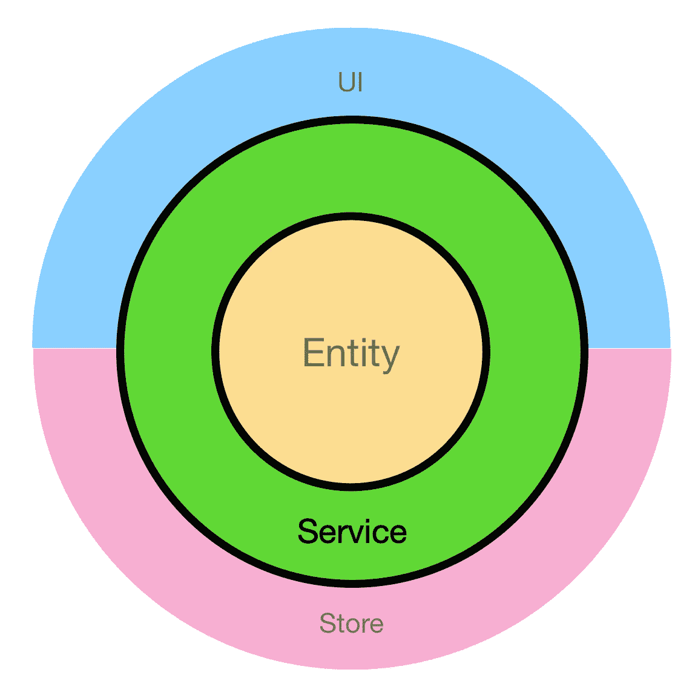

# 构建 Vue 企业应用程序:第 2 部分。服务

> 原文：<https://javascript.plainenglish.io/building-vue-enterprise-application-part-2-services-f7ec400190e7?source=collection_archive---------0----------------------->

## 清洁架构原则在企业前端应用中的应用



# 目录

*   介绍
*   需求分析
*   测试优先(TDD)
*   服务，为您服务！
*   供应者
*   结论

# 介绍

上次我们基于[清洁建筑](https://blog.cleancoder.com/uncle-bob/2012/08/13/the-clean-architecture.html)的理念为我们的博客建立了一个坚实的基础。我们建立了文章和评论的规则和数据结构:我们应用程序的主要构件。在这篇文章中，我们将更进一步:我们将编写服务。

什么是“服务”？根据上下文和谈话对象的不同，你可能会得到完全不同的定义和解释。在我们的例子中，我将大胆地把它们命名为“执行核心业务操作的东西”从架构的角度来看，它是依赖关系图中的下一个圆圈。

从技术角度来看，它可以是任何东西:类、函数、一组函数和一个有方法的对象。唯一的规则:远离“细节”:框架、商店、UI 等。唯一的依赖服务应该是实体或其他服务。

从概念的角度来看，服务的目标是在实体上执行所需的业务操作。如果你熟悉叔叔的鲍勃的书“干净的建筑”，你可能会注意到一些偏差。在他的书中，鲍伯·马丁将下一个循环描述为“用例”我不是在重新发明轮子，而是在“服务”的保护伞下组合用例如果您熟悉后端世界中非常流行的存储库服务模式，您可能会发现许多相似之处。

# 需求分析


Photo by [Isaac Smith](https://unsplash.com/@isaacmsmith?utm_source=medium&utm_medium=referral) on [Unsplash](https://unsplash.com?utm_source=medium&utm_medium=referral)

让我们从需求分析开始我们的旅程。该应用程序是一个博客，但我们不会复制所有可能的功能。让我们假设我们的业务团队和我们使用增量方法，现在，我们正在构建最小的有价值的产品:MVP。

英国电信给我们带来了以下故事:

*   作为用户，我应该能够在主页上看到所有的文章
*   作为一个用户，我应该能够从那里导航到一个页面，代表一个特定的文章，并看到完整的文章
*   作为一个用户，我应该能够在这个页面上留下评论

(提醒一下，您可以在这里找到一个工作演示示例

这些都是很长的故事，现在，我们不关心其中的 UI 部分。我们在想，“数据第一。”。我们可以将它们转化为仅针对数据/逻辑的技术任务:

*   实现获取所有文章的方法
*   实现一种通过 Id 获取一篇文章的方法
*   实现为文章创建新评论的方法

# 首先测试


Photo by [Siora Photography](https://unsplash.com/@siora18?utm_source=medium&utm_medium=referral) on [Unsplash](https://unsplash.com?utm_source=medium&utm_medium=referral)

源代码可在[repo](https://github.com/soloschenko-grigoriy/vue-vuex-ts)中获得。随意切换到“实体”如果你跳过了前一篇文章，在项目中分支。如果您完成了实体部分，并且一切正常，那么您就可以开始了。

关于服务文件夹结构，我将遵循我们用于实体的相同方法:

```
/src/services/articles
contains all Articles Services code, specifically:/src/services/articles/articles.ts
actual Article Service/src/services/articles/articles.types.ts 
types for Article Service/src/services/articles/articles.spec.ts 
unit tests for Article Service/src/services/articles/articles.mocks.ts 
mocks for Article Service/src/services/articles/index.ts 
barrel file for Article Service/src/services/index.ts 
barrel file for all Services
```

让我们创建这些文件。我还会填写木桶文件:

Updating barrel files

太好了，是时候让我们写一些类型和测试了。根据需求，有三种用例:获取所有文章，通过 id 获取一篇文章，并为文章创建评论。让我们为他们定义签名:

ArticleService Protocol

第一种方法很简单:获取并返回所有文章。

getOneById 需要一个数字 Id 作为参数，如果它存在或未定义，则返回一个文章。最后，“createComment”希望文章的评论数据和 ID 能够附加新创建的评论。

*注意，我们可以创建一个单独的评论服务。但是由于没有专门的 API(或者单独的 JSON 文件)用于注释，我觉得没有必要。但是您的实际应用程序可能会有所不同。*

现在，由于服务是一个普通的 TS/JS 代码，并且我们预先为文章和评论实体创建了模拟，所以编写测试是绝对容易和愉快的:

ArticleService Spec

最后两个测试值得特别注意。如果用于创建注释的数据无效，我预计会抛出一个错误。服务应该检查实体并验证所提供的数据，否则会出现错误。我发现强调这一点很重要:**错误处理通常是应用程序的关键部分**。验证规则可能不受 UI 定义或控制:React/Vue 组件、Redux/Vuex 存储、Thunks/Sagas 等。验证规则可能 ***只有*** *被实体管理，而服务利用并执行它们*。

# 服务，为您服务！


Photo by [Lefteris kallergis](https://unsplash.com/@lefterisk?utm_source=medium&utm_medium=referral) on [Unsplash](https://unsplash.com?utm_source=medium&utm_medium=referral)

是时候写下一些产品代码了。任务感觉很清楚:创建一个类和三个方法。例如，“getAll”返回所有数据:

Articles Service

但是什么是数据呢？如果有远程后端/API，那么“数据”将是对该 API 的请求的结果。但是，如果您还记得，我们使用本地文件来简化事情。因此，在我们的例子中，数据是 data.json 的内容。假设 webpack 设置为导入 JSON 文件，这应该没有技术问题。但是会有一个**架构问题**。

你看，导入这个文件意味着服务在结构上依赖于它。如果源代码改变了怎么办:我们现在有了“articles.json”而不是“data.json”？这种变化与服务本身无关。这意味着，我们违反了单一责任原则:

> *“把因相同原因而改变的事物聚集在一起。把那些因为不同原因而变化的东西分开*”。

另外，假设有几个服务使用相同的数据。您可能希望加载文件一次，然后将它传递给所有服务，而不是一次又一次地导入。因此，记住这一点，让我们在架构之旅中更进一步，将数据“注入”到服务中:

Inject data source into Article Service

现在，无论谁实例化服务，都必须提供一个数据实例。在更复杂的情况下，我们可以注入 Axios、RxJS 或任何其他帮助我们获取和操作数据的低级工具。

*注意:我想强调术语“低级”。你不应该注入与 UI 紧密耦合的沉重的框架或库:像 Redux-Saga 或 Thunk。这样做，您将服务与 UI/Store 结合起来，这是我们试图避免的事情之一。再次强调:尽可能保持服务的纯净。*

太好了，所有的东西都在这里。让我们实现剩下的方法:

Articles Service

现在，是时候清理测试了。我创建了一个 ArticleService 实例，并向构造函数提供了一个模拟:

Articles Service Spec

我还创建了一个 ArticleService 模拟:

Article Service Mock Interface

Article Service Mock

# 供应者


Photo by [Anunay Mahajan](https://unsplash.com/@anunaymahajan?utm_source=medium&utm_medium=referral) on [Unsplash](https://unsplash.com?utm_source=medium&utm_medium=referral)

我们的服务看起来很棒。但是少了一点。想象一下，我们在代码中有几个地方使用 ArticleService。为此，他们必须:

*   加载 data.json
*   创建 ArticleService 的实例并提供数据

这不是一个明确的方法。如果有服务提供者，可以很容易地避免多次加载数据和实例化服务。这是一种很常见的模式，它会麻烦地实例化多个服务，并用必要的数据支持它们。然后，这些实例可以注入到“消费者”中:动作、UI 组件、其他服务等。

我将把 Provider 放在 services 文件夹的根目录中，因为它运行于 Services:

```
/src/services/provider.types.ts
/src/services/provider.spec.ts
/src/services/provider.mock.ts
/src/services/provider.ts
```

让我们为提供者定义一个类型。

Provider protocol

我们的应用程序只包含一个服务，所以 Provider 只保存对 ArticleService 的引用。当现实生活中的应用程序增长时，Provider 拥有越来越多的服务。

这个测试相当容易完成:我们应该确保 ArticleService 被实例化:

Provider Spec

提供者本身只是一个函数，它实例化并返回对所有服务的引用:

Service Provider

最后，让我们定义一个模拟和更新类型和桶文件:

Finalizing Provider

在这一点上，我们的代码应该没有错误地编译，并且所有的测试应该以 100%的覆盖率通过。完成的教程可以在[回购](https://github.com/soloschenko-grigoriy/vue-vuex-ts)的“服务”分支下找到

# 结论

在这一章中，我们学习了如何操作实体和数据来完成业务团队呈现给我们的用例。我们测试了我们的服务，以确保它们做了它们应该做的事情。我们还通过定义服务提供者，在服务和任何其他将要使用它们的代码(商店、UI 组件)之间建立了一座“桥梁”。我们将在下一章中使用该提供程序。

美妙之处在于实体和服务完全独立于 UI 解决方案。您可以选择 React 或 Vue，有或没有 Redux，有或没有 Vuex，应用程序将无缝工作，因为核心业务功能是由服务和实体内的纯代码管理的。

下一次，我们将建立商店，并看看它和服务如何一起发挥作用。

这是“构建 Vue 企业应用”系列文章的第二章。其他剧集请点击此处:

*   第 0 部分。序曲
*   [第一部分。实体](https://medium.com/@gregsolo/building-vue-enterprise-application-part-1-entities-808077f3d2e7)
*   [第二部分。服务](https://medium.com/@gregsolo/building-vue-enterprise-application-part-2-services-f7ec400190e7)
*   第三部分。Vuex
*   [第四部分。UI:页面和组件](https://medium.com/@gregsolo/building-vue-enterprise-application-part-4-ui-components-21a45b3067a4)

【JavaScript 用简单英语写的一句话:我们总是对帮助推广优质内容感兴趣。如果你有一篇文章想用简单的英语提交给 JavaScript，用你的 Medium 用户名给我们发邮件到[submissions@javascriptinplainenglish.com](mailto:submissions@javascriptinplainenglish.com)，我们会把你添加为作者。