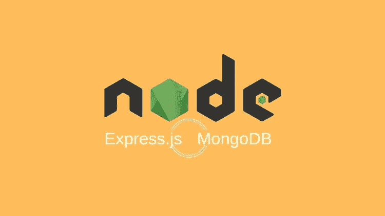

# 使用 Express.js 构建 Web API

> 原文：<https://javascript.plainenglish.io/building-web-api-using-express-js-c0ae69901cf3?source=collection_archive---------5----------------------->



# 摘要

在这篇文章中，我将向您展示如何在 Node.JS 中构建博客 web API。JS 用于处理 HTTP 请求，Mongodb 用于存储数据。

# 目录

*   [简介](#12ce)
*   [设置](#1c50)
*   [套餐](#12b9)
*   [数据库](#2cf0)
*   [MVC 结构](#8d7b)
*   [快递申请](#6d8d)
*   [完整示例](#1711)
*   [结论](#daa4)

# 介绍

节点。JS 是一个使用 Javascript 构建服务器端应用程序的平台。带节点。JS，开发人员能够在几分钟内构建后端 API。它有一个伟大的社区和一套庞大的软件包。这些包帮助开发人员构建优秀的应用程序。开发者不需要从头开始构建一切。我们主要关注两个包。首先是**快递。JS** ，这是开发者构建 web APIs 最常用的包之一。其次是**mongose**，用于简化节点间的通信。JS 和 MongoDB。

## 要求

*   基本的 Javascript 知识
*   节点。JS 10.0.0 或更高版本
*   NPM 4.6.1 或更高版本
*   Mongodb 4.2.1 或更高版本
*   VS-Code 或任何其他编辑器

# 设置

典型的节点。JS 应用程序有一个根目录，其中包含至少两个文件 **package.json** (保存关于应用程序和所需 npm 包的元数据)和 **index.js** 文件(一个 javascript 入口文件)。

1.  创建项目的目录

```
mkdir blog-server
cd blog-server
```

2.创建 **package.json** 文件

```
npm init -y
```

3.创建 **index.js** 文件(入口文件)

```
// index.js
const PORT = 3000;console.log(`A node.js server that runs on ${PORT}`);
```

4.运行应用程序

```
node index.js
```

# 包装

我们的 express.js web 应用程序需要这些包。

*   **express** :路由和中间件 web 框架
*   **cors** :启用 cors(跨源资源共享)
*   **主体解析器**:将 json 主体解析成 javascript 对象
*   **morgan** :记录 http 请求，这对查看请求很重要
*   **猫鼬**:猫鼬
*   **nodemon** :通过在发生任何变化时重启服务器来简化开发

注意: **nodemon** 被用作开发依赖项，因为它只在开发期间需要。

1.  从 NPM 安装软件包。

```
npm install --save-dev nodemon
npm install --save express cors body-parser morgan mongoose
```

2.在 index.js 文件中使用 require 导入包。

```
const express = require("express");const cors = require("cors");const bodyParser = require("body-parser");const morgan = require("morgan");const mongoose = require("mongoose");
```

# 数据库ˌ资料库

如上所述，我们使用 Mongodb 来存储应用程序相关的信息。我们使用**mongose**作为 Mongodb 和 node.js 应用程序模型之间的对象映射器。

1.  连接到 mongodb

```
mongoose.connect("mongodb://localhost:27017/blog");
```

2.创建**mongose 模式**来定义从读取**或从** Mongodb 写入**的文档结构。**

创建一个名为 **postSchema** 的模式来定义**文章**的结构，它有**标题**和**正文**。

```
const postSchema = new mongoose.Schema(
   {
      title: { type: String, required: true },
      body: { type: String, required: true },
   },
   { timestamps: true }
);
```

# 类似 MVC 的应用程序

一个 MVC 应用被构造成三层[模型、视图、控制器]。有时，额外的层被添加到 MVC 中，比如 DAL、服务、存储库。

在这个例子中，app 分为三层【模型→服务→控制器】。通常，每一层都存在于一个目录中。

## 模型

模型代表特定领域的数据。该模型基于上面定义的**后置模式**。

1.  创建一个 **Post** 模型。

```
const Post = mongoose.model("post", postSchema);
```

## 服务

服务层是 MVC 中的一个附加层，它协调控制器**和模型**之间的通信。这一层增加了更多的抽象和易测试性。****

1.  创建一个 **postService** 实体，它公开两个服务:

*   查找:查询所有帖子数据
*   保存:保存帖子

```
const postService = {

   find: () => Post.find({}),

   save: async (postData) => {
      const post = new Post({ ...postData });
      await post.save();
      return post;
   },};
```

## 控制器

顾名思义，控制器控制传入的请求，捕捉错误并向客户端发回响应。

1.  创建一个**后控制器**，它有两个动作:

*   find:handles***GET/API/post***
*   保存:处理 ***帖子/API/帖子***

```
const postController = {

  find: async (req, res, next) => {
      try {
         const posts = await postService.find({ ...req.query });
         res.json(posts);
      } catch (error) {
         error.msg = "failed to retrieve posts";
         next(error);
      }
   },

   save: async (req, res, next) => {
      try {
         const post = await postService.save(req.body);
         res.json(post);
      } catch (error) {
         error.msg = "failed to create post";
         next(error);
      }
   },
};
```

# 快速申请

> Express 是一个**路由**和**中间件** web 框架，它拥有自己的最小功能:Express 应用程序本质上是一系列中间件函数调用。

1.  创建快速应用程序

```
const app = express();
```

## 中间件

中间件是在控制器动作之前或之后执行的功能。

```
app.use(cors());
app.use(morgan("tiny"));
app.use(bodyParser.json());
```

## 快速路由器

快速路由器将请求路由到控制器中的特定动作。

1.  定义两条基于**的快速路由**来处理

*   **获取/API/发布**
*   **岗位/API/岗位**

```
const router = express.Router();
router.get("/posts", postController.find);
router.post("/posts", postController.save);
app.use("/api", router);
```

## 完整示例

我已经包含了一个完整的 express 服务器示例。

# 结论

您已经详细学习了如何创建 express 服务器并连接到 mongodb 来存储数据。您已经公开了一些 API。在本教程中，为了简单起见，我将所有代码都写在一个文件中。你可以访问这个[库](https://github.com/bewarusman/blog-api.git)来获得完整的例子。