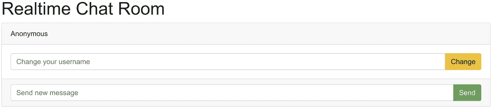
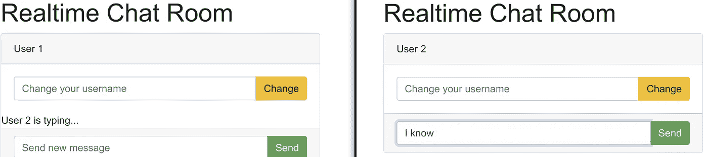

# 用 Node 构建 Web 应用程序。射流研究…

> 原文：<https://javascript.plainenglish.io/building-web-applications-with-node-js-15027e69159e?source=collection_archive---------12----------------------->

## 了解如何使用 node.js 构建实时应用程序


Photo by Christopher Gower on Unsplash

现在开发人员开发实时应用程序的时间越来越多。我们今天使用的大多数应用程序，无论是移动应用程序还是桌面应用程序，都具有实时功能。例如，考虑包含实时消息和通知的 messenger 应用程序，它们都是应用程序中常用的实时功能。

在这个故事中，我将通过构建一个 messenger 应用程序来介绍如何使用 **node.js** 开发一个实时应用程序。尽管这个故事将解释特定的用例，但是您也可以在其他场景中应用这个策略。

在进入主题之前，你必须了解一点 **node.js** ，由于它的异步特性，它是构建实时应用的强大编程语言之一。

# 实时应用的特点

您可以找到构建实时应用程序所需的功能。他们是，

# 实时消息传递

我们都熟悉像 WhatsApp、脸书等即时通讯软件的使用。这些实时应用不仅用于纯粹的消息服务。我们可以获得实时消息服务，如送货应用程序、打车应用程序和其他合作平台。

# 通知传递

当用户参与度急剧增加时，启用实时通知非常复杂。所以，这就是为什么你会看到一个现代的应用程序不能实时地向用户发送通知。

# 直播

随着实时流的使用，用户能够与其他用户进行交互在社交媒体平台上越来越受欢迎。因此，我们可以将实时视频流集成到应用程序中。最好的例子是脸书和 Instagram 直播视频流功能。

# 实时跟踪

实时跟踪变得更加重要。优步和亚马逊等流行的打车和送货应用程序正在使用实时跟踪功能。这个特性增加了应用程序的可用性和可读性。

# 构建实时应用程序需要遵循哪些步骤？

构建实时应用程序是否不同于普通的 web 应用程序？。答案是，可以。

对于构建消息应用程序，用户可以向其他用户发送消息。当第一个用户发送后，其他用户也可以收到这些消息。如果我们像普通的 web 应用程序一样开发这个应用程序，我们只能向服务器发出接收数据的请求，用户必须定期刷新网页才能看到新消息。因此，它不是用户友好的，我们必须找到一些替代方法来构建实时应用程序。

Web socket 为此提供了解决方案。这是一种允许客户端和服务器同时交互的通信协议。使用 web socket，服务器可以随时向客户端发送数据，而无需客户端请求。我们可以使用 web socket API 来构建我们的应用程序。

# Socket.io

当我们使用 node 实现实时应用时，我们不必直接使用 web socket API。取而代之的是 JavaScript 和 **node.js** 库 **socket.io** 这是 web socket API 的一个 API，使用起来很简单。在这个项目中，我们将使用 **socket.io** 来创建和管理客户端和服务器之间的 web socket 连接。

# 用 node.js 构建聊天室

现在我们可以开始创建我们的应用程序了。首先，我们将创建一个简单的聊天室，用户可以在其中与其他连接的用户进行交流。任何数量的用户都可以加入聊天室，一旦用户发送消息，聊天室的所有用户都会立即收到。

我们聊天室的特色，

*   更改用户的用户名。
*   发送消息。
*   当用户正在输入消息时显示输入。

# 设置应用程序环境

首先为应用程序创建一个新目录，运行 npm init 来设置 **package.json** 文件。那么 **app.js** 就是你的主脚本。确保你得到它。

# 安装依赖项

在这个项目中，我们使用 express、Ejs、socket.io 和 nodemon 包来构建应用程序。

*   我们在前面已经看到了关于 **socket.io** 的内容。
*   Ejs 是一个 JavaScript 模板引擎。
*   Nodemon 是一个包，当我们改变应用程序中的代码时，它会自动重启服务器。我们将 nodemon 安装为开发依赖项，因为我们仅将它用于开发目的。

使用此命令安装 express。

```
npm install express ejs socket.io --save
```

使用以下命令安装 nodemon。

```
npm install nodemon --save-dev
```

要用 nodemon 启动应用程序，我们必须在我们的 **package.json** 中添加一个启动脚本。

```
"scripts": {
    "start": "nodemon app.js",
 },
```

然后我们使用这个命令启动应用程序。

```
npm run start
```

# 设置应用程序结构

该应用程序所需的所有依赖项都已安装，让我们构建应用程序结构。首先，我们需要创建一些指令。应用程序结构如下所示。

```
|--app.js
|--views
|--node_modules
|--package.json
|--public
   |--css
   |--js
```

*   **app . js**——是一个用来托管我们的服务器端代码的文件。
*   **视图** -包含视图的文件夹。
*   **node _ modules**——包含我们项目的所有依赖项。
*   **public**——是一个用来存储我们所有项目文件的目录。

# 构建服务器

我们需要做的第一步是打开我们的 **app.js** 文件并粘贴以下代码。

```
const express = require('express')
const socketio = require('socket.io')
const app = express()

app.set('view engine', 'ejs')
app.use(express.static('public'))

app.get('/', (req, res)=> {
    res.render('index')
})

const server = app.listen(process.env.PORT || 3000, () => {
    console.log("server is running")
})
```

一旦我们用 **ejs** 模板配置了 **express** ，那么就开始在 **socket.io** 上工作。为此，在 **app.js** 文件的末尾添加以下代码。

```
//initialize socket for the server
const io = socketio(server)

io.on('connection', socket => {
    console.log("New user connected")
})
```

如果您使用**NPM**start 运行您的服务器，您将能够接收新的套接字连接。

# 构建我们的前端

让我们首先创建一个模板，然后创建一个 **index.ejs** 文件，并粘贴以下代码。

```
<!DOCTYPE html>
<head>
    <title>Simple realtime chatroom</title>
    <link rel="stylesheet" href="https://stackpath.bootstrapcdn.com/bootstrap/4.5.0/css/bootstrap.min.css">
</head>
<body>
    <div class="container">
        <div class="title">
            <h3>Realtime Chat Room</h3>
        </div>

        <div class="card">
            <div class="card-header">Anonymous</div>
            <div class="card-body">
                <div class="input-group">
                    <input type="text" class="form-control" id="username" placeholder="Change your username" >
                    <div class="input-group-append">
                        <button class="btn btn-warning" type="button" id="usernameBtn">Change</button>
                    </div>
                </div>
            </div>
            <div class="message-box">
                <ul class="list-group list-group-flush" id="message-list"></ul>
                <div class="info"></div>
            </div>

            <div class="card-footer">
                <div class="input-group">
                    <input type="text" class="form-control" id="message" placeholder="Send new message" >
                    <div class="input-group-append">
                        <button class="btn btn-success" type="button" id="messageBtn">Send</button>
                    </div>
                </div>
            </div>
        </div>

    </div>
    <script src="https://cdnjs.cloudflare.com/ajax/libs/socket.io/2.0.4/socket.io.js"></script>
    <script src="/js/chatroom.js"></script>
</body>
</html>
```

下面是客户端 **socket.io** 库的脚本和我们将在这段代码中使用的自定义 JavaScript 文件。

```
<script src="https://cdnjs.cloudflare.com/ajax/libs/socket.io/2.0.4/socket.io.js"></script>
<script src="/js/chatroom.js"></script>
```

我们创建了一个 ID 为 **messageBtn** 的按钮来发送消息，并创建了另一个 ID 为 **usernameBtn** 的按钮来创建新用户。所有用户消息都出现在 ID 为 **message_list** 的无序列表中。如果用户正在输入一条消息，那么它会出现在 div 中，带有类别**信息**。

现在，如果你打开浏览器，运行 http://localhost:3000/你的应用程序将会是这样的。



Chat Room layout

现在我们只创建了一个前端，它不工作，除非我们提供功能。接下来，我们将前端与服务器连接起来。

为此，您需要在 js 文件夹中创建一个新的 JavaScript 文件名 **chatroom.js** ，在 JavaScript 文件中，我们需要使用以下代码将前端与 socket 连接起来。

```
(function connect(){
    let socket = io.connect('http://localhost:3000')
})()
```

现在，您的应用程序运行良好。接下来让我们构建功能。

# 更改用户名

我们用于每个连接的默认用户名是匿名的。因此，我们必须给用户选择改变他们的用户名。为此，我们必须设置后端，以便在前端发出 **change_username** 事件时更改用户名。让我们在 **app.js** 中编辑您的连接事件。

```
io.on('connection', socket => {
    console.log("New user connected")

    socket.username = "Anonymous"

    socket.on('change_username', data => {
        socket.username = data.username
    })
})
```

然后我们需要调整我们的前端。因此，当我们按下更改用户按钮时，它会触发 **change_username** 事件。在 **chatroom.js** 中添加事件监听器到 **usernameBtn** 中，当按钮被点击时发出一个 **change_username** 事件。

```
(function connect(){
    let socket = io.connect('http://localhost:3000')

    let username = document.querySelector('#username')
    let usernameBtn = document.querySelector('#usernameBtn')
    let curUsername = document.querySelector('.card-header')

    usernameBtn.addEventListener('click', e => {
        console.log(username.value)
        socket.emit('change_username', {username: username.value})
        curUsername.textContent = username.value
        username.value = ''
    })
})()
```

现在你可以添加新的用户名，接下来让我们开始发送消息。

# 发送消息

我们要实现的下一个特性是发送消息。每次前端发出消息时，服务器都会接收到 **new_message** 事件，并向所有连接的客户端触发该功能，以便它们可以获得新消息。

首先设置前端在提交新消息时发出一个 **new_message** 事件。然后同时创建一个 **receive_message** 事件来显示新消息。我们可以通过使用 **chatroom.js** 中的以下代码来实现这两者。

```
let message = document.querySelector('#message')
let messageBtn = document.querySelector('#messageBtn')
let messageList = document.querySelector('#message-list')

messageBtn.addEventListener('click', e => {
    console.log(message.value)
    socket.emit('new_message', {message: message.value})
    message.value = ''
})

socket.on('receive_message', data => {
    console.log(data)
    let listItem = document.createElement('li')
    listItem.textContent = data.username + ': ' + data.message
    listItem.classList.add('list-group-item')
    messageList.appendChild(listItem)
})
```

然后在后端，当我们收到一个 **new_message** 事件时，我们需要向所有客户端发出一个新事件，为此我们使用了 **io.sockets.emit()** 函数。现在将文件上的**连接**事件更改如下:

```
io.on('connection', socket => {
    console.log("New user connected")

    socket.username = "Anonymous"

    socket.on('change_username', data => {
        socket.username = data.username
    })

    //handle the new message event
    socket.on('new_message', data => {
        console.log("new message")
        io.sockets.emit('receive_message', {message: data.message, username: socket.username})
    })

})
```

现在你可以连接到聊天室了。在两个浏览器中打开它，看看消息是如何通过应用程序界面从一个用户传递到另一个用户的。

# 打字

在大多数应用中，我们看到当用户 x 正在输入时，它向另一个用户显示用户 x 正在输入。这提供了实时感并改善了用户体验。让我们在应用程序中构建这个特性。

我们在消息输入框中添加了一个新的事件监听器，以便每当按键发生时发出一个**输入**事件。每当用户键入消息时，它触发服务器用户正在键入的消息，并将其显示在用户界面上。

在连接函数内部，在 **chatroom.js** 中添加以下代码。

```
let info = document.querySelector('.info')

message.addEventListener('keypress', e => {
    socket.emit('typing')
})

socket.on('typing', data => {
    info.textContent = data.username + " is typing..."
    setTimeout(() => {info.textContent=''}, 5000)
})
```

现在我们需要设置后端来处理输入事件。下面的代码是，

```
socket.on('typing', data => {
    socket.broadcast.emit('typing', {username: socket.username})
})
```

现在，您可以看到功能齐全的实时聊天应用程序。



Final Chat Application

# 结论

我希望你喜欢这个故事，并花了宝贵的时间。现在，您已经学习了如何使用 node.js 和 socket.io 创建实时应用程序。

感谢阅读！