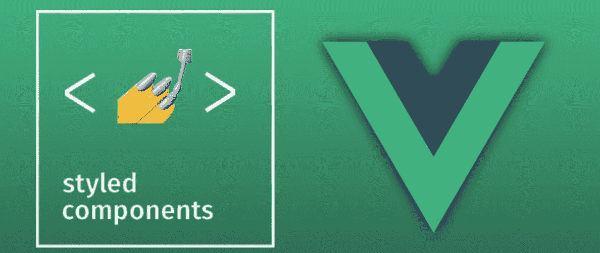
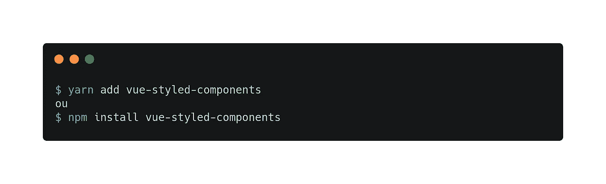

# 使用 Vue.js 中的样式化组件构建应用程序

> 原文：<https://javascript.plainenglish.io/building-your-application-with-styled-components-in-vue-js-8d0fdd8e605a?source=collection_archive---------0----------------------->

大家好！

> 原文是 [**这里是**](https://medium.com/@fsenaweb/construindo-sua-aplicacao-com-styled-components-no-vue-js-3e550449ae0e) 。

对于那些不熟悉的人来说，Styled-Components 是 React 和 React 本地社区中一个非常受欢迎的库，它为开发人员提供了在 JavaScript 中创建 CSS 代码的能力。

使用 Vue 的开发人员知道在一个文件中使用 CSS、HTML 和 JavaScript 来处理组件样式是多么容易；所有这一切都归功于 SFC(单文件组件)的强大功能。这无疑是非常积极的一点，它有助于提高 Vue 在前端社区的受欢迎程度。

然而，最近几个月，我一直在一个大型项目的开发中使用 React，正是从那里，我知道了这个库，并在它的风格化部分使用了它；我甚至承认，我让应用程序变得更加有条理和实用。刚开始有点困惑，但后来你开始喜欢这个库了。

但是像我的大多数项目一样，我使用 Vue，所以我决定研究一种方法，将样式组件库的实用性与 Vue.js 及其生态系统的能力结合起来。就在那时，我发现 Vue 有一个特定的库，由 React 的样式组件的相同创建者维护，它被称为 [**vue 样式组件**](https://github.com/styled-components/vue-styled-components) 。

 [## 样式组件/vue 样式组件

### 组件时代的视觉原语。样式组件的 Vue 的简单端口💅 …

github.com](https://github.com/styled-components/vue-styled-components) 

如果您在 React 中有项目，并希望切换到 Vue(是的，变化过程也在那个方向上发生，并且已经增加了很多)，使用样式化组件创建的样式，它们可以很容易地迁移，从而获得收益、敏捷性、性能和可伸缩性。

# 开始

但是让我们把谈话放在一边，让我们来看代码！安装和使用 vue 风格组件的过程非常简单实用。创建好项目后，只需使用您喜欢的包管理器(Yarn，NPM)安装这个库。

Library installation step

一点也不复杂，在应用程序中就能快速发挥这个库的潜力。在我的 GitHub 中，我留下了一个项目，里面有风格化标签的例子和一些使用 vue 风格的组件与它们交互的方法。

示例中使用的每个元素/标签都可以被 vue-styled-components 视为具有其单独属性的独立组件，或者从其他组件接收数据。

在我们的第一个例子中，尽可能简单，让我们创建一个默认样式的按钮。现在不要担心，定制这些标签，我们正在慢慢演变成一个过程，这个组件可以被映射，并允许动态样式更新。

Creating the default Button.js file using vue-styled-components

创建 Button.js 文件后，就像将任何组件导入 Vue 一样使用它，并在 SFC 的 HTML 代码中为该文件的标记命名(*我在这里认为您已经熟悉使用它了)。来自 Vue.js 及其所有架构*。

我通常用字母 C 作为前缀(指的是组件这个词)，来命名我在 Vue 中使用的自定义标签；这是我从 Angular 那里学到的一个很好的做法。此时，在应用程序的任何地方，我们都可以使用这个风格化的组件。

## 传递属性

在 vue-styled-components 中，您可以通过属性传递这些值来动态定义组件的样式。我们将通过根据传递的参数修改按钮样式来改进按钮组件。在这个例子中，我们通知当 primary 属性被传递时，按钮将接收新的背景样式和字体颜色。

在这个代码中没有秘密，简单地说，我们只是做了一个三元告知，如果有主要属性，它返回一种颜色，如果没有，将返回另一种颜色。上面的例子可以改进，甚至添加新的属性(你可以传递任意多的属性)；在项目中，一切都按照你的需要进行。

## 增强性能

操纵我们接收的属性使我们有机会在单个文件中获得不同的组件，放置满足特定样式的条件。在下面的例子中，你有机会选择你想要分配给你的按钮的颜色方案，而不影响其他的，从而使你的应用多样化。

为了更好地解释创建这个按钮的过程:我们开始(总是)调用 *vue-styled-components* ，紧接着(*从第 3 行到第 6 行*)，我们需要定义哪些类型的属性将被传递给组件，在这种情况下，我们创建两种类型。，它们是类型和半径；第二个属性只是为了显示我们是否想要一个圆角按钮。

从第 8 行的*到第 31 行的*，我们创建了一个函数，它接受 type 属性的值，并生成一个条件(在本例中，我们使用开关),查看输入的值，根据传递的内容，它返回背景属性。颜色和颜色各自的情况下，如果没有作为属性传递，那么按钮将被赋予一个默认值。

根据这些知识，您可以实现新的属性，例如字体大小、填充、边距，以及其他属性，这些属性可以使您的定制组件非常动态，并在整个应用程序中使用。

我把这些小例子放在我的 GitHub 中，这样你就可以迈出实现这个库的第一步。享受并提交新的风格化领域，以帮助其他也想学习的朋友。

 [## fsenaweb/vue 样式组件

### 此时您不能执行该操作。您已使用另一个标签页或窗口登录。您已在另一个选项卡中注销，或者…

github.com](https://github.com/fsenaweb/vue-styled-components?source=post_page-----3e550449ae0e----------------------) 

如果你喜欢这篇文章，一定要分享和评论。如果你想知道更多一点，交流一些想法(我的英语还在提高，但我们可以交谈)，你可以留下你对该主题的评论，甚至为接下来的文章提出一些建议。

喜欢并了解一点我的工作，访问网站 [**www.fsenaweb.me**](http://www.fsenaweb.me) ，他有我的作品集，我的社交网络(包括 [GitHub](https://github.com/fsenaweb/) ，你可以在那里用 Vue.js 练习一些示例应用)，还有一个小的联系人空间。

 [## fsenaweb -概述

### 在 GitHub 上注册您自己的个人资料，这是托管代码、管理项目和与 40…

github.com](https://github.com/fsenaweb) 

就这些了，下次见！我的名字是 Matheus Ricelly，非常感谢大家的关注！