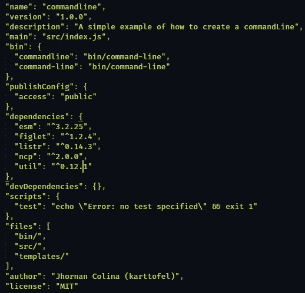
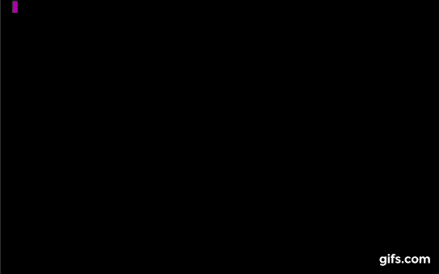

# 构建您自己的命令行

> 原文：<https://javascript.plainenglish.io/building-your-own-command-line-7311e5892c8b?source=collection_archive---------6----------------------->

> 接下来的一周，我完成了我的第一个命令行“package app ”,我选择创建一个关于它的帖子，我花了整整一周的时间学习和教自己如何创建一个命令行，因为这对我来说是新的东西。当我开始学习反应时，创建一个类似 create-react-app 的命令行是我很久以来的一个想法，所以今天我将教你如何创建一个简单的命令行。


我喜欢把这个帖子看做是普鲁顿星球，当我们建立一个命令行时，我们需要知道如何使它变得小而漂亮。你应该看到一些命令行有着惊人的颜色和直观的用户界面，一个例子可能是 Netlify，这是一个很大的原因，因为我不再使用“Github Pages”来部署我的应用程序了。在开始之前，我们需要了解一些关于命令行的基本概念，因为如果我们想首先构建一个命令行界面，我们需要了解命令行的含义。

# 命令行界面

“命令行界面”是一种允许用户通过一行文本向某些信息程序给出指令的方法。CLI 和 Shell 之间有所不同，因为 Shell 是一个信息程序，CLI 是一种方法。关于什么是命令行的一个很大的例子可能是 *create-react-app* 和 Netlify，当您编写 *create-react-app* 来执行某件事情时，这就是命令行的任务，在 *create-react-app* 的情况下，会创建一个包含一些文件的文件夹。

*   好吧，现在我们知道命令行不是信息学程序，而是一种方法。
*   命令行用行文本向信息程序给出指令。
*   通过命令行，您可以执行文件或程序。

# 我们开始吧！

首先，我们需要一些包，因为我们不想手动构建所有东西，有些人花了几个月或几个星期来构建这些包，我们现在没有时间。

*   **esm** :我们需要使用导入，所以 esm 会为我们配置所有的东西。
*   **figlet** :生成带有一些印刷字体的横幅文本。
*   **listr** :一些命令行有一个任务列表，您可以在其中查看类似软件包安装的进度。
*   **ncp** :我们需要复制粘贴一些文件，由 ncp 负责。
*   **util** :我们使用允诺

> -NPM init
> -NPM I ESM fig let listr NCP

## 包配置

我们需要做一些配置，如放置 bin，并对包说，如果项目将是公共的或否，默认文件夹:



不用担心，我会向您解释包内发生了什么，您如何看到我们有我给你的相同依赖关系，文件内唯一的区别是:

*   bin:使用 bin，我们对这个包说，我们将编写一些命令来执行一些文件。有些人最初编写 cli.js(我们将在其中编写命令属性的文件)。
*   **发布配置**:这有助于我们确保给定的包没有被标记为“最新的”，没有发布到全局公共注册中心，或者默认情况下一个作用域模块是私有的。
*   **文件**:可选文件字段是一个文件模式数组，它描述了当你的包作为一个依赖项被安装时要包含的条目。

## 项目树

我们需要创建一些文件和文件夹，但不要担心，我会给你留下我的项目树:

```
├─bin
├── command-line
├─src
├── cli.js
├─templates
├── template.txt
├─ .gitignore
├─ packpage.json 
├─ package-lock
```

# 书写说明

好的，我们需要编写 CLI 函数并导出它，因为稍后我们将在“命令行”中执行 require(别担心，我会一步一步解释):

*   在 cli.js 中编写 cli 函数。该函数接收 argv，其中包含用户编写的文本，在本例中，该文本是我们将创建的文件夹的名称。

*   所以，在这一部分，我们从 cli.js 导入 cli 函数，并像参数一样传递它
    ***" process . argv "***。
*   **#！/usr/bin/env node** :是 shebang 行的一个实例:在类 Unix 平台上的可执行纯文本文件中的第一行*，它告诉系统将该文件传递给哪个解释器来执行*。[更多信息](https://stackoverflow.com/questions/33509816/what-exactly-does-usr-bin-env-node-do-at-the-beginning-of-node-files)。

# 首次测试

好的，我们有必要的代码来获取我们的命令，但是在运行它之前，我们需要运行 **npm 链接**，然后运行我们的**命令**。

我知道这个命令行看起来很简单，但是我们会赋予它复杂性。我们需要创建一个命令行来复制文件夹的内容，然后将其粘贴到不同的目录中。

# 欢迎方法

不是必须的，但是如果我们希望我们的命令更漂亮，有一个演示信息是很好的。该函数需要写入 cli 文件中，我们将需要使用 figlet，因为该软件包为我们提供了漂亮的横幅:



# 复制和粘贴功能

首先，我们需要从 *util* 中导入 promisify，因为有时我们需要复制并粘贴大量文件，所以这将是一种毫无问题地获取所有这些文件的方法:

copyTempalteFiles 函数的说明:

*   模板目录:这将是我们拥有模板的方向。
*   targetDir :我们将要粘贴所有模板文件的方向。
*   **clobber** :不要重写文件。

我们需要导入**路径**，因为这将给我们模板的方向。

# 任务列表

首先我给你简单介绍一下 **listr** :这是一个制作任务列表的包，用户可以在其中查看命令的每个状态。

解释:

*   **实际路径**:我们使用 *import.meta.url* 来给出实际路径。
*   **templatesDir** :我们使用*“path resolve”*为此， *resolve* 方法的第一个参数将是获取其路径名的实际路径，第二个参数将是我们的模板文件夹的路径。
*   **TaskList** :我们需要创建一个异步函数，因为任务需要用 await 调用，因为有时这个任务会花费很多时间。在函数内部，我们将创建一个 const，调用一个类来放置我们的任务。

# 调用函数

我们将调用我们的两个函数 **HelloMessage** 和 **TaskList。**首先，我们调用 HelloMessage 方法，因为这将是演示文稿，然后我们将“argv”作为参数传递，因为通过它我们可以获得文件夹的名称(我们将创建的文件夹的名称)。

## 最终代码:

# 运行我们的命令🎊

这是我们的踪迹的结束，运行命令并且观看魔术


> 嘿，如果这对你有用，给我一些掌声，在我的网络上关注我！

推特:@ ToyoJhornan
Github:[https://github.com/karttofer](https://github.com/karttofer)