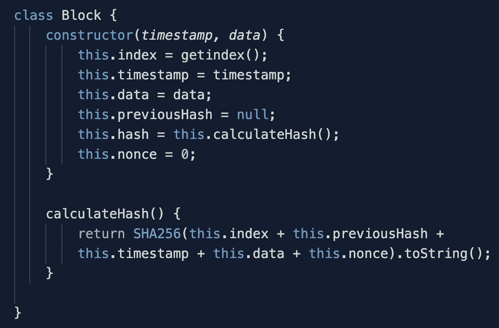
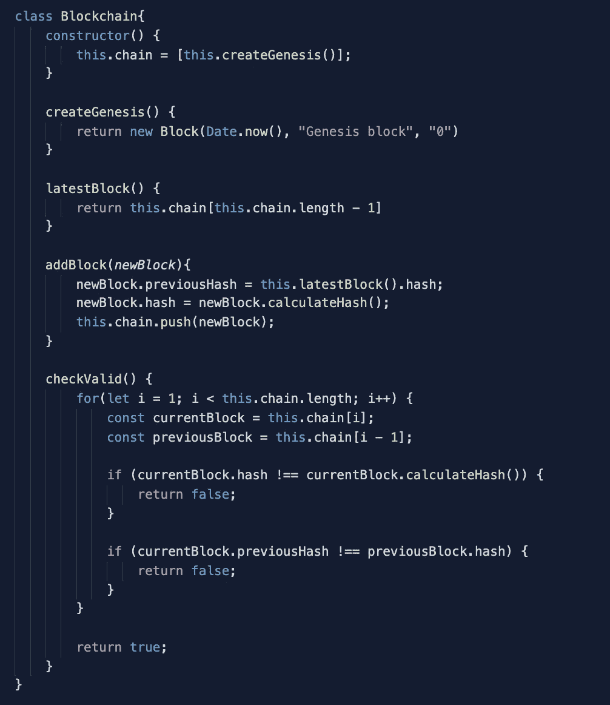
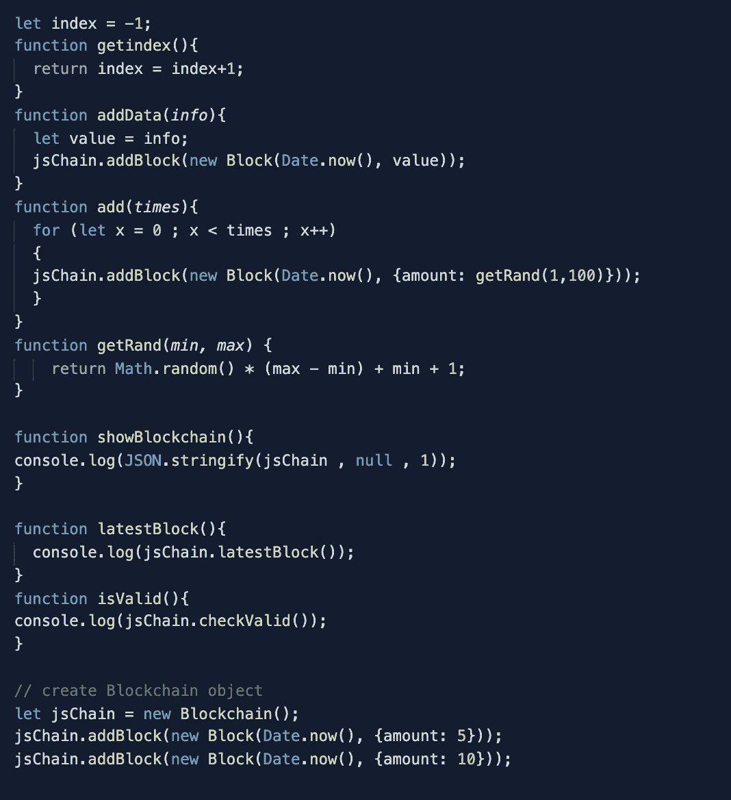

# 如何用 JavaScript 创建区块链

> 原文：<https://javascript.plainenglish.io/byob-build-your-own-blockchain-93ecfdc388ad?source=collection_archive---------7----------------------->

## 让我们通过编写自己的简单版本来揭开神秘的区块链，并了解它在幕后是如何工作的。

[source](https://images.unsplash.com/photo-1456428746267-a1756408f782?ixlib=rb-1.2.1&ixid=eyJhcHBfaWQiOjEyMDd9&auto=format&fit=crop&w=1350&q=80)

# *最终，它可能会让你建立自己的实验性微型区块链网络，而天空是你真正能做的极限。*

# **先决条件**

*   区块链基础知识(有史以来最全面的文章- [区块极客](https://blockgeeks.com/guides/what-is-blockchain-technology/))
*   Javascript 基础知识
*   热情:)

# 让我们开始吧

在实际编写我们自己的区块链之前，第一步是弄清楚我们需要哪些不同的信息。因为我已经做了所有的工作，所以下面是我们的微型区块链实现所需的构建块列表:

*   类块(索引、时间戳、数据、以前的哈希、哈希、随机数)
*   类区块链(追加所有区块，从 genesis 区块开始)
*   用于计算哈希的库(sha256)
*   帮助器函数来使用我们实现的类

现在让我们开始，

我们首先需要的是一个能够在 javascript 中创建散列的库，我们将使用[这个](https://www.npmjs.com/package/crypto-js)。一旦安装了 npm，就可以简单地添加它( **npm 安装 crypto-js** )

现在你有了所有需要的依赖/库，所以让我们开始编码我们的块，

我们在这里所做的是为我们的区块链实现中的构造块创建一个类。它是通过调用一个构造函数来完成的，这个构造函数在每次被调用时都会创建一个新的块(new block())。我们还使用了库中的 SHA256 函数来创建散列。接下来，我们将实现区块链类，这将帮助我们创建不可变的独立区块链。

这里要注意的重要部分是，构造函数应该总是只被调用一次，为什么，因为 genesis 块总是在块链调用时创建的。因此，我们将只做 **new Blockchain ()** 一次，之后我们将只访问同一个对象来添加块或查询已经创建的对象的任何内容。还有一个有效性检查功能，用于查询区块链是否合法。这是一个非常幼稚的实现，但是我们在这里也实现了区块链的幼稚版本。现在，我们有了区块链设置的基本构建模块，但我们仍然缺少一些东西，是的助手功能，它将帮助我们在控制台和区块链初始化中看到输出。这是最后一段代码。

这里需要注意的几件重要事情是索引函数的编写方式，它从第 0 块开始索引到第 n 块。我添加了一些帮助函数，使它更具交互性，如下所示:

*   **showBlockchain() -** 在你第一次运行文件之后，请调用这个来监控我们在这里创建的区块链的结构。
*   **add(x)——**这里 x 可以是任意数，比如说 50，它要做的是在我们的区块链中添加 50 个随机数据块。
*   **addData(string)** - ex。addData("whatDaBlock ")，将在我们新创建的块中添加一个带有字符串数据的块，使用 **showBlockchain()** 来验证我们新创建的块的添加。
*   **latestBlock() -** 将给出区块链中添加的最新(仅最后一个)块。
*   **isValid() -** 将导致显示**真**或**假**，这取决于我们的原始条件是否被利用。

请使用本文底部提供的沙盒环境中的控制台来尝试上述命令；)

# **少了点什么**

是的，你是对的，看起来这就是我们设置区块链实现所需要的一切，但是我们仍然遗漏了这个模型中的一些重要主题，比如 nonce 部分。您可能想知道为什么 nonce 对于所有块都是 0，而挖掘功能又是什么呢？我省略了所有这些，因为我还没有实现它们中的任何一个，这是下一部分，我们可以讨论 PoS，merkle 树🌲、采矿、nonce 和其他疯狂的东西；)

# 代码在哪里？

我知道你会看这一篇，但是让你等着看完整篇文章。

实际上，我已经让您更容易地开始我们刚刚实施的区块链计划，而不需要您去任何其他地方，因为我已经完成了整个过程，并在这里为您设置了一个沙箱。没有什么是需要进一步的，只是疯狂与它:D

I find [**Repl.it**](https://repl.it/) a great source for online coding / collaboration / mentoring . Highly recommended

如果你仍然觉得有必要看看我的完整代码，那么去 [**这里**](https://repl.it/@AkshatJain5/BYOB) **。**

希望你喜欢我的帖子。谢谢，请分享:)