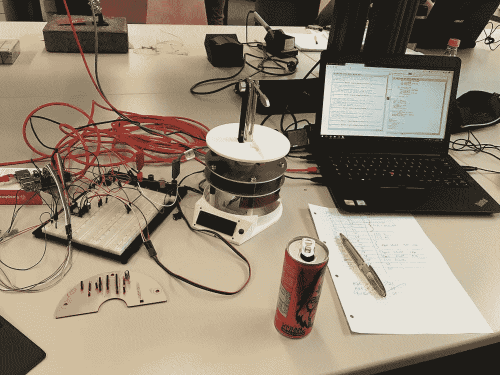
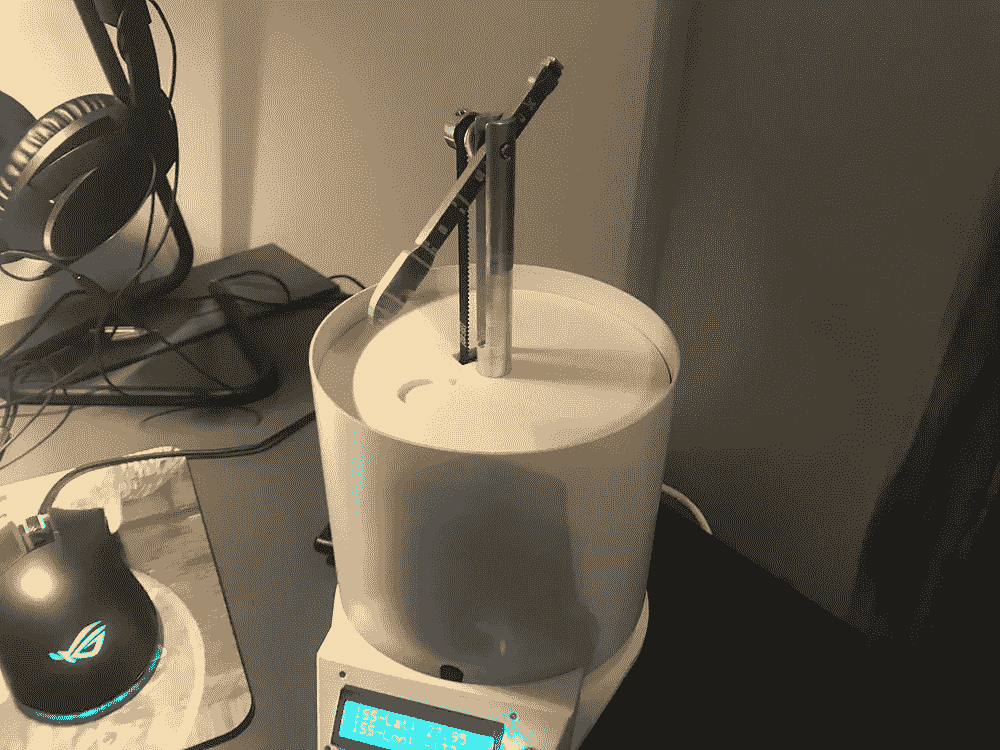
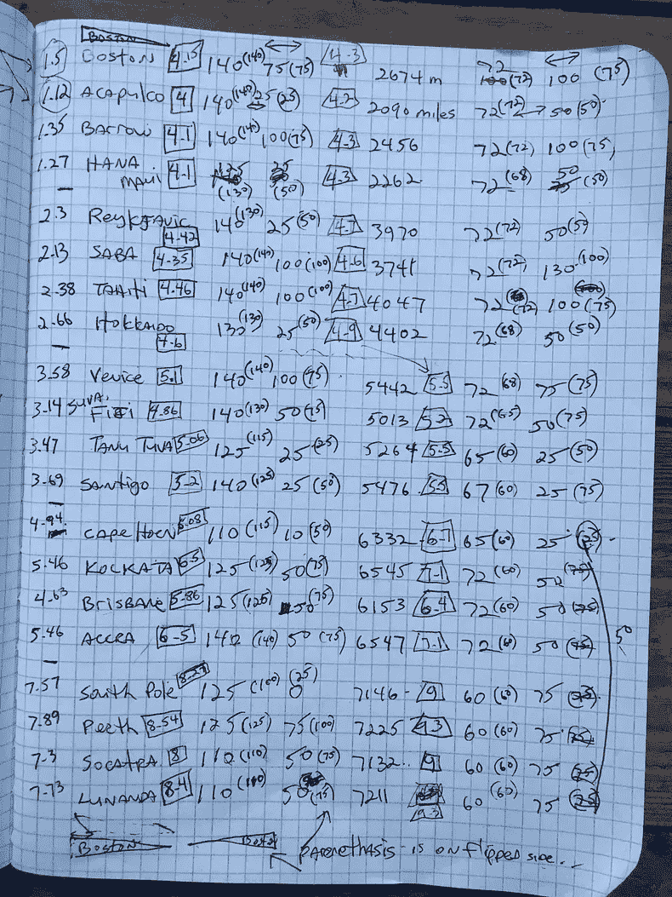
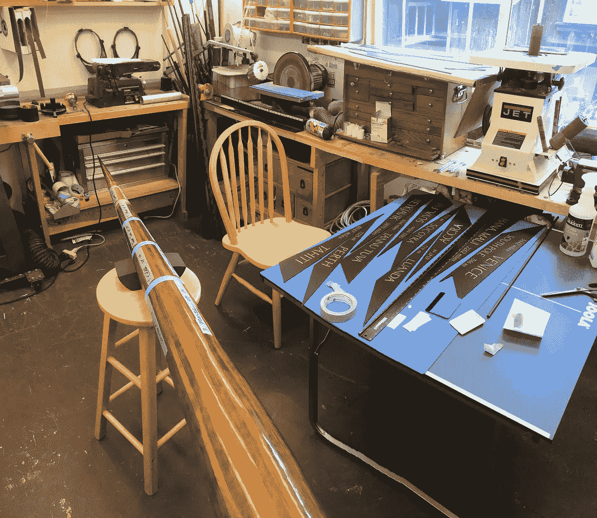
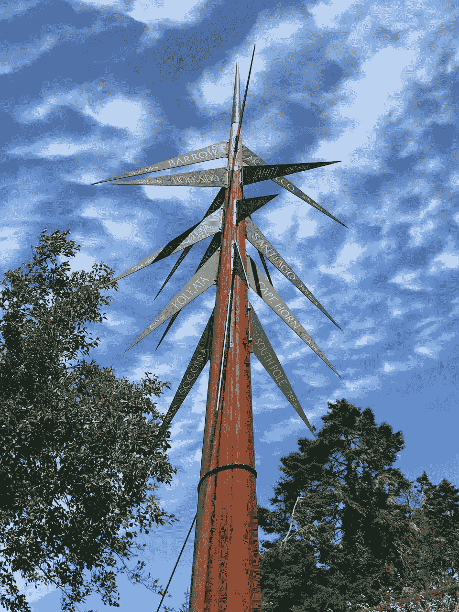

# 用 JavaScript 从一对 GPS 位置计算方位角、距离和高度

> 原文：<https://javascript.plainenglish.io/calculating-azimuth-distance-and-altitude-from-a-pair-of-gps-locations-36b4325d8ab0?source=collection_archive---------0----------------------->

## 一个寻找你的无人机或瞄准卫星天线的算法，带有 JavaScript 示例代码

Photo by [Donald Giannatti](https://unsplash.com/@wizwow?utm_source=medium&utm_medium=referral) on [Unsplash](https://unsplash.com?utm_source=medium&utm_medium=referral)

假设你正站在地球上的某个地方，地球上有另一个地方你想面对、接近或用望远镜瞄准。如果您有这两个位置的 GPS 坐标(纬度、经度和海拔),我将向您展示一种算法，用于计算将您的起点指向该目标点的两个方向角。此外，该算法还会计算两点之间的距离。我还提供了一个基于 web 的计算器，它使用开源的 JavaScript 代码实现了这个算法。

## 输入

为了执行计算，该算法需要两个点的三个坐标，总共六个数字。你所站的点称为 a 点。要观察的目标点是 b 点。对于这两个点，你都需要:

*   **纬度**:该点在地球赤道以北或以南多少度。正值为赤道以北，负值为赤道以南。
*   **经度**:该点距离英国格林威治本初子午线东(正)或西(负)多少度。
*   **高程**:该点高于(正)或低于(负)平均海平面的高度，单位为米。

## 地球静止卫星

如果你的目标位置是地球同步卫星，这个算法也是有效的。所有地球静止卫星都在地球赤道(纬度= 0 度)正上方的轨道上运行，高度为 35，786，000 米。因为纬度和海拔已经知道，唯一缺少的是卫星的经度。我的在线计算器有一个地球同步卫星的复选框，使这种情况更容易。启用该复选框后，您只需输入卫星的经度。人们已经利用这一功能来帮助瞄准卫星天线。

## 输出

给定两组坐标，该算法计算以下量:

*   **方位角**:从 a 点看 B 点的罗盘方向，这是一个 0 到 360 度的数字。值 0 表示北，90 表示东，180 表示南，270 表示西。
*   **高度**:这是观察者在 a 点看到的 B 点地平线以上(正)或以下(负)的角度。不要与上面定义的高度输入相混淆。
*   **距离**:A 点到 B 点的直线距离(不是绕地球的距离)，单位为公里。

## 它是如何工作的

该算法做的第一件事是将点 A 和点 B 转换为笛卡尔坐标( *x* 、 *y* 、 *z* )。由于地球不是一个完美的球体，这就变得复杂了。由于旋转，地球在赤道处凸出，形成一个被称为*扁球体*的形状。两极之间的距离是 6357 公里，但是一个直径穿过赤道的距离是 6378 公里。考虑这个图，其中为了说明的目的，膨胀被夸大了:

Geocentric latitude *θ is not the same as geodetic latitude φ on the oblate Earth.*

这里， *X* 是地球表面的一点， *N* 是北极， *S* 是南极， *C* 是地心。赤道由穿过 *C* 的水平线表示。想象你正站在点 *X* 。那里与地球相切的虚线表示你当地的地平线。

与你的地平线垂直的是另一条进入地球的虚线。在那条虚线接触地球赤道平面的地方，你会看到一个标有 *φ* 的角度(希腊字母*φ*)。这个角度叫做*大地纬度*。这就是 GPS 报的那种纬度。

的确，大地纬度是自古以来使用的经典纬度。粗略地说，它表示一个天文学测量的纬度:它是北天极(北极星附近天空中的一点)在你当地地平线以上的角度。如果你站在地球的北极，北极星会笔直向上，或者说与地平线成 90 度。同样，如果你站在赤道上，北极星将在地平线上，或地平线以上 0 度。因此，在夜空晴朗的情况下，任何水手都可以直接测量大地纬度。

然而，要计算出 *X* 相对于地球中心 *C* 的笛卡尔坐标，计算器需要*地心纬度*，在图中用 *θ* (希腊字母*θ*表示。这是从 *C* 看到的赤道和 *X* 之间的角度。转换基于世界大地测量系统标准 [WGS 84](https://en.wikipedia.org/wiki/World_Geodetic_System) 。在计算器中，这在函数`GeocentricLatitude`中实现，如下所示:

同样，从地球中心到地球表面某一点的距离也是可变的。函数`EarthRadiusInMeters`根据大地纬度计算该距离，同样使用 WGS 84:

有趣的是，当你在赤道上时，地心纬度和大地纬度是一样的:都是 0 度。如果你在地球的两极，这两种纬度也是一样的:+90 度或-90 度。但是在地球上的其他地方，他们的分歧程度不同。

计算器使用函数`LocationToPoint`计算一个点的笛卡尔坐标，给出它的大地纬度、经度和海拔。该函数还计算给定点的法向量，即垂直于观察者地平线的向上方向，以正确调整平均海平面以上的高程。产生的矢量分量都用米表示。

为了完成计算，算法使用了一个技巧。它旋转坐标系，使观测点(A 点)位于假想的赤道和本初子午线上。换句话说，想象旋转你拿着的地球仪，这样你的观察点就在赤道上，并且正对着你。现在的坐标非常适合于计算观察者在 A 点看到的方位角和高度角:

*   *x* 轴指向正上方(从地球中心向外)。
*   y 轴指向正东方向。
*   z 轴指向正北。

下面是旋转功能`RotateGlobe`:

在`RotateGlobe`旋转坐标系后，你可以从旋转的地球仪上的 A 点到同一个旋转的地球仪上的 B 点，通过三维空间画一条线。这条线通常会穿过地球，假设 A 和 B 都在地球表面或接近地球表面。使用三角函数和矢量点积的组合，计算器确定方位角和高度角。它使用毕达哥拉斯公式来确定两点之间的直线距离。

所有的代码都可以在下面的链接中找到。

## 资源

*   [在线计算器](https://doncross.net/geocalc/compass.html):允许您在浏览器中进行计算。
*   [GitHub 库](https://github.com/cosinekitty/geocalc):包含计算器的完整 HTML 和 JavaScript 代码。

## 示例用途

这里有三个例子，说明人们是如何将我的 JavaScript 代码用于有趣的项目的。(照片和姓名均经个人通信许可使用。)

## 例子#1:国际空间站指针

来自波恩-莱茵-锡格河应用科技大学的 Jan Steinberg 和他的同事使用该算法建造了一个总是指向国际空间站的设备。通过计算国际空间站的轨道并使用该设备在地面上的已知位置，计算机将这两个位置转换为方位角和高度角。它使用步进电机来实时定位指针。

ISS Pointer project by A. Busch, R. Pick, M. Schmidt, J. Steinberg; Bonn-Rhein-Sieg University of Applied Sciences, Germany.

## 例 2:翼形望远镜

来自加州门多西诺的里克·黑明斯使用高度/方位计算器页面构建了一个指向全球各个城市的雕塑。这座雕塑以正确的方位角和高度角直接指向其他城市，向下穿过地球。他为这个项目创造了“pterrascope”这个词。

Calculations and assembly of Rick Hemming’s pterrascope.

Completed pterrascope by Rick Hemmings; Mendocino, California.

## 例 3:月出照片

[来自挪威 Sola 的 Ole jrgen nord Hagen](http://www.facebook.com/astronomiforalle)使用方位角/距离计算器计算出在选定的地球物体后面何时何地拍摄月亮和太阳的照片。

Moon rising behind Ullandhaugtårnet in Stavanger; by Ole Jørgen Nordhagen.

## 其他示例

*   如果你有一架广播其 GPS 坐标的无人机，并且你有一个告诉你自己的 GPS 坐标的设备，你可以自动计算你的无人机的方向和范围。一个人给我发电子邮件说，当他的无人机降落在可见范围之外时，他用这种技术来定位它。
*   一个赛船的人用我的工具来帮助规划通过比赛所需航路点的路线。
*   一位微波天线技术人员用我的工具帮助将微波中继器从一座塔对准另一座塔。
*   一位卫星天线安装人员说，我的工具有助于将天线对准特定的卫星。我根据他的建议加了“地球静止卫星”复选框，这样他就不用手动输入高程数了。
*   我最初写这个工具是为了让我可以为我建造的 AM 接收器试验磁环天线。这些天线对广播塔的方向非常敏感。通过转动接收器，我可以知道信号来自哪个方向。我可以将此与广播塔的已知 GPS 坐标相关联，以验证我是否真的接收到了我认为来自广播塔的信号。

欢迎在这里发表评论，分享你是如何使用这段代码的！我总是对人们做的创造性的事情感兴趣。