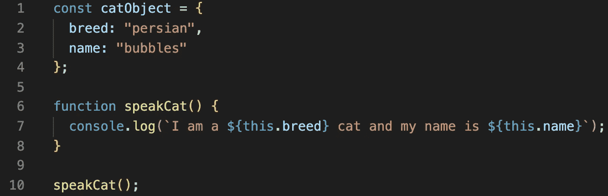
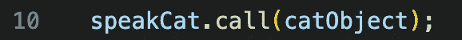
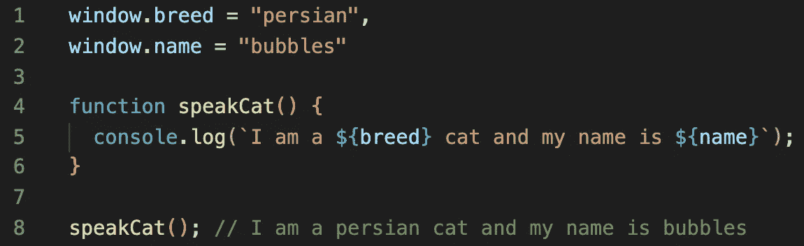
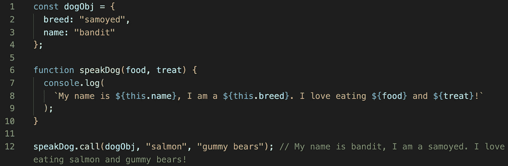
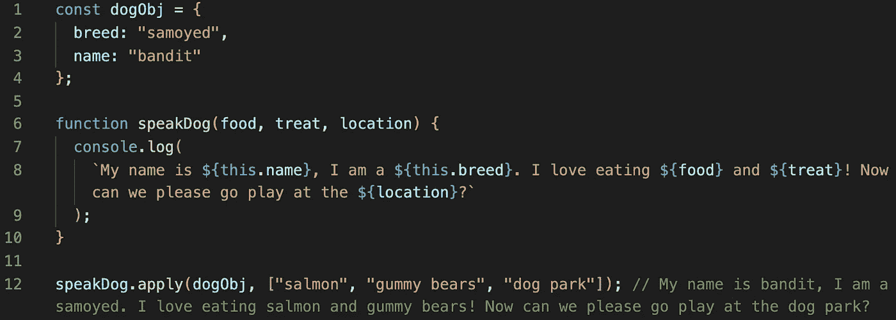
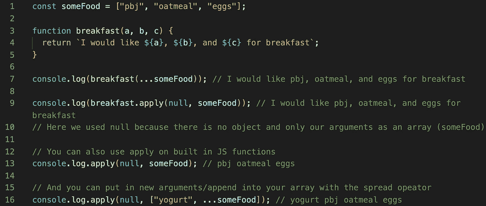

# 如何在 JavaScript 中使用 Call 和 Apply

> 原文：<https://javascript.plainenglish.io/call-and-apply-js-cf3a480b73ad?source=collection_archive---------3----------------------->

## 如果你一直在写或者开始学习 JavaScript，很可能你已经看过 call()和 apply()…如果没有，你会！

让我们一起来看看它们的不同之处。它们绝对相似，但用途不同。

# 如何使用 call()

为了创建一个简单的例子，我将制作一个对象和函数:



What does this return?

如果你认为这是回报:

*我是一只波斯猫，我的名字叫泡泡*

那就**错了**。您实际上会得到一条**错误**消息:


要修复这个错误，我们必须*用 catObject 调用*函数 speakCat:



Now you should get the expected outcome

我们上面的代码起初不工作，因为没有定义*这个*。对于 JS 中的这个例子，*这个*将引用全局对象。因为我在浏览器上(Chrome 🥳)，全局对象是*窗口*。因此，我们可以通过用*窗口:*替换*这个*来使上面的代码工作



Can not just replace ‘this’ literally but have to modify the object and notation a bit

call()可以接受多个参数，如果可以接受多个参数，那么也可以传递这些参数！



speakDog() is accepting multiple arguments and passing them to call()

# 如何使用 apply()

apply()类似于 call()，但有一些不同。应用 T21 接受参数的方式是以数组的形式。注意，在*调用*中，接受的参数只是用逗号分隔。

```
yourFunction.apply(object, [“thing1”, “thing2”, “thing3”])
```

在 ES6 中很酷的一点是，你也可以使用 spread 操作符在数组中展开。



apply() requires arguments in an array format

一些扩展运算符示例以及一些内置 JS 函数的示例:



Spread operator examples and some more with built-in JS functions

要记住哪个符号用于*调用*和*应用*，*我没有想到这一点，我忘了在哪里读到的，可能是 StackOverflow*:

**c** 全部使用 **c** ommas 和**a**supply 使用 **a** rrays。

我希望这能帮助你理解*调用*和*应用*的区别，如何使用它们，以及如何将扩展运算符(ES6)与*应用*一起使用！