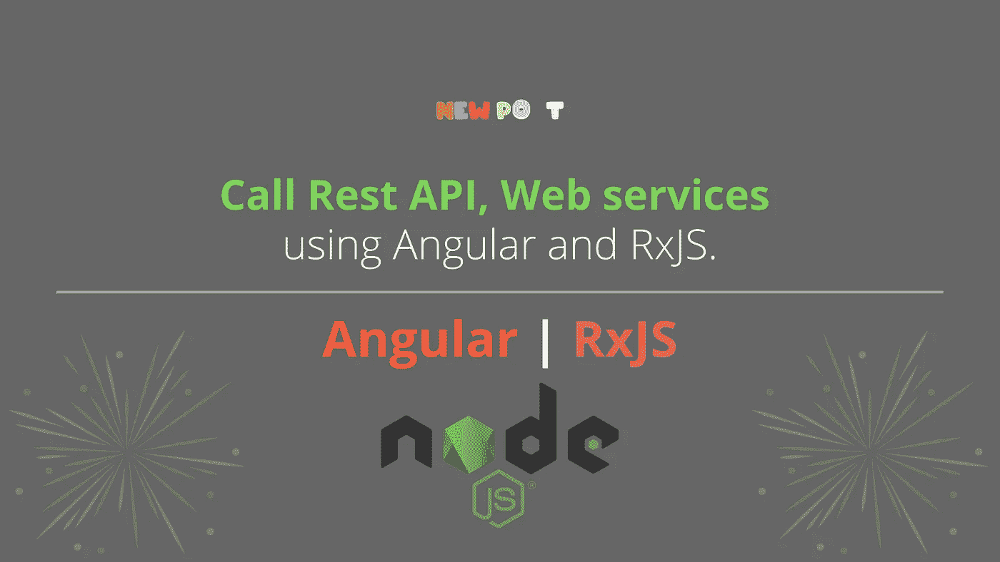
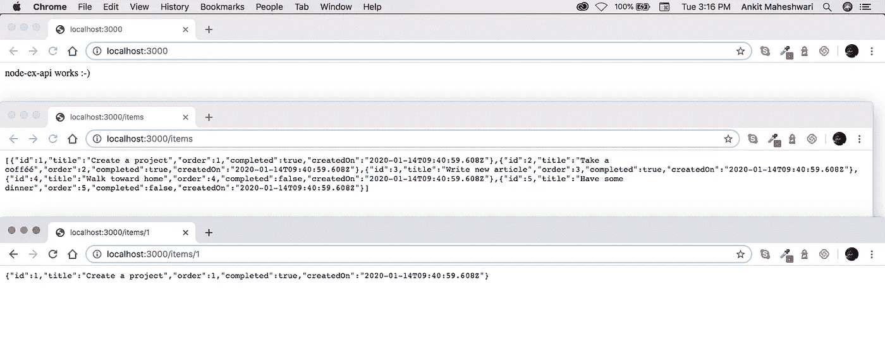
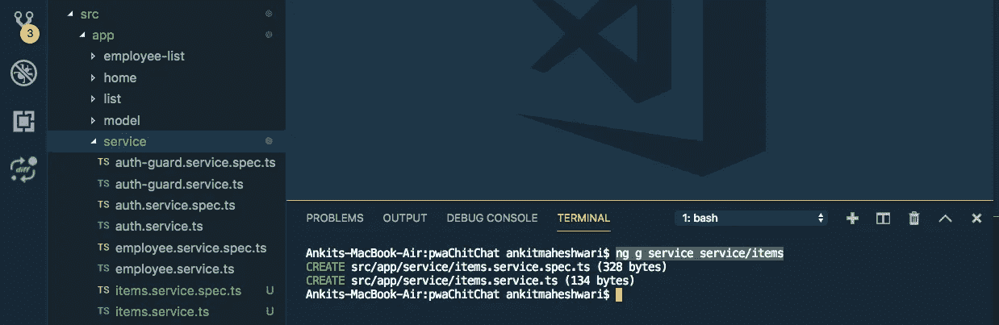
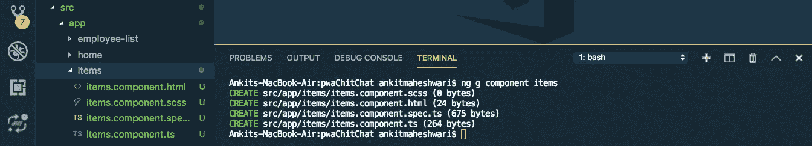
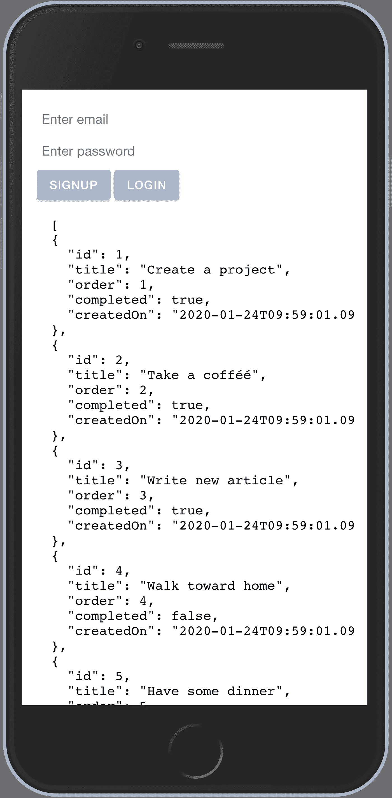

# 使用 Angular 和 RxJS 调用 RESTful APIs | Web 服务。

> 原文：<https://javascript.plainenglish.io/call-rest-api-web-services-using-angular-and-rxjs-4f00e833a65?source=collection_archive---------0----------------------->

调用并缓存从`HttpClient`返回的数据。缓存数据将加速你的网络/应用程序。我们来了解一下如何！



`HttpClient`返回一个可观察值。为了进行缓存，我们需要将可观察到的内容与`shareReplay`和`catchError`结合起来。我们使用缓存来避免对服务器的过多请求。

# 让我们深入了解 HTTP API 调用的细节:

**1。**不使用缓存。
**2。**带有缓存值。
**3。**带缓存可观察。

# 调用 API 之前

你必须有 API，按照本文创建 API 使用 **Node.js 和 Express.js** : [**链接创建 Rest API** 👆](https://medium.com/@AnkitMaheshwariIn/create-rest-api-web-services-using-node-js-and-express-js-with-crud-operations-ff790d6ae030)

[](https://medium.com/javascript-in-plain-english/create-rest-api-web-services-using-node-js-and-express-js-with-crud-operations-ff790d6ae030) [## 用 Node 和 Express.js 创建 CRUD Rest API

### 为了在 Node.js 中构建 API，我们将使用 Express.js 框架。也可以使用任何其他框架，但是 Express.js 非常…

medium.com](https://medium.com/javascript-in-plain-english/create-rest-api-web-services-using-node-js-and-express-js-with-crud-operations-ff790d6ae030) 

# 1.不使用缓存的 API 调用。

现在假设我们有一个 API 端点，它返回一个条目列表——每个条目都是一个 JSON 对象。

API 端点: [localhost:3000/items](http://localhost:3000/items) (返回对象列表，见下图👇)(创建 API 遵循:[链接创建 Rest API👆](https://medium.com/@AnkitMaheshwariIn/create-rest-api-web-services-using-node-js-and-express-js-with-crud-operations-ff790d6ae030))



让我们为我们的项目创建一个服务，如下所示:

我们将在这个服务文件中编写代码，返回一个项目列表。
(确保在你的项目根目录下运行下面的命令👇)

```
ng g service service/items
```

这个命令将生成两个类型脚本文件——请看下面👇



接下来，打开`src/app/service/items.service.ts`文件并更新代码:

## 使用 HTTP GET 方法:

```
import { Injectable } from '@angular/core';
import { HttpClient } from '@angular/common/http';
import { Observable } from 'rxjs';

@Injectable({
  providedIn: 'root'
})
export class ItemsService {

  // URL which returns list of JSON items (API end-point URL)
  private readonly URL = 'http://localhost:3000/items';

  constructor(private http: HttpClient) { }

  // create a method named: resolveItems()
  // this method returns list-of-items in form of Observable
  // every HTTTP call returns Observable object
  resolveItems(): Observable<any> {
    console.log('Request is sent!');
    // this.http is a HttpClient library provide by @angular/common
    // we are calling .get() method over this.http object
    // this .get() method takes URL to call API
    return this.http.get(this.URL);
  }
}
```

## 使用 HTTP POST 方法:

```
import { Injectable } from '[@angular/core](http://twitter.com/angular/core)';
import { HttpClient } from '[@angular/common](http://twitter.com/angular/common)/http';
import { Observable } from 'rxjs';[@Injectable](http://twitter.com/Injectable)({
  providedIn: 'root'
})
export class ItemsService {// URL which returns list of JSON items (API end-point URL)
  private readonly URL = '[http://localhost:3000/items'](http://localhost:3000/items');constructor(private http: HttpClient) { }// create a method named: resolveItems()
  // this method returns list-of-items in form of Observable
  // every HTTTP call returns Observable object
  resolveItems(): Observable<any> {
    console.log('Request is sent!');
    // Using the POST method
    const headers =  {
      headers: new  HttpHeaders({ 
        'Content-Type': 'application/x-www-form-urlencoded'})
    };
    return this.http.post(this.URL,
    {
      'email' : '[ankit.codechintan@gmail.com](mailto:ankit.codechintan@gmail.com)',
      'phone' : 910950xxxxx
    },
    headers)
  }
}
```

接下来，我们将在**组件中测试这个 API。为此，我们将使用我们在`items.service.ts`中创建的方法。**

让我们为我们的项目创建一个组件如下:
(确保在你的项目根目录下运行下面的命令)

```
ng g component items
```

这个命令将生成四个类型脚本文件——请看下面👇



# 重要的

不要忘记对这个新的`ItemsComponent`进行布线。
**分两步做:**
**#1。**在`app-routing.module.ts`文件中定义您的`component`路线。
**#2。在`app.module.ts`文件中声明你的`component`。**

# 让我们这样做…

**#1。**打开您的`src/app/app-routing.module.ts`文件，更新如下:

```
...

import { ItemsComponent } from './items/items.component';

const routes: Routes = [
  ...
  {
    path: 'items',
    component: ItemsComponent
  }
];

...
```

**#2。**打开您的`src/app/app.module.ts`文件，并更新如下:

```
...

import { ItemsComponent } from './items/items.component';

@NgModule({
  declarations: [
    AppComponent,
    ItemsComponent
  ],
  ...
})

...
```

**更深入地了解一个角形组件** **'**
( [点击此处)👆](https://medium.com/@AnkitMaheshwariIn/routing-of-an-angular-component-angular-routing-2b7e53046542))

**最后**，打开`src/app/items/items.component.ts`文件，更新如下:

```
import { Component, OnInit, Input } from '@angular/core';
import { Observable } from 'rxjs';
import { ItemsService } from '../service/items.service';

@Component({
  selector: 'app-items',
  templateUrl: './items.component.html',
  styleUrls: ['./items.component.scss'],
})
export class ItemsComponent implements OnInit {

  @Input()
  result$: Observable<any>;

  constructor(private itemsService: ItemsService) {
    this.result$ = itemsService.resolveItems();
  }

  ngOnInit() {}

}
```

接下来，打开`src/app/items/items.component.html`文件，并按如下方式更新它:

```
<pre *ngIf="code"> {{(result$|async)|json}} </pre>
```

现在，让我们在`AppComponent`中使用`ItemsComponent`。打开`src/app/app.component.html`文件并添加以下代码:

```
<!-- This tag is a selector of src/app/items/items.component.ts file to be added anywhere in src/app/app.component.html file -->
<app-items></app-items>
```

完成的🤩代码的输出在这里👇👇数据以 JSON 对象的形式加载。



# 结论

**我们已经看到 HTTP API 调用有以下几种方式:**
#1)不使用缓存。
#2)带有缓存值。
#3)带缓存可观察。

# 搞定了。🤩使用 Angular 和 RxJS 调用 Rest API/Web 服务就是这么简单。

再见👋👋

> 欢迎在评论框中发表评论…如果我错过了什么，或者什么是不正确的，或者什么对你不起作用:)
> 继续关注更多文章。
> 
> 更多文章敬请关注:
> https://medium.com/@AnkitMaheshwariIn

如果你不介意给它一些掌声👏 👏因为它有帮助，我将非常感激它。:)帮别人找文章，这样就能帮到他们！

永远鼓掌…


*最初发表于 2020 年 1 月 24 日*[*https://www.codewithchintan.com*](https://www.codewithchintan.com/call-rest-api-web-services-using-angular-and-rxjs/)*。*

# 了解更多信息