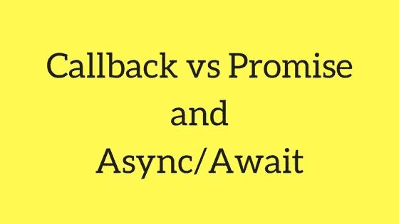
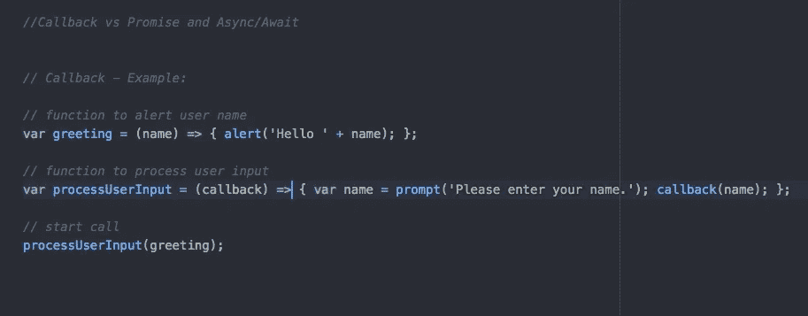
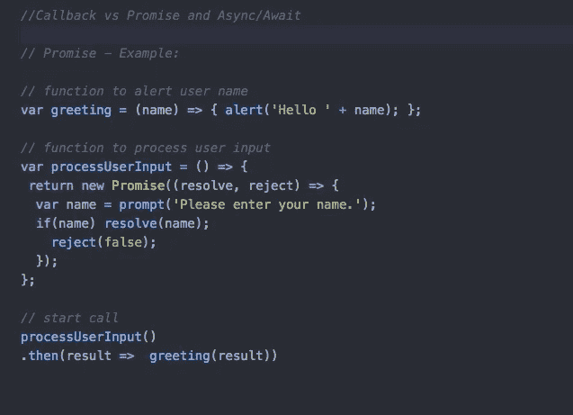
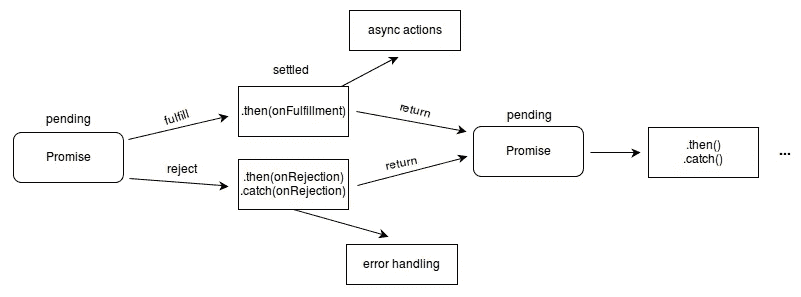
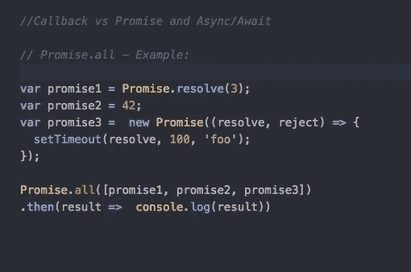
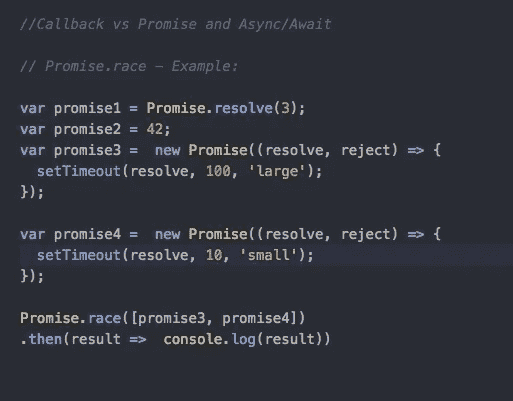
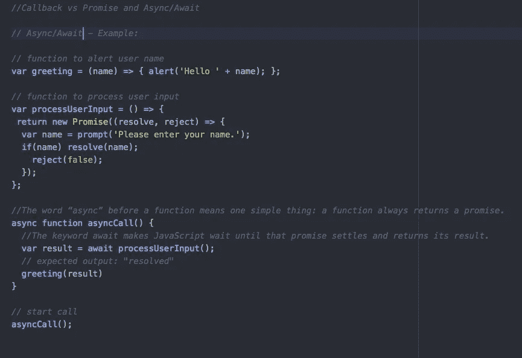

# JavaScript 中的回调 vs 承诺和异步/等待

> 原文：<https://javascript.plainenglish.io/callback-vs-promise-and-async-await-1e46bc1780f4?source=collection_archive---------0----------------------->

Callback vs Promise and Async/Await

# 回调函数

回调函数是作为参数传递给另一个函数的函数，它在 other function 内部被调用(或执行)。

Example: callback

所以处理异步操作的基本方法是通过回调。但是当处理大量依赖的异步操作时，很快就会陷入回调地狱。

# 承诺

**Promise** 对象表示异步操作的最终完成(或失败)及其结果值。

从本质上讲，承诺是一个返回的对象，您可以将回调附加到该对象上，而不是将回调传递到函数中。

Example: Promise

一个**承诺**是一个在承诺创建时不一定知道的值的代理。它允许您将处理程序与异步操作的最终成功值或失败原因相关联。这使得异步方法像同步方法一样返回值:异步方法不是立即返回最终值，而是返回一个*承诺*在未来的某个时间提供该值。

Promise-concept

以下部分选项可通过**承诺获得。**

**1。Promise.all**

**Promise.all(iterable)** 方法返回单个[承诺](https://developer.mozilla.org/en-US/docs/Web/JavaScript/Reference/Global_Objects/Promise)，当 iterable 参数中的所有承诺都已解析或 iterable 参数不包含承诺时，该承诺将解析。它用拒绝的第一个承诺的理由拒绝。

Example: Promise.all

**2。承诺.竞赛**

**Promise.race(iterable)** 方法返回一个承诺，该承诺在 iterable 中的一个承诺解析或拒绝后立即解析或拒绝，并带有该承诺的值或原因。

Example: Promise.race

# **异步&等待**

**异步函数**声明定义了一个*异步函数*，它返回一个[异步函数](https://developer.mozilla.org/en-US/docs/Web/JavaScript/Reference/Global_Objects/AsyncFunction)对象。

Async/await 实际上是建立在承诺之上的。它不能用于普通回调或节点回调。

函数前面的单词“async”意味着一件简单的事情:函数总是返回一个承诺。如果代码中有 return <non-promise>,那么 JavaScript 会自动将它包装到一个具有该值的解析承诺中。</non-promise>

关键字 await 让 JavaScript 一直等到承诺完成并返回结果。

Example: Async/Await

我们应该使用哪种方法？

我们有以下选项来处理 JavaScript 中的异步问题。

1.  回收
2.  承诺
3.  异步/等待
4.  RxJS 可观测量

如果你别无选择或者只能处理一个异步操作，就使用**回调**。代码仍然是完全可管理和可理解的。回调函数本身并不坏，只是在许多情况下存在更好的替代方法。

一个这样的例子是多个链接的(或相关的)异步操作。在这种情况下，当你试图使用回调时，你很快就进入了回调地狱。**承诺**是以结构化和可预测的方式处理你的运营的伟大工具。

**async/ await** 是一个非常棒的工具，适用于那些你并不真的想要或者需要使用可观测量，但是仍然想要使用承诺的情况。您可以使用 async/ await 编写“同步”代码，并更轻松地处理您的承诺链。

在所有使用承诺的情况下，你也可以使用**可观察到的**。但是 RxJS 是第三方库，用来处理数据流上的异步操作。

# **总结**

**1。回调**有进入回调地狱的危险

2.**承诺**逃脱回调地狱

3.**异步/等待**编写“同步”代码并承诺

4.**可观察对象**处理数据流并应用操作员魔法

请在以下[要点](https://gist.github.com/santoshshinde2012/2f9a9a34c8e6523b46c97c0de9d3cf5f)中找到所有示例源代码。