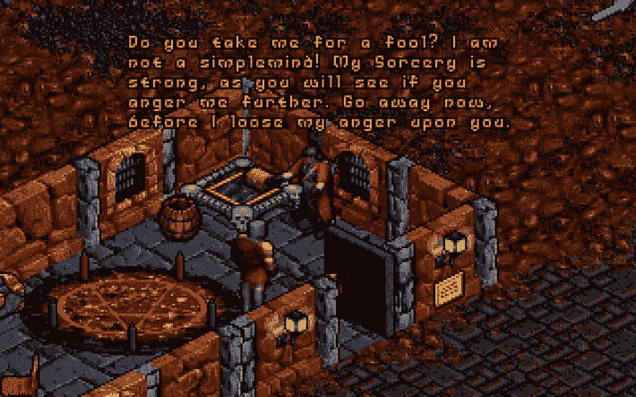
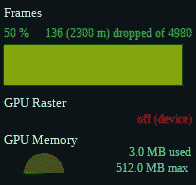
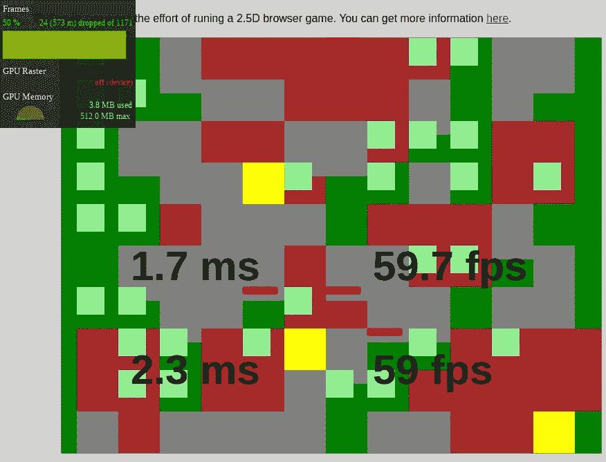
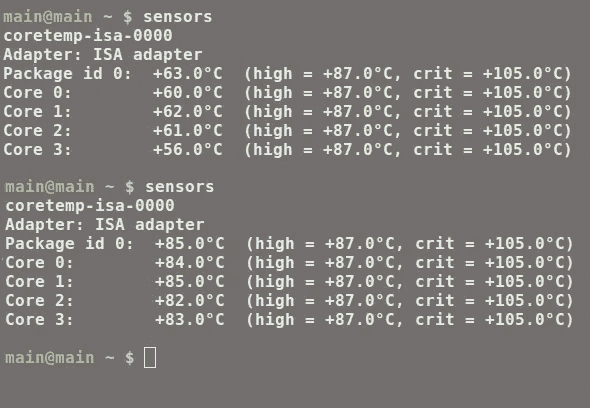
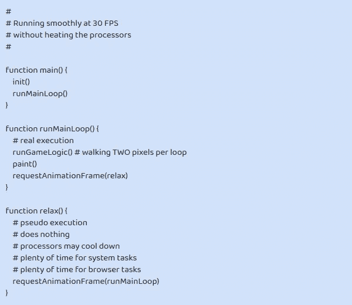
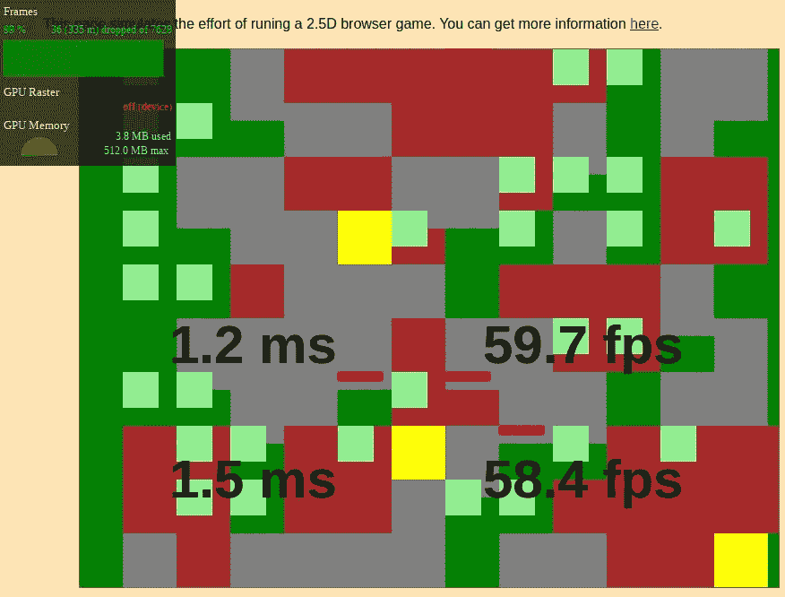

# 浏览器真的能以 60 FPS 运行吗？

> 原文：<https://javascript.plainenglish.io/can-browsers-actually-run-at-60-fps-1abb343879a8?source=collection_archive---------2----------------------->

## JavaScript 2.5D 游戏性能研究

Ultima 8

在本文中，我们检查浏览器是否能够以 60 FPS(每秒帧数)运行精灵游戏。我们讨论了架构选项，运行了性能测试，并发现了一个巨大的陷阱。

# 循环

一个以 60 FPS 运行的应用意味着它有**不到 16，666 ms** (1 秒/ 60)来完成每个循环的执行。但是由于浏览器和操作系统有其他任务要执行，实际上我们有一半的时间。

如果我们想要一个强大的安全边际(我们不知道我们的游戏将在哪些情况下运行)，我们可以考虑将 **3 ms** 作为游戏中每个循环执行的最大可用时间。

# 浏览器和系统

本文的测试是在 Linux 笔记本电脑上使用***Chrome 85.0 版*** *完成的。*

为什么选择 Chrome？因为它是目前最快的(在写这篇文章的时候)。因此，如果代码在 Chrome 中不工作，我们知道它是*不会在其他任何地方工作*。

幸运的是，Chrome 在浏览器市场占有最大份额。它是免费的，易于安装。所以如果我们的游戏需要 Chrome 来运行…没什么大不了的！

# 游戏

文章开头的图片是我用来作为测试灵感的游戏类型的一个很好的例子。一个 2.5D 的冒险类游戏，第三人称视角，玩家的头像总是定位在画布的中心。游戏环境是一个 100×100 正方形的迷宫，有湖泊、生物、许多树和许多墙。

# 游戏逻辑

在一个简单的描述中，游戏机制的代码使用了 4 个列表:地形，生物，导弹和回调(它处理其他人不处理的)。

地形列表是一个大列表，包含 10，000(100 X100)个正方形对象。每个 squareObject 告诉它所代表的地形的所有信息，包括生物和可能在它上面的导弹。

生物列表和导弹列表都很小。并且仅用于提高效率。每个循环，生物和导弹都必须更新。迭代 2 个小列表比迭代 1 万个对象列表更有效。

游戏逻辑的权重，即使有生物的 AI 在起作用，也是微不足道的。在没有绘画的情况下运行游戏需要 0.1 ms 或更少。因此，本文不再讨论游戏的逻辑。

# 这幅画

当化身行走时，他的整个环境必须在画布上移动(因为他总是被画在画布的中心)。因此我们必须在每个循环中重新绘制整个画布。这是一个昂贵的手术。

我们可以想象一个替代的，便宜的重新绘制系统，当头像静止的时候。但这是个坏主意，原因有二。首先，当化身行走时，它没有帮助(游戏必须在 100%的时间里运行)。第二，由于体积元素(生物、墙壁、说话者、导弹、树木等)错综复杂的重叠，这个系统很难实现..)，主要是会动的，各有各的形状和大小。

游戏画布的宽度为 780 像素，高度为 600 像素。这相当于每边 60 像素的 13×10 的正方形。

# Chrome FPS 仪表

The Chrome FPS Meter

Chrome 浏览器提供了宝贵的工具，可以给出正在运行的网页的信息。其中一个正是我们所需要的: [Chrome FPS 米](https://medium.com/@gilfink/quick-tip-using-the-chrome-devtools-fps-meter-1bb400b63f7)。

当前版本的 Chrome FPS 米具有非常重要的进步。它告诉**丢了多少帧(不打印在屏幕上)**。并且显示了最近打印的帧占所有最近产生的帧的百分比。显示的最大值为 99% *，即使打印完所有帧*。

任何 Chrome 工具都容易降低网页性能。因此，无论测试结果如何，不使用 Chrome FPS 测量仪可能会更好一些。

注意:Chrome FPS 测量仪不测量在 ***iframe*** 标签内运行的游戏的性能。如果页面的其余部分是静态的，该工具会告诉您没有丢帧；iframed 游戏的性能有多差并不重要。

# 60FPS 测试

测试是使用一个简单的网页来完成的，这个网页反映了绘制游戏的平均工作量。它有一块 780 x 600 的画有矩形的画布:

*   草:130 绿色 60x60
*   草药:30 个浅绿色 40x40
*   墙壁:40 灰色 60x80
*   树木:20 棵棕色 120x120
*   导弹:6 枚红色 50x10
*   生物:3 个黄色 60x90

除了草地，矩形将每循环向西移动 1 个像素(每秒 60 个像素)，模拟化身的行走。

**过了一会儿**，画布将开始显示 4 个统计数据:

*   左上角是最近 40 幅画的平均持续时间
*   在左下方，是过去 40 幅画中持续时间最长的
*   在右上角，最后 39 个循环的平均 FPS
*   在右下角，最后 39 个循环的最差 FPS

您可以在这里运行 60 FPS 测试。

注意:这个测试并不是我们如何在游戏画布上绘制精灵。它的代码必须简单，否则我们会失去重点。

# 分析 60FPS 测试

60 FPS test

上面我们看到了测试运行的截图。在其他时刻拍摄的截图会告诉类似的统计数据。

我们可以看到，执行绘画所需的平均时间(这是瓶颈)是 1.7 毫秒，远低于我们选择的 3 毫秒的严格限制。最差的情况是 2.3 毫秒，也低于 3 毫秒！太棒了。！！

现在我们来看看 FPS 进展如何。平均 59.7，最差 59。太棒了。小的不精确是正常的。

我们的内部 JavaScript 测试告诉我们，我们可以非常容易地以 60 FPS 运行浏览器游戏。

我们只需要检查 Chrome FPS 表显示的内容。哦不！它说有 50%的帧被丢弃了！！！这就像画了一帧又放下下一帧，画了一帧又放下下一帧…这太糟糕了！！！我们不确定掉帧是如此有规律，还是像油漆 1，掉落 4，油漆 2，掉落 1，油漆 3，掉落 1…

所以我们相信我们的 Javascript 代码还是 Chrome FPS 米？我们可以相信两者。而且比起相信他们，更要相信我们玩游戏的体验:游戏流畅不流畅？

我的猜测是:用 JavaScript 编写的测试测试了 V8 运行时的性能。但是在 V8 运行时之外还有更多工作，比如与视频图形卡交互。这只能用 Chrome PFS 仪表测量。似乎视频卡不能处理它收到的所有东西。

那么，为什么要下降 50%呢？另一种猜测是:Chrome 意识到它无法保持 60 FPS 的运行速度。因此，Chrome 没有尝试几乎总是失败，而是决定直接达到 30 FPS，提供更流畅的体验。

Chrome 在测试过程中不稳定。有时它以 60 FPS 开始，然后仅仅因为我移动(不是拖动)鼠标，它就下降到 30 FPS。

# PixiJS，ThreeJS，WebGL，WebAssembly 还是只是你聪明的 JavaScript 代码？

注:这一部分是完全编辑过的，因为它不够清楚。

如果你想用 C、C++或 Rust 重写一个这样的游戏，然后转换成 WebAssembly 来加速游戏逻辑，我会说这是没有必要的。JavaScript 很好地处理了游戏逻辑。

我用 PixiJS、WebGL 和 ThreeJS 做了**非常肤浅的**尝试。我没有得到更好的结果**画小妖精们；*也许我没有用正确的方式测试它们*** 。我不是说他们不能很好地工作。我放弃了，因为我更愿意花时间去寻找一种方法，用纯 JavaScript 和 **2D 画布**让游戏工作。

我会在结论部分多讲一些。

# 暖气——你最大的敌人

Monitoring the heat

如果你的操作系统是 Linux，在你的终端输入 ***sensors*** 和***【ENTER】***。这显示了机器中处理器的温度。这是一个非常可靠的方法来检查你的应用程序是否对他们要求太多。

当您的应用给系统带来压力时，温度会上升。但是处理器不会崩溃，因为操作系统启动了一个防御协议来延迟(可能跳过，我不知道)进程的执行。

> 这种防御协议会导致以下奇怪的效果。您的游戏正在以可接受的性能运行。突然，它开始表现得很糟糕。让我说清楚，我的意思是可怕。一分钟后，游戏恢复到可接受的性能。然后重复这个循环。

如果你**没有意识到发热问题，你会开始疯狂地寻找*不存在*的**内存泄漏。你重构所有的东西，没有发现任何错误。然后你放弃制作你的浏览器游戏，因为你相信浏览器对于游戏来说不可靠。

# 以每秒 30 帧的速度运行正常

既然在实践中 Chrome 每秒绘制 30 帧，让我们接受并配合这一不可避免的命运。

首先我们需要调整游戏机制(逻辑)以 30 FPS 运行。比如头像速度不再是每循环 1 个像素。它必须是每循环 2 像素，**匹配原来的每秒 60 像素的速度**。

其次，我们必须调整游戏循环，如下面的伪代码所示:

Pseudocode

这个系统有非常重要的优点。我们停止在每个循环中给浏览器、操作系统和机器施加压力，给它们时间冷却。系统不需要启动防热协议。我们有稳定的、可预测的表现。代码的变化很小。游戏将是免费的。30 FPS 对于一个雪碧游戏来说已经不错了。

30 FPS test

你可以在这里运行 30 FPS 的测试。

# 结论

这篇文章是我尝试分享我制作一个****2.5D****游戏所学到的东西，使用画布* ***2D*** *上下文和普通 JavaScript* 。我认为 60 FPS 不是一个可以达到的目标。即使 JavaScript 引擎没有压力。*

*我推荐你把你的**简单精灵游戏**设计成**有效 30 FPS** 。你不会后悔的！*

*注:看起来有 3D 游戏在 60 FPS 的浏览器上流畅运行。就像一位读者指出的那样。这类游戏超出了本文的范围。*

*谢谢大家！*

***重要编辑**:*

**在发表当前文章的几天后，我在我的 Linux 计算机上重新安装了操作系统，并意识到在重新安装之前我的显卡出现了问题。现在我已经没有那些问题了，我必须更新我的观点，说 60 FPS 对于一个浏览器游戏是可以的(在一台好机器上)。虽然跑 30 FPS 比较安全。**

*这个插曲让我有点尴尬。所以我想指出两个事实来为自己辩护。第一，我的机器是运行 Linux 的像样的硬件:大家都习惯信任 Linux 了吧？第二，我还在我的第二台机器(不太好)上做了测试，这台机器运行 Windows。我认为第二台机器代表了很大的市场份额。*

**还有一件重要的事情要提:新版(89)Chrome 的 FPS 米倒退到早期阶段，再次不可靠:它说一切正常，而我们知道它不是(我们可以在一些网页中看到 janks)。**