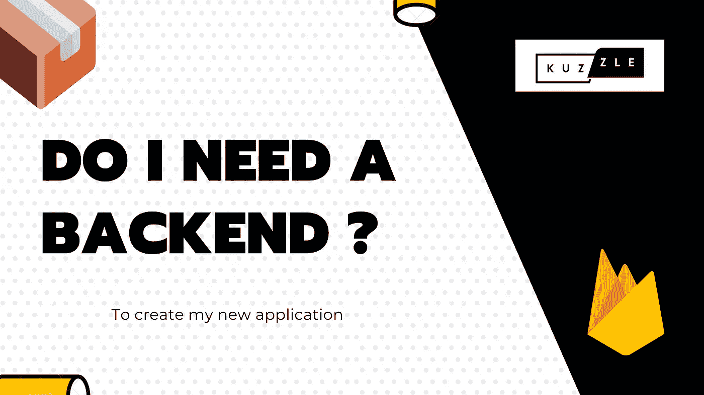

# 我可以不用任何后台代码做一个 app 吗？

> 原文：<https://javascript.plainenglish.io/can-i-make-an-app-without-any-backend-code-7ef22129e3d7?source=collection_archive---------1----------------------->

## 剧透:是的，你可以！这篇文章将告诉你为什么你会对这个感兴趣，以及如何继续。



在一个一切都在加速的世界里，你需要快速迭代，以免被抛弃。

有很多技术，你不可能掌握其中的每一项。你可能会问自己“没有后端代码的知识，我如何构建一个应用程序？”。

*   你需要快速、安全地迭代
*   没有太多关于后端代码、托管或开发的知识。
*   专注于你已经很复杂的前端开发工作。

那么，你能在没有任何后端代码的情况下制作一个完全正常工作的应用吗？

# 👨🏻‍🚒后端即服务(BaaS)助您一臂之力

> 后端即服务是一个远程工具箱，它将快速帮助您构建通用的应用程序功能，而无需一行代码，例如身份验证、数据库持久性、搜索和统计。

有很多工具可以提供这样的工具。

*   [**Firebase**](https://firebase.google.com/) 可能是最知名的了，它的背后是谷歌和谷歌云平台下的钩子。它真的很高效，很酷，是作为云黑盒子工具托管的。

如果您需要内部工具，您可以使用自己的主机查看一些解决方案，例如

*   [**Kuzzle**](https://kuzzle.io/) 一款基于 NodeJS、弹性搜索、Redis 的物联网和高性能/流量应用特别强大的 BaaS。
*   [**FeatherJS**](https://feathersjs.com/)**一个 NodeJS 服务器，带有各种连接器，用于 MySQL、Postgres 或 MongoDB 等。**
*   **[**Strapi**](https://strapi.io/) 帮助快速构建 CMS 的 NodeJS 服务器。**

**使用 BaaS 时，您需要稍微改变一下想法。**

**您通常使用前端的格式化数据直接查询与数据库交互的服务端点，因为它必须出现在数据库中，而不是调用您自己的端点来根据您的自定义逻辑更改数据。**

**因此，前端代码被认为是安全的，您唯一要做的就是在后端应用一些验证策略，以确认某些情况下的数据完整性。**

****💡记住***当谈到“无止境的后端”时，事实上有一个正在运行的后端，你只是不要写任何(或只有几个)关于它的代码。几乎所有的事情都为你做好了。***

## ****后端即服务的一个小例子****

**想象一下，您需要创建一个博客帖子，如果没有 baa，您可能会调用某个称为 POST /blog/create 的端点，您可能会传递这样的对象**

```
{
  "title": "My new post",
  "content": "<h1>Some HTML…"
}
```

**然后在后端，您会添加一个帖子 ID，一个带有创建日期的服务器时间戳，可能还有一个使用会话令牌找到的当前用户的作者字段。**

**有了 baa，您可以像使用 SDK 一样直接对集合进行调用(我将在下面向您展示 Firebase Firestore 示例，但在其他工具中非常相似)**

```
const articleReference = db.collection("blog_posts").add({
  "title": "My new post",
  "content": "<h1>Some HTML…",
  "owner": "<user_unique_id>"
  "creation_date": 1578855978
})
.then(success => console.log(success))
.catch(error => console.warn(error));
```

**您还可以在后端添加一些限制策略，比如验证作者。**

```
match /blog_posts/{postId} {
      allow read if true,
      allow create, update: if request.auth.uid == resource.data.owner;
}
```

**这样，您可以更快地编写代码，并且比后端代码更容易为安全策略定义自动化测试套件。默认情况下，一切都是禁用的，您可以一点一点地启用。**

**这也可以定义一些后端功能，这些功能会“挂钩”一些事件，例如文档创建、编辑或删除。这样，您就可以定义一些副作用或额外验证**

# **我可以用后端即服务构建什么？**

**事情就是这样……您可以构建的东西没有限制，如果您遇到了限制，您可以用其他工具甚至自定义后端来扩展这些工具。**

**大多数时候，基于云的解决方案都有合理的免费层，所以当你的应用成功时，你可以毫无问题地开始构建，并开始支付少量费用。**

****很贵吗？****

**请记住，任何有助于您更快、更安全的事情通常都会有缺点。当使用内部部署时，成本与开发人员支持和协助许可证有关。**

**但是当使用云 baa 时，当它们扩展到一个非常大的数据集时，它们通常是昂贵的，您还需要设计您的应用程序来与它们大规模合作，但是工程师最大的问题是花费数小时优化一些根本不应该存在的东西。**

**使用 baa 快速迭代，如果你的产品获得了一些成功，想一个以后优化它的方法，也许可以换成另一种技术。**

**BaaS 的酷之处在于，您真的可以很容易地迁移到其他工具。**

**[**🇫🇷STOP！你是法国人吗🥖？**法国的时事通讯《法国的隐私》🙂](https://codingspark.io)**