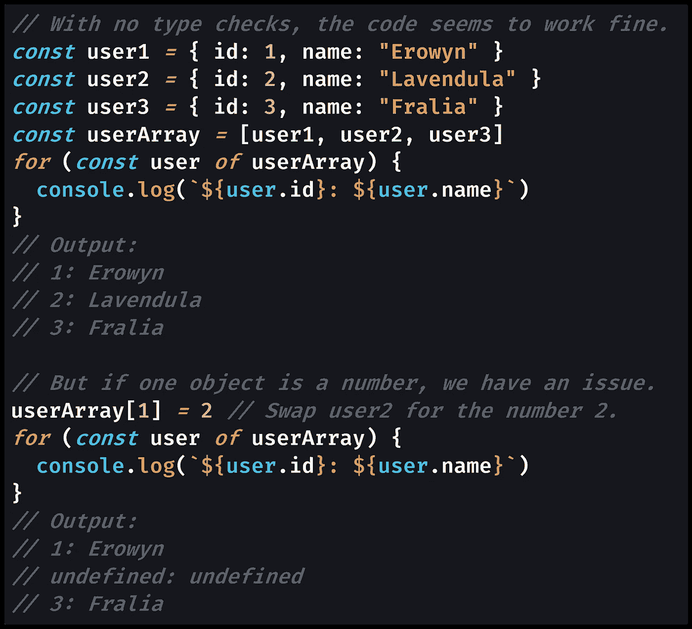
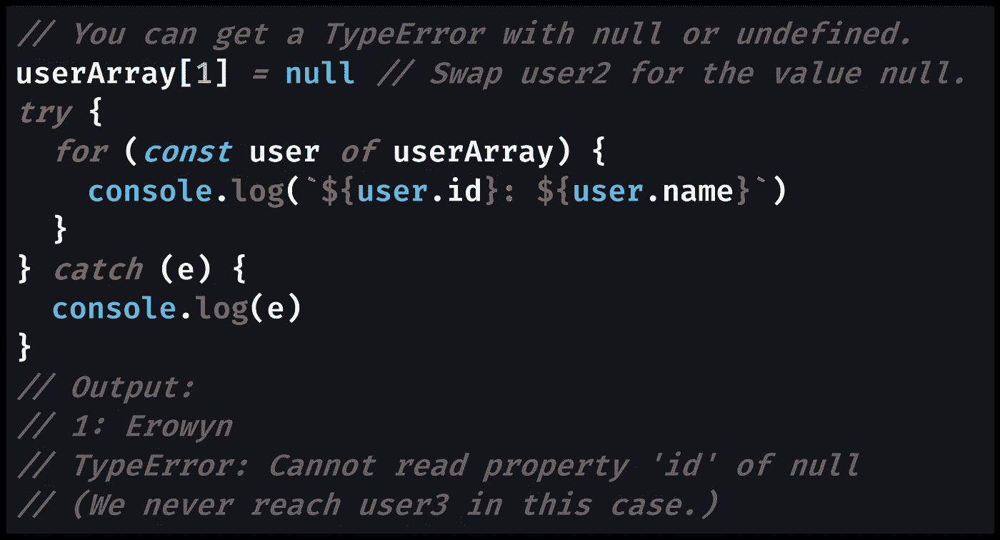

# JavaScript 数组可以包含不同的类型吗？

> 原文：<https://javascript.plainenglish.io/can-javascript-arrays-contain-different-types-e34a4939befc?source=collection_archive---------0----------------------->

## JavaScript 数组可以同时包含任何和所有类型的数据，这既奇妙又可怕。

Photo by [Gayatri Malhotra](https://unsplash.com/@gmalhotra?utm_source=medium&utm_medium=referral) on [Unsplash](https://unsplash.com?utm_source=medium&utm_medium=referral)

# JavaScript 数组可以包含不同的类型

永远有用的 [Javascript 数组](https://medium.com/javascript-in-plain-english/how-to-check-for-an-array-in-javascript-6ad20f7a0e21)是一个简单的条目列表，从索引`0`开始，一直到索引`array.length - 1`:数组中的条目数(其`[length](https://developer.mozilla.org/en-US/docs/Web/JavaScript/Reference/Global_Objects/Array/length)`)减 1。

使用数组时，尤其是对于来自其他编程语言的程序员来说，一个常见的问题是 JavaScript 数组是否可以包含多种类型。

大多数编程语言都有严格的类型，这意味着在声明数组变量时，需要定义数组的类型。JavaScript 是一种松散类型的语言，这意味着任何变量都可以包含任何类型的数据:字符串可以用数字替换，反之亦然。

换句话说:当使用 JavaScript 数组时，你需要执行类型检查吗？`[typeof](https://medium.com/better-programming/how-to-check-data-types-in-javascript-using-typeof-424d0520a329)`在这里有用吗？

JavaScript 数组确实可以包含任何和所有类型的数据。一个数组可以包含其他对象(包括其他数组)以及任意数量的原始值，如[字符串](https://medium.com/javascript-in-plain-english/how-to-check-for-a-string-in-javascript-a16b196915ff)、`[null](https://medium.com/javascript-in-plain-english/how-to-check-for-null-in-javascript-dffab64d8ed5)`和`[undefined](https://medium.com/coding-at-dawn/how-to-check-for-undefined-in-javascript-bcedd62c8ad)`。

当您将一个对象放在另一个对象的内部时，这称为嵌套对象。嵌套数组需要特殊的处理，这取决于你是想对数组进行[浅拷贝](https://levelup.gitconnected.com/how-to-copy-an-array-in-javascript-with-array-from-298c7e66eebc)还是[深拷贝](https://medium.com/javascript-in-plain-english/how-to-deep-copy-objects-and-arrays-in-javascript-7c911359b089)。

JavaScript 数组能够包含不同的类型意味着你可以做一些很酷的事情，比如将不同类型的数据嵌套在一起。缺点是，在任何给定的时间，不能保证您在数组内部处理的值的类型。

让我们来看一个代码示例，在这个示例中，我们循环遍历一组`user`对象，每个对象都需要一个`id`和一个`name`:

[View raw code](https://gist.github.com/DoctorDerek/72de57c664bcc23981a5cb68591b65ad) as a GitHub Gist

使用数字返回`undefined`，因为属性`id`和`name`不存在(不像字符串上的`[.length](https://developer.mozilla.org/en-US/docs/Web/JavaScript/Reference/Global_Objects/String/length)`)。

[View raw code](https://gist.github.com/DoctorDerek/72de57c664bcc23981a5cb68591b65ad) as a GitHub Gist

使用`null`值会产生`[TypeError](https://developer.mozilla.org/en-US/docs/Web/JavaScript/Reference/Global_Objects/TypeError)`，在这里用`[try...catch](https://developer.mozilla.org/en-US/docs/Web/JavaScript/Reference/Statements/try...catch)`块捕获并记录到控制台。

[View raw code](https://gist.github.com/DoctorDerek/72de57c664bcc23981a5cb68591b65ad) as a GitHub Gist

因为 JavaScript 数组可以包含不同的类型，所以我们可以用任何其他类型替换数组中的任何元素。在代码示例中，我将对象换成了一个[数字](https://medium.com/javascript-in-plain-english/how-to-check-for-a-number-in-javascript-8d9024708153)原语，然后换成了值`null`。

这个数字产生了`undefined`对象属性，但是`null`产生了一个`[TypeError](https://developer.mozilla.org/en-US/docs/Web/JavaScript/Reference/Global_Objects/TypeError)`“null 没有属性。”哎呦！

后来，我为一个对象添加了一个显式的[检查，这是我所期望的。在这样做的时候，我还必须检查`null`，因为`typeof null`是`"object"`。这阻止了](https://medium.com/p/3b2632330296/)`[TypeError](https://developer.mozilla.org/en-US/docs/Web/JavaScript/Reference/Global_Objects/TypeError)`被抛出。

另一种常见的语法是使用“[短路操作符](https://medium.com/p/7ee0e8dc8bc8/edit)”`&&`(逻辑 AND)，它停止对任何 [falsy 值](https://medium.com/coding-at-dawn/what-are-falsy-values-in-javascript-ca0faa34feb4)的执行。换句话说，代码行的剩余部分在`&&`之后不会被执行。必要时，您还可以使用`&&`将多个类型检查串在一起。

在这个例子中，请注意，我实际上没有键入 check 来确保我有某种类型的`User`对象，只是任何对象。检查对象的类型需要类似于`[Object.getPrototypeOf()](https://medium.com/p/c90dd3686bfa)`的东西。

# TypeScript 数组可以包含不同的类型吗？

甚至 [TypeScript](https://www.typescriptlang.org/) ，JavaScript 的严格类型扩展(技术上称为“[严格语法超集](https://en.wikipedia.org/wiki/TypeScript)”)也允许你将任何类型的数据放入一个带有语法`[any[]](https://www.typescriptlang.org/docs/handbook/basic-types.html#array)`的数组中:意思是一个`[any](https://www.typescriptlang.org/docs/handbook/basic-types.html#any)`类型的数组。

如果您没有在 TypeScript 中指定一个特定的类型(或一组类型)，默认情况下也会使用`any[]`的数组类型(“推断”)。

相比之下，只有数字的 TypeScript 数组由`number[]`指定——如果您的代码试图向数组中添加非数字，您将无法将 TypeScript 编译成 JavaScript。

想想我们的用户对象的例子，我们期望数组中的每一项都是具有`id`属性的`user`,您可以想象您必须在 TypeScript 中进行更少的类型检查:事实上，根本不需要。

虽然有许多强烈的支持和反对 TypeScript 的意见，但我认为使用对象数组的好处是显而易见的。

如果我不得不打赌 JavaScript 开发人员如此喜欢 TypeScript 的第一个原因，那就是您可以在保证数据类型的情况下迭代数组，而不需要每次都进行类型检查。

然而，您需要知道数组可以包含“普通 JavaScript”中的任何类型(由浏览器或[节点](https://nodejs.org)运行的 JavaScript，不使用 TypeScript 或任何其他扩展、框架或助手)。

这里要传达的信息是，您应该小心迭代您“期望”为某种类型的项目数组，尤其是如果这些项目本身就是 JavaScript 对象。

只需要一个未处理的`TypeError`就可以让你的整个 JavaScript 代码崩溃，所以一定要经常使用像`[try...catch](https://developer.mozilla.org/en-US/docs/Web/JavaScript/Reference/Statements/try...catch)`、`[typeof](https://medium.com/better-programming/how-to-check-data-types-in-javascript-using-typeof-424d0520a329)`和`[null](https://medium.com/javascript-in-plain-english/how-to-check-for-null-in-javascript-dffab64d8ed5)`、[这样的工具来检查](https://medium.com/javascript-in-plain-english/how-to-check-for-null-in-javascript-dffab64d8ed5)，以避免你的项目出现重大的 bug。

**快乐编码！**🦔🐉🦩👀🎢

[德里克·奥斯汀博士](https://www.linkedin.com/in/derek-austin/)是《职业规划:如何在 6 个月内成为一名成功的 6 位数程序员 一书的作者，该书现已在亚马逊上架。