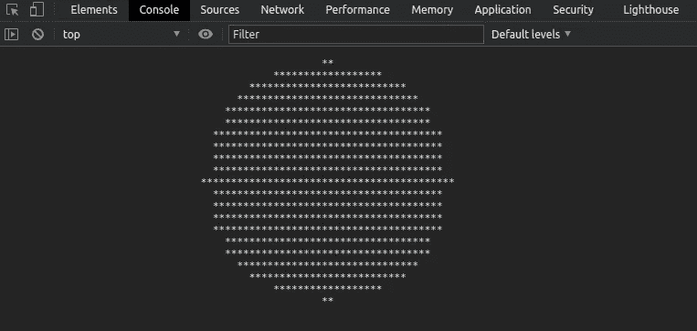

# 可以在浏览器控制台打印一个圆吗？

> 原文：<https://javascript.plainenglish.io/can-you-print-a-circle-on-the-browser-console-1dec46f9136a?source=collection_archive---------2----------------------->

## 我们通常使用 console.log 方法来显示一些调试输出。今天让我们展示一个 ASCII 圈来取乐吧！

我经常使用`console.log`通过使用一些字符如`=`和`+`来输出程序的调试信息。我使用这些字符来强调一些重要的调试细节。这让我想起了我过去的大学时光，那时我们使用 C 编程语言作为最初的编码活动，制作 ASCII 框、三角形和其他一些形状。这些算法上的东西真的很有趣，也很有挑战性。因此，在深入研究该解决方案之前，只需打开浏览器控制台，尝试打印如下内容。



A circle on the browser console, screenshot by the author

但是，这不是一个完美的圆，因为我们只是使用文本字符作为像素。

# 笛卡尔坐标系

数学中的笛卡尔坐标系表示二维平面中的每个点都可以使用一个值对来唯一标识。如果我们把整个浏览器控制台想象成一个虚拟的笛卡尔坐标系，那么浏览器控制台的左上角可以标记为`(0, 0)`点。此后，控制台的水平路径可以作为 x 轴。同样，控制台从上到下的垂直路径可以作为 y 轴。现在，我们可以使用字符串操作技术在浏览器控制台上简单地打印一个给定的`(x, y)`点。

如果有一种不用换行符就能直接在控制台上打印内容的方法，就不需要字符串操作。但是`console.log`会在每次方法调用后添加一个换行符。因此，可以用二维的点细节来构造一维的字符串序列。

# 如何打印圆

在打印圆之前，让我们写一段简单的代码，将`**`字符打印到我们的虚拟笛卡尔平面的所有点上。

A code to put some characters to the virtual Cartesian plane, written by the author

这两个循环穿过平面的每个点，并将添加`**`，如果到达 x 轴的末端，将添加新的行(`\n`)字符以转到下一行。

好吧，要修改上面的代码来打印一个圆，我们只需要知道一个关于普通圆的小事实。

> "从圆心到圆周的所有直线都相等，这叫做半径."

因此，只有当从圆心到特定点的欧几里得距离小于我们圆的半径时，我们才能标记一个点。否则，空格字符可用于跳过特定点。在我们的代码中可以使用下面的公式来计算欧几里德距离。

```
dist = sqrt( (x1 - x2) ^ 2 + (y1 - y2) ^ 2 )
```

# 让我们写代码

上面显示了第一个代码，可以组合公式来解决我们的挑战。

The solution to print a circle on the browser console, written by the author

常数`R`是半径的大小。另外，`xSize`和`ySize`常量分别定义了 x 轴和 y 轴的最大尺寸。用最大长度除以 *2* 计算出平面的中心。