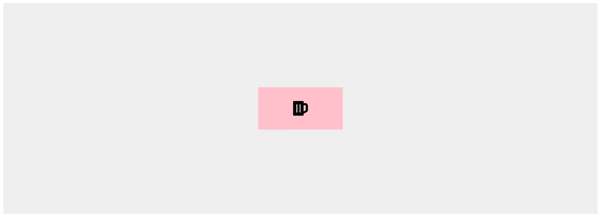
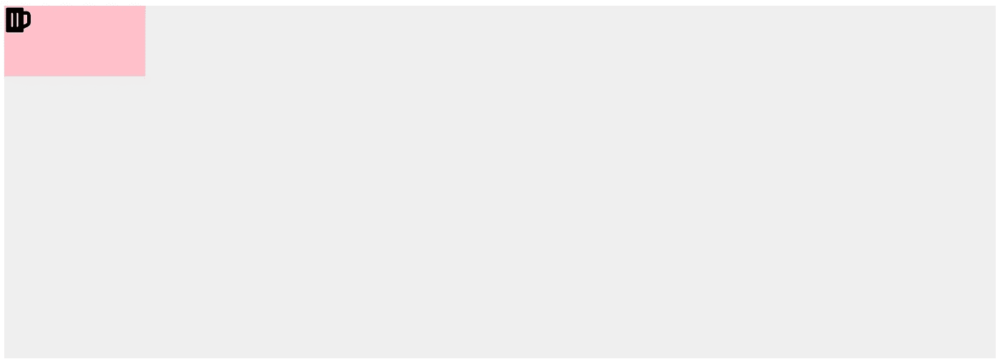

# 在 CSS 中居中元素的 3 种方法

> 原文：<https://javascript.plainenglish.io/center-the-elements-with-css-58edc59955c5?source=collection_archive---------15----------------------->

Web 开发人员在日常生活中会遇到许多需要将元素居中的情况。这也是在面试中被问到的一个非常普遍和重要的概念。所以今天我想列出我最喜欢的三种使用 CSS 居中的方式。



我们有两个 **div** 元素，一个在另一个里面。外部 **div** 具有 *id= '容器'*，内部容器具有 *id = '内容'*。里面有一个图标。

```
<div id="container">        
  <div id="content">   
     <i class="fa fa-beer" style="font-size:24px"></i>       
  </div>      
</div>
```



# 1 .使用 Flexbox

我们可以使用 flexbox 使元素居中。为此，我们将*显示*属性分配给 flex。对于居中项目，我们使用属性 *justify-content* 和 *align-items* 并将其指定为居中。

# 2.使用网格

使用网格使元素居中是一种更有效的方法。我们可以使用 *display* 属性来利用网格。 *place-items* 属性用于将元素置于中心。

# 3.使用位置属性

另一种方法是使用*位置*属性将事物居中的老方法。我们已经使用了*边距、*、*顶部、右侧、底部和左侧* t 属性来表示位置。

谢谢你