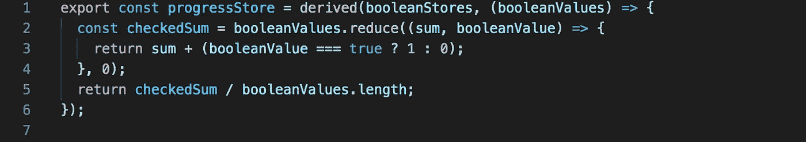

# 高级反应性:结合和链接可观测量

> 原文：<https://javascript.plainenglish.io/chaining-svelte-js-stores-df781a1fb1b?source=collection_archive---------4----------------------->


Photo by [Max van den Oetelaar](https://unsplash.com/@maxvdo?utm_source=medium&utm_medium=referral) on [Unsplash](https://unsplash.com?utm_source=medium&utm_medium=referral)

在我的[上一篇文章](https://medium.com/@mikael.castellani/choosing-svelte-js-for-production-abc1d3d1ef7c)中，我解释了我们为我们的制作网站推进 Svelte.js 的决定。在本文中，我将深入探讨我们必须为应用程序构建的技术细节:连锁商店。Svelte 的开发者体验是围绕反应式商店构建的:在 UI 中使用动态值的可观察模式。这意味着一旦值发生变化，依赖于它的 UI 就会更新以反映 DOM 中的新值。

我所说的连锁商店是指需要第一家商店的价值才能存在的商店。例如，第一个存储定义用户 id，第二个存储需要指向用户的某些属性。如果用户 id 改变，我们需要更新第二个商店。

我将首先提醒 svelte.js 中存在的模式:商店和衍生商店，然后深入研究一个现实生活中的连锁商店的例子。

虽然我关注的是苗条商店，一个简单的[observables 的实现](https://github.com/sveltejs/svelte/blob/master/src/runtime/store/index.ts)，但是这些概念可以很容易地转换成适合其他实现。

# Svelte.js 的商店

Svelte.js 中的一个 store 基本上就是一个实现[可观察接口](https://github.com/tc39/proposal-observable)的对象:有一个 subscribe 方法，懒于求值，订阅时返回一个 unsubscribe 方法。


Store example code, from Svelte’s own documentation

当在 UI 组件中使用存储时，svelte 开发人员体验的美妙之处就显现出来了，对存储的订阅和取消订阅由编译器处理:


Using stores in components, with subscription and unsubscription handled automatically

注意我们导入的变量前面的' $ '字符:这是让编译器知道我们正在使用存储的技巧，当组件被安装和卸载时，它将处理订阅/取消订阅。就凭这一点，你就可以像使用一个变量一样使用存储！(只要你在[一个“反应性声明”里面使用它，在教程](https://svelte.dev/tutorial/reactive-declarations)里会有更多的说明)。我发现这是一个很棒的开发者体验 Svelte.js 就是这么回事。

你可以在这个 https://svelte.dev/repl/1d1d4f0beb4240848fa04be97ffbdf6c? REPL[里玩这个代码版本=3.29.4](https://svelte.dev/repl/1d1d4f0beb4240848fa04be97ffbdf6c?version=3.29.4)

# 衍生商店

一个常见的模式也是导出数据。就像上面提供的例子一样，您有时需要原始值，有时需要格式化值。派生存储是分解转换代码的简单方法。派生存储还允许将多个值合并为一个值。例如，在这个例子中，我是如何从正在填写的表单的值中创建“progressStore”的:


Using a derived store to implement progress

这个进度存储的代码非常简单:



Code of the progress store for checkboxes

提醒一下，当且仅当:

*   商店至少有一个订户。
*   原始存储中的一个值发生了变化。

性能问题到此为止！我们的代码只有在用户屏幕上显示进度条时才会运行。

[https://svelte.dev/repl/ea03956ee4374c8cbe078dcaed40d5bf?这里是 REPL 版本=3.29.4](https://svelte.dev/repl/ea03956ee4374c8cbe078dcaed40d5bf?version=3.29.4)

# 当这还不够时

Svelte.js 提供的可写、可读和派生的存储提供了很大的灵活性。当创建它们时，通过它们简单的初始化和取消订阅接口，以及异步处理，您将能够将许多不同的数据源无缝地插入到您的应用程序中。例如，一个 web 套接字、一个轮询机制、一个定制的或开源的库……所有这些都将作为一个商店向您的应用程序公开，并与其余的很好地集成。

然而，我们仍然很快遇到了一个不容易处理的用例，这也是本文的中心。

正如我在以前的文章中提到的，[https://strollyn.com](https://strollyn.com)使用 Google Firebase 作为后台，以及主机。Cloud Firestore，即数据库，是一个无 sql、面向文档的数据库。因此，我们选择对数据模型进行反规范化，结果如下所示，一个用户可以拥有几个家庭:

```
{
  "user": {
    "user1-id": {
      "uid": "user1-id",
      "homes": [
        {"homeid": “home1-id”},
        {“homeid”: “home2-id”}
      ]
    }
  },
  "home": {
    "home1-id": {
      "homeid": "home1-id",
      "type": "apartment",
      "pictures": [...]
     }
    },
    "home2-id": {
      "homeid": "home2-id",
      "type": "villa",
      "pictures": [...]
    }
  }
}
```

当用户第一次登录时，我们得到他的 uid。为了获得他的 home 并将其公开为一个商店，我们必须首先查看用户文档的内容以获得 homeid，然后订阅适当的 home 文档。换句话说，我们必须等到 uid 已知后才能创建主存储。这就是`derived`方法的不足之处:它只能用于声明时已经存在的存储。

# 进入连锁商店

有几种方法可以解决这个问题，但是我们选择了一种方法，这种方法尊重链接函数调用的函数方式。我们把它命名为`chainReadableStore`，这就是它的用法。


The uidStore, getting its value from the Firebase SDK

首先，让我们创建我们的 uidStore，它在用户登录时被填充。

值得注意的主要事情是，一旦用户对象可用，就调用第 7 行的`set(user.uid)`。


The homeidStore, chained from the uidStore

然后，我们希望创建一个返回第一个家的 homeid 的存储，但是只有在 uid 已知的情况下！


The homeStore is chained from the previously chained homeidStore

最后，我们希望再次链接该值，以便在其余部分可用时尽快获得主文档！

在 UI 端，所有的复杂性都被隐藏了。商店可以像教程开始时一样使用，例如显示一个家的图片，我们可以无缝地“等待”来自服务器的信息。

## chainReadableStore


The code of the `chainReadableStore` function

评论:

*   此函数创建一个订阅初始存储的可读存储
*   当初始存储值不同于`undefined`时，它将调用回调函数来创建链式存储，这是短暂的。
*   当初始存储的值改变时，它将取消订阅(并因此销毁)临时链接的存储，然后使用新值创建一个新的存储。
*   当存储不再有订阅者时，它将销毁其订阅以及临时链接的存储。

在前面的用户和家庭示例中，chaining 函数用于创建 2 个新商店。当 uid 第一次被知道时，它允许获取 homeid(虽然不是马上，但是在一些隐藏的服务器请求之后)。一旦知道了 homeid，我们就知道从哪里获取 home 文档。因为瘦存储仅在值实际改变时通知订户(如果有疑问，请参见[这个 REPL](https://svelte.dev/repl/5903fbd16da740c49f75a24c236e5760?version=3.29.4) )，我们的函数仅在需要时运行:当 uid 或 homeid 改变时，并且仅当最终存储的订阅存在时。

# 结果呢

多亏了连锁商店，我们有了一种非常简单灵活的方式来定义依赖关系。在处理应用程序的加载时，它可以提供很大的帮助。在代码的 UI 端，由于 store API，它集成得非常好。


Progressive loading of the application, with chained stores

你可以在 REPL 的[里摆弄它。](https://svelte.dev/repl/fbec6544d9fa450aad501de11f81195a?version=3.29.4)

# 一句警告

尽管苗条的商店使事情变得相当安全(懒惰评估，[仅在值实际改变时通知](https://svelte.dev/repl/5903fbd16da740c49f75a24c236e5760?version=3.29.4))，请记住，连锁店意味着每次初始商店有新值时，取消/订阅的循环。在一行中有几个链接的情况下，它可以创建许多操作。我发现它特别适合应用程序初始化，但需要给出一个警告:不要在热代码路径中使用它，或者用于定期更改值的存储。当商店之间没有依赖关系时，坚持使用衍生商店。