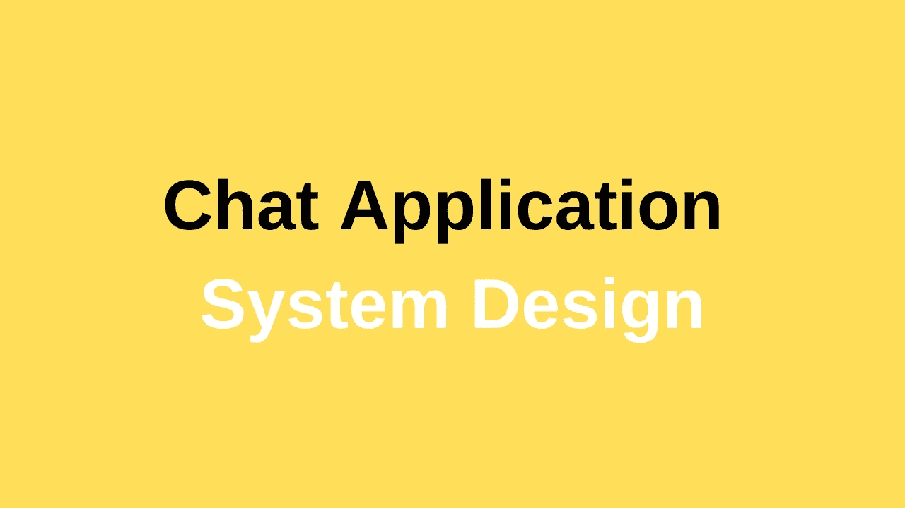
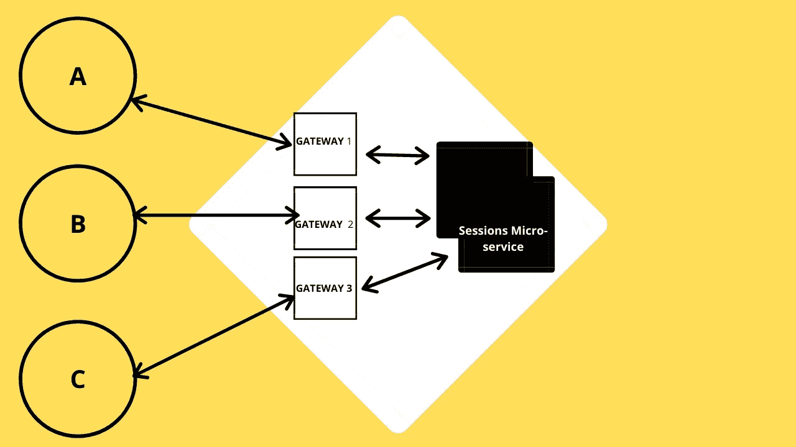
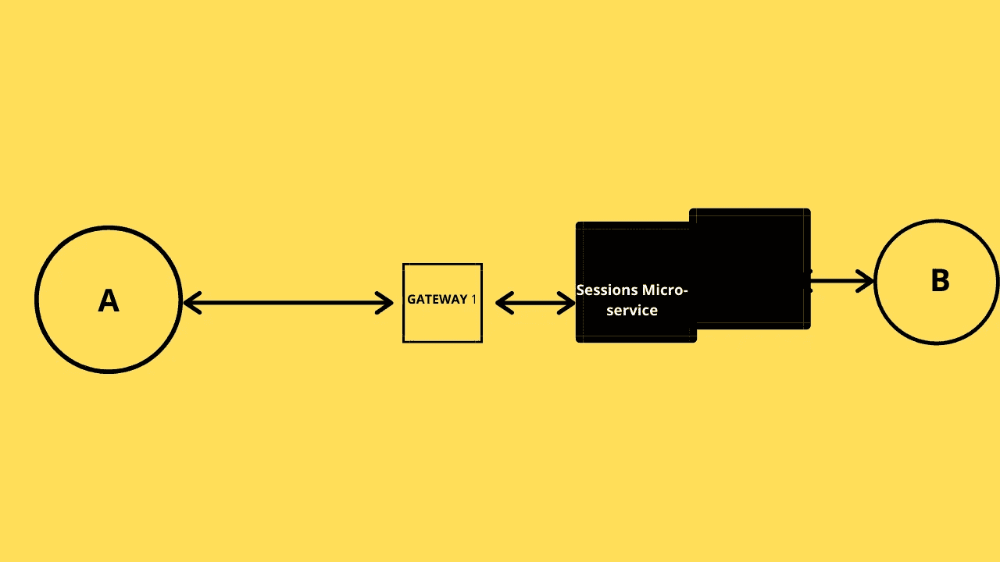
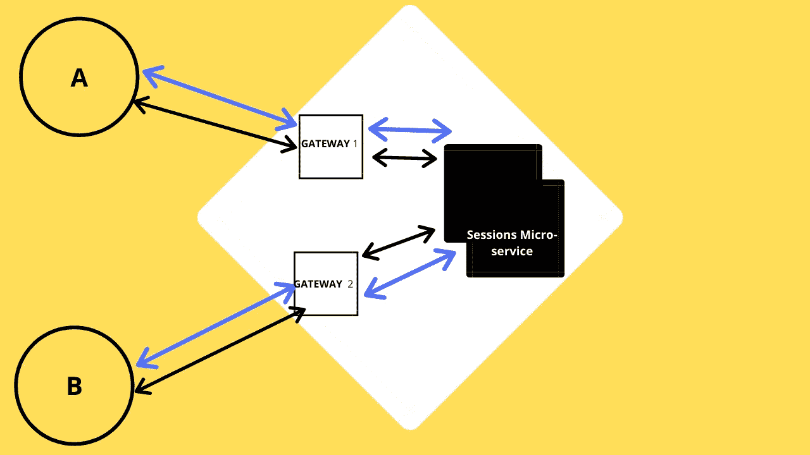

# 聊天应用系统设计

> 原文：<https://javascript.plainenglish.io/chat-applications-system-design-6a070c60c8cd?source=collection_archive---------4----------------------->

## 几乎每个聊天应用都使用的现代聊天应用系统数据库架构

## **我们的应用程序基本特性:**

> ***发送消息***
> 
> ***通知用户发送消息***
> 
> ***通知用户看到的消息***

> *注意:我们现在不打算在这里讨论群发消息*

# 在两个用户之间发送消息

因此，假设 **A** 向 **B** 发送一条消息，我们将使用网关来连接用户，以处理自身的安全性。因此，一旦你连接到网关， **A** 向 **B** ， ***发送消息，但这里我们必须存储哪个用户连接到哪个网关，以使服务更快。***

一旦网关知道用户 **B** 连接到**网关 2** ，它将连接到该网关并提前发送消息，但为此，我们需要将该信息发送到某个地方，为此，我们将使用**会话微服务**，因为在网关中存储该数据本身将是一件昂贵的事情，因为网关已经忙于处理用户请求，这需要大量内存，因此我们需要会话微服务。

所以现在 **A** 用 **B** 的用户 id 将消息发送到**网关 1** 并且会话微服务将做什么，它找出这个用户连接到哪里，然后将消息路由到连接的网关，消息到达 **B** 。

在这里，你可以看到服务器能够向客户端发送请求，而使用 **HTTP** 绝对不可能，使用 Websockets (WSS)也是如此，它让我们可以自由地在用户之间建立对等连接，这样 A 可以向 be 发送消息，反之亦然，这里没有客户端或服务器问题。

因此，现在我们的服务器可以轻松地向客户端发送消息，现在它将更加实时。

所以 B 从 A 那里得到了消息，现在我们交付的部分完成了。

> 我们发送消息的第一个功能现在工作正常！

现在，发送消息部分已经完成，现在我们还必须通知我们的发送者发送消息，如果用户已经阅读了消息(**我们在这些天的每个消息应用中看到)**，对于其他用户也是如此。

因此，现在我们将使用相同的 **TCP** 确认来通知我们的用户

因此，现在当 **B** 收到消息时，它将再次联系网关，然后会话微服务将进行一个会话( **to: from 字段)，其中 to- B 和 from- A，然后**会话微服务将找到用户 **A** 连接的是哪个门，然后通知用户收到了消息，这同样适用于查看消息功能，每当用户打开应用程序时，我们都会以相同的方式向其他用户发送请求，并且它以良好的方式工作。

> **现在我们完成了:发送、接收和查看通知**

# **通知活动用户**

因此，现在无论何时 **B** 或 **A** 读取一条消息，都会有一个用户活动记录在服务器中，该活动每秒存储一次，阈值为 4 秒，但我们不会显示 4 秒前的**在线，**我们将只显示在线，阈值完全由您决定，您需要考虑多少时间，但通常 20 秒听起来不错。因此，现在每当用户登录到服务器，我们的服务器会检查用户日志，如果用户最近登录，那么它会显示在线或在特定时间最后一次看到。

## 进一步阅读

 [## 我用 Next.js、Fauna 和 WunderGraph 为 GraphQL 实时查询构建了一个无服务器的实时聊天应用程序

### 使用无服务器技术创建可扩展的实时聊天应用程序的分步指南，来自…

javascript.plainenglish.io](/i-built-a-serverless-live-chat-app-with-next-js-fauna-and-wundergraph-for-graphql-live-queries-b671d9646f6)