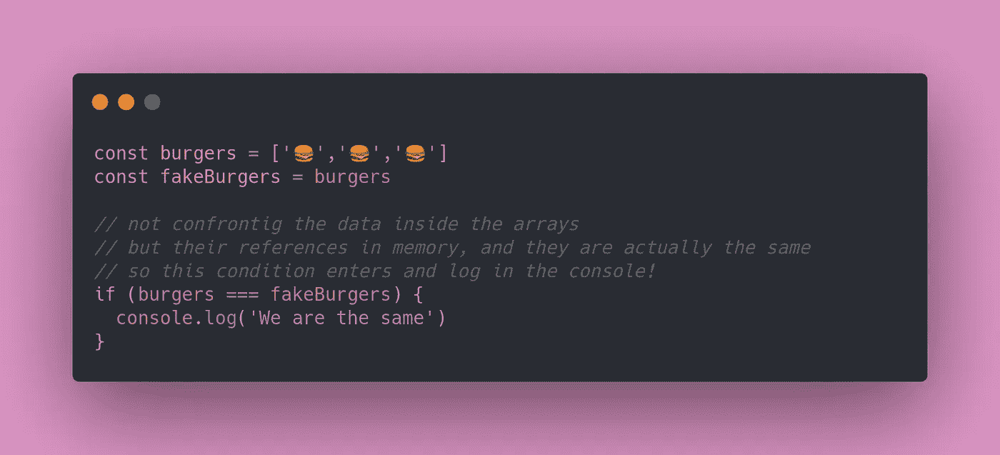
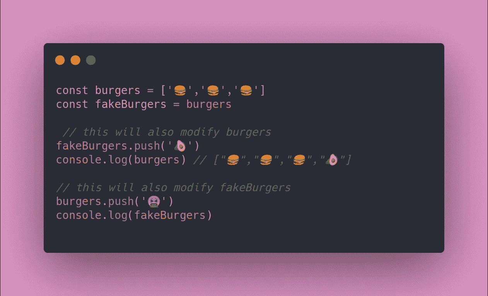
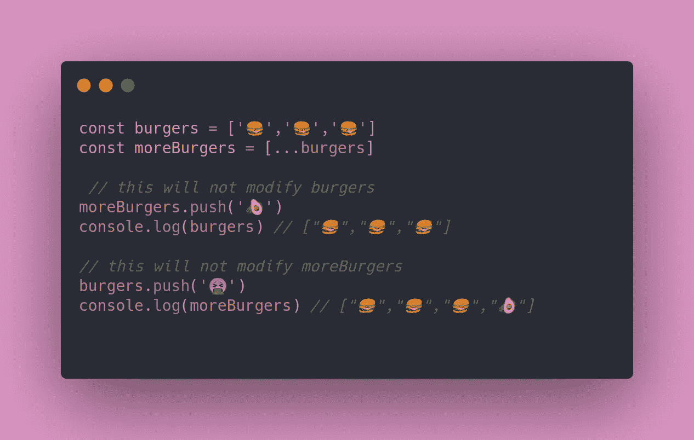
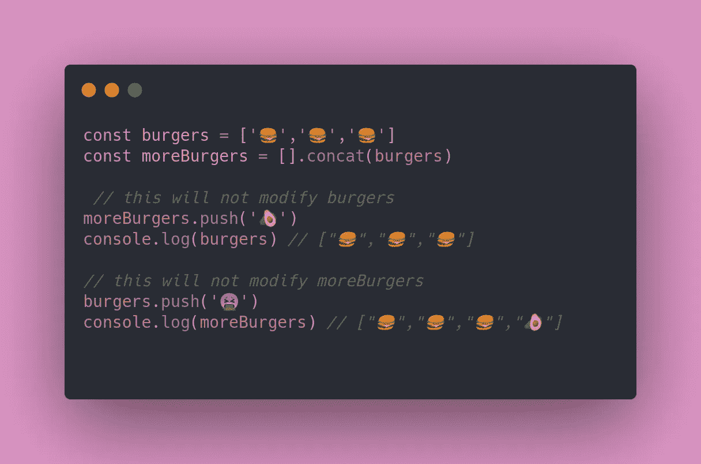
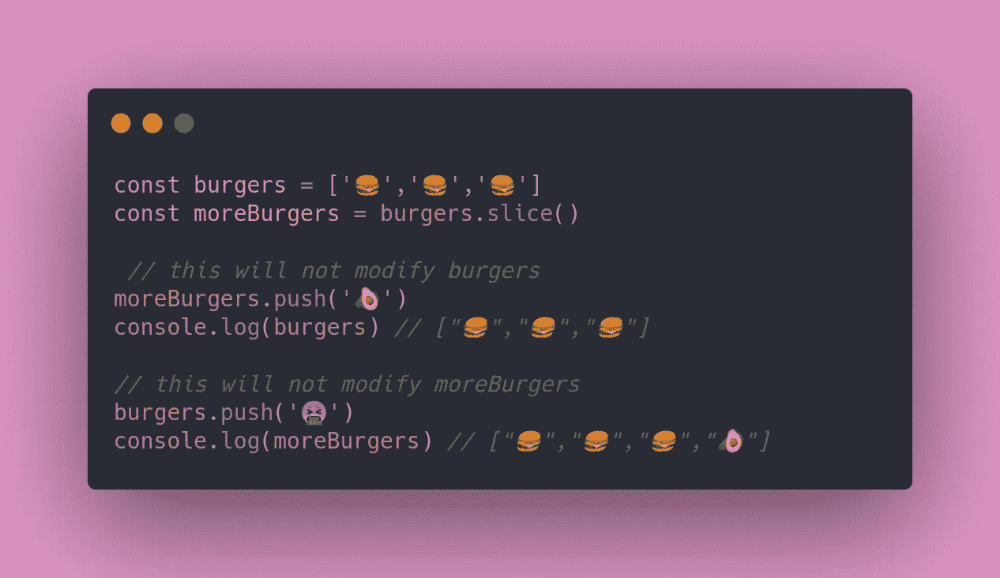
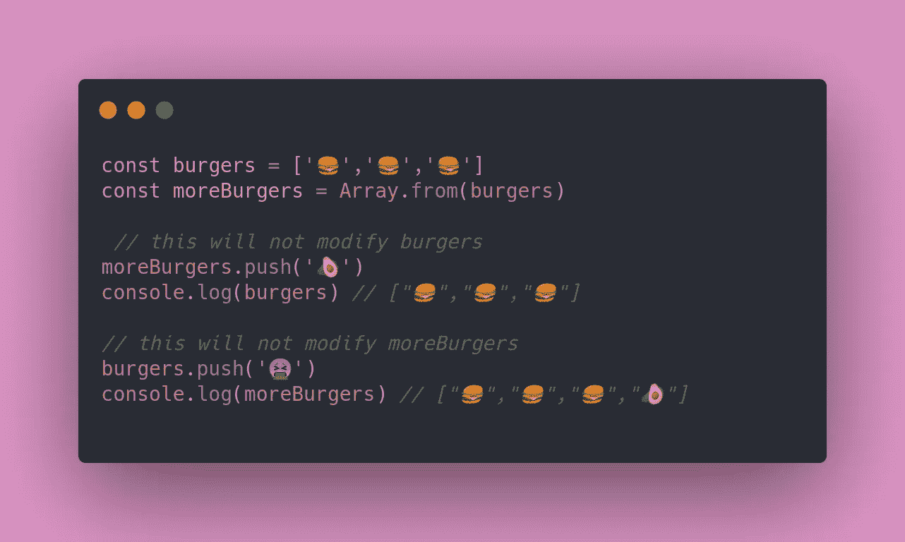
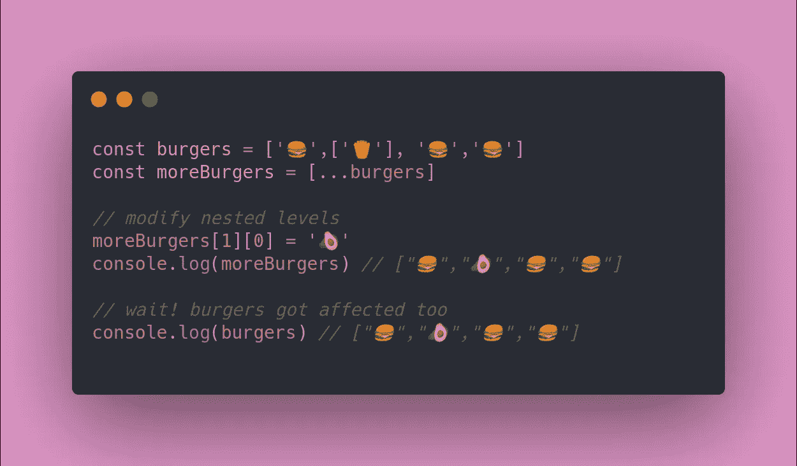
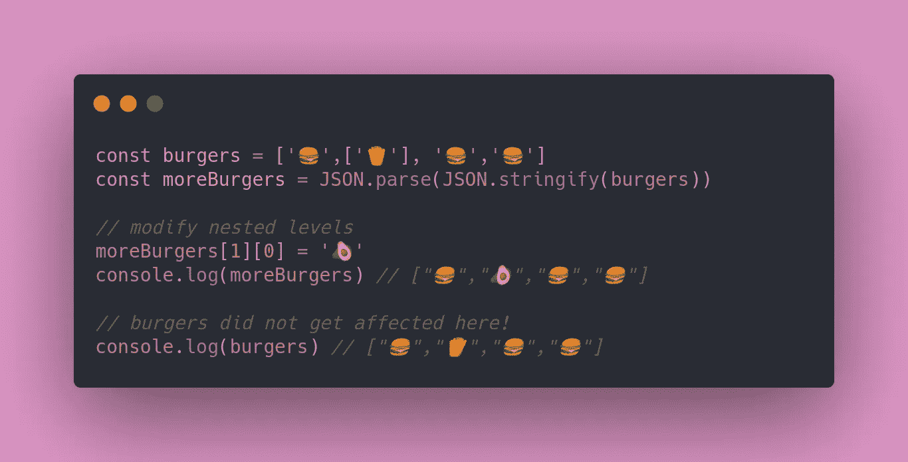
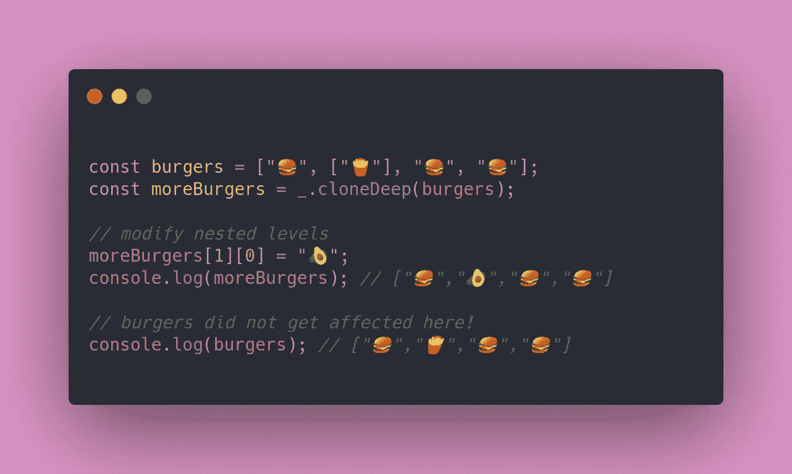
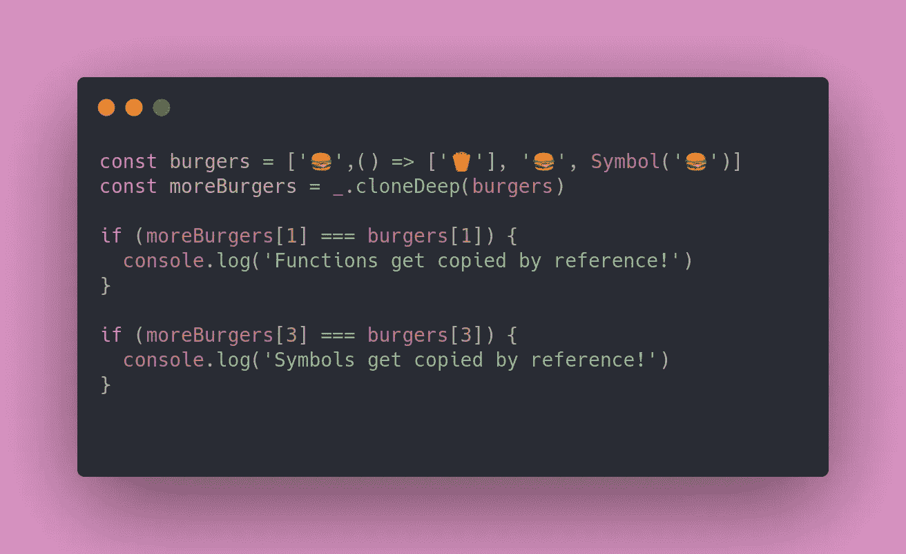

# JavaScript 中克隆数组的备忘单

> 原文：<https://javascript.plainenglish.io/cheat-sheet-for-cloning-arrays-in-javascript-1058ce3c351c?source=collection_archive---------4----------------------->

## 如何在浅层和深层克隆中生存

在 JavaScript 中有 10 种方法。而且，大多数时候，他们的一部分是错的。比如使用`=`符号复制数组。

这是为什么呢？因为 JavaScript 中的数组是 [*引用类型*](https://itnext.io/javascript-interview-prep-primitive-vs-reference-types-62eef165bec8) 。这意味着试图用`=`复制它们只会复制对原始数组的引用**。**

不相信我？尝试在您的控制台中运行这样一个示例:

Arrays here are copied by reference

你能想象现在我们通过引用复制这些数组会发生什么吗？因为我们指向内存中的同一个位置，所以对`fakeBurgers`的每次修改也会修改`burgers`，反之亦然。

Modifying one array will also modify the other.

## 这个怎么解决？

很明显，您应该真正理解如何正确地**克隆两个阵列**。想象一下，你在没有意识到的情况下，执行了如上所述的参考复制。对一个实体的每次修改也会修改一个或多个其他实体。当比较它们时导致“*脏检查*”。

您不需要创建一个新的数组，并在原来的数组上迭代，将每个值复制到新生成的容器中。这是执行这项任务的老方法。试试这些更简单的方法:

## **1)展开操作员**

Cloning two arrays using the spread operator

## 2)串联

Using concat to clone two arrays

## 3)切片

Using slice to clone two arrays

## 4) Array.from()

Cloning two arrays using Array.from

## 小心点！

因为你刚才看到的对 [*深度抄袭*](https://levelup.gitconnected.com/difference-between-shallow-and-deep-copy-c0a968e89c44) 不起作用。这意味着**多维数组将只在第一层**被复制。或者，在“*面*上，如果你愿意的话。更深的层次将简单地通过引用复制，如上所示。

The provided solutions won’t work for nested arrays

这个只在第一级复制数组的过程叫做“*浅复制*”。你主要有两个选择来解决这个问题:

## 1) JSON.parse

Deep cloning using JSON.parse()

## 2) Lodash _。克隆深度睡眠

JavaScript 用户的最佳方法集怎么可能不考虑这种情况呢？只需使用 [Lodash](https://lodash.com/) (建议的解决方案)并深度克隆您的阵列。

Deep cloning using Lodash

为什么这是我建议的解决方案？因为

*   你想做什么就更清楚了。
*   项目已经使用 Lodash 的可能性更高。
*   `JSON.parse()`会引起事端。因为它只能处理数字、字符串和对象文字。所以它不支持函数或符号属性。

**请注意:**功能和符号在使用`_.cloneDeep`时被参照复制

## 结论

正如本文开头所说，在 JavaScript 中有很多方法可以做任何事情。您只需克隆两个阵列就可以证明这一点。希望这篇文章揭示了克隆的过程以及如何确保你做得正确。

— *皮耶罗*

## **简明英语笔记**

你知道我们有四份出版物和一个 YouTube 频道吗？你可以在我们的主页 [**plainenglish.io**](https://plainenglish.io/) 找到所有这些内容——关注我们的出版物并 [**订阅我们的 YouTube 频道**](https://www.youtube.com/channel/UCtipWUghju290NWcn8jhyAw) **来表达你的爱吧！**

## 资源

*   [原语与引用类型](https://itnext.io/javascript-interview-prep-primitive-vs-reference-types-62eef165bec8)。
*   [*深度克隆*](https://levelup.gitconnected.com/difference-between-shallow-and-deep-copy-c0a968e89c44) *。*
*   [洛达什](https://lodash.com/)。