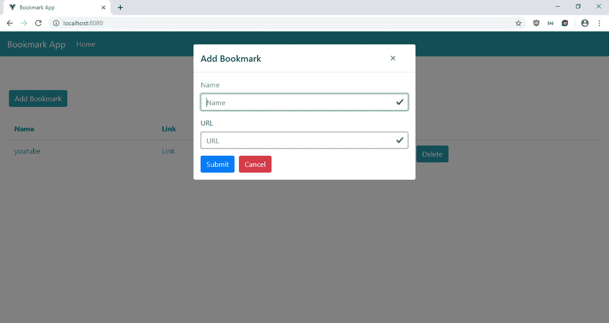
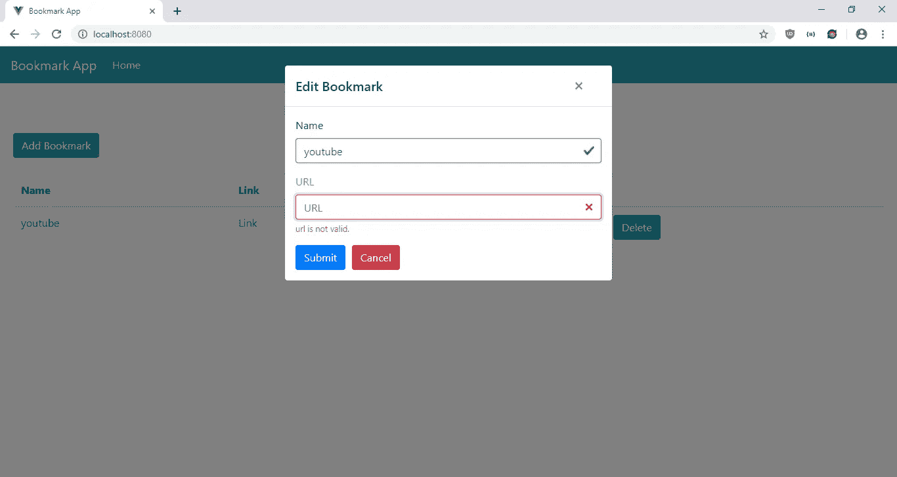
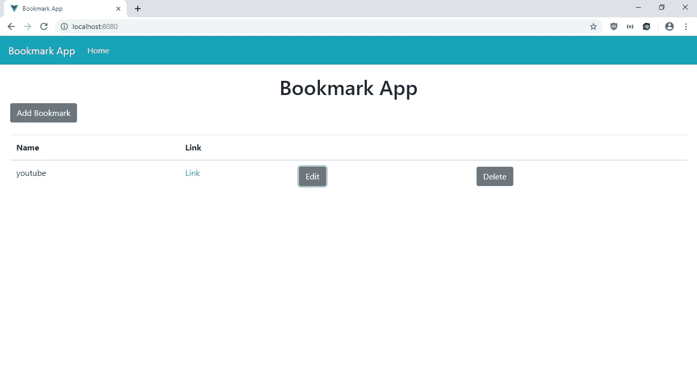

# 检查输入元素是否被 Vue-Focus 聚焦

> 原文：<https://javascript.plainenglish.io/check-if-an-input-element-is-focused-with-vue-focus-c91b07075bec?source=collection_archive---------1----------------------->

为了让应用程序的用户体验更好，当输入元素被聚焦时，通常你必须做一些事情。例如，您可能希望在输入获得焦点时突出显示输入的标签，以便用户知道他们正在填写哪个字段。使用 Vue.js，最简单的方法是使用 Vue-Focus 库来完成这项工作。它提供了一个指令和 mixin，允许您处理聚焦和模糊事件，并将其绑定到组件的数据字段。

在本文中，我们将制作一个网站书签管理器应用程序，让用户为他们喜欢的 URL 添加书签。当输入成为焦点时，标签将突出显示。为了开始构建项目，我们通过运行以下命令来运行 Vue CLI:

```
npx @vue/cli create bookmark-app
```

当向导运行时，我们选择“手动选择功能”，并选择 Babel、CSS 预处理器、Vuex 和 Vue 路由器。

接下来，我们安装一些软件包。我们需要 Axios 向我们的后端发出 HTTP 请求，Bootstrap-Vue 用于样式化，Vee-Validate 用于表单验证，Vue-Focus 用于处理输入的焦点状态。为了安装包，我们运行`npm i axios bootstrap-vue vee-validate vue-focus`。安装软件包后，我们可以开始构建我们的书签应用程序。

首先，我们创建表单让用户添加和编辑他们的账单。在`components`文件夹中，创建一个名为`BookmarkForm.vue`的文件，并添加:

```
<template>
  <ValidationObserver ref="observer" v-slot="{ invalid }">
    <b-form [@submit](http://twitter.com/submit).prevent="onSubmit" novalidate>
      <b-form-group>
        <ValidationProvider name="name" rules="required" v-slot="{ errors }">
          <label :class="{'highlight': nameFocused}">Name</label>
          <b-form-input
            type="text"
            v-model="form.name"
            placeholder="Name"
            name="name"
            [@focus](http://twitter.com/focus)="nameFocused = true"
            [@blur](http://twitter.com/blur)="nameFocused = false"
            v-focus="nameFocused"
            :state="errors.length == 0"
          ></b-form-input>
          <b-form-invalid-feedback :state="errors.length == 0">Name is requied.</b-form-invalid-feedback>
        </ValidationProvider>
      </b-form-group> <b-form-group>
        <ValidationProvider name="url" rules="required|url" v-slot="{ errors }">
          <label :class="{'highlight': urlFocused}">URL</label>
          <b-form-input
            type="text"
            :state="errors.length == 0"
            v-model="form.url"
            required
            placeholder="URL"
            name="url"
            [@focus](http://twitter.com/focus)="urlFocused = true"
            [@blur](http://twitter.com/blur)="urlFocused = false"
            v-focus="urlFocused"
          ></b-form-input>
          <b-form-invalid-feedback :state="errors.length == 0">{{errors.join('. ')}}</b-form-invalid-feedback>
        </ValidationProvider>
      </b-form-group> <b-button type="submit" variant="primary" style="margin-right: 10px">Submit</b-button>
      <b-button type="reset" variant="danger" [@click](http://twitter.com/click)="cancel()">Cancel</b-button>
    </b-form>
  </ValidationObserver>
</template><script>
import { focus } from "vue-focus";
import { requestsMixin } from "@/mixins/requestsMixin";export default {
  name: "BookmarkForm",
  mixins: [requestsMixin],
  directives: { focus },
  props: {
    bookmark: Object,
    edit: Boolean
  },
  methods: {
    async onSubmit() {
      const isValid = await this.$refs.observer.validate();
      if (!isValid) {
        return;
      }if (this.edit) {
        await this.editBookmark(this.form);
      } else {
        await this.addBookmark(this.form);
      }
      const { data } = await this.getBookmarks();
      this.$store.commit("setBookmarks", data);
      this.$emit("saved");
    },
    cancel() {
      this.$emit("cancelled");
    }
  },
  data() {
    return {
      form: {},
      nameFocused: false,
      urlFocused: false
    };
  },
  watch: {
    bookmark: {
      handler(val) {
        this.form = JSON.parse(JSON.stringify(val || {}));
      },
      deep: true,
      immediate: true
    }
  }
};
</script><!-- Add "scoped" attribute to limit CSS to this component only -->
<style scoped lang="scss">
.highlight {
  color: #42b983;
}
</style>
```

该表单允许用户使用给定的关键字搜索菜肴，然后返回菜肴的配料列表，然后用户可以将它们添加到删除重复项的列表中。我们使用 Vee-Validate 来验证我们的输入。我们使用`ValidationObserver`组件来监视组件内部表单的有效性，使用`ValidationProvider`来检查组件内部输入值的有效性规则。在`ValidationProvider`中，我们为文本输入字段提供了 BootstrapVue 输入。在`b-form-input`组件中。

我们还添加了 Vee-Validate 验证，以确保用户在提交之前已经填写了日期。我们使`name`和`url`字段成为`rules`道具中的必需字段，这样用户将不得不输入它们来保存账单。此外，我们定制了一个`url` Vee-Validate 验证规则来检查 URL 是否有效。

在输入中，我们使用 Vue-Focus 提供的`v-focus`指令来设置输入的焦点状态。我们将输入的焦点状态分别绑定到`nameFocused`和`urlFocused`变量。一旦用户将光标放在输入中，输入的标签将被突出显示，因为我们根据输入焦点的状态将`highlight`类设置为标签。

我们通过运行`this.$refs.observer.validate()`来验证`onSubmit`函数中的值。如果解析为`true`，那么我们运行代码，通过调用`if`块中的函数来保存数据，然后我们调用`getNotes`来获取注释。这些功能来自我们将要添加的`requestsMixin`。通过调用`this.$store.commit`将获得的数据存储在我们的 Vuex 存储中。

在这个组件中，我们还有一个`watch`块来观察`bill`值，该值是从我们必须构建的 Vuex 存储中获得的。随着`bill`值的更新，我们获得了最新的配料列表，这样当我们将这些值复制到`this.form`时，用户可以编辑最新的配料列表。

接下来，我们创建一个`mixins`文件夹，并将`requestsMixin.js`添加到`mixins`文件夹中。在文件中，我们添加了:

```
const APIURL = "[http://localhost:3000](http://localhost:3000)";
const axios = require("axios");export const requestsMixin = {
  methods: {
    getBookmarks() {
      return axios.get(`${APIURL}/bookmarks`);
    }, addBookmark(data) {
      return axios.post(`${APIURL}/bookmarks`, data);
    }, editBookmark(data) {
      return axios.put(`${APIURL}/bookmarks/${data.id}`, data);
    }, deleteBookmark(id) {
      return axios.delete(`${APIURL}/bookmarks/${id}`);
    }
  }
};
```

这些是我们在组件中使用的函数，用于向后端发出 HTTP 请求以保存书签。

接下来在`Home.vue`中，将现有代码替换为:

```
<template>
  <div class="page">
    <h1 class="text-center">Bookmark App</h1>
    <b-button-toolbar>
      <b-button [@click](http://twitter.com/click)="openAddModal()">Add Bookmark</b-button>
    </b-button-toolbar>
    <br />
    <b-table-simple responsive>
      <b-thead>
        <b-tr>
          <b-th>Name</b-th>
          <b-th>Link</b-th>
          <b-th></b-th>
          <b-th></b-th>
        </b-tr>
      </b-thead>
      <b-tbody>
        <b-tr v-for="b in bookmarks" :key="b.id">
          <b-td>{{b.name}}</b-td>
          <b-td>
            <a :href="b.url">Link</a>
          </b-td>
          <b-td>
            <b-button [@click](http://twitter.com/click)="openEditModal(b)">Edit</b-button>
          </b-td>
          <b-td>
            <b-button [@click](http://twitter.com/click)="deleteOnebookmark(b.id)">Delete</b-button>
          </b-td>
        </b-tr>
      </b-tbody>
    </b-table-simple> <b-modal id="add-modal" title="Add Bookmark" hide-footer>
      <BookmarkForm [@saved](http://twitter.com/saved)="closeModal()" [@cancelled](http://twitter.com/cancelled)="closeModal()" :edit="false"></BookmarkForm>
    </b-modal> <b-modal id="edit-modal" title="Edit Bookmark" hide-footer>
      <BookmarkForm
        [@saved](http://twitter.com/saved)="closeModal()"
        [@cancelled](http://twitter.com/cancelled)="closeModal()"
        :edit="true"
        :bookmark="selectedBookmark"
      ></BookmarkForm>
    </b-modal>
  </div>
</template><script>
// @ is an alias to /src
import BookmarkForm from "@/components/BookmarkForm.vue";
import { requestsMixin } from "@/mixins/requestsMixin";export default {
  name: "home",
  components: {
    BookmarkForm
  },
  mixins: [requestsMixin],
  computed: {
    bookmarks() {
      return this.$store.state.bookmarks;
    }
  },
  beforeMount() {
    this.getAllBookmarks();
  },
  data() {
    return {
      selectedBookmark: {}
    };
  },
  methods: {
    openAddModal() {
      this.$bvModal.show("add-modal");
    }, openEditModal(bookmark) {
      this.$bvModal.show("edit-modal");
      this.selectedBookmark = bookmark;
    }, closeModal() {
      this.$bvModal.hide("add-modal");
      this.$bvModal.hide("edit-modal");
      this.selectedBookmark = {};
      this.getAllBookmarks();
    }, async deleteOnebookmark(id) {
      await this.deleteBookmark(id);
      this.getAllBookmarks();
    }, async getAllBookmarks () {
      const { data } = await this.getBookmarks();
      this.$store.commit("setBookmarks", data);
    }
  }
};
</script>
```

这是我们在 BootstrapVue 表中显示账单的地方。这些列是名称、金额和截止日期，以及打开编辑模式的编辑按钮和单击时删除条目的删除按钮。

我们还添加了一个“添加账单”按钮来打开模式，让用户添加账单。通过运行`beforeMount`钩子中的`this.getAllBookmarks`函数从后端获取注释，钩子将数据存储在我们的 Vuex 存储中。

`openAddModal`、`openEditModal`、`closeModal`分别打开打开和关闭模态，关闭模态。当调用`openEditModal`时，我们设置`this.selectedBookmark`变量，这样我们可以将它传递给我们的`BookmarkForm`。

接下来在`App.vue`中，我们将现有代码替换为:

```
<template>
  <div id="app">
    <b-navbar toggleable="lg" type="dark" variant="info">
      <b-navbar-brand to="/">Bookmark App</b-navbar-brand><b-navbar-toggle target="nav-collapse"></b-navbar-toggle><b-collapse id="nav-collapse" is-nav>
        <b-navbar-nav>
          <b-nav-item to="/" :active="path  == '/'">Home</b-nav-item>
        </b-navbar-nav>
      </b-collapse>
    </b-navbar>
    <router-view />
  </div>
</template><script>
export default {
  data() {
    return {
      path: this.$route && this.$route.path
    };
  },
  watch: {
    $route(route) {
      this.path = route.path;
    }
  }
};
</script><style lang="scss">
.page {
  padding: 20px;
}button,
.btn.btn-primary {
  margin-right: 10px !important;
}.button-toolbar {
  margin-bottom: 10px;
}
</style>
```

在页面顶部添加一个引导导航条，并添加一个`router-view`来显示我们定义的路线。这个`style`部分没有限定范围，所以样式将适用于全球。在`.page`选择器中，我们给页面添加一些填充。我们在剩余的`style`代码中给按钮添加了一些填充。

然后在`main.js`中，将现有代码替换为:

```
import Vue from "vue";
import App from "./App.vue";
import router from "./router";
import store from "./store";
import BootstrapVue from "bootstrap-vue";
import { ValidationProvider, extend, ValidationObserver } from "vee-validate";
import { required } from "vee-validate/dist/rules";
import "bootstrap/dist/css/bootstrap.css";
import "bootstrap-vue/dist/bootstrap-vue.css";extend("url", {
  validate: value => {
    return /(https?:\/\/(?:www\.|(?!www))[a-zA-Z0-9][a-zA-Z0-9-]+[a-zA-Z0-9]\.[^\s]{2,}|www\.[a-zA-Z0-9][a-zA-Z0-9-]+[a-zA-Z0-9]\.[^\s]{2,}|https?:\/\/(?:www\.|(?!www))[a-zA-Z0-9]+\.[^\s]{2,}|www\.[a-zA-Z0-9]+\.[^\s]{2,})/.test(
      value
    );
  },
  message: "Invalid URL."
});
Vue.use(BootstrapVue);
Vue.component("ValidationProvider", ValidationProvider);
Vue.component("ValidationObserver", ValidationObserver);
extend("required", required);Vue.config.productionTip = false;new Vue({
  router,
  store,
  render: h => h(App)
}).$mount("#app");
```

我们在这里添加了我们需要的所有库，包括 BootstrapVue JavaScript、CSS 和 Vee-Validate 组件，以及用于通过检查给定的正则表达式来验证输入的 URL 是否有效的`required` 验证规则和`url` 规则。

在`router.js`中，我们将现有代码替换为:

```
import Vue from "vue";
import Router from "vue-router";
import Home from "./views/Home.vue";Vue.use(Router);export default new Router({
  mode: "history",
  base: process.env.BASE_URL,
  routes: [
    {
      path: "/",
      name: "home",
      component: Home
    }
  ]
});
```

将主页包含在我们的路线中，以便用户可以看到该页面。

在`store.js`中，我们将现有代码替换为:

```
import Vue from "vue";
import Vuex from "vuex";Vue.use(Vuex);export default new Vuex.Store({
  state: {
    bookmarks: []
  },
  mutations: {
    setBookmarks(state, payload) {
      state.bookmarks = payload;
    }
  },
  actions: {}
});
```

将我们的`bookmarks`状态添加到存储中，这样我们就可以在`BookmarkForm` 和`HomePage`组件的`computed`块中观察到它。我们有`setBookmarks` 函数来更新`notes` 状态，我们通过调用`this.$store.commit(“setBookmarks”, data);`在组件中使用它，就像我们在`BookmarkForm`和`HomePage`中所做的那样。

最后，在`index.html`中，我们将现有代码替换为:

```
<!DOCTYPE html>
<html lang="en">
  <head>
    <meta charset="utf-8" />
    <meta http-equiv="X-UA-Compatible" content="IE=edge" />
    <meta name="viewport" content="width=device-width,initial-scale=1.0" />
    <link rel="icon" href="<%= BASE_URL %>favicon.ico" />
    <title>Bookmark App</title>
  </head>
  <body>
    <noscript>
      <strong
        >We're sorry but vue-focus-tutorial-app doesn't work properly without
        JavaScript enabled. Please enable it to continue.</strong
      >
    </noscript>
    <div id="app"></div>
    <!-- built files will be auto injected -->
  </body>
</html>
```

更改我们应用程序的标题。

在所有的努力之后，我们可以通过运行`npm run serve`来启动我们的 app。

为了启动后端，我们首先通过运行`npm i json-server`来安装`json-server`包。然后，转到我们的项目文件夹并运行:

```
json-server --watch db.json
```

在`db.json`中，将文本改为:

```
{
  "bookmarks": []
}
```

所以我们有了在`requests.js`中定义的`bookmarks`端点。

经过所有的努力，我们得到了:

