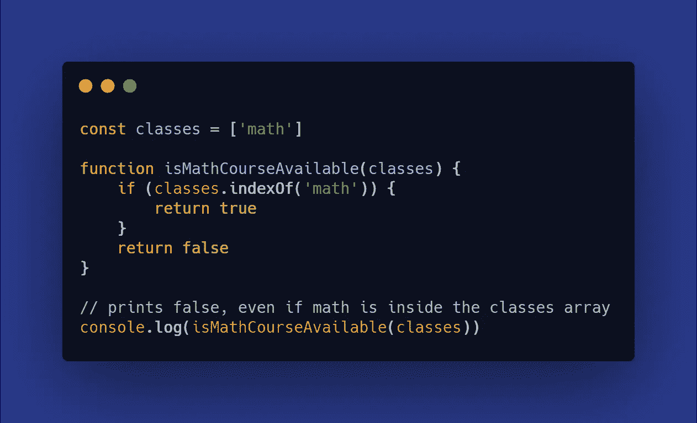
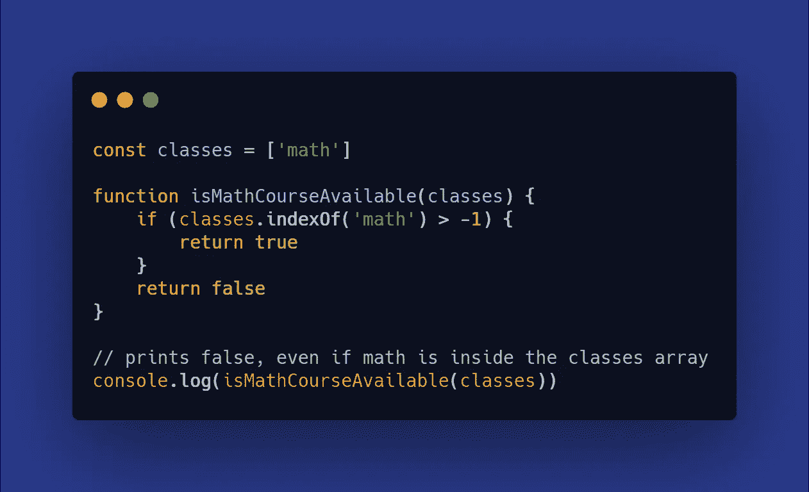
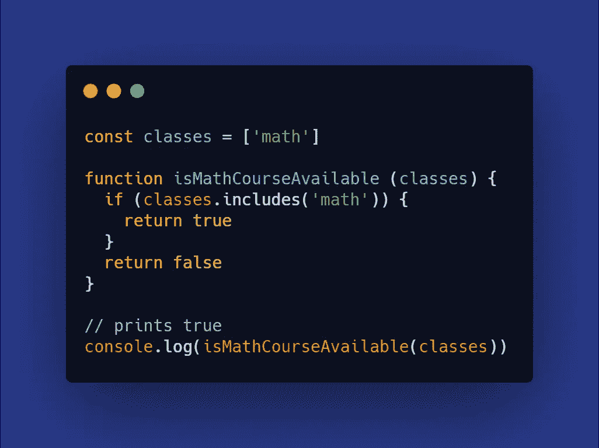

# 使用 Includes()检查数组中的值是否存在

> 原文：<https://javascript.plainenglish.io/checking-value-existence-in-an-array-with-includes-b1598142281?source=collection_archive---------8----------------------->

## 你每天做的事情可以做得更好

Camera Access. Source [Icons8](https://icons8.it/ouch/illustration/flame-camera-access).

**很容易错过做某事的捷径**。你可能会被日常任务包裹得太紧，以至于把日常问题变得过于复杂。考虑一下如何检查数组中值的存在。这可能是我想到的这种类型的*数据结构*最常见的操作之一。

## 过于复杂的任务

如果您已经在 JavaScript 世界呆了足够长的时间，您会知道测试数组中的数据存在性一直是一个笨拙的操作。对于一些人来说，依靠*索引*来测试它仍然很常见。例如，如果您想测试一个数组中是否存在一个*字符串*，您可以检查*字符串*是否有位置。如果该位置存在，您将获得该值的索引，这意味着它实际上是已处理数组的一部分。如果不是，你会得到`-1.`

在这种情况下，狡猾的问题是索引可以为零。而零在一个条件下将被计算为假。这意味着**在这种边缘情况下，存在将为真，但最终条件将评估为假**。

这是一个非常不幸的处境，对吗？您可以用如下稍微不同的条件来解决这个问题:

## 简化日常工作

但是说实话，为什么要把这样的任务复杂化。在 ES2017 中，一种叫做`includes()`的新方法通过一行程序解决了这个问题。这个方法检查一个值是否在一个数组中，如果是，它返回`true`。否则，如你所料，它将返回 false。所以你可以这样写前面的代码:

容易，更简洁，意图明确。这就是下次你写代码时，这个方法能为你做的。

## 结论

**编码时出现的小而不实际的错误会随着时间的推移而加剧**。今天或者明天都没关系。但是你会意识到代码库变得多么难以管理，久而久之。像这样改进的解决方案对于开发人员来说总是很好的建议和理想的实践。希望这是有帮助的！

— *皮耶罗*