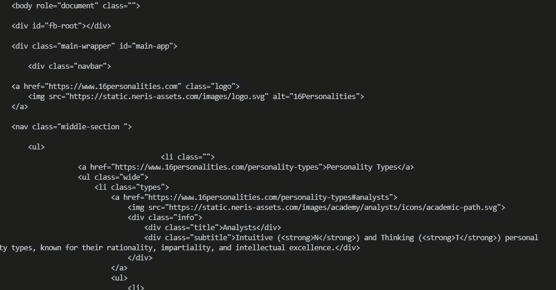
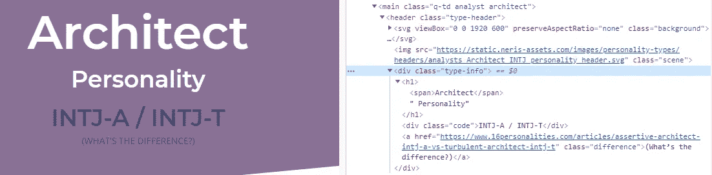
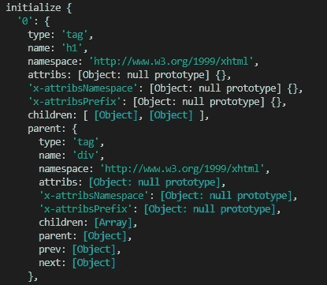
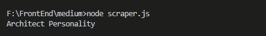
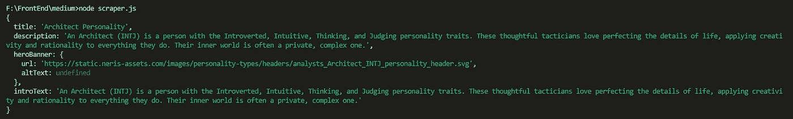

# 将 HTML 页面转换成 JSON 文件的 Cheerio 脚本

> 原文：<https://javascript.plainenglish.io/cheerio-script-for-turning-html-pages-into-json-files-8e9363106904?source=collection_archive---------1----------------------->

## 使用 Cheerio 和 Node.js 的 Web scraper


Photo by [Greg Rakozy](https://unsplash.com/@grakozy?utm_source=unsplash&utm_medium=referral&utm_content=creditCopyText) on [Unsplash](https://unsplash.com/s/photos/html?utm_source=unsplash&utm_medium=referral&utm_content=creditCopyText)

当您需要将内容从一个博客迁移到另一个博客时，您会怎么做？

理想情况下，[你使用一个 API](https://medium.com/frontend-digest/beginners-guide-to-apis-protocols-and-data-formats-f80cf7f30425) 。但是如果 origin blog 没有提供，您可能需要构建自己的脚本来抓取页面并以所需的格式获取所有内容。

如果您正在抓取具有相似结构的纯 HTML 页面，您可以使用 Cheerio 和 Node.js 来获取内容并将其作为 JSON 输出。

这并不是唯一的选择，但是如果您已经了解一些 JavaScript，并且没有处理动态内容，这可能是最简单的。对于抓取包含 JS 的更复杂的页面，您可能希望使用像 Puppeteer 这样的工具。

作为先决条件，您应该已经知道您希望 JSON 文件是什么样子，所以您应该在示例文件中有一个清晰的结构。没有这个，您将能够获得数据，但是当您需要重构时，事情会变得混乱。

# 什么是 Cheerio，它有什么作用？

[Cheerio](https://cheerio.js.org/) 解析 HTML 标记，并提供一个 API 来操作和遍历结果数据结构。由于它使用核心 jQuery 的子集，Cheerio 有一个熟悉的语法，因此对于初学者来说更容易使用。

该工具可以解析任何普通的 HTML 页面，因为它使用简单一致的 DOM 模型。操作快速高效，所以如果你只需要抓取内容，不需要应用 CSS 或者执行 JavaScript 代码，Cheerio 是一个非常好的选择。

# Web scraper 解析 HTML 并输出 JSON

对于这个演示，我将使用 Cheerio 构建一个简单的 web scraper，它从一个页面获取所有内容，并在同一个文件夹中输出一个 JSON 文件。

这意味着，我们实际上将创建一个新文件来保存这些数据，而不是仅仅在控制台中记录 JSON 数据，以便以后可以轻松地重用这些数据。

我将抓取的数据将来自[这一页](https://www.16personalities.com/intj-personality):


Image via [16personalities.com](https://www.16personalities.com/intj-personality)

**注**:搜集数据不是最道德的事情，所以我不鼓励你为了学习以外的目的去做这件事。当然，如果您正在创建一个用于迁移您自己的内容的脚本，这是一种不同的情况。

回到教程。我希望我的最终 JSON 文件具有以下结构:

```
const contentJSON = {
  title: '',
  description: '',
  heroBanner: {
    src: '',
    altText: '',
  },
  introText: '',
  artBody: {
    sections: '' // This will include all the body content
  },
};
```

## 安装依赖项

为了构建 scraper，我将不仅使用 Cheerio，还将使用`axios`作为依赖项，并且我将使用 [Node.js 文件系统模块](https://nodejs.dev/the-nodejs-fs-module)。

首先，创建一个新文件夹，用于存储本教程的所有文件。然后，打开 VSCode，在终端中运行下面的命令来初始化`npm.`

```
npm init // Press enter at every step to accept the default setup npm install 
```

您将看到创建了一个名为 node_modules 的新文件夹，以及两个文件:package.json 和 package-lock.json。

接下来，让我们通过运行以下命令来安装依赖项:

```
npm install cheerio axios
```

`Axios`是一个让 [HTTP 请求](https://medium.com/@andreea.macoveiciuc/beginners-guide-to-apis-protocols-and-data-formats-f80cf7f30425)的包。至于 Node.js 文件系统模块，如果您安装了 Node，就可以使用它了。我们将需要这个模块能够创建新的文件，将存储抓取的内容。

# 建造 Cheerio 铲运机

在项目文件夹中，创建一个名为`scraper.js`的新文件。在内部，添加以下代码:

```
const axios = require('axios');
const cheerio = require('cheerio');const url = '[https://www.16personalities.com/intj-personality](https://www.16personalities.com/intj-personality)';
```

现在，我们将启动 Axios 调用，从目标 URL 获取信息:

```
axios.get(url).then( res => { console.log(res.data) })
```

Axios 将进行 HTTP 调用，然后当它得到响应时，它将执行在`res`之后的代码。现在，我们只是访问`res`或响应对象，并检索服务器发回的数据。

一旦我们保存了文件，我们就可以运行这个脚本来查看我们是否得到了任何数据。为此，请在终端中键入以下命令:

```
node scraper.js
```

你现在应该看到控制台中记录了很多代码，如下所示:



这实际上没有什么帮助，因为我们想要更多的结构化内容，然后我们可以用一种易于处理的格式输出。

让我们调整我们的代码。首先，我们需要将数据加载到一个变量中，这样我们就可以轻松地使用 Cheerio 方法来遍历和操作它。

```
axios.get(url).then((res) => {
  const $ = cheerio.load(res.data);
});
```

现在让我们看看原始页面，看看我们如何能够挂钩到我们想要拉的元素。

挂钩 DOM 和检索数据的最简单的方法是查找 id 或类，但是您也可以使用简单的选择器，如用于标题的`<h1>`等等。让我们检查一下这个页面，看看我们能使用什么。



对于页面标题，我可以拉出位于`div class="type-info"`元素内部的`h1`标签。

我将把我想要的 JSON 数据与抓取的页面中的元素进行映射，这样可以更容易地编写脚本，而不必每次都检查每个元素。

*   标题:将在`<div class=”type-info”>`中使用`h1`
*   描述:将在`<div class=”definition”>`中使用第二个`p`标签
*   heroBanner:将在`<header class=”type-header”>`中使用第一个`img`标签
*   introText:将使用与描述相同的文本，因为描述内容将仅在迁移期间用作元描述
*   sections:将对页面上的每个部分使用第一个`p`和第一个`h2` 。这些部分都以 `h2`开始，后面跟着一个`p`标签，除了第一段，它是在`<blockquote>`标签下面的第一个 `p`

我们准备好创建我们的脚本了！这是我们到目前为止所拥有的:

```
const axios = require("axios");
const cheerio = require("cheerio");const url = "[https://www.16personalities.com/intj-personality](https://www.16personalities.com/intj-personality)";axios.get(url).then((res) => {
  const $ = cheerio.load(res.data);
});
```

我们的`html`主体被加载到 `$ variable`中，因此为了在其上使用任何方法，我们将调用这个变量。Cheerio 使用 jQuery 语法，所以我们可以使用任何已知的方法。

让我们首先抓取标题并将其记录在控制台中，看看它是否工作正常。在`const $`行的正下方添加代码。

```
console.log($(".type-info").find("h1"));
```

如果我们现在使用命令`node script.js`运行脚本，我们又会得到一些不太有用的数据:



为了提取实际的标题内容，我们需要调整上面的行，如下所示:

```
axios.get(url).then((res) => {
  const $ = cheerio.load(res.data);console.log($(".type-info").find("h1").text());
});
```

现在，我们应该看到控制台中记录的标题:



太好了，现在我们知道脚本正在运行，所以我们将构建其余的 scraper，然后再次记录它。在我们得到所有想要的内容后，我们将使用文件系统创建一个新文件，并在那里输出 JSON 数据。

```
axios.get(url).then((res) => {
  const $ = cheerio.load(res.data);const artTitle = $(".type-info").find("h1").text();
  const artDescription = $(".definition").find("p").next();
  const heroBanner = $("header[class='type-header']").find(
    "img"
  );
  const artIntro = artDescription;// Our JSON outputconst contentJSON = {
    title: artTitle.trim(),
    description: artDescription.text().trim(),
    heroBanner: {
      url: heroBanner.attr("src"),
      altText: heroBanner.attr("alt"),
    },
    introText: artIntro.text().trim(),
    // artBody: {
    //   sections: getSections(),
    // },
  };console.log(contentJSON);
});
```

如果我们运行这段代码，我们会在控制台中得到以下内容:



完美，现在我来快速解释一下上面的代码。

```
const artTitle = $(".type-info").find("h1").text();// This searches inside the html body an element with the class type-info, then inside it, the first h1, and pulls only the text, not the full html code.const artDescription = $(".definition").find("p").next();// This looks at the element with the class definition, finds the first p, then pulls the next one. So basically it gets the second paragraph. const heroBanner = $("header[class='type-header']").find("img");// This searches for the header tag which has the class type-header, and inside it, finds the img element.const artIntro = artDescription;// This reuses the artDescription variable that we defined above.
```

在 contentJSON 对象中，我们有以下内容:

```
title: artTitle.trim(),
    description: artDescription.text().trim(),
    heroBanner: {
      url: heroBanner.attr("src"),
      altText: heroBanner.attr("alt"),
    },
    introText: artIntro.text().trim(),
```

`trim()`方法删除文本周围的任何空白，只返回文本本身。

`.attr(‘src’)`和`.attr(‘alt’)`方法搜索 heroBanner 变量存储的`img`标签中的属性。

现在更具挑战性的部分来了。如果可能的话，我们希望以更自动化的方式检索其余的内容，这样我们就不必重复编写相同的代码五次。

让我们试着创建一个循环遍历 body 元素的函数，每当它发现一个`h2` 标记时，它就在 JSON 对象中创建一个带有关键字‘heading’的条目。

我们将对所有段落做同样的事情:我们将遍历正文，对于找到的每个段落，我们将在 JSON 对象中推入一个“text”键，以及它各自的值。

```
const getSections = function () {
 const sectionTexts = []; const artBody = $("article").children(); artBody.each((i, element) => {
    const heading = $(element).filter("h2").text().trim();
    const text = $(element).filter("p").text().trim();
    const img = $(element).filter("img");
    const quote = $(element).find(".description - pullout").first(); if (text) {
      sectionTexts[i] = {
        text: text,
      };
    } else if (heading) {
      sectionTexts[i] = {
        heading: heading,
      };
    } else if (img) {
      sectionTexts[i] = {
        image: img.attr("src"),
        altText: img.attr("alt"),
      };
    } else if (quote) {
      sectionTexts[i] = {
        quote: quote,
      };
    }
  });return sectionTexts;
};
```

现在我们需要在最终的 contentJSON 对象中输出所有这些内容:

```
const contentJSON = {
  title: artTitle.trim(),
  description: artDescription.text().trim(),
  heroBanner: {
    url: heroBanner.attr("src"),
    altText: heroBanner.attr("alt"),
  },
  introText: artIntro.text().trim(),
  artBody: getSections(),
};
```

最后，让我们添加创建新文件的代码，在该文件中添加我们收集的数据:

```
const artFinal = JSON.stringify(contentJSON);
const filename = artTitle.slice(0, 9).trim() + ".json";
fs.writeFileSync(filename, artFinal);
```

为了实现这一点，我们还需要在开头添加这一行:

```
const fs = require('fs');
```

我们的最终代码如下所示:

```
const axios = require("axios");
const cheerio = require("cheerio");
const fs = require("fs");const url = "[https://www.16personalities.com/intj-personality](https://www.16personalities.com/intj-personality)";axios.get(url).then((res) => {
  const $ = cheerio.load(res.data);const artTitle = $(".type-info").find("h1").text();
  const artDescription = $(".definition").find("p").next();
  const heroBanner = $("header[class='type-header']").find("img");
  const artIntro = artDescription;const getSections = function () {
    const sectionTexts = [];const artBody = $("article").children();artBody.each((i, element) => {
      const heading = $(element).filter("h2").text().trim();
      const text = $(element).filter("p").text().trim();
      const img = $(element).filter("img");
      const quote = $(element).find(".description - pullout").first();if (text) {
        sectionTexts[i] = {
          text: text,
        };
      } else if (heading) {
        sectionTexts[i] = {
          heading: heading,
        };
      } else if (img) {
        sectionTexts[i] = {
          image: img.attr("src"),
          altText: img.attr("alt"),
        };
      } else if (quote) {
        sectionTexts[i] = {
          quote: quote,
        };
      }
    });return sectionTexts;
  };// Our JSON outputconst contentJSON = {
    title: artTitle.trim(),
    description: artDescription.text().trim(),
    heroBanner: {
      url: heroBanner.attr("src"),
      altText: heroBanner.attr("alt"),
    },
    introText: artIntro.text().trim(),
    artBody: getSections(),
  };const artFinal = JSON.stringify(contentJSON);
  const filename = artTitle.slice(0, 9).trim() + ".json";
  fs.writeFileSync(filename, artFinal);
});
```

如果您现在在终端中运行命令`node scraper.js`，您应该看到在您的项目文件夹中创建了一个名为 `Architect.json`的新文件。打开文件，您应该会找到您的 JSON 数据。

我希望你喜欢这个，并祝你好运创造自己的刮刀！

## **简明英语团队的笔记**

你知道我们有四种出版物吗？给他们一个关注来表达爱意:[**JavaScript in Plain English**](https://medium.com/javascript-in-plain-english)[**AI in Plain English**](https://medium.com/ai-in-plain-english)[**UX in Plain English**](https://medium.com/ux-in-plain-english)[**Python in Plain English**](https://medium.com/python-in-plain-english)**——谢谢，继续学习！**

**我们还推出了一个 YouTube，希望你能通过 [**订阅我们的英语频道**](https://www.youtube.com/channel/UCtipWUghju290NWcn8jhyAw) 来支持我们**

**一如既往,“简明英语”希望帮助推广好的内容。如果您有一篇文章想要提交给我们的任何出版物，请发送电子邮件至[**submissions @ plain English . io**](mailto:submissions@plainenglish.io)**，并附上您的媒体用户名和您感兴趣的内容，我们将会回复您！****