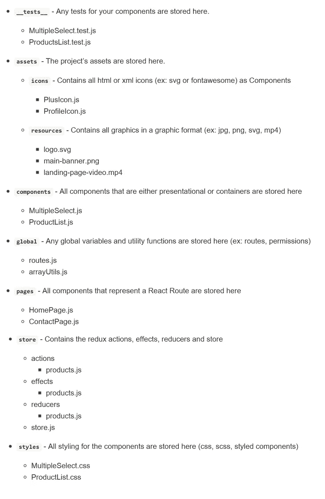
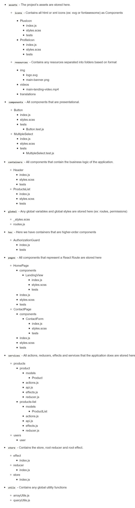
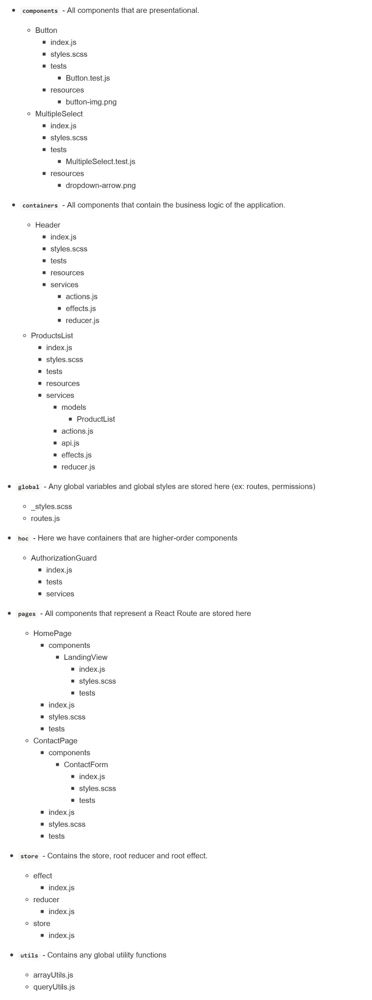

# 为 React 应用程序选择最佳的文件夹结构

> 原文：<https://javascript.plainenglish.io/choosing-the-best-folder-structure-for-your-react-application-cba4885b3a2?source=collection_archive---------1----------------------->

我们可能都已经知道，与 Angular 不同，在 Angular 中，我们已经有了一种预定义的结构化文件的方式，在 React 中，这种负担或天赋，取决于您如何看待它，是赋予我们这些勇敢的开发人员的。

现在，我选择把它当作一份礼物。让我解释一下原因。

在构建 React 应用程序时，我们都有不同的目标和需求。有时我们正在构建一个小的应用程序，比如概念验证，在这种情况下，我们喜欢的是速度和简单性。在其他情况下，我们正在构建中型应用程序，在这种情况下，我们想要的是扩展它们的可能性。当然，有时我们中的一个人可能会参与构建一个巨大的应用程序，有成千上万个组件，在这种情况下，我们最重视的一件事就是可维护性。

现在我们知道我们在不同的时间可能有不同的需求，通过自由选择我们自己的 React 文件夹结构，我们可以调整我们的应用程序以适应我们的需求。这就是为什么我认为这是一个礼物。

现在，最后来回答让你打开这篇博客的问题——React 应用程序的最佳文件夹结构根据应用程序的大小和需求而不同。

哇，多么曲折的情节啊。但是，我相信你是一个聪明的开发人员，你已经看到了这一点。然而，现在又出现了另一个问题——对于小型、中型和大型应用程序来说，什么是最佳的文件夹结构？根据我所遇到的和我所看到的——我会告诉你我目前对这个问题的想法，但是，我想让你知道这是一件不确定的事情，你应该总是寻找定制和改进的东西，以便它们最适合你的特定需求。好吗？太好了，我们开始吧。

**小应用**

下面是一个文件夹结构的例子，它可以满足小型 React 应用程序的需要。

Small React application folder structure example

由于在一个小的应用程序中，我们不需要处理很多组件，所以将东西放在共享文件夹中是非常直接和简单的。开发人员只需打开一个文件夹，就可以轻松查看应用程序中与该文件夹对应的所有文件。这促进了速度和简单性。这正是我们建造小东西时所需要的！

然而，正如您所猜测的，如果我们开始增加组件的数量，这种精确的文件夹结构将开始难以维护，并且查找东西将变得更加困难，因为组件和它的样式是分离的，操作和 reducers 是分离的，等等。

这就是为什么我们需要为中型应用程序使用更具互联性的东西。

**媒体应用**

这是一个文件夹结构的例子，它可以做到这一点，并且更具可伸缩性。

Medium React application folder structure example

正如我们所看到的，这种结构比前一种要复杂得多(简单和快速)，但是我们得到的是高可伸缩性和更好的可维护性。

我想和你讨论一些要点，这样我们就可以解释我们在图像中看到的一些东西。

其中一个明显的变化是，现在我们将组件存储在它自己的文件夹中，所有与它相关的样式和测试都存储在那个文件夹中。每当有人打开一个组件的文件夹时，他们可以在那里找到与之相关的所有内容，因此拥有大量组件不会对可维护性产生负面影响。

另一个有趣的变化是，现在组件可以有一个名为“组件”的子文件夹，这样做的原因是，如果我们想将一个组件拆分为多个组件，以提高人类的理解能力，我们可以通过嵌套它们来轻松实现。

此外，所有与相同特征或对象一起工作的减少器、动作和效果现在被分组在一起，因为它们是相关的，这样它们更容易被找到和维护。

这种文件夹结构具有高度的可伸缩性和可维护性，但是，如果我们需要处理一个具有数千个组件的大型应用程序，有一种方法可以进一步提高可维护性！

**巨大的应用**

这是一个文件夹结构的例子，可以用于一个巨大的 React 应用程序。

Gigantic React application folder structure example

正如您在这里看到的，每个组件都包含它在文件夹中使用的所有资源和服务。每个组件都有自己独立的模块。你可能会猜到这对大型应用程序来说有多有用，也更容易维护，但这样的文件夹结构是有代价的，为了确保整个应用程序的可重用性，我们真的需要考虑如何构建和组织我们创建的组件。

现在我们已经看了一些如何构建下一个 React 应用程序的例子，我想让你知道没有什么比实验更好的了。我鼓励你以此为例，从不同的资源中获取一些信息，创建自己的文件夹结构模式。

还有，在你走之前，我想给你一样东西。因为我们大多数人构建的 React 应用程序属于中等规模，所以我在 GitHub 上创建了一个 React 样板应用程序，您可以使用它来快速引导您的下一个应用程序，并立即开始入侵。它使用一个文件夹结构作为中等大小的示例，它安装并设置了所有经典的依赖项，如 Redux、React 路由器、Axios，它有一个很好的 ESLint 配置，配置有详细的文档说明文件夹结构、约定、使用的依赖项以及如何开始。基本上你需要的一切，以便立即开始，不浪费时间。

您可以在这里找到 Javascript 版本[，在这里](https://github.com/FilipPano/react-boilerplate)找到 Typescript 版本[。](https://github.com/FilipPano/react-typescript-boilerplate)

祝你好运，黑客快乐！