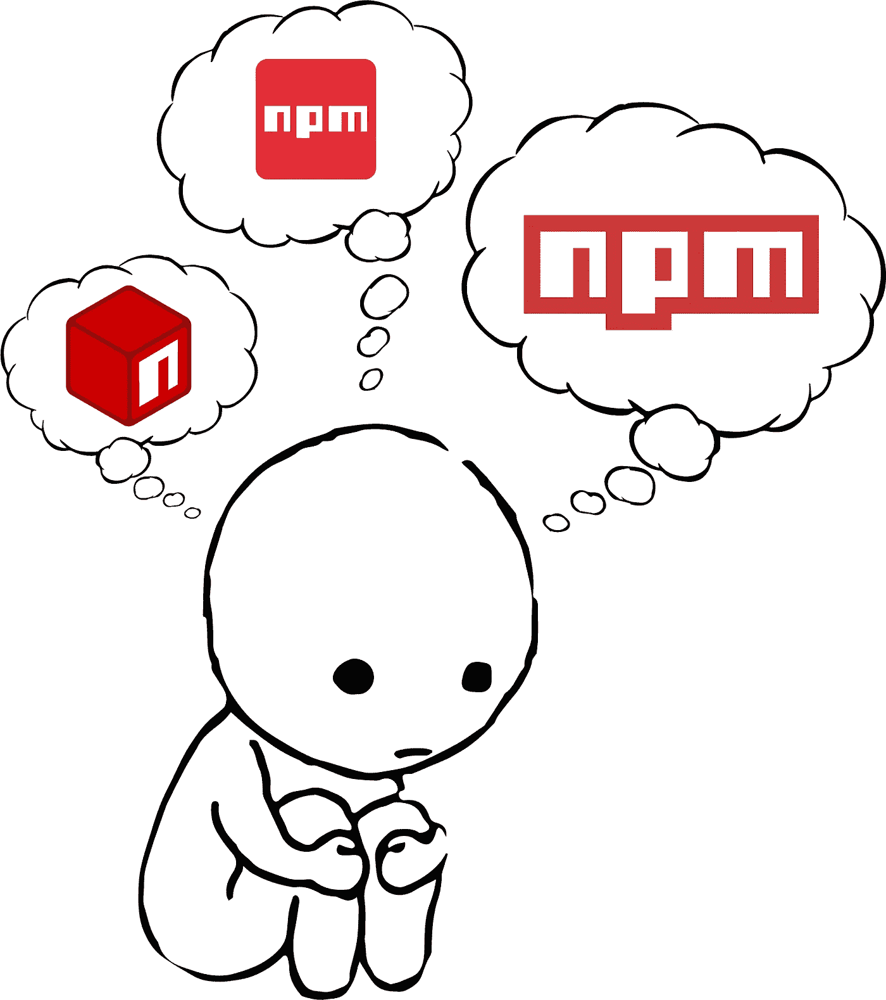

# 选择“正确的”NPM 套餐

> 原文：<https://javascript.plainenglish.io/choosing-the-right-npm-package-eefd46e66e75?source=collection_archive---------6----------------------->

deciding is hard…

最近，我正在开发一个新的定制包，我需要一个美国各州的列表来填充地址表单中的州字段。也许最直接的方法是[去维基百科](https://en.wikipedia.org/wiki/List_of_states_and_territories_of_the_United_States)手动编辑我们的列表。然而，如果你想一想，这是一个如此普通的任务，几乎可以肯定，某个程序员已经为我们解决了这个问题。果不其然，[简短的谷歌搜索](https://www.google.com/search?q=npm+list+of+us+states)会产生几个看起来很有希望的包:

*   [美国各州](https://www.npmjs.com/package/usa-states)
*   [美国州代码](https://www.npmjs.com/package/us-state-codes)
*   [状态列表](https://www.npmjs.com/package/state-list)

但是怎么挑呢？NPM 没有任何质量控制。实际上任何人在任何时候都可以发布一个包，而且它[中甚至不需要有任何运行代码](https://www.npmjs.com/package/empty-npm-package)！因此，作为一名开发人员，由您自己来决定这些包是否能满足您的需求。以下是我在做出此类决定时通常会考察的软件包的特性:

*   **它是什么时候发布的，多久更新一次？**
    软件包的版本号和上次发布时间列在 NPM 软件包页面的顶部。一般来说，任何超过一年没有更新的东西都应该被怀疑。(然而，对于美国的州数据，实际的州列表已经有一段时间没有真正改变了，所以在这种特殊情况下，这可能不是问题。)
*   还有多少人在使用它？每个 NPM 页面都显示了一个包下载历史的迷你图。如果一个包每周被持续下载数百或数千次，很有可能许多其他开发人员已经发现它足够健壮和可靠，可以包含在他们的包中。如果*非常新，即在过去几个月内第一次发布，我只会考虑下载量很少的包。*
*   *文档有多好？
    好的包有好的文档。NPM 页面(反映了软件包通常所在的 GitHub repo 的自述文件)通常会解释软件包是什么、如何安装、如何使用，并给出常见使用场景的清晰示例。有时我会使用一个迫使我钻研源代码的包来学习如何使用它，但并不经常。*
*   ***维护人员对支持请求的响应速度如何？**
    最后，我将前往维护包的 GitHub repo，查看“问题”和“拉请求”公开发行与关闭发行的比率是多少？维护人员对问题或错误报告的反应有多快？他们对来自社区的拉取请求的响应速度有多快？他们对发布问题和 pr 的人有礼貌吗？你也可以在栈溢出上搜索这个包，看看是否有问题在那里得到回答。*

*这些标准都不是绝对的。在做出决定之前，你必须把它们都考虑进去。对于一个简单的包，比如提供美国各州的列表，你不会真的认为会有很多问题。同样，代码可能非常简单，如果有一段时间没有升级，这就不是问题。在[美国州代码](https://www.npmjs.com/package/us-state-codes)的情况下，他们的迷你图显示一段时间内他们每周获得大约 20，000+的下载量(DPW)(这是一个很大的数字)！这在 2018 年 10 月突然开始，在 2019 年 2 月突然结束。我真的不知道为什么。从那以后，他们一直得到 3000 DPW。这仍然是相当可观的，比美国各州得到的大约 2000 DPW 还要多。另一方面， [state-list](https://www.npmjs.com/package/state-list) 每周仅获得约 3 次下载，从未超过 25 次。这可不好。*

*综上所述，[美国州码](https://www.npmjs.com/package/usa-states)比[美国州码](https://www.npmjs.com/package/us-state-codes)有更清晰的文档，提供了更接近我们实际需要的东西。另外，usa-states 提供了 TypeScript 类型声明，这很好，因为我们正在使用 TypeScript 进行开发。如果一个包每周有几千次下载，你可以有一定的信心，即使最初的开发者/维护者决定放弃这个包，它也足够重要到需要*某个人*接管维护并让它继续存在。这可能是最重要的事情。在这种情况下，无论如何，这足以让我忽略这样一个事实:usa-states 目前的版本号是一个非常低的 v0.0.5，而且已经近 2 年没有更新了。*

*最后要考虑的是包裹重量。您计划使用的软件包有多大(kb )?你打算使用足够的 it 功能来证明让使用你的包的人也下载*包的合理性吗？在美国各州的情况下，[估计的下载大小只有 1.8kb](https://bundlephobia.com/result?p=usa-states@0.0.5) (minified，gzipped)，非常小。如果一个包达到几十或几百 kb，您可能需要考虑在您自己的包中手工重新实现您需要的部分。**

# *即使这样…*

*很容易犯错误。我最终在我的项目中使用了 usa-states，并且很快发现那些 TypeScript 类型声明(你知道，我选择这个的主要原因之一)是*错误的*。甚至有[对回购的 pull 请求，更新类型以修复坏的类型](https://github.com/nathanbarrett/usa-states/pull/1)。公关甚至被合并了。不幸的是，软件包所有者没有采取最后一步，即在 NPM 库中更新软件包。😞也就是说，为这个包修补 TypeScript 定义仍然比从头重新实现我自己的解决方案更容易、更快(但可能不会太快)。我仍然很感激那些慷慨地拿出时间、精力和专业知识与我分享他们的解决方案的开发人员。*

# *所以…*

*随着全球可用的开源软件包库变得越来越大，美国开发者不互相借鉴将是疯狂的。正如艾萨克·牛顿的名言，“我们只是站在巨人的肩膀上。”只是要小心你选择的“巨人”！*