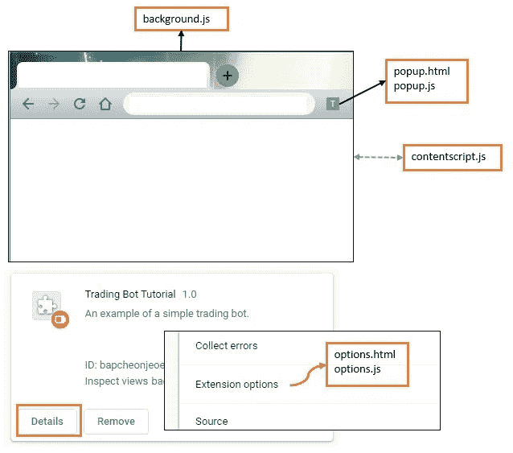
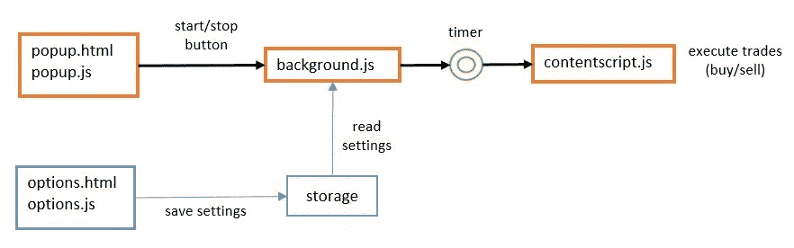
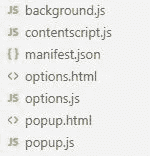
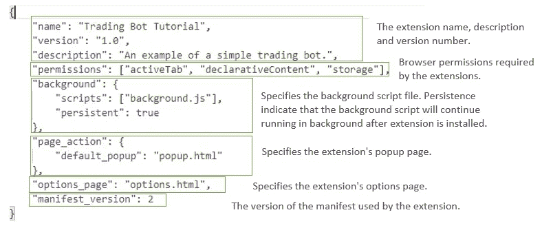
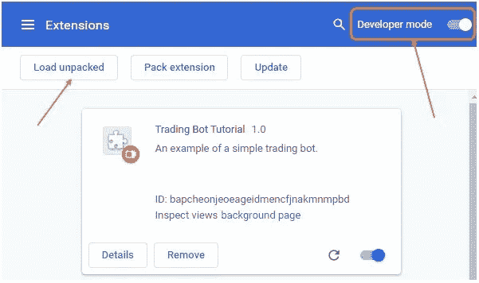
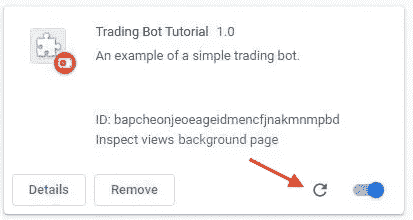
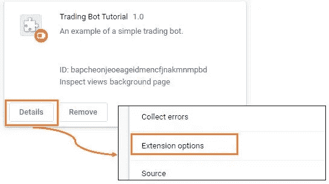
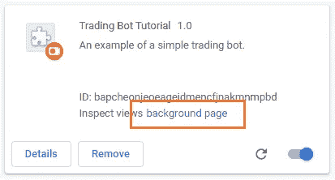

# Chrome 扩展:构建一个简单的加密交易机器人

> 原文：<https://javascript.plainenglish.io/chrome-extension-building-a-simple-crypto-trading-bot-8126ebd4fbf9?source=collection_archive---------2----------------------->

## 了解如何在 Google Chrome Extension 上创建 web 自动化。


Photo by [Negative Space](https://www.pexels.com/@negativespace) via [Pexels](https://www.pexels.com)

这是一个循序渐进的指南，将告诉你如何建立一个真正的加密交易机器人。完成本教程后，你还将学习如何使用 Chrome Extension 来自动化网站上的某些任务。

由于我们需要看到我们的交易机器人在运行，我决定最好的方法是在一个真正的平台上运行它。对于这个例子，我们将编码我们的交易机器人在一个模拟的加密交易网站上运行: [https://bitcoinhero.me](https://bitcoinhero.me/) 。

> 注意:我和 bitcoinhero 没有任何关系。我只是把这个网站作为一个例子，因为它不需要注册就可以使用——这使得这个指南更容易理解。

**扩展的完整源代码可以在这里找到:**【https://github.com/jnlewis/trading-bot-tutorial】T4

# Chrome 扩展概述

在我们开始之前，让我们快速浏览一下 chrome 扩展是如何工作的。



The different components of a Google Chrome extension

组成扩展的主要文件有 5 个:

*   ***manifest.json*** —这是描述您的扩展和运行扩展所需资源的清单文件。所有的 Chrome 扩展都以这个文件开始。
*   ***background . js***—加载扩展时运行的主脚本文件。背景没有页面或用户界面。
*   ***popup.html/popup.js***—用户与扩展交互的页面。
*   ***options.html/options.js***—这是可从扩展选项菜单访问的扩展配置页面。
*   ***content script . js***—这是将在目标页面上执行的脚本。您将看到我们如何定制这个脚本来执行我们的交易操作。

# 交易机器人技术设计



Trading bot process flow

这是我们简单的交易机器人的流程图。既然我们已经有了一个粗略的设计，让我们开始实施吧。

> 注意:研究本指南中的每一个代码片段以理解机器人如何在幕后工作是很重要的。

# 创建扩展

1.  为您的扩展创建一个新文件夹，然后在该文件夹中创建以下文件(暂时保留其内容为空):



Chrome extension source files

2.编辑 **manifest.json** 文件，添加以下内容。

File content: manifest.json

*下面是上面配置中每一行的快速分解:*



3.编辑 **background.js** 文件，替换为以下内容。这将仅在我们浏览页面 *bitcoinhero.me* 时启用我们的扩展。

File contents: background.js

4.打开**popup.html**和 **popup.js** 文件，替换为以下标记:这将添加两个启动和停止交易机器人的按钮，以及一个显示状态的标签。

File contents: popup.html

File contents: popup.js

4.我们的扩展部分完成了。我们现在可以在 Chrome 中加载并首次运行它。

# 安装延伸部分

1.  通过导航到 *chrome://extensions/* 打开谷歌浏览器中的**扩展**页面
2.  启用**开发者模式**，然后点击**加载解包**按钮，如下图截图所示。选择要加载的扩展文件夹。



Installing the extension

3.我们的扩展现在已经安装好了！导航到 trading simulator 网站 [https://bitcoinhero.me](https://bitcoinhero.me/) ，我们应该看到地址栏旁边启用了扩展图标。


The extension icon is now clickable

4.单击扩展图标打开我们之前准备的 popup.html 页面。摆弄开始和停止按钮，查看状态标签的变化。

# 添加交易机器人功能

既然我们已经建立并运行了我们的扩展，是时候开始实现交易机器人了。

1.  编辑**popup.js** 文件，将其所有内容替换为以下代码:

File contents: popup.js

> 注意，这次我们在开始和停止按钮点击事件中做了一些不同的事情。我们使用 sendMessage 向 background.js 脚本发送指令。这将让我们的 background.js 脚本执行必要的操作。

2.编辑 **background.js** 文件，并用以下代码替换其所有内容。注意这里我们添加了一个定时器，每 5 秒触发一次，在目标网站上执行 *contentscript.js* 。

File contents: background.js

3.现在编辑 **contentscript.js** 文件，并添加将在目标页面上运行的代码。

File contents: contentscript.js

该脚本所做的是在每次执行时决定是进入交易位置(买入)还是退出位置(卖出)。

4.你们都完了。刷新扩展，重新加载交易网站。点击我们扩展中的开始按钮，几秒钟后它将执行交易。



Refresh extension button

此时，我们简单的交易机器人已经可以工作了。请参阅下一节，了解我们如何进行一些改进。

> 因为我们的 bot 需要在最小化浏览器后继续运行，所以我们从 background.js 而不是 popup.js 文件中触发内容脚本。这是因为安装扩展后，后台脚本在后台持续保持活动状态，而 popup.js 仅在弹出窗口可见时才处于活动状态。

# 使交易区间可配置

这就是我们将利用本教程开始时创建的**options.html**文件的地方。

启动选项页面；在 *chrome://extensions/* 导航到扩展页面，然后在交易机器人教程扩展上——点击细节>扩展选项。



Accessing the options.html page

现在，您将看到一个空白页面。让我们为我们的交易机器人添加一些可配置的选项。

1.  用以下代码替换【options.html】的**和**的【选项. js】的内容:****

File contents: options.html

File contents: options.js

注意，代码正在调用 **chrome.storage.sync** 。这将访问我们的浏览器存储器，以将我们的间隔值保存在存储器( *chrome.storage.sync.set* )中。每次我们的**options.html**页面加载时，我们将使用之前保存的设置重新填充间隔文本框——这是我们从存储(*chrome . storage . sync . get*)中检索设置的地方。

现在我们已经将设置保存在存储器中，我们需要一个地方来读取它。这就是我们的 background.js 脚本，因为我们的定时器间隔是在那里初始化的。

用以下完整代码最后一次替换 **background.js** :

File contents: background.js

注意我们使用 chrome.storage.sync.get 的位置——第一次安装扩展时初始化存储中的默认设置，第二次每当从 popup.js 接收到一个动作(通过开始/停止按钮单击)时从存储中获取设置。

# 额外资源

## 扩展权限

正如您已经注意到的，我们在我们的 **manifest.jso** n 文件中添加了这行代码:

```
"permissions": ["activeTab", "declarativeContent", "storage"]
```

这是为了从浏览器请求额外的权限来访问特殊资源。

*   ***activeTab*** :这个权限允许访问 chrome.tabs，我们用它在浏览器中当前的*活动标签*上执行我们的内容脚本。
*   ***declarative content***:这让我们可以访问 chrome.declarativeContent
*   ***存储*** :这允许使用 chrome.storage，就像我们在 options.js 文件中做的那样。

## 监控控制台日志

*console.log* 函数根据其调用位置将消息写入不同的区域——背景、弹出、选项或内容脚本。

要查看输出，您必须在 Chrome 中打开开发者工具 *Ctrl/Cmd + Shift + I* 或*右键单击> Inspect 元素*从适当的页面。

*   对于弹出窗口和选项，从弹出窗口或选项页面的任意位置打开开发人员工具。
*   对于 contentscript，从目标网站本身(交易网站)打开开发者工具。
*   您可以从扩展菜单中访问后台开发工具，如下所示:



Accessing the extension’s background page

## 更改扩展图标

目前，我们的扩展使用默认图标，因为我们没有指定一个。

您可以在清单文件中指定图标图像文件的路径，如下所示:

```
"page_action": {
    "default_popup": "popup.html",
    "default_icon": {
      "16": "images/icon16.png",
      "32": "images/icon32.png",
      "48": "images/icon48.png",
      "128": "images/icon128.png"
    }
},
"icons": {
  "16": "images/icon16.png",
  "32": "images/icon32.png",
  "48": "images/icon48.png",
  "128": "images/icon128.png"
},
```

将所有图像图标文件放在 *<扩展文件夹> /images* 文件夹中。

# 结论

我们已经介绍了 Google Chrome 扩展的不同组件如何组合在一起，以及如何构建一个简单的加密交易机器人来运行在一个真实的模拟交易网站上。希望这篇教程很好地展示了如何构建 Chrome 扩展来自动化某些网站的任务。