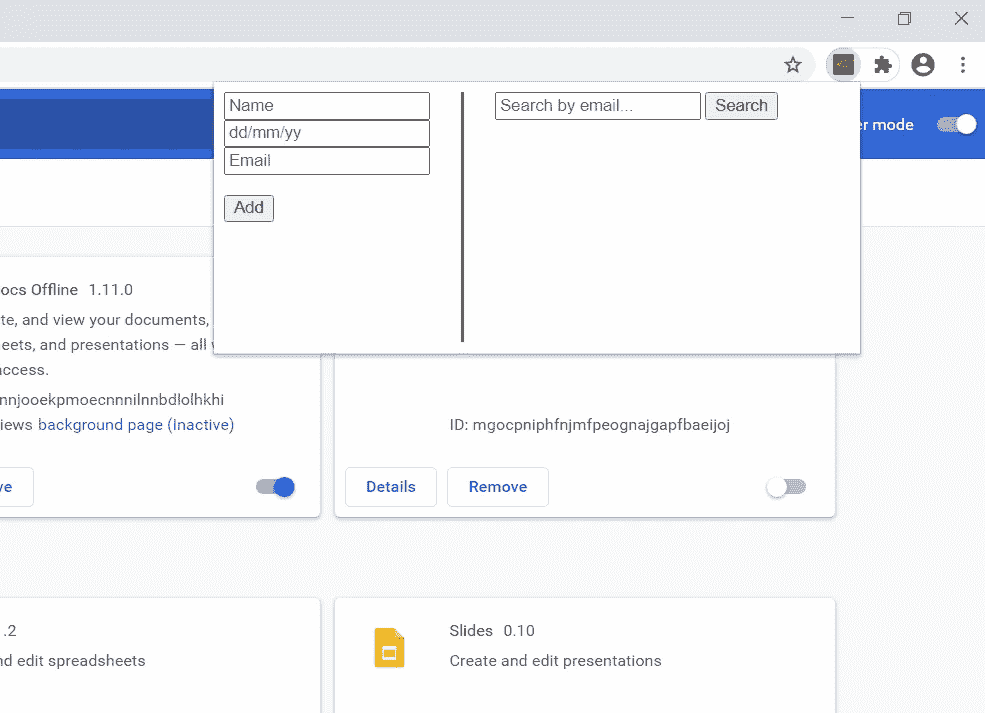
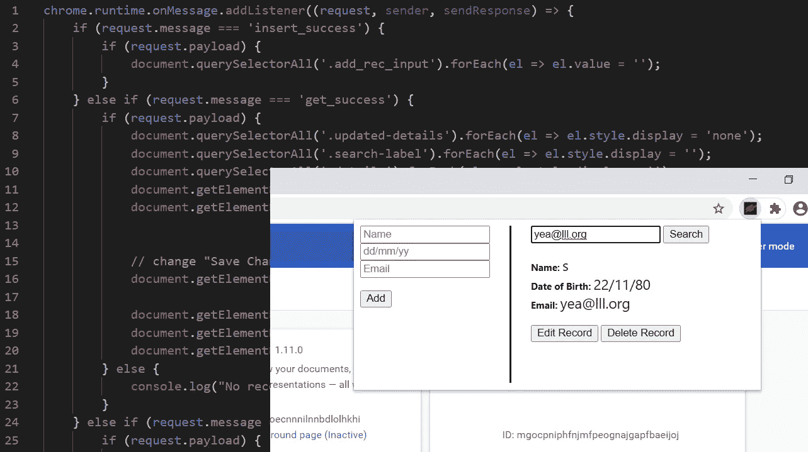

# Chrome 扩展和本地数据库(IndexedDB)

> 原文：<https://javascript.plainenglish.io/chrome-extensions-and-local-database-indexeddb-3c92e12c436?source=collection_archive---------0----------------------->

## 在本地硬盘上存储大量数据。

如果你想了解谷歌 Chrome 扩展的基础知识，请点击这里查看我的文章:

[](https://medium.com/@an_object_is_a/how-does-a-chrome-extension-work-web-development-6e85bd2bccc1) [## Chrome 扩展是如何工作的？(网络开发)

### Chrome 扩展有 5 个部分:

medium.com](https://medium.com/@an_object_is_a/how-does-a-chrome-extension-work-web-development-6e85bd2bccc1) 

为了在一个 **Chrome 扩展**的上下文中演示 **IndexedDB** ，我们将使用一个包含两个表单的简单 HTML 页面。

*一个添加记录的表单。*

*用于搜索和编辑记录的一个表单。*



我们将通过我们的 **Chrome 扩展**的弹出页面使用这个表单。

# 我们开始吧

## 我们的清单文件

```
// manifest.json{
    "name": "chrome ext with localDB",
    "description": "chrome ext interacting with IndexedDB",
    "version": "0.1.0",
    "manifest_version": 2,
    "icons": {
        "16": "./obj-16x16.png",
        "32": "./obj-32x32.png",
        "48": "./obj-48x48.png",
        "128": "./obj-128x128.png"
    },
    "background": {
        "scripts": [
            "./background.js"
        ]
    },
    "options_page": "./options.html",
    "browser_action": {
        "default_popup": "popup.html"
    },
    "permissions": []
}
```

**注意:**
我们不需要任何特殊权限；我们不需要'*存储*'权限来使用**索引数据库**。

# 我们来看看那个背景脚本吧！

当我们的 Chrome 扩展首次安装时，我们创建了一个数据库

```
// background.jslet db = null;function create_database() {
    const request = window.indexedDB.open('MyTestDB'); request.onerror = function (event) {
        console.log("Problem opening DB.");
    } request.onupgradeneeded = function (event) {
        db = event.target.result; let objectStore = db.createObjectStore('roster', {
            keyPath: 'email'
        }); objectStore.transaction.oncomplete = function (event) {
            console.log("ObjectStore Created.");
        }
    } request.onsuccess = function (event) {
        db = event.target.result;
        console.log("DB OPENED.");
        insert_records(roster); db.onerror = function (event) {
            console.log("FAILED TO OPEN DB.")
        }
    }
}
```

然后填充数据库。

```
// background.jsfunction insert_records(records) {
    if (db) {
      const insert_transaction = db.transaction("roster", 
                                   "readwrite");
      const objectStore = insert_transaction.objectStore("roster"); return new Promise((resolve, reject) => {
         insert_transaction.oncomplete = function () {
             console.log("ALL INSERT TRANSACTIONS COMPLETE.");
             resolve(true);
         } insert_transaction.onerror = function () {
             console.log("PROBLEM INSERTING RECORDS.")
             resolve(false);
         } records.forEach(person => {
           let request = objectStore.add(person); request.onsuccess = function () {
             console.log("Added: ", person);
           }
         });
      });
    }
}
```

当我们从前台添加、获取、更新或删除消息时:

```
// background.jsfunction get_record(email) {
  if (db) {
    const get_transaction = db.transaction("roster", "readonly");
    const objectStore = get_transaction.objectStore("roster"); return new Promise((resolve, reject) => {
      get_transaction.oncomplete = function () {
        console.log("ALL GET TRANSACTIONS COMPLETE.");
      } get_transaction.onerror = function () {
        console.log("PROBLEM GETTING RECORDS.")
      } let request = objectStore.get(email); request.onsuccess = function (event) {
        resolve(event.target.result);
      }
    });
  }
}function update_record(record) {
  if (db) {
    const put_transaction = db.transaction("roster", "readwrite");
    const objectStore = put_transaction.objectStore("roster"); return new Promise((resolve, reject) => {
      put_transaction.oncomplete = function () {
        console.log("ALL PUT TRANSACTIONS COMPLETE.");
        resolve(true);
      } put_transaction.onerror = function () {
        console.log("PROBLEM UPDATING RECORDS.")
        resolve(false);
      } objectStore.put(record);
    });
  }
}function delete_record(email) {
  if (db) {
    const delete_transaction = db.transaction("roster", 
                                             "readwrite");
    const objectStore = delete_transaction.objectStore("roster"); return new Promise((resolve, reject) => {
      delete_transaction.oncomplete = function () {
        console.log("ALL DELETE TRANSACTIONS COMPLETE.");
        resolve(true);
      } delete_transaction.onerror = function () {
        console.log("PROBLEM DELETE RECORDS.")
        resolve(false);
      } objectStore.delete(email);
    });
  }
}
```

…我们可以通过获取、更新和删除记录来响应…

# 让我们来看看弹出页面及其附带的脚本。

弹出页面是基本的 html 页面。两个带按钮的表单…

…当然还有我们的' **popup-script.js** '附件，这样我们就可以捕获和操作 DOM 了。

在' **popup-script.js** 中，我们捕获表单信息并向后台脚本发送消息，因此后台脚本可以执行所有的 **IndexedDB** 命令…

> …一旦我们从后台接收到 IndexedDB 数据，我们就会在 HTML 弹出页面上向用户显示一些视觉反馈！



如果你想查看更深入的指南，可以查看我在 YouTube 上的完整视频教程，**一个对象就是一个**。

一定要在 [**Instagram**](https://www.instagram.com/an_object_is_a/) 和 [**Twitter**](https://twitter.com/anobjectisa1) 上关注我们，及时了解我们最新的 **Web 开发教程**。

*代表*[***plain English . io***](https://plainenglish.io/)*团队，感谢阅读。*