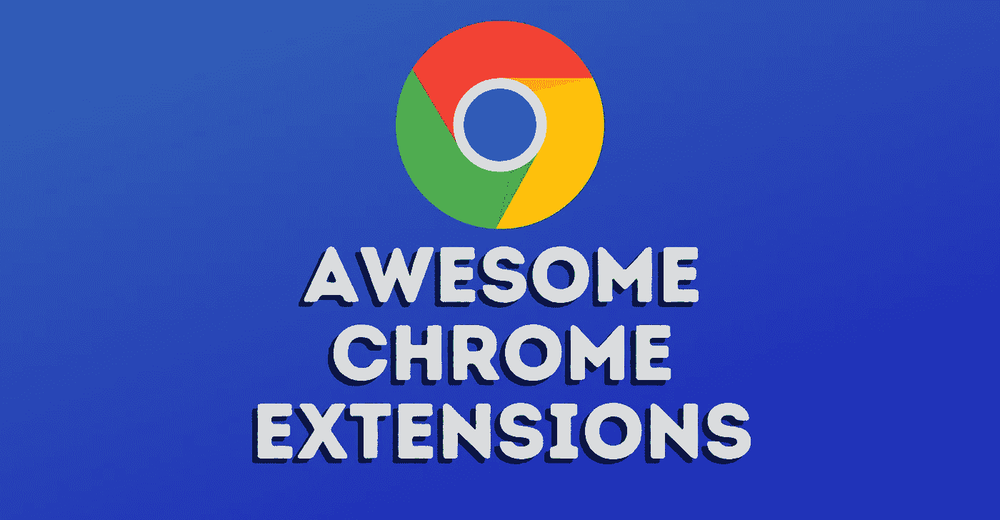
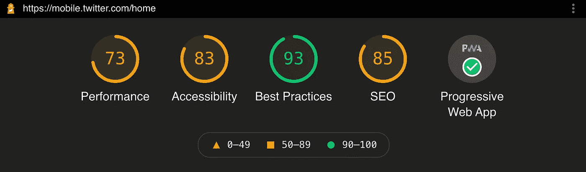
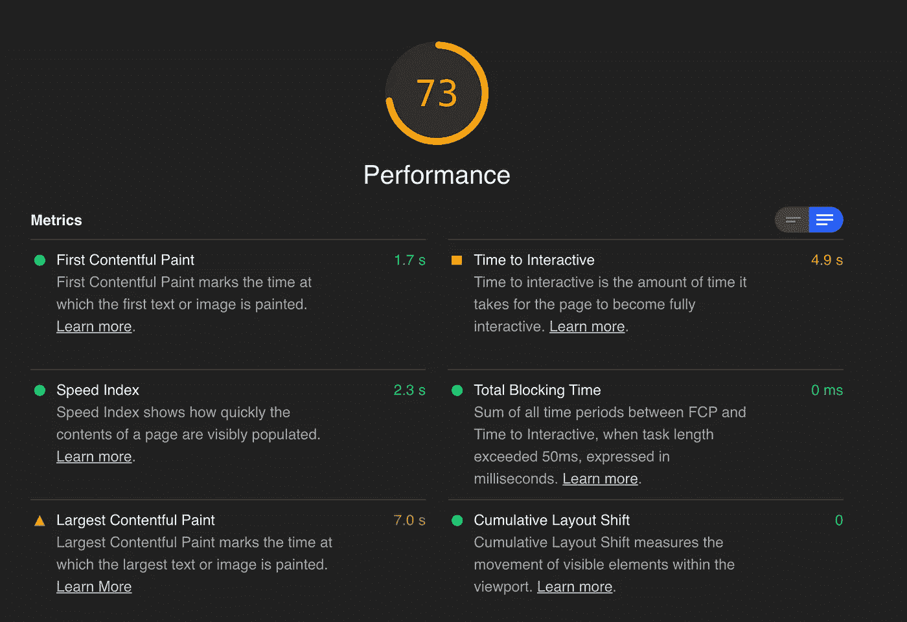
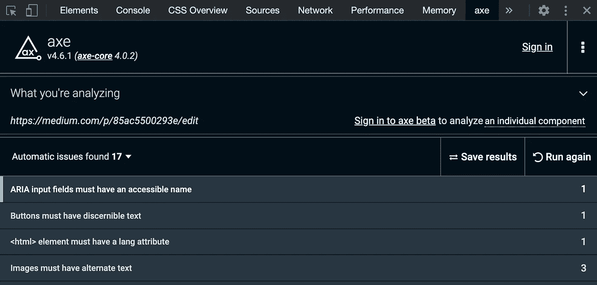
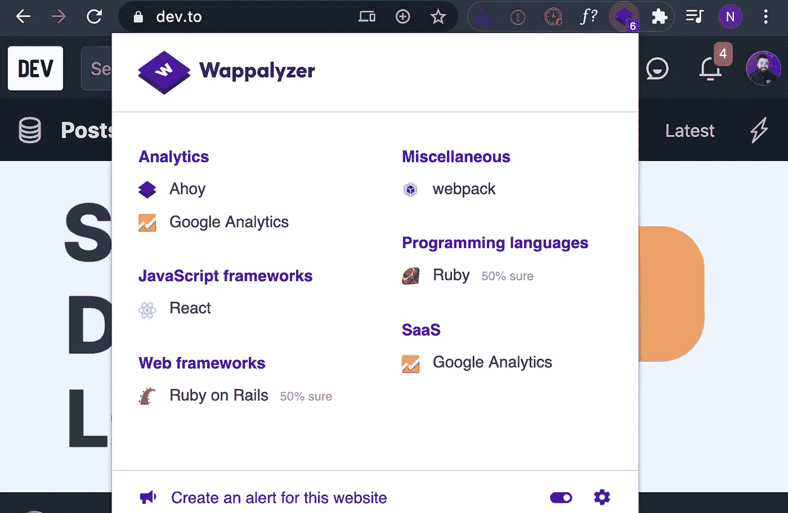
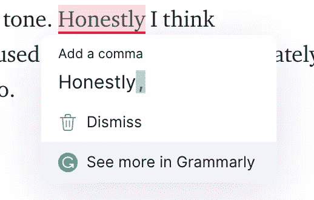

# 你今天应该安装的 Chrome 扩展

> 原文：<https://javascript.plainenglish.io/chrome-extensions-you-should-install-today-85ac5500293e?source=collection_archive---------19----------------------->

Awesome Chrome Extensions

## 还有我不能删除的扩展名

在这篇文章中，我们将看看我几乎每天都在使用的五个我最喜欢的 Chrome 扩展。

我最近检查了我的 Chrome 扩展，清除了所有我最近没用过的扩展(事实证明有十几个)。在这段时间里，我花了一点时间来思考哪些是我在过去一周或至少大多数周使用过的，这就是这篇文章的灵感来源。

本文的视频版本:

# 灯塔

> Lighthouse 是一款[开源](https://github.com/GoogleChrome/lighthouse)，用于提高网页质量的自动化工具。你可以在任何网页上运行它，无论是公开的还是需要认证的。它对性能、可访问性、渐进式网络应用、搜索引擎优化等进行审计。

这个工具可能是我最常用的扩展，可以生成易于使用的报告，其中包含优化我的项目的提示，或者为潜在客户的应用提供一些快速建议。以下是快速概述的一个示例:

Lighthouse report summary from Twitter Mobile

当您向下滚动页面时，您会看到可以采取哪些措施来提高您在所有这些方面的表现。当你不确定如何获得一个性能更好的网站或应用程序时，像这样的详细报告是一个非常棒的行动计划。

Showing a performance breakdown from a Lighthouse report

 [## 灯塔|网站开发者工具|谷歌开发者

### Lighthouse 是一个开源的自动化工具，用于提高网页质量。你可以在任何网站上运行它…

developers.google.com](https://developers.google.com/web/tools/lighthouse) 

# 德克斧

> WCAG 新协议和第 508 节可访问性检查。使用 axe Chrome 扩展来查找您的网站或 web 应用程序的可访问性缺陷。扔掉你的易访问性缺陷！

如果你曾经在 Twitter 上，你会注意到很多关于可访问性的呼声，这是正确的，因为网络应该是一个包容的地方。无论我们有多健康，我们都需要一个无障碍的网站。要有同情心，有了这个工具，你可以很容易地找到创建一个完全符合 WCAG 标准的网站所需的修正。

在你的 Chrome 开发者工具中有一个额外的标签，它会告诉你你做得怎么样:

axe report from Medium.com from Chrome DevTools

 [## axe -网络无障碍测试

### Chrome 中面向开发者的可访问性检查器

chrome.google.com](https://chrome.google.com/webstore/detail/axe-web-accessibility-tes/lhdoppojpmngadmnindnejefpokejbdd) 

# 瓦帕里斯

> Wappalyzer 不仅仅是一个 CMS 检测器或框架检测器:它揭示了几十个类别中的一千多种技术，如编程语言、分析、营销工具、支付处理器、CRM、CDN 等。

对于好奇的开发者来说，这是一个非常有趣的扩展。这个扩展可以让你对一个站点的技术栈有一个全面的了解。如果我们看一个像 [dev.to](https://dev.to/) 这样受欢迎的网站，我们会得到一个很棒的网站细分:

Wappalyzer report from dev.to

我真的很喜欢看到我最喜欢的网站是由什么组成的，我相信你也一样。我也发现了一些新的技术宝藏，因为我对有这个插件的网站很好奇。

 [## 瓦帕里斯

### 识别网络技术

chrome.google.com](https://chrome.google.com/webstore/detail/wappalyzer/gppongmhjkpfnbhagpmjfkannfbllamg?hl=en) 

# GoFullPage

> 对整个网页进行截图的最佳 Chrome 扩展

现在比以往任何时候，特别是随着远程工作的增加，能够分享整页截图是一个方便的技巧。只需点击一下扩展劫持你的网页开始滚动截图，并拼接在一起无缝全页截图。然后，您可以选择下载 PNG、JPG 或 PDF 格式的照片。以下是我从自己的 YouTube 频道中截取的一个例子:

Codú Community full-screen capture

我喜欢能够抓取像这样的大截图，并用我的平板电脑在上面画笔记，与人分享。

 [## GoFullPage -整页截屏

### 完整可靠地捕获当前页面的屏幕截图——无需请求任何额外的权限！

chrome.google.com](https://chrome.google.com/webstore/detail/gofullpage-full-page-scre/fdpohaocaechififmbbbbbknoalclacl/related) 

# 语法上

> 从语法和拼写到风格和语气，Grammarly 帮助您消除写作错误，找到表达自己的完美词汇。你会在 Gmail、Google Docs、Twitter、LinkedIn 以及几乎所有你发现自己在写作的地方得到来自 Grammarly 的实时反馈。Grammarly 是一个写作助手，为你提供具体的建议，帮助你提高写作水平

好吧，这个并不是专门针对开发人员的，但是这个确实帮助我给人一种专业的错觉，让我的邮件听起来不那么无能或者愚蠢。这个小插件可以快速扫描大多数文本输入，并让你知道你是否犯了一些拼写错误，语法错误，甚至帮助你的语气。老实说，我认为 Grammarly 是我最常用的工具。自从我开始写更多的内容以来，我越来越多地使用和滥用它。这就是我不能把它从我的“可怕的扩展列表”中删除的原因。

An example of a suggestion whilst writing the last section

从语法上来说，谢谢你让我拼写得更好…

 [## 铬的语法

### 用 Grammarly 为 Chrome 写你最好的。

chrome.google.com](https://chrome.google.com/webstore/detail/grammarly-for-chrome/kbfnbcaeplbcioakkpcpgfkobkghlhen?hl=en) 

你有没有什么我错过的建议，如果没有这些建议，你会很失落？