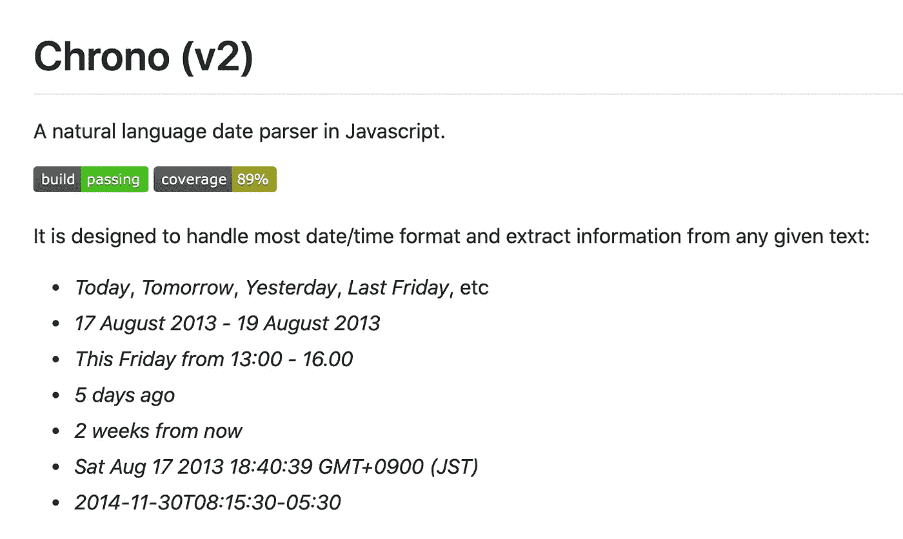

# Chrono 的打字稿重写

> 原文：<https://javascript.plainenglish.io/chronos-typescript-rewrite-dcb33b04266?source=collection_archive---------6----------------------->

## 如果你没听说过，Chrono(【https://github.com/wanasit/chrono】T4)是 JavaScript 中的一种自然语言日期解析器。



我在 2012 年写了第一个提交(想想 jQuery 和 Bootstrap v1)。那也是我去东京读研究生的时候，也是我开始作为一名专业软件开发人员工作之前。从那以后，JavaScript (ES6，TypeScript，React，…)和我的编程经验都发生了很多变化。今年夏天，我终于有时间呆在家里重新设计图书馆。

Chrono，v2，是这个项目用 TypeScript 几乎是从零开始重写的，考虑到了以下目标。

*   保持熟悉的 API
*   减少重复代码和样板文件

# 保持熟悉的 API

Chrono 只做一件事——从文本中解析日期。因此，对于想要使用它的人来说，它应该是简单明了的。虽然隐藏了深层的解析复杂性，但 Chrono 一直保持最小的接口，即它的`parse()`函数。

除了一些重要的差异(最重要的是地区处理)，Chrono v2 拥有相同的极简 API。

```
import * as chrono from ‘chrono-node’;chrono.parseDate(‘Today at 5 PM’) // Return a javascript Date object
chrono.parse(’Today at 5 PM’)     // Return more detailed results
```

您可以通过克隆基本设置和添加/删除`parsers`或`refiners`来自定义秒表计时:

```
import * as chrono from ‘chrono-node’;const customChrono = new chrono.Chrono();
// or const customChrono = chrono.en.clone();customChrono.parsers.push(...)
```

如果你一直在使用 Chrono，改变应该很简单。如果你不是，入门应该不难。

同时，对于 TypeScript 项目，您可以获得 Chrono 新改进的类型系统的免费优势。

```
class Chrono { parsers: Array<Parser>
    refiners: Array<Refiner> parse(
        text: string, ref?: Date, option?: ParsingOption
    ): ParsedResult[] { 
        ... 
    }}
```

# 减少重复代码和样板文件

在 ECMAScript 2015 引入`class`之前，JavaScript 项目需要依赖基于原型的继承。

在 Chrono 中，由于没有良好的独立于语言的抽象(对于解析器和提炼器来说都是如此)，重复的代码也更加严重。我们鼓励贡献者从英语中复制并粘贴整个代码。

```
exports.Refiner = function ENMergeDateTimeRefiner() { Refiner.call(this); this.refine = function(text, results, opt) {
        // check if there are results with unknown date and time
        // check if the words between them meaningful
        // merge them
    }
}exports.Refiner = function FRMergeDateTimeRefiner() { Refiner.call(this); this.refine = function(text, results, opt) {
        // mostly same code, but check French words }
}
```

在 v2 中，公共逻辑(例如日历和日期时间处理)被组织成独立于语言的公共类，而关键字和模式处理被分离并包含在它们自己的模块中(参见.`/common/…`和`/locales/en/…`)。

v2 中相同的英国精炼商看起来像这样:

```
export default class ENMergeDateTimeRefiner extends AbstractMergeDateTimeRefiner { patternBetween(): RegExp { return /^\s*(T|at|after|before|on|of|,|-)?\s*$/i; }
}
```

新的抽象应该也使得定制 Chrono 更加容易。

在 v1 中，这是自述文件中关于如何添加自定义解析器的示例:

```
var christmasParser = new chrono.Parser();
christmasParser.pattern = function () { return /\bChristmas\b/i; };
christmasParser.extract = function(text, ref, match, opt) { 
    return new chrono.ParsedResult({
        ref: ref,
        text: match[0],
        index: match.index,
        start: {    
            day: 25, 
            month: 12, 
        }
    });
};var custom = new chrono.Chrono();
custom.parsers.push(christmasParser);
```

现在，它是:

```
const custom = chrono.casual.clone();
custom.parsers.push({
   pattern: () => { return /\bChristmas\b/i },
   extract: () => {
      return {
         day: 25, month: 12
      }
   }
});
```

# 另一个重要的变化

> >…默认情况下，我们几乎没有理由尝试一次解析多种语言。这样做会导致一系列的极端情况，比如-#319-#318。多语言应用程序已经必须跟踪用户的语言，所以我不确定是否真的有必要尝试自动检测
> 
> —本·奥宾，318 号计时撰稿人

默认情况下，Chrono v1 应用它支持的所有语言的所有日期模式/关键字，这被证明是一个糟糕的设计决策。

当 Chrono 只支持解析英语和日语时，它在一开始工作得很好。然而，在不得不解析更多语言(7 种语言在`v1.3.7`中，感谢很多贡献者)之后，应用所有日期模式会导致很多不正确或意想不到的结果(例如，将德语缩写与英语混合)，并使维护和 bug 修复变得越来越困难。

因此，从 v2 开始，Chrono 将默认尝试只解析英语(美国国际)。

```
chrono.parseDate('6/10/2018');    
chrono.en.parseDate('6/10/2018');
```

当然，您可以通过同样易于使用的 API 在其他语言中使用 Chrono 解析。

```
chrono.ja.parseDate('令和２年８月１０日');
```

因此，现在我们可以以更可持续的方式支持多种语言或更多日期模式，欢迎您的任何贡献或反馈。

请在 Github 上查看 [Chrono！](https://github.com/wanasit/chrono)