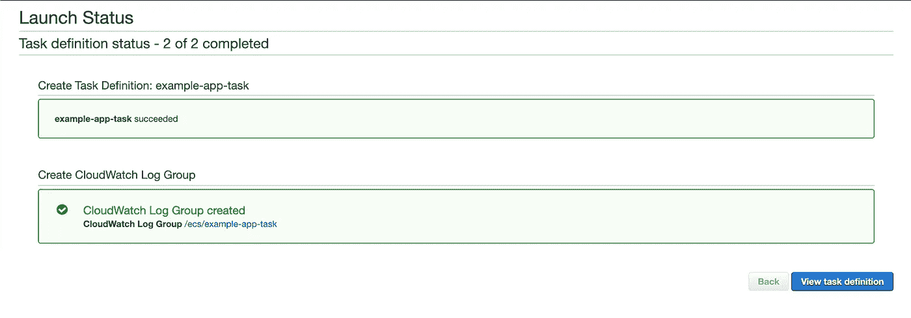
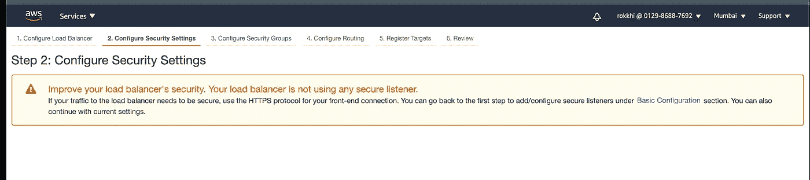
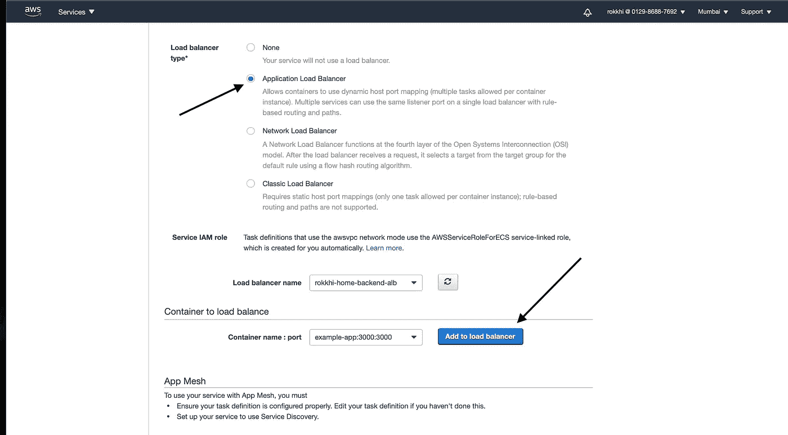
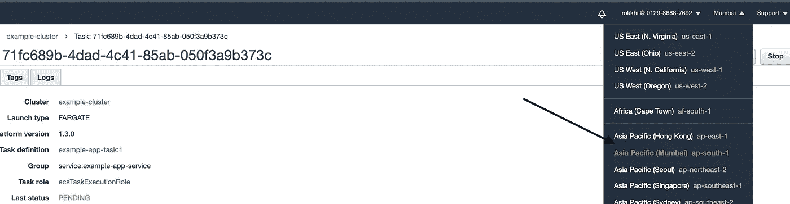

# 为 NodeJS 应用程序创建 CI/CD 管道

> 原文：<https://javascript.plainenglish.io/ci-cd-pipeline-for-nestjs-app-using-github-actions-and-aws-e5c6cba6ce70?source=collection_archive---------1----------------------->


Photo by [tian kuan](https://unsplash.com/@realaxer?utm_source=unsplash&utm_medium=referral&utm_content=creditCopyText) on [Unsplash](https://unsplash.com/s/photos/pipeline?utm_source=unsplash&utm_medium=referral&utm_content=creditCopyText)

# 我们会学到什么？

今天我们将使用 GitHub actions 和 amazon web services (AWS)为 NodeJS 应用程序建立一个完整的 CI/CD 管道。

对于本文，我们使用 Nest.js 框架。对于任何 Node.js 框架，所有的过程都是完全相同的。(喜欢 Express.js)

# 先决条件

*   GitHub 账户
*   AWS 帐户
*   对 Docker 的基本了解
*   对 NestJS 或 NodeJS 有基本的了解

# 要遵循的步骤

*   创建一个 nestJS(也可用于任何 nodeJS 框架)应用程序
*   将应用程序归档
*   在 AWS 的弹性容器存储库中创建一个存储库
*   创建一个任务来包含弹性容器服务中的存储库
*   创建新的目标群体
*   创建负载平衡器
*   在弹性容器服务中创建新集群
*   创建新的服务来连接它们
*   最后，添加 Github 动作来自动化整个过程

## **第一步:创建 NestJs 应用并归档**

在[之前的一篇文章](https://56faisal.medium.com/dockerizing-a-nestjs-nodejs-app-d440762d98a4)中，我们创建了一个基本的 nestJS 应用程序，并对该应用程序进行了 Dockerized。我们将从那里继续…

[](https://medium.com/@mohammadfaisal1011/dockerizing-a-nestjs-nodejs-app-d440762d98a4) [## 将 NestJS/NodeJS 应用程序归档

### Nest JS 是什么，为什么要用？

medium.com](https://medium.com/@mohammadfaisal1011/dockerizing-a-nestjs-nodejs-app-d440762d98a4) 

## **步骤 2:在弹性容器服务中创建一个新的存储库**

*   首先，登录 AWS 控制台
*   搜索弹性容器服务
*   单击创建新的存储库


*   为您的存储库命名，然后单击创建


*   稍后，您的存储库将出现在列表中


## **第三步:创建一个任务**

*   进入弹性集装箱服务
*   转到边栏中的任务，然后单击创建新任务


*   选择实例类型 Fargate


*   随便你取什么名字
*   选择角色为 ecsTaskExecutionRole
*   选择任务内存 0.5GB 和 0.25vcpu(我们现在选择最小值)
*   然后点击添加容器


*   我们将获取我们之前创建的存储库的链接，并将链接和 append: latest 粘贴到它的末尾，因为我们需要最新的容器来运行
*   我们将填写存储库的名称，并将软限制设置为 128(运行任务所需的最小内存)
*   我们需要在端口映射中添加 3000，因为我们的容器公开了 3000(参见上一篇文章)。您可以在这里映射您想要的端口。它应该与您从容器中公开的端口相匹配。
*   将所有其他内容保留为默认值，然后单击“添加”


*   转到页面底部，单击“通过 JSON 配置”


*   从侧边栏复制 JSON 代码，然后单击 save。


*   现在点击保存，然后在页面底部创建。
*   现在，将刚才复制的 JSON 代码粘贴到一个名为 task-definition.json 的新文件中，并将其放在项目的根目录中。


*   同时，在您的控制台中，您的任务定义应该已经创建好了



## **步骤 4:创建新的目标群体**

*   现在前往 AWS 控制台的搜索栏，搜索 EC2


*   从侧边栏中找到目标群体并选择它


*   点击创建目标组


*   选择目标类型-> Ip 地址
*   给个名字
*   选择默认 VPC(现在，你可以选择你定制的 VPC)
*   将运行状况检查路线添加为默认路线。我们需要在我们的项目中有一个路由，它应该返回 200 响应。在这种情况下，如果我们点击项目的 ***'/'*** 路径，我们应该会得到 200 的响应(我们将在后面的项目中处理这个问题。同样，如果您指定 ***'/health'*** 作为您的健康检查路线，如果我们点击 ***'/health'*** 端点，您的应用程序应该会响应 200。通过这种方式，AWS 可以确定目标是否健康。


*   单击 next，在下一页将所有内容保留为默认值(我们现在不需要注册任何 IP 地址或端口，因为它将由我们之前创建的任务负责)。然后点击创建目标组。


*   一旦创建，它将变成绿色并出现在列表中。

## **第五步:创建负载平衡器**

*   找到负载平衡器选项


*   单击创建新的负载平衡器


*   选择 Http/Https 类型，然后单击创建


*   设置一个名称并将 Scheme 设置为面向互联网，因为我们希望我们的负载平衡器可以从 AWS 外部访问。
*   添加 HTTP: 80 作为监听器。你也可以添加 HTTPS，如果你想 HTTPS，并有适当的证书。但是现在，我们跳过它
*   现在选择默认 VPC，并从不同的可用性区域中选择多个子网。在我们的案例中，我们选择了 3。
*   单击下一步


*   它会给我们一个关于安全的警告，因为我们没有选择 HTTPS。别担心，点击下一个



*   选择创建一个新的安全组，然后单击下一步，允许 HTTP 从任何地方访问负载平衡器


*   单击“next ”,在“configuring routing”的下一页中，选择现有的目标组，然后选择我们在上一步中已经创建的目标组。它将自动填充剩余的字段


*   在下一页，我们保持原样，然后点击“下一页”


*   在最后一页，我们检查了所有内容，然后单击“Create”


*   我们已经完成了负载平衡器的工作


## **步骤 6:在弹性容器服务中创建一个新的集群**

*   我们返回到弹性容器服务，并单击集群->创建集群


*   选择仅网络作为群集模板。我们将在本教程中使用 Fargate。Fargate 非常适合管理容器，因为它是由 AWS 自动管理的


*   给一个名称，不要点击创建 VPC 复选框，因为我们将使用我们的默认 VPC 本教程


*   单击“Create ”,您将拥有您的集群:D


## **步骤 7:创建一个新的服务来连接它们**

*   首先进入您新创建的集群


*   然后点击 Create 创建一个新的服务


*   然后选择 Fargate 作为启动类型。选择我们之前选择的任务定义，给出一个名称，并保持任务数为 1(这意味着我们的服务将运行我们的任务的一个实例，从而产生一个 fargate 实例)。如果我们想要我们的应用程序有多个实例，我们可以选择任意多个

> 完成教程后，回到这里，编辑任务数回 0 或完全删除服务，以降低成本，否则它会继续向你收费。


*   在底部，让一切保持原样，然后点击“下一步”


*   在下一页中，选择默认 VPC，并从下拉列表中选择三个子网
*   保持启用自动分配公共 IP，以便我们可以在出现任何错误时访问 fargate 实例


*   单击上图中安全组旁边的编辑按钮
*   使用端口 3000 和源 Anywhere 添加自定义 TCP 规则。如果我们想在没有负载均衡器的情况下访问 fargate 实例(这是可选的),这将有助于我们使用 IP 地址访问它们


*   在下面选择负载平衡器类型作为应用程序负载平衡器



*   从下拉列表中选择我们之前创建的负载平衡器，并点击**添加到负载平衡器**


*   从下拉列表中选择生产侦听器端口 Http:80，而不是 new
*   从下拉列表中选择目标组，然后单击下一步。
*   在下一页上，选择**不调整服务的期望计数**，然后点击**下一步**


*   查看所有内容，然后单击创建服务。


*   你的服务现在应该准备好了。


## **第 8 步:添加 Github 动作，使整个过程自动化:**

有趣的部分来了。我们已经做了一切来自动化我们的部署过程，现在唯一要做的就是用 Github 动作来自动化它。

如果你读了前一篇文章，你应该有一个包含 Dockerfile 的 nestJS 应用程序。转到该项目的 GitHub 存储库。如果你没有自己的项目，你可以分叉这个库[https://github.com/Mohammad-Faisal/example-nestjs-app](https://github.com/Mohammad-Faisal/example-nestjs-app)

> (别忘了替换存储库内部 task-definition.json 文件的代码！)

*   转到存储库中的“操作”选项卡。


*   选择部署到 Amazon ECS 并点击**设置此工作流**


*   它将向您的项目添加一个名为 aws.yml 的新文件。我们必须在这个文件中填写所需的细节
*   用您所在的地区替换 aws-region，在我的例子中是 ap-south-1，所以我的代码变成了 aws-region: ap-south-1



*   将 ECR_REPOSITORY: my-ecr-repo 替换为 ECR_REPOSITORY: example-app(我们在步骤 2 中为存储库指定的名称)
*   将**IMAGE _ TAG:$ { { github . sha } }**替换为 **IMAGE_TAG:最新**
*   将**容器名称:样品应用**替换为**容器名称:样品应用**(使用您给定的容器名称)
*   从 AWS 控制台的 IAM 控制台获取您的 AWS_ACCESS_KEY_ID 和 AWS_SECRET_ACCESS_KEY。


*   然后将它们添加到项目的“机密”标签中


*   将**服务:示例-应用-服务**替换为**服务:示例-应用-服务**(与我们在上一步中给服务起的名字相同)
*   将**集群:默认**替换为**集群:示例-集群**(我们的集群名称)
*   最后，打开您的项目并更新 app.controller 的代码，以便它在默认路由('/')上返回 status code 200。如果您没有使用 express 或其他框架，您必须向控制器添加一个类似的路由，以便负载平衡器的健康检查不会失败。
*   在 app.controller.ts 文件中添加以下代码

```
*import* { *Controller*, Get, *HttpCode* } *from* '@nestjs/common';@Get()
@HttpCode(200)
getHello(): *string* {
  *return this*.appService.getHello();
}
```

**我们 aws.yml 文件的最终版本是**


当我们创建一个新的版本时，这个动作将被触发。每次发布后，将执行以下任务

1.  登录 Aws
2.  建立形象
3.  将图像推送到 ECR(弹性容器注册表)
4.  运行任务定义
5.  使用服务部署任务定义

因此，现在我们将创建一个新版本来启动这一过程…


我们可以再次在操作选项卡中看到操作的进度


如果一切顺利，您应该会看到一个绿色勾号。这项服务需要一些时间来启动和运行。转到 Aws 控制台中的负载平衡器菜单，获取 DNS 名称并转到链接


转到这个链接，你将会得到一个回应:Hello World！


所以如果你能走到这一步，恭喜你。有太多的地方你会犯错误。所以一切都要小心。这个过程适用于任何类型的 Node.js 应用程序，如 Express 或 React 应用程序。我尽了最大努力，尽可能表达清楚，但我的知识非常有限。欢迎任何建议。

**通过**[**LinkedIn**](https://www.linkedin.com/in/56faisal/)**或我的** [**个人网站**](https://www.mohammadfaisal.dev/) **与我取得联系。**