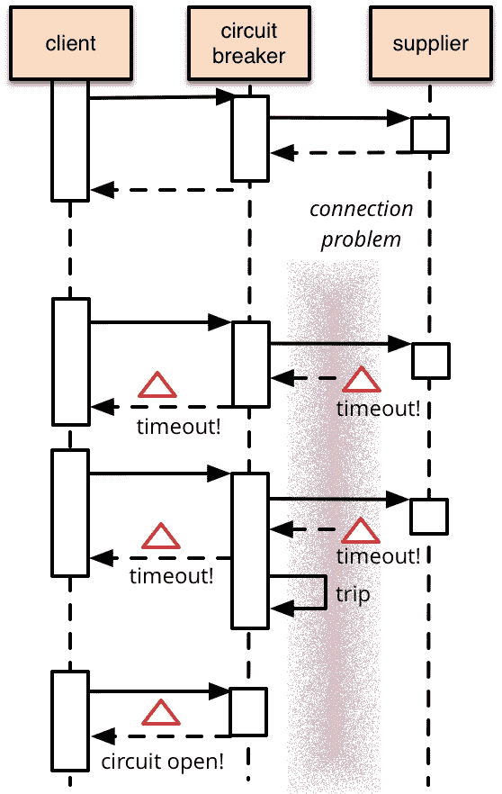
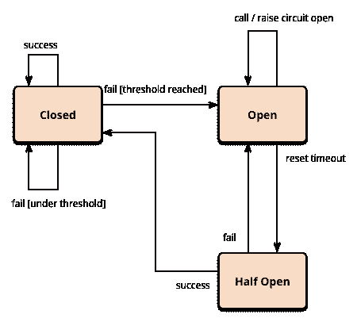

# 通过解剖负鼠理解 JavaScript 中的断路器

> 原文：<https://javascript.plainenglish.io/circuit-breakers-in-javascript-opossum-bcd65c2ce9bd?source=collection_archive---------6----------------------->

## 理解断路器模式并在负鼠上实现


A cute picture of a Pygmy Possum to get more people interested in failing gracefully

如果一个请求没有得到响应，它可能会占用你 30 到 120 秒的资源。在客户端和服务器的 2 层架构中，这可能不是灾难性的，但是如果您的服务器依赖于许多其他微服务，而这些微服务又依赖于其他微服务，则这种持久连接可能会级联地消耗整个网络的资源。这种灾难性的连锁反应可以通过断路器模式轻松挽救。

从广义上看，断路器是一个函数的包装器，它监视错误，并在达到某个阈值后优雅地拒绝请求。该功能还对错误进行计数，并使断路器跳闸，阻止进一步请求呼叫无响应的服务器。让我们更深入地探讨一下这个问题。

# 断路:了解负鼠库



## 初始变量

```
// snippet from line 54-67 and 170-173
//[https://github.com/nodeshift/opossum/blob/bd59b4860ce412608c520c757af1bf2b9398577b/lib/status.js#L146](https://github.com/nodeshift/opossum/blob/bd59b4860ce412608c520c757af1bf2b9398577b/lib/status.js#L146)// number of buckets in which the CB window should be divided  
**this[BUCKETS]** = options.rollingCountBuckets; **// DEFAULT:** **10**// window length of the CB
**this[TIMEOUT]** = options.rollingCountTimeout; **// DEFAULT: 10000**// Bucket where all the calculations will be stored
**this[WINDOW]** = new Array(this[BUCKETS]); //**QUEUE datastructure**// rotating interval for the bucket
**const bucketInterval** = Math.floor(this[TIMEOUT] / this[BUCKETS]);// rotate the window bucket
**this[BUCKET_INTERVAL]** = setInterval(nextBucket(this[WINDOW]),      bucketInterval);// rotating logic
**const nextBucket** = window => _ => {  window.pop();  window.unshift(bucket());};
```

下面是代码
1 的要点。用 10 个桶
做一个**窗口** 2。**每隔 **1 秒
3 旋转**铲斗。将初始化变量([负鼠的默认变量](https://nodeshift.dev/opossum/))排队到窗口，并将最旧的值
4 出列。将区间引用存储在变量中以备将来使用**

## 负鼠开火

```
//very very very stripped down overview of call function line 442
[https://github.com/nodeshift/opossum/blob/master/lib/circuit.js](https://github.com/nodeshift/opossum/blob/master/lib/circuit.js)call (context, ...rest) {

    //emit('fire');if (CACHE.get(this) !== undefined) {
      // emit('cacheHit') and return cache value
    } else if (this.options.cache) {
      // emit('cacheMiss');
    }if (!this.closed && !this.pendingClose) {
      // CB is closed emit('reject', error);
    }
    // emit ('success') if done
    // emit ('timeout') if not done
    // emit ('failure') if not done }
```

代码中出现了以下关键点。
1。一进入函数
2 就发出 fire 事件。如果启用了缓存，并且我们命中了缓存，我们将返回缓存的值
3。如果我们未命中缓存，则发出缓存未命中事件
4。如果断路器未闭合，发出拒绝事件
5。如果函数成功，增加当前窗口的成功计数器。
6。如果发生超时或失败，则发出失败和超时事件，

## 收集窗口统计信息

```
//copied from line 93
// [https://github.com/nodeshift/opossum/blob/master/lib/circuit.js](https://github.com/nodeshift/opossum/blob/master/lib/status.js)// Function that return the default values for a bucket
const bucket = _ => ({  
failures: 0,  
fallbacks: 0,  
successes: 0,  
rejects: 0,  
fires: 0,  
timeouts: 0,  
cacheHits: 0,  
cacheMisses: 0,  
semaphoreRejections: 0,  
percentiles: {},  
latencyTimes: []});get stats () {
    const totals = this[WINDOW].reduce((acc, val) => {
      if (!val) { return acc; }
      Object.keys(acc).forEach(key => (acc[key] += val[key] || 0));
      return acc;
    }, bucket());return totals;
  }
```

请求来自负鼠的统计数据会从由**滚动计数桶**选项设置的桶中聚集统计数据。它只是将窗口中的所有值相加，并返回一个包含所有总和的对象。

## 失败

```
//this code looks almost same lol from line 678 -703
[https://github.com/nodeshift/opossum/blob/master/lib/circuit.js](https://github.com/nodeshift/opossum/blob/master/lib/circuit.js)function fail (circuit, err, args, latency) {circuit.emit('failure');const stats = circuit.stats;
  if ((stats.fires < circuit.volumeThreshold) && !circuit.halfOpen) return;
  const errorRate = stats.failures / stats.fires * 100;
  if (errorRate > circuit.options.errorThresholdPercentage ||
    circuit.halfOpen) {
    circuit.open();
  }
}
```

当代码失败时，我们从 **stats()** 询问，并检查错误率是否小于我们设置的阈值。如果超过了阈值，我们就打开断路器。然后发出“打开”事件。

## 半开

```
//again a little stripped down code from line 178 -197
[https://github.com/nodeshift/opossum/blob/master/lib/circuit.js](https://github.com/nodeshift/opossum/blob/master/lib/circuit.js)function _startTimer (circuit) {
    return _ => {
      const timer = circuit[RESET_TIMEOUT] = setTimeout(() => {
        circuit[STATE] = HALF_OPEN;
        circuit[PENDING_CLOSE] = true;
        circuit.emit('halfOpen', circuit.options.resetTimeout);
      }, circuit.options.resetTimeout);};
  }this.on('open', _startTimer(this));
  this.on('success', _ => {
    if (this.halfOpen) {
      this.close();
    }
  });

}
```

半开如果断路器试图恢复时的状态。在这里，我们监听 open 事件，并在事件触发时立即启动计时器。超时完成后，我们检查是否将断路器的状态更改为半开。如果呼叫成功，我们关闭断路器并重置所有值。

# TLDR:断路器



断路器在三种状态之间旋转:
**闭合:**当断路器正常工作时。
**开:**断路器跳闸时。
**半开:**断路器试图恢复时。

事件的执行如下:
1:只要事件成功，断路器就保持闭合。
2。一旦呼叫超时或失败，就增加窗口中的错误计数。
3。如果窗口中的误差阈值增加到某个极限，那么我们使断路器跳闸。
4。在一定的间隔之后，断路器试图恢复并进入半开状态。
5。如果随后的呼叫失败，断路器回到打开状态。
6。如果随后的呼叫成功，断路器进入断开状态。

# 在 JavaScript 项目中使用负鼠

```
const CircuitBreaker = require('opossum');

function asyncFunctionThatCouldFail (x, y) {
  return new Promise((resolve, reject) => {
    // Do something, maybe on the network or a disk
  });
}

const options = {
  timeout: 3000, // If our function takes longer than 3 seconds, trigger a failure
  errorThresholdPercentage: 50, // When 50% of requests fail, trip the circuit
  resetTimeout: 30000 // After 30 seconds, try again.
};const breaker = new CircuitBreaker(asyncFunctionThatCouldFail, options);

breaker.fire(params)
  .then(console.log)
  .catch(console.error);
```

脚注:每个`npm install`都是添加到服务器内存和 CPU 利用率上的成本。深入了解你安装的库，不仅可以帮你节省成本，还可以发现瓶颈，让你有效的使用库。

## 简单英语的 JavaScript

你知道我们有三份出版物和一个 YouTube 频道吗？在[**plain English . io**](https://plainenglish.io/)找到所有内容的链接！