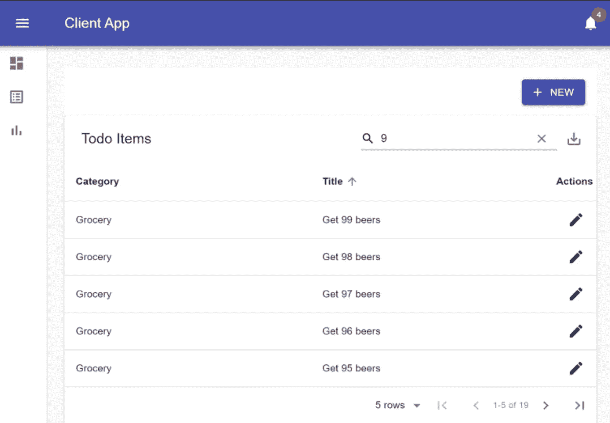
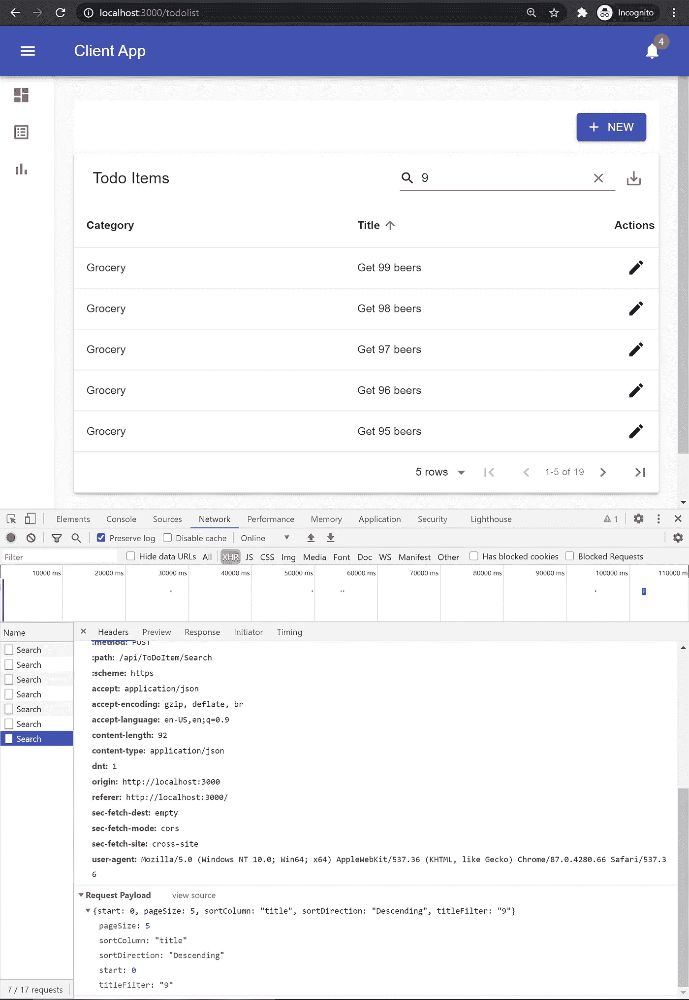

# 干净的架构——reaction Client 应用程序中的材料用户界面数据表

> 原文：<https://javascript.plainenglish.io/clean-architecture-material-ui-datatable-in-react-client-app-624de7b92088?source=collection_archive---------7----------------------->

## 如何使用 REST API 支持的 React Client 应用程序中的 Material UI，通过服务器端处理(包括分页、排序和搜索)构建数据表。

**2022 年 4 月 10 日更新:GitHub repo 中的所有项目均已升级至。NET 5。**

在我的上一篇文章 [*数据表支持使用带有 Cosmos DB*](https://medium.com/swlh/pagination-and-searching-in-asp-net-core-api-using-cosmos-db-869384a59f5) 的分区存储库，我讨论了如何在 REST API 中通过分页、排序和搜索来支持服务器端的数据表。在本文中，我们来看看如何使用 reactor 在前端构建一个数据表。**就像点寿司一样，只吃自己需要的东西！**

Screenshot by Author

## 重述—为什么选择服务器端处理？

虽然设置数据表最简单的方法是将所有数据加载到客户端，但是在处理大量数据时，性能会成为一个大问题。想象一下，你有一个生意做得很好，你有 1000 万客户，你可能不希望每次请求都有 1000 万条记录。这是当您想要使用服务器端处理时，所以您只传输您实际看到的一小部分数据。

## 第 1 步-安装所需的软件包。

我们将使用拥有最多 GitHub 星和最好的文档:[材料表](https://material-table.com/#/)。要安装材料表包，请运行以下命令:

*   纱线添加材料-表
*   纱线添加@材料-ui/芯

## 第 2 步-创建数据表组件。

除了必要的进口商品之外，一些可带走的纸币有:

*   材料用户界面图标使用 tableIcons 常量进行映射。
*   loadRemoteData()是应该返回承诺的回调函数。

## 第 3 步——使用待办事项列表页面中的数据表组件。

这一个非常简单，因为它只呈现了我们在上一步中创建的 ToDoDataTable 组件。您可能想在这个页面上添加样式，为了简单起见，我们跳过了这个步骤。

## 最后，让我们看看服务器端的处理是如何运作的！

请注意，当我按 9 搜索并按“标题”排序时，到达“/API/tototooitem/Search”端点的有效负载如下所示:

搜索响应如下所示。注意为了节省空间，我删除了数据数组中的一些记录。但是“totalRecords”和“page”数字用于分页，而“data”数组用于显示表中的行。

下面是我们的数据表在 React web 应用程序中的样子。

Screenshot by Author

## 结论

恭喜您，您现在拥有了一个可以使用服务器端处理来处理大量数据的数据表，包括分页、排序和搜索。还有其他内置功能，如 PDF 生成和 CSV 数据导出，使材料表包成为 React 项目的一个非常有价值的补充！

非常感谢您的阅读！干杯！

本文中的示例代码来自一个 [GitHub starter 项目](https://github.com/ShawnShiSS/clean-architecture-azure-cosmos-db)。您可以在客户端应用程序文件夹中找到 React web 应用程序的源代码。请随意使用整个入门项目或它的一部分来启动您的下一个激动人心的冒险！

更多与项目相关的资源:

*   GitHub repo: [*干净的架构，使用 Azure Cosmos DB*](https://github.com/ShawnShiSS/clean-architecture-azure-cosmos-db) 的分区存储库模式
*   文章: [*数据表支持使用带有 Cosmos DB*](https://medium.com/swlh/pagination-and-searching-in-asp-net-core-api-using-cosmos-db-869384a59f5) 的分区存储库
*   文章: [*干净的架构——使用分区存储库模式和 Azure Cosmos DB 的 ASP.NET 核心 API*](https://medium.com/swlh/clean-architecture-with-partitioned-repository-pattern-using-azure-cosmos-db-62241854cbc5)
*   文章: [*使用 Cosmos DB 的分区存储库模式审计日志*](https://medium.com/swlh/audit-log-using-partitioned-repository-pattern-with-cosmos-db-99b63de97e35)
*   文章: [*干净的架构——使用带有 Cosmos DB 的分区存储库的 Azure 功能*](https://medium.com/swlh/clean-architecture-azure-functions-using-cosmos-db-ce7f521aa7b5)