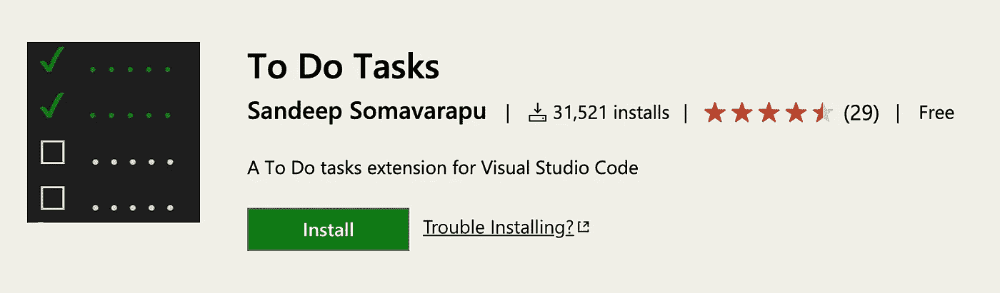

# 促进干净代码的 9 个技巧:以好的方式写注释

> 原文：<https://javascript.plainenglish.io/clean-code-writing-comments-in-a-good-way-8203c7d80c65?source=collection_archive---------0----------------------->


## 当你觉得需要写注释时，首先尝试重构代码，这样任何注释都变得多余


本系列的所有知识都基于 Robert C. Martin 的“干净代码”我希望我能鼓励人们阅读这本书，并通过这种方式编写更好的代码。

在我们的代码和代码格式中，我将在这篇文章中讨论注释。我的目的是试图找出我们应该在代码中添加注释的时间。因为开发人员每天都需要阅读代码，所以我们必须使用良好的设计风格，使其更容易阅读。

```
**// It works on my machine 
// ¯\_(ツ)_/¯**
```

> “不要评论糟糕的代码——重写它。”— 布莱恩·w·克尼根和 p·j·普劳格尔

糟糕的代码是写评论最常见的原因之一。我们写了一个模块，我们意识到它是混乱无序的。我们意识到这是一场混乱。我们告诉我们，“哦，我想更好地评论！”其实不是这样的！你最好打扫干净！你最好打扫干净！

带有少量注释的简单而简洁的代码比带有多个注释的混乱而复杂的代码要好得多。

***“与其把时间浪费在写那些描述你一团糟的评论上，不如把时间花在收拾这个烂摊子上。”***


没有什么比漂亮的评论更有帮助了。没有什么比毫无意义的教条式的言论更能涵盖一个模块了。没有什么比传播谎言的讨厌的旧信息更有害的了。


是时候讨论编码注释了。我觉得三件事大致可以是:好的，坏的，搞笑的(尤其是不用处理的情况下)。现在，让我们想想评论**“关注什么样的问题？”**。

*   我们可以快速修改和测试软件行为，甚至在生产中。
*   **可以在代码中输入软件许可证。**
*   **我们可以提供一些信息给不同的开发商等。**


如果我们考虑代码中的注释，我们脑海中会有说明代码在做什么的注释。评论的挑战在于它们并不总是被发表。代码修改的相当频繁，但是旧的注释都差不多。因此，注释不再代表代码。

> "最好的注释是一个方法或类的好名字."

# 评论规则

1.  总是试着用代码解释你自己。
2.  不要多此一举。
3.  不要添加明显的噪声。
4.  不要使用右大括号注释。
5.  不要注释掉代码。只是删除。
6.  用作意图解释或代码澄清。
7.  用作后果的警告。
8.  用作法律和信息注释。
9.  用作 TODO 注释。


# 1.总是试着用代码解释你自己

只需要几秒钟的时间，就可以清除代码中的大部分思想。
在许多情况下，这都是关于开发一种方法，告诉你的陈述同样的事情。

显然，许多程序员发现这种描述代码的好方法并不常见。这显然是错误的。你想看什么？以下内容:

```
***// Check to see if the employee is eligible for full benefits
if ((employee.flags & HOURLY_FLAG) &&
(employee.age > 65))***
```

或者，您可以使用如下描述性函数来避免注释:

```
***if (employee.isEligibleForFullBenefits())***
```

另一个例子:

```
// student is eligible for blood donation
***if (student.age >= 17 && student.weight >= 58.0 
&& student.height >= 1.55)
{
scheduleBloodDonatingSessionWith(student);***
```

也许在上面的例子中你并不认为这个观点不好。当然，也没那么糟糕。然而，考虑失去获得有用方法或属性的机会:

```
***if (student.isEligibleForBloodDonation)
{
    scheduleBloodDonatingSessionWith(student);***
```

当你可以使用函数或变量时，不要使用注释


# 2.不要多此一举。

你知道，一遍又一遍地说同样的话…

你只能通过阅读文件来理解正在发生的事情。这意味着在你解释完自己之后，发表评论是没有意义的。


当您的字段或方法有了一个好的名称来解释字段或方法的性质时，您就不再需要语句了。例如，当被调用时，一个被称为 ***【发送电子邮件】*** 的方法不需要进一步的注释。电子邮件发送方式的名称显而易见。

```
*// if the student is at least 18 years of age* ***if (student.age> = 18){*** *// send meeting invitation to the student* ***notificationService.sendMessageTo(student, meetingInvitation);
}
else*** *// if the student is younger than 18 years* ***{*** *// sends a meeting invitation to the student’s legal guardian* ***notificationService.sendMessageTo(student.parent,meetingInvitation);
}***
```

# 3.不要添加明显的噪声


在许多情况下，开发人员并没有说他们想做什么。然后，您可能会得到一条消息，说客户正在发送电子邮件，然后最终调试并试图理解为什么没有发送电子邮件。

最后，您知道您被命名的方式并不提交电子邮件，而只是创建电子邮件对象。

通常情况下，在大公司和大项目中，你最终会得到需要每个方法和类的注释的规则。你最终会得到几个没有真正意义的观察结果。

举个例子:

```
***public void sendMailer(Customer customer)
{
    foreach (var address in customer.Addresses)*** //Cycle through all of the customer's addresses
        ***_mailService.sendGreting(address);*** //Call the mail service to send a greeting mailer to the address
***}***
```

通常情况下，这种事情是好的。人们将这种智慧内在化，将后来者考虑在内，并将过多的信息而不是过少的信息弄错。但是到了某个时候就变成了毫无意义的噪音。

程序员维护需要上下文，而不是编程课程。你知道 foreach)(是做什么的，你也知道调用函数的基本原理。节省一些时间和代码库的噪音，不要试图澄清你对语言的反馈。

开发人员用于注释的有趣注释:

```
***i++;*** //increment iOR***return 1;*** # returns 1
```

# 4.不要使用右大括号注释。

程序员通常会对右括号进行注释。这对于长函数和深度嵌入的结构来说可能很重要，但是只对那种小的和封装的特性，我们选择。所以，如果你想让你的右括号被描述出来，尽量缩短你的功能。

```
 } // End of While Block 
  } // End of if block 
 } // End of outer if block
} // End of method
```

“有什么错误吗？! "有可能吗？"这是互联网，我可以看到你的一些侮辱. "这将真正帮助你抓住一个大循环的两端！

我承认，如果您有大量具有多层嵌套作用域的循环，这样的语句也会有所帮助。在这种情况下，问题不是语句本身，而是维护的噩梦。

忘掉这些话吧。这种问题编码风格是正常的，团队变得顽固。不要对到达的终点进行注释，而是提取方法，直到块宽到您再也看不到它们是从哪里开始的。

# 5.不要注释掉代码。只是删除。


请不要将代码注释掉！求你了。人们会害怕把它拿走。我相信你使用了版本控制系统。所以删除注释文件。作为高级开发人员，你不应该批准初级开发人员的这种代码。

**“在提交之前，删除所有被“注释掉”的代码”**

```
***function foo(bar) {
const baz = bar(false)*** *// we no longer do this for some good reason
// if (baz === 'foobar') {
// return baz
// } else {
// return bar.foobar()
// }* ***return baz
}***
```

这个函数应该是这样的:

```
***function foo(bar) {
 return bar(false)
}***
```

# 6.用作意图解释或代码澄清

有时你会觉得有必要解释你试图做的事情，因为一些复杂的算法或其他任何原因。但是，请确保您无法改进代码设计。

当表达意图时，陈述通常是有用的。我们在代码中所做的没有必要评论，因为读者可以显示代码本身。我们想在代码中做什么更重要。

在某些情况下，我们无法确切地说出我们的目标是什么。这就是为什么我们必须增加说明，更多地澄清和解释我们为什么没有采取特定行动。也许我们不得不停止某个库中的缺陷，或者我们对客户有一个特殊的请求。

# 7.用作后果的警告。

通常我们知道某些代码行是非常必要的，例如，如果没有它们，程序可能会崩溃。在这种情况下，其他开发人员可能会被警告某些代码行的值。

一个很好的例子是用于访问公共资源的互斥变量。也许不是所有的开发人员都知道这个互斥体的含义，它需要引起注意。

一个比 1000 字更有价值的例子。:)

```
***//
// Dear maintainer:
//
// Once you are done trying to 'optimize' this routine,
// and have realized what a terrible mistake that was,
// please increment the following counter as a warning
// to the next guy:
//
// total_hours_wasted_here = 42
//***OR***// Magic. Do not touch.***OR***// I will give you two of my seventy-two virgins if you can fix this.***OR***// drunk, fix later***OR***// I am not sure if we need this, but too scared to delete.***
```

# 8.用作法律和信息注释

有些情况下，法律上的正当理由是你必须做出评论。代码可以根据特定的许可条件进行解释和修改。在这种情况下，您可以添加注释来指定这一点，但不是所有的许可条款。从文章中，您可以指向一个特定的文档或 URL 连接来解释许可的条件。有了这个细节，你就不要 200 行评论了。

通常，注释会给文件增加价值。例如，当我们提供更多关于方法返回内容的细节时。注意，在某些情况下，一个好的流程名称可以省略对返回值注释的需求。

示例:

```
***// Copyright (C) 2020 by Someone, Inc. All rights reserved. 
// Released under the terms of the GNU General Public License***
```

# 9.用作 TODO 注释


我从来不会提出 TODO 注释！如果你知道你有事情要做，就去做。
**如果你现在做不到，请创建一张票并以某种方式使其可用。**
你可以使用任务管理工具来完成。


否则，TODO 很可能会被遗忘。

示例:

```
 ***// TODO-MdM these are not needed
 // We expect this to go away when we do the checkout model*** *protected VersionInfo makeVersion() throws Exception
 {
return null; 
}*
```

在发布文件之前，您经常会忘记检查添加的待办事项。因此，我需要很长一段时间来强调它们，并告诉我笔记或项目尚未完成。

希望你也能得到这些扩展，它们对放置 TODO 注释很有帮助。


[**TODO Highlight**](https://marketplace.visualstudio.com/items?itemName=wayou.vscode-todo-highlight)


[**Todo Tree**](https://marketplace.visualstudio.com/items?itemName=Gruntfuggly.todo-tree)


[**Todo Plus**](https://marketplace.visualstudio.com/items?itemName=azad-ratzki.todo-plus)

在代码库中没有注释的情况下，你可以使用一些插件来添加 TODO 任务，如 TODO.md 或 TODO.txt 等。

VScode IDE 有几个扩展，如下所述。


[**Todo Markdown**](https://marketplace.visualstudio.com/items?itemName=usernamehw.todo-md)


[**Markdown Todo**](https://marketplace.visualstudio.com/items?itemName=fabiospampinato.vscode-markdown-todo)



[**To-Do Tasks**](https://marketplace.visualstudio.com/items?itemName=sandy081.todotasks)

这是我写的关于在代码中使用注释的文章。尽管有一些好的评论，我认为你应该尽量减少评论的使用。

不要忘记最简单的规则是最好的！


当你在编写干净的代码时，你最好阅读我以前的文章，关于 [**干净代码命名约定**](https://medium.com/@pabashani.herath/clean-code-naming-conventions-4cac223de3c6) 和[**干净代码:编写函数或方法**](https://medium.com/swlh/clean-code-writing-functions-or-methods-4e6e53ff4ac2)；

[](https://medium.com/@pabashani.herath/clean-code-naming-conventions-4cac223de3c6) [## 干净的代码命名约定

### 把命名惯例当成你宝宝的名字。不要用伊隆儿子的名字…

medium.com](https://medium.com/@pabashani.herath/clean-code-naming-conventions-4cac223de3c6) [](https://medium.com/swlh/clean-code-writing-functions-or-methods-4e6e53ff4ac2) [## 干净的代码:编写函数或方法

### 重构是一小步一小步地改变程序，所以如果你犯了一个错误，很容易找到错误在哪里。

medium.com](https://medium.com/swlh/clean-code-writing-functions-or-methods-4e6e53ff4ac2)