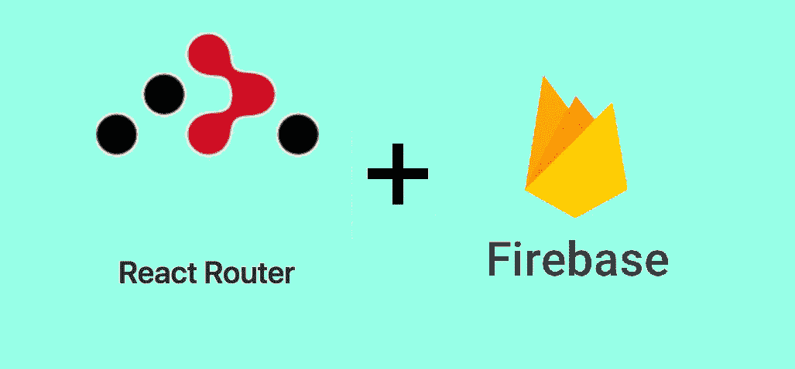

# 基于 Firebase 的客户端路由

> 原文：<https://javascript.plainenglish.io/client-side-routing-with-firebase-a6e630f299f2?source=collection_archive---------15----------------------->

## 使用 React 路由器和 Firebase 身份验证创建受保护的路由



# 问题

假设你正在尝试使用 [React](https://reactjs.org/) 和 [Firebase](https://firebase.google.com/) 构建一个 web 应用程序。到目前为止，您已经完成了以下步骤:

1.  创建了一个空白的单页应用程序:`npx create-react-app .`
2.  已安装 Firebase npm 软件包:`npm install --save firebase`
3.  在你的 React: `firebase.initializeApp(firebaseConfig);`的 index.js 文件中添加了 Firebase
4.  创建了一个[基本注册和登录界面](https://www.positronx.io/build-react-login-sign-up-ui-template-with-bootstrap-4/)
5.  增加了 [Firebase 验证码](https://firebase.google.com/docs/auth/web/start)

下一步是将用户路由到受保护的页面。然而，这带来了一些可怕的问题:

*   如何在我的单页应用程序中添加多个页面？
*   如何在 React 中创建受保护的路由？
*   我如何将它与 Firebase 身份验证联系起来？

# 解决办法

您首先需要将 React 路由器添加到您的项目中。 [React Router](https://reactrouter.com/) 是一个工具，可以让你在 web app 中处理路由，而不是在服务器上处理。

之前:

```
app.get('/home', function (req, res) { res.render('home'); })
```

现在:

```
<Route exact path=”/home” component={Home} />
```

要将 React Router 添加到您的 web 应用程序中，您可以安装 *react-router-dom。*我用过 5.2.0 版本，所以这段代码将来有可能会被弃用。

```
npm install react-router-dom
```

接下来，在你的 **App.js.** 中添加 *firebase* 、 [*useState*](https://reactjs.org/docs/hooks-state.html) 、 [*useEffect*](https://reactjs.org/docs/hooks-effect.html) 和[*react-router-DOM*](https://reactrouter.com/web/guides/quick-start)然后，中的**函数 **App** ，添加一个新的状态变量。这将用于确定用户是否已登录应用程序。**

接下来，每当 Firebase 用户发生变化时，我们可以使用 *useEffect* 钩子来更新我们上面创建的状态变量。

最后，我们可以添加我们的 return 语句。你可能会看到*路径*被设置到子目录，比如*"/登录"*或者*"/仪表板。"*

另外，注意*加载*、*主页*、*登录*、*注册*、*管理*和*错误*都是需要在 **App.js** 顶部导入的 React 组件。我不会包含这些页面的任何代码，因为您应该已经有了您的注册和登录代码。

看起来我们都完成了，但是还有一步。*路径*在 **App.js** 顶部导入，但是 *PublicRoute* 和 *PrivateRoute* 不存在。在您的应用程序中，您可能有一些只有经过身份验证的用户才能访问的页面，比如*仪表板*页面。然而，你也可能有认证用户不能访问的页面，比如*注册*页面。毕竟，为什么已经登录的人需要创建另一个帐户呢？

将以下代码添加到 **App.js** 的底部，**在 **App** 函数的**之外。

现在，您已经解决了将用户路由到受保护页面的问题！

# 走向


要扩展本教程，您可以执行以下操作:

*   添加更多受保护的和公共的路由
*   在 useEffect 挂钩内添加附加代码
*   改变**保护路线**和**公共路线**的重定向

如果你遇到问题，问问自己:

*   我是否缺少任何注册、登录或管理组件？
*   我是否正确地创建了一个 Firebase 项目？
*   我是否安装了**并且**导入了所有需要的包？
*   我用的是旧的**还是新版本的**React？

最后，这里有一些我用来学习所有使用 Firebase 的 React 路由的资源。请检查他们！

*   [https://stack overflow . com/questions/58769189/react-router-protected-route-with-firebase-auth-check](https://stackoverflow.com/questions/58769189/react-router-protected-route-with-firebase-auth-check)
*   [https://medium . com/@ subalerts/creating-protected-routes-in-react-js-89e 95974 a822](https://medium.com/@subalerts/creating-protected-routes-in-react-js-89e95974a822)

感谢你把这篇文章看完！我真的很高兴找到像我一样对计算机科学充满热情的人。

确保**喜欢** / **分享**这篇文章😁，并评论你的阅读体验！