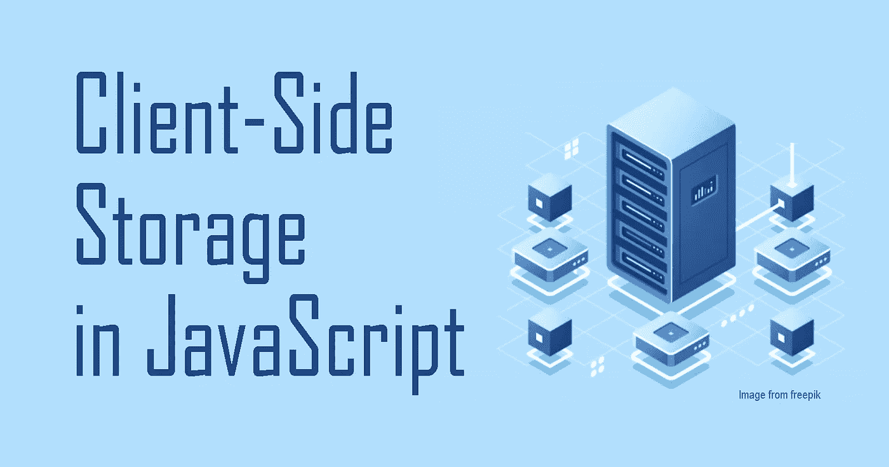
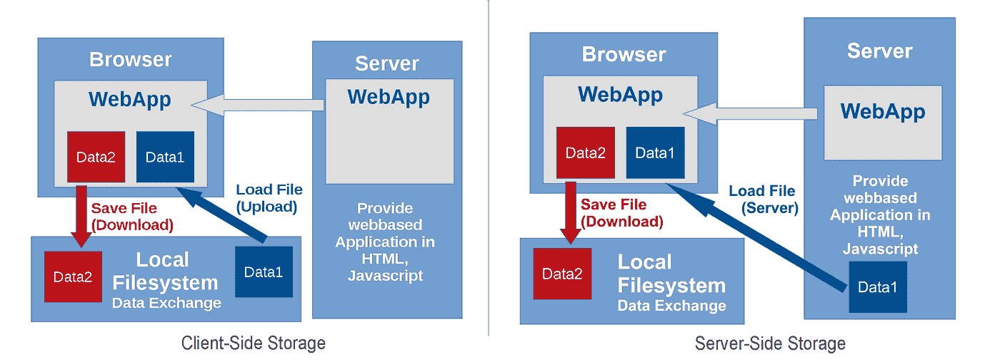
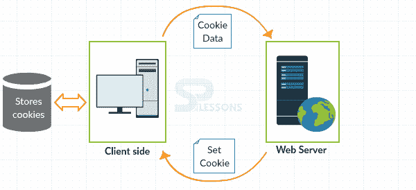
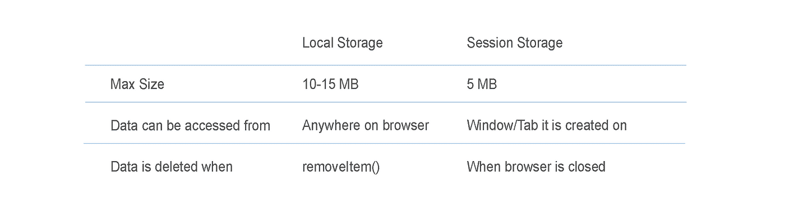
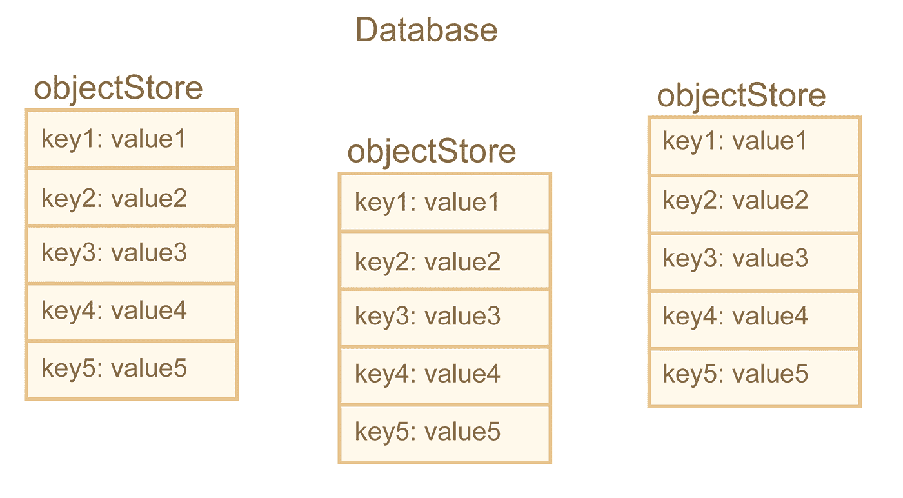

# JavaScript 中的客户端存储

> 原文：<https://javascript.plainenglish.io/client-side-storage-in-javascript-c1e65bf0626a?source=collection_archive---------7----------------------->



# 什么是客户端存储？

顾名思义，客户端存储允许用户**在客户端**(即用户的浏览器)存储数据。相反，服务器端存储将数据存储在服务器上(即外部数据库)。

> *要了解更多关于“客户端”和“服务器”之间区别的信息，请查看我的文章* [*后端编程介绍*](https://lo-victoria.com/a-beginners-intro-to-back-end-programming-ckanyrk7d02b2bbs1g9fv127k) *。*



*Source:* [*upload.wikimedia.org/wikipedia/commons/a/a4..*](https://upload.wikimedia.org/wikipedia/commons/a/a4/AppLSAC-0_LocalStorage_remote_data_fetch.svg)

在当今的许多现代浏览器中，页面是动态加载的。这意味着它们使用服务器端存储来检索数据并在浏览器上呈现数据。然而，仍然存在客户端存储有用的情况。

# 什么时候有用？

客户端存储有利于以下使用情形:

*   **快速且独立于网络的**数据访问
*   **存储用户偏好**(即自定义小工具、字体大小、颜色等。)
*   **存储之前活动的会话**(即登录账户、购物车等。)
*   **本地保存数据供离线使用**

# 客户端存储的类型

## 1.Cookies(不推荐)



*Source:* [*webideasole.com/wp-content/uploads/2019/02/..*](https://www.webideasole.com/wp-content/uploads/2019/02/javascript-cookies-01-splessons.png)

你可能听说过饼干。它们是最经典的客户端存储类型，从 web 早期开始就被网站使用。

Cookies 从服务器发送到客户端**，然后**存储在客户端**上。然后，每当客户端再次向服务器发出请求时，就可以检索存储的 cookie 并将其发送回服务器。通常，cookies 用于管理帐户会话、存储用户信息和跟踪用户数据。**

然而，由于 cookies 是最古老的客户端存储形式，它们有一些安全问题和存储限制，这使它们不适合存储客户端数据。

> *如需了解更多关于 cookies 安全问题的信息，请在此处阅读*[](https://developer.mozilla.org/en-US/docs/Web/API/Document/cookie#Security)**。**

## *CRUD 示例*

```
*//Create
document.cookie = "name=victoria";

//Read
console.log( document.cookie );

//Update
document.cookie = "name=victoria lo";

//Delete - Just set an expiry date that has passed
document.cookie = "name=victoria lo ; expires = Thu, 01 Jan 2010 00:00:00 GMT"*
```

# *2.Web 存储 API*

*Web 存储 API 是一个在客户端存储数据的**键值对**的 API。这种简单直观的语法允许轻松存储和检索**字符串或字符串化的 JSON 数据**。*

*该 API 中有两种类型的 web 存储:**本地存储**和**会话存储**。*

## *本地存储与会话存储*

*这两种类型的 web 存储之间有一些明显的区别需要注意。*

**

## *本地存储的 CRUD 示例*

```
*// Create
const user = { first: 'Victoria', last: 'AAA' }
//store as a stringified JSON
localStorage.setItem('user', JSON.stringify(user));

// Read
console.log(JSON.parse(localStorage.getItem('user')))
//output will be a JSON: {first: "Victoria", last: "lo"}

// Update
const update = { first: 'Victoria', last: 'Lo'  }
localStorage.setItem('user', JSON.stringify(update));

// Delete
localStorage.removeItem('user');*
```

## *会话存储的 CRUD 示例*

*语法与本地存储相同，但将`localStorage`替换为`sessionStorage`。*

# *3.IndexedDB API*

*一个完整的数据库系统，适合存储比客户端本地存储更复杂的数据。与 Web 存储 API 不同，它允许组织和存储更多的结构化数据，如客户记录、详细的待办事项列表等。*

*它使用**对象存储**，本质上是类似表的结构，来包含键值对。*

**

**Source:* [*javascript.info/article/indexeddb/indexeddb..*](https://javascript.info/article/indexeddb/indexeddb-structure.svg)*

## *CRUD 示例*

*首先，我们必须请求打开数据库:*

```
*let openRequest = indexedDB.open('database', 1);
// users is the database name and 1 is the version*
```

*然后，我们可以在下面添加一些方法来执行操作:*

```
*openRequest.onupgradeneeded = function() {
  // triggers if the client had no database
  // ...perform initialization...
};openRequest.onerror = function() {
  console.error("Error", openRequest.error);
};openRequest.onsuccess = function() {
  let db = openRequest.result;
  // continue to work with database using db object
};*
```

**(代码来自*[](https://javascript.info/indexeddb)**)***

**现在，让我们在`onupgradeneeded`方法中创建一个对象存储:**

```
**let db = openRequest.result;
 // if there's no "users" store initialized, we create one
if (!db.objectStoreNames.contains('users')) {
       let objectStore = db.createObjectStore('users', { keyPath: 'id', autoIncrement:true });
}**
```

**为了将数据添加到对象存储中，IndexedDB API 使用**事务**。我们可以启动一个事务，通过以下方式将数据添加到“用户”对象存储中:**

```
**// open a read/write transaction
let transaction = db.transaction("users", "readwrite"); // get the object store we want to operate on
let userStore = transaction.objectStore("users");// add the data into the store
userStore.add({
        first: 'Victoria',
        last: 'Lo'
    });// finish the transaction
transaction.oncomplete = function() {
  console.log("Transaction is complete");
};**
```

**要读取或删除数据，只需遵循前面显示的相同事务步骤，但这一次，我们使用的不是 add，而是:**

```
**// Read
userStore.get('Victoria');// Delete
userStore.delete('Victoria');**
```

# **这就是要点！**

**感谢您阅读这篇 JavaScript 客户端存储的基本介绍。这些示例只是作为这些不同类型的存储如何工作的快速概述。我鼓励您阅读更多详细信息，网址为:**

*   **[javascript.info/indexeddb](https://javascript.info/indexeddb)**
*   **[developer.mozilla.org/en-US/docs/Learn/Java..](https://developer.mozilla.org/en-US/docs/Learn/JavaScript/Client-side_web_APIs/Client-side_storage)**

**尽管如此，最好的学习方法是实践，所以我也鼓励你**尝试做一个使用客户端存储的迷你项目**。希望这篇文章有所帮助。干杯！**

**【https://lo-victoria.com】原载于[](https://lo-victoria.com/client-side-storage-in-javascript-ckcj01tb400fsxas1cezt540r)**。****

## ***简单英语的 JavaScript***

***喜欢这篇文章吗？如果有，通过 [**订阅解码获得更多类似内容，我们的 YouTube 频道**](https://www.youtube.com/channel/UCtipWUghju290NWcn8jhyAw) **！*****