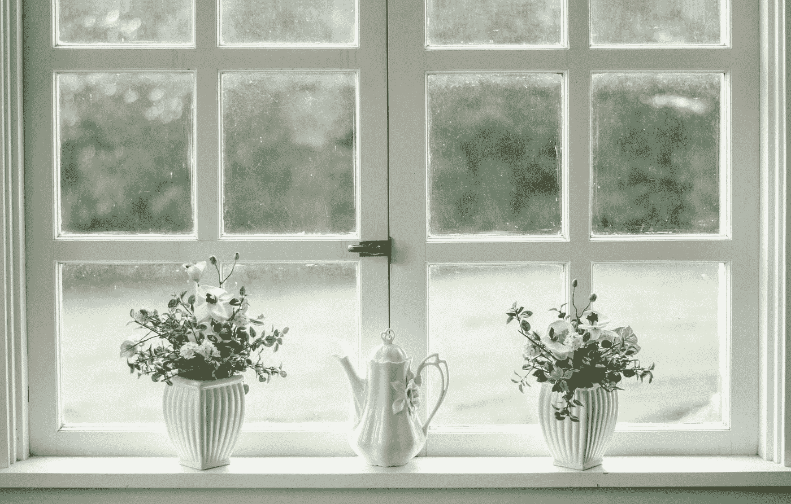
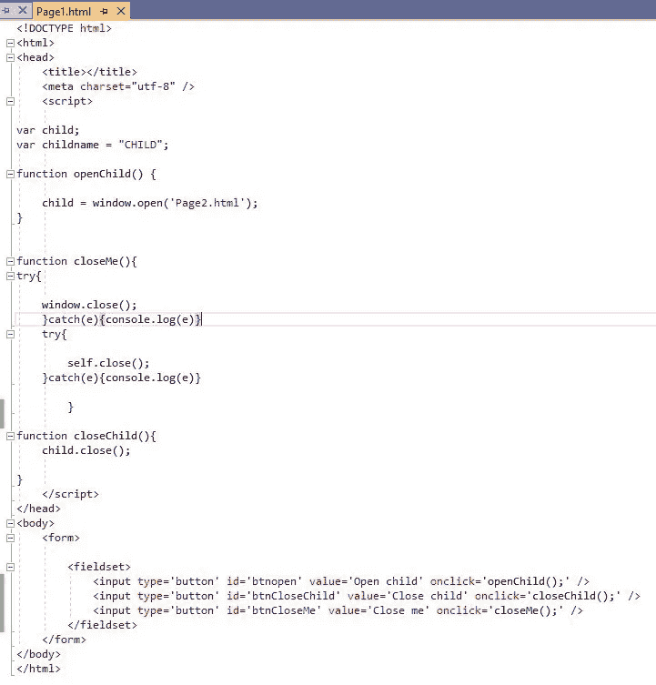
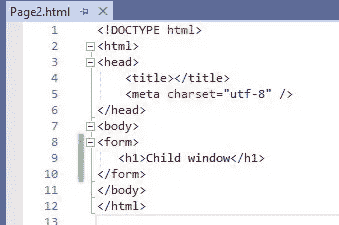
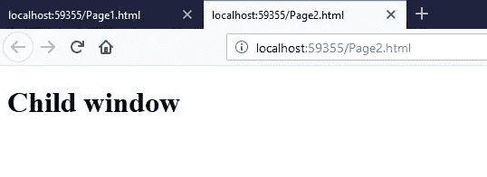
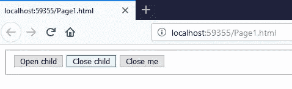
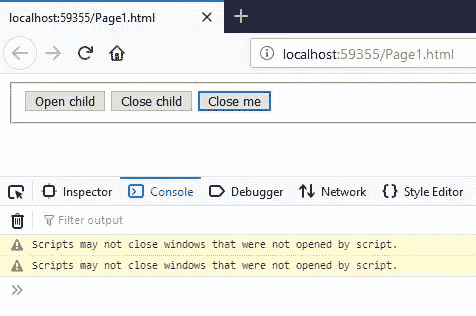
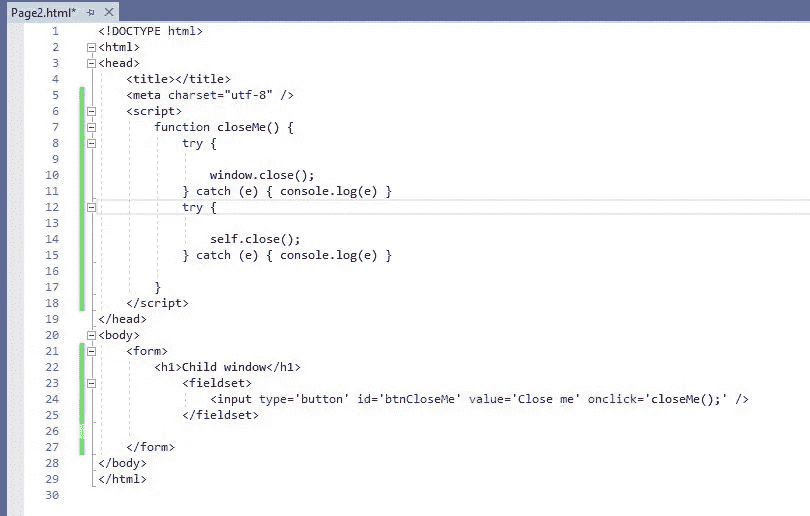
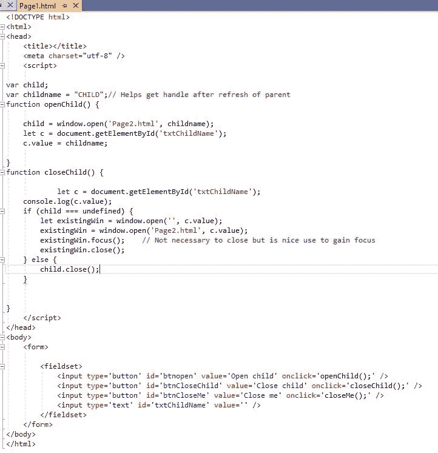

# 用 JavaScript 关闭窗口

> 原文：<https://javascript.plainenglish.io/closing-a-window-with-javascript-beeec56344bb?source=collection_archive---------2----------------------->

## 简而言之，什么可行，什么不可行

Photo by Nathan Fertig on [Unsplash](https://unsplash.com)

> 如何用 JavaScript 关闭窗口？

有趣的是这个问题经常出现。可以很快回答。正如 MDN 所说，

> `Scripts may not close windows that were not opened by script`

> 这句话到底说了什么？

## 第一:打开和关闭窗户。

**用**打开窗户

*window . open()；—* [*完整语法此处*](https://developer.mozilla.org/en-US/docs/Web/API/Window/open)

**用**关闭窗户

*window.close()。——*[*完整语法此处*](https://developer.mozilla.org/en-US/docs/Web/API/Window/close)***(但不尽然！)***

这就是 MDN 语句发挥作用的地方。一个简单的例子应该可以澄清这一点。

## 示例:

我创建了两个页面，Page1.html(父窗口)和 Page2.html(子窗口)。)

> 由于我没有指定窗口的大小，*它将在浏览器中作为一个新标签*打开。这同样适用于弹出窗口。

JavaScript 函数用于，

1.  关闭子窗口。
2.  关闭父项。嗯。

Parent

Child

## 运行示例

运行 Page1.html，点击“打开孩子”。子窗口作为单独的窗口打开，就像选项卡一样。

Child opens as a tab

回到父窗口，点击“关闭子窗口”，子窗口关闭。**维奥拉！**

现在，在父页面上，单击“关闭我”。什么都没发生。**扫兴的人**！实际上确实发生了一些事情。我试着用两种方法关闭它。window.close()和 self.close()。请参阅 console . log()；

Window can close itself (or can it?)

> 所以窗户不能自己关上。

> 稍等一会儿！

根据 MDN，它可以在合适的条件下自动关闭*。*

***给 Page2.html(child)添加下面的按钮和 closeMe()函数。)***

**

*Additions to child*

## *运行示例*

*运行 Page1.html，点击“打开孩子”。和以前一样，子窗口像标签一样作为单独的窗口打开。*

*现在点击子里的【关闭我】**。关门了。**中提琴**！***

*那扇窗户自己关上了。观察如下。*

# ***结论:***

*   *由于我们使用一个脚本打开了孩子，并且有一个指向那个孩子的引用句柄(在变量“child”中)，通过 MDN 语句，我们能够使用 window.close()的句柄关闭它；(**child . close()；**)*
*   *因为父级不是用 window.open()打开的；不能使用 window.close()或 self.close()关闭它。*
*   *由于子窗口是用脚本 window.open()打开的；它可以自己关闭。*

*所以声明，*

> *`Scripts may not close windows that were not opened by script.`*

*现在更有意义了。*

*我希望这个简单例子已经澄清了一些事情。*

*感谢阅读！*

## *坚持住。最后一点意见。*

> *如果父级被刷新，它将丢失对子级的引用，并且父级不能关闭子级。救命啊！*

## *尝试*

1.  *打开 Page1.html，点击“打开孩子”。*
2.  *刷新父节点，Page1.html 点击【关闭子节点】，失败**！***

## *****解决方案*****

***你会注意到我有一个名为“孩子名”的变量。如果我们把它存储在页面上，我们可以用它来再次获得一个引用！***

***下面，在 Page1.html，我添加了一个文本字段(可能是一个隐藏字段)，删除了 closeMe()函数，因为这是一个史诗般的失败！并修改了 closeChild()函数来查看引用是否丢失。如果是这样，使用窗体上存储的窗口名。***

******

***Observe closeChild()***

## ***运行示例***

1.  ***打开 Page1.html，点击“打开孩子”，然后点击“关闭孩子”。仍然有效。***
2.  ***打开 Page1.html，点击“打开孩子”。刷新 Page1.html，点击 Page1.html 上的“关闭孩子”。儿童关闭。耶！***

***编码快乐！***